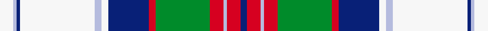

This page is one **sett** — a single exact thread-count. It belongs to the [tartan](/setts/w4lb1db1w22lb2w2db12r2g16r4lb1r4db2/)
(the same proportion at any scale), whose colour order is pattern [BRWRGRBWWWBWW](/stripes/brwrgrbwwwbww/).

Part of the [MacGillivray Dress, Janice](/tartans/macgillivray-dress-janice/) tartan — the named design grouping this sett with its other cloths.

Sourced from register-of-tartans.  It is a [13 stripe tartan](/stripes/stripes13/).

Original link https://www.tartanregister.gov.uk/tartanDetails.aspx?ref=10811

## Register references

External register numbers recorded for this tartan.

- Scottish Register of Tartans: [10811](https://www.tartanregister.gov.uk/tartanDetails.aspx?ref=10811)

## Thread count
W/8 LB2 DB2 W44 LB4 W4 DB24 R4 G32 R8 LB2 R8 DB/4

One full sett is **280 threads**.

## Palette
<table><thead><tr><th>Colour</th><th>Shade</th><th>OKLCh</th></tr></thead><tbody><tr><td>LB</td><td><code style="background-color:#B5BBDE;">#B5BBDE</code> <small style="color:#888">#B5BBDE</small></td><td><small style="color:#888">oklch(79.9% 0.050 277.6)</small></td></tr><tr><td>DB</td><td><code style="background-color:#082077;">#082077</code> <small style="color:#888">#082077</small></td><td><small style="color:#888">oklch(30.0% 0.149 265.1)</small></td></tr><tr><td>G</td><td><code style="background-color:#008B2A;">#008B2A</code> <small style="color:#888">#008B2A</small></td><td><small style="color:#888">oklch(55.4% 0.170 145.9)</small></td></tr><tr><td>R</td><td><code style="background-color:#D60020;">#D60020</code> <small style="color:#888">#D60020</small></td><td><small style="color:#888">oklch(55.2% 0.224 25.5)</small></td></tr><tr><td>W</td><td><code style="background-color:#F7F7F7;">#F7F7F7</code> <small style="color:#888">#F7F7F7</small></td><td><small style="color:#888">oklch(97.6% 0.000 89.9)</small></td></tr></tbody></table>

# Sample pattern

## Nearest variants

The nearest existing variants by ΔTartan distance, with this cloth at the top so the swatches line up against it.

ΔTartan

Threads

Variant

Sett

—

280

<a href="/variants/s13/w4lb1db1w22lb2w2db12r2g16r4lb1r4db2~x2/">MacGillivray Dress, Janice</a>

<a href="/ttd/edit/#slug=w4lb1db1w22lb2w2db12r2dg16r4lb1r4db2~x2&amp;base=w4lb1db1w22lb2w2db12r2g16r4lb1r4db2~x2" title="compare in the TTD">0.00</a>

280

<a href="/variants/s13/w4lb1db1w22lb2w2db12r2dg16r4lb1r4db2~x2/">MacGillivray Dress, Janice (Personal</a>

## Neighbour map

Every grey dot is one of 13620 variants placed by the first two principal components of the ΔTartan feature space (42% of its variance). Red is this tartan; blue dots are its nearest — click one to open its page.

<svg viewBox="0 0 640 380" role="img" style="max-width:100%;height:auto;border:1px solid #e0e0e0;border-radius:4px;display:block" xmlns="http://www.w3.org/2000/svg"><image href="/nn/cloud.v1.png" width="640" height="380"/><a href="/variants/s13/w4lb1db1w22lb2w2db12r2dg16r4lb1r4db2~x2/"><circle cx="165.7" cy="108.0" r="4" fill="#3465a4"><title>MacGillivray Dress, Janice (Personal</title></circle></a><circle cx="171.1" cy="112.2" r="5" fill="#c00000"/><text x="320" y="376" text-anchor="middle" font-size="11" fill="#999">ground</text><text x="11" y="190" text-anchor="middle" font-size="11" fill="#999" transform="rotate(-90 11 190)">complexity</text></svg>

ID: /variants/s13/w4lb1db1w22lb2w2db12r2g16r4lb1r4db2~x2/
