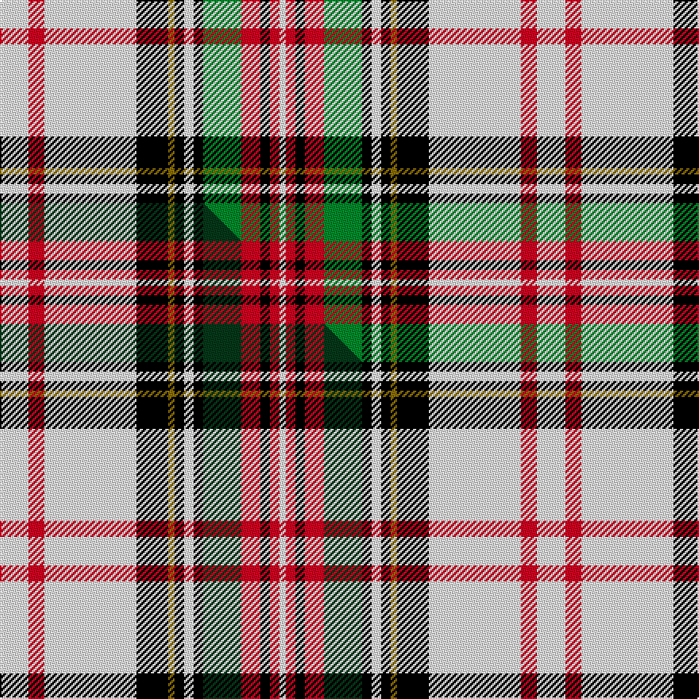

This page is one **sett** — a single exact thread-count. It belongs to the [tartan](/setts/w9r5w29k10y2k3w3k3g12r6k3r3w2/)
(the same proportion at any scale), whose colour order is pattern [WRKRGKWKGKWRW](/stripes/wrkrgkwkgkwrw/).

Part of the [Hay or Stewart](/tartans/hay-or-stewart/) tartan — the named design grouping this sett with its other cloths.

Sourced from weddslist.  It is a [13 stripe tartan](/stripes/stripes13/).

Original link http://www.weddslist.com/cgi-bin/tartans/pg.pl?source=sts

## Thread count
W/18 R10 W58 K20 Y4 K6 W6 K6 G24 R12 K6 R6 W/4

One full sett is **338 threads**.

## Palette
<table><thead><tr><th>Colour</th><th>Shade</th><th>OKLCh</th></tr></thead><tbody><tr><td>G</td><td><code style="background-color:#008B2A;">#008B2A</code> <small style="color:#888">#008B2A</small></td><td><small style="color:#888">oklch(55.4% 0.170 145.9)</small></td></tr><tr><td>K</td><td><code style="background-color:#000000;">#000000</code> <small style="color:#888">#000000</small></td><td><small style="color:#888">oklch(0.0% 0.000 0.0)</small></td></tr><tr><td>W</td><td><code style="background-color:#F7F7F7;">#F7F7F7</code> <small style="color:#888">#F7F7F7</small></td><td><small style="color:#888">oklch(97.6% 0.000 89.9)</small></td></tr><tr><td>R</td><td><code style="background-color:#D60020;">#D60020</code> <small style="color:#888">#D60020</small></td><td><small style="color:#888">oklch(55.2% 0.224 25.5)</small></td></tr><tr><td>Y</td><td><code style="background-color:#8B6E00;">#8B6E00</code> <small style="color:#888">#8B6E00</small></td><td><small style="color:#888">oklch(55.1% 0.113 90.4)</small></td></tr></tbody></table>

# Sample pattern

## Compared to the master

This cloth is one sett of its design; the master sett (the exemplar the design is anchored on) is below for comparison.

Its **ΔTartan distance** from the master is **0.36** — the same measure the nearest-tartans table ranks by (0 is identical; a re-scale of the same cloth is near 0, a recolour or a different proportion further).

<figure class="master-compare" style="margin:0">

this sett
master sett ★

<figcaption style="color:#888;font-size:smaller">One weave of this sett against the <a href="/setts/w9r5w29k10y2k3w3k3dg12r6k3r3w2/">master sett ★</a>, split on the diagonal: a shared proportion runs seamlessly across it with only the shades shifting; a different proportion breaks on it.</figcaption>
</figure>

## Nearest variants

The nearest existing variants by ΔTartan distance, with this cloth at the top so the swatches line up against it.

ΔTartan

Threads

Variant

Sett

—

338

<a href="/variants/s13/w9r5w29k10y2k3w3k3g12r6k3r3w2~x2/">Hay, or Stewart</a>

<a href="/ttd/edit/#slug=w9r5w29k10y2k3w3k3dg12r6k3r3w2~x2&amp;base=w9r5w29k10y2k3w3k3g12r6k3r3w2~x2" title="compare in the TTD">0.00</a>

338

<a href="/variants/s13/w9r5w29k10y2k3w3k3dg12r6k3r3w2~x2/">Hay or Stewart</a>

<a href="/ttd/edit/#slug=w9r5w29db3k10ly2k3w3k3g12r6k3r3w2~x2&amp;base=w9r5w29k10y2k3w3k3g12r6k3r3w2~x2" title="compare in the TTD">0.30</a>

350

<a href="/variants/s14/w9r5w29db3k10ly2k3w3k3g12r6k3r3w2~x2/">Hay - Stewart (Fashion)</a>

<a href="/ttd/edit/#slug=r2w24lb3w3k6y1k1w1k1g8r4k1r2w1~x2&amp;base=w9r5w29k10y2k3w3k3g12r6k3r3w2~x2" title="compare in the TTD">2.01</a>

226

<a href="/variants/s14/r2w24lb3w3k6y1k1w1k1g8r4k1r2w1~x2/">Stuart/Stewart Victoria</a>

<a href="/ttd/edit/#slug=w15db2k3y1k1w1k1g3r4k1r1w1~x2&amp;base=w9r5w29k10y2k3w3k3g12r6k3r3w2~x2" title="compare in the TTD">2.57</a>

104

<a href="/variants/s12/w15db2k3y1k1w1k1g3r4k1r1w1~x2/">Stewart Dress MINI Tartan</a>

<a href="/ttd/edit/#slug=w31db4k6y2k2w2k2g7r4k2r2w2~x2&amp;base=w9r5w29k10y2k3w3k3g12r6k3r3w2~x2" title="compare in the TTD">2.58</a>

198

<a href="/variants/s12/w31db4k6y2k2w2k2g7r4k2r2w2~x2/">Stuart/Stewart Dress Royal</a>

<a href="/ttd/edit/#slug=w39db3k6y3k3w3k3g8r5k3r3w3~x2&amp;base=w9r5w29k10y2k3w3k3g12r6k3r3w2~x2" title="compare in the TTD">2.63</a>

244

<a href="/variants/s12/w39db3k6y3k3w3k3g8r5k3r3w3~x2/">Stewart Dress (Clan)</a>

<a href="/ttd/edit/#slug=w16db3w8k3w3k6y2k2w2k2g7r4k2r2w2~x2&amp;base=w9r5w29k10y2k3w3k3g12r6k3r3w2~x2" title="compare in the TTD">2.90</a>

220

<a href="/variants/s15/w16db3w8k3w3k6y2k2w2k2g7r4k2r2w2~x2/">Stuart/Stewart Dress #2</a>

## Neighbour map

Every grey dot is one of 13620 variants placed by the first two principal components of the ΔTartan feature space (42% of its variance). Red is this tartan; blue dots are its nearest — click one to open its page.

<svg viewBox="0 0 640 380" role="img" style="max-width:100%;height:auto;border:1px solid #e0e0e0;border-radius:4px;display:block" xmlns="http://www.w3.org/2000/svg"><image href="/nn/cloud.v1.png" width="640" height="380"/><a href="/variants/s13/w9r5w29k10y2k3w3k3dg12r6k3r3w2~x2/"><circle cx="160.7" cy="108.8" r="4" fill="#3465a4"><title>Hay or Stewart</title></circle></a><a href="/variants/s14/w9r5w29db3k10ly2k3w3k3g12r6k3r3w2~x2/"><circle cx="132.2" cy="93.4" r="4" fill="#3465a4"><title>Hay - Stewart (Fashion)</title></circle></a><a href="/variants/s14/r2w24lb3w3k6y1k1w1k1g8r4k1r2w1~x2/"><circle cx="185.9" cy="53.9" r="4" fill="#3465a4"><title>Stuart/Stewart Victoria</title></circle></a><a href="/variants/s12/w15db2k3y1k1w1k1g3r4k1r1w1~x2/"><circle cx="170.0" cy="79.0" r="4" fill="#3465a4"><title>Stewart Dress MINI Tartan</title></circle></a><a href="/variants/s12/w31db4k6y2k2w2k2g7r4k2r2w2~x2/"><circle cx="190.0" cy="73.9" r="4" fill="#3465a4"><title>Stuart/Stewart Dress Royal</title></circle></a><a href="/variants/s12/w39db3k6y3k3w3k3g8r5k3r3w3~x2/"><circle cx="197.0" cy="79.5" r="4" fill="#3465a4"><title>Stewart Dress (Clan)</title></circle></a><a href="/variants/s15/w16db3w8k3w3k6y2k2w2k2g7r4k2r2w2~x2/"><circle cx="111.9" cy="126.0" r="4" fill="#3465a4"><title>Stuart/Stewart Dress #2</title></circle></a><circle cx="160.8" cy="110.3" r="5" fill="#c00000"/><text x="320" y="376" text-anchor="middle" font-size="11" fill="#999">ground</text><text x="11" y="190" text-anchor="middle" font-size="11" fill="#999" transform="rotate(-90 11 190)">complexity</text></svg>

ID: /variants/s13/w9r5w29k10y2k3w3k3g12r6k3r3w2~x2/
