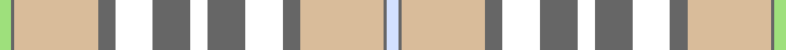

This page is one **sett** — a single exact thread-count. It belongs to the [tartan](/setts/wi4n1lr29n6w13n13w6n13w13n6lr29n1lg4/)
(the same proportion at any scale), whose colour order is pattern [WBYBWBWBWBYBY](/stripes/wbybwbwbwbyby/).

Sourced from register-of-tartans.  It is a [13 stripe tartan](/stripes/stripes13/).

Original link https://www.tartanregister.gov.uk/tartanDetails.aspx?ref=10527

## Register references

External register numbers recorded for this tartan.

- Scottish Register of Tartans: [10527](https://www.tartanregister.gov.uk/tartanDetails.aspx?ref=10527)

## Thread count
LG/8 N2 LR58 N12 W26 N26 W12 N26 W26 N12 LR58 N2 LN/8

One full sett is **536 threads**.

## Palette

Palette: <strong>Tartan Register</strong> <small style="color:#888">(1 of 5 colours)</small>
<table><thead><tr><th>Colour</th><th>Threads</th><th>Shade</th><th>Base</th><th>OKLCh</th></tr></thead><tbody><tr><td>LG/</td><td style="text-align:right;font-variant-numeric:tabular-nums">8</td><td><code style="background-color:#9EE07C;">#9EE07C</code> <small style="color:#888">#9EE07C</small></td><td>Y <code style="background-color:#F2BF00;">#F2BF00</code></td><td><small style="color:#888">oklch(84.0% 0.148 135.8)</small></td></tr><tr><td>N</td><td style="text-align:right;font-variant-numeric:tabular-nums">2</td><td><code style="background-color:#666666;">#666666</code> <small style="color:#888">#666666</small></td><td>B <code style="background-color:#2A418A;">#2A418A</code></td><td><small style="color:#888">oklch(51.0% 0.000 89.9)</small></td></tr><tr><td>LR</td><td style="text-align:right;font-variant-numeric:tabular-nums">58</td><td><code style="background-color:#D9BC9A;">#D9BC9A</code> <small style="color:#888">#D9BC9A</small></td><td>Y <code style="background-color:#F2BF00;">#F2BF00</code></td><td><small style="color:#888">oklch(81.2% 0.057 71.3)</small></td></tr><tr><td>N</td><td style="text-align:right;font-variant-numeric:tabular-nums">12</td><td><code style="background-color:#666666;">#666666</code> <small style="color:#888">#666666</small></td><td>B <code style="background-color:#2A418A;">#2A418A</code></td><td><small style="color:#888">oklch(51.0% 0.000 89.9)</small></td></tr><tr><td>W</td><td style="text-align:right;font-variant-numeric:tabular-nums">26</td><td><code style="background-color:#FFFFFF;">#FFFFFF</code> <small style="color:#888">#FFFFFF</small></td><td>W <code style="background-color:#F7F7F7;">#F7F7F7</code></td><td><small style="color:#888">oklch(100.0% 0.000 89.9)</small></td></tr><tr><td>N</td><td style="text-align:right;font-variant-numeric:tabular-nums">26</td><td><code style="background-color:#666666;">#666666</code> <small style="color:#888">#666666</small></td><td>B <code style="background-color:#2A418A;">#2A418A</code></td><td><small style="color:#888">oklch(51.0% 0.000 89.9)</small></td></tr><tr><td>W</td><td style="text-align:right;font-variant-numeric:tabular-nums">12</td><td><code style="background-color:#FFFFFF;">#FFFFFF</code> <small style="color:#888">#FFFFFF</small></td><td>W <code style="background-color:#F7F7F7;">#F7F7F7</code></td><td><small style="color:#888">oklch(100.0% 0.000 89.9)</small></td></tr><tr><td>N</td><td style="text-align:right;font-variant-numeric:tabular-nums">26</td><td><code style="background-color:#666666;">#666666</code> <small style="color:#888">#666666</small></td><td>B <code style="background-color:#2A418A;">#2A418A</code></td><td><small style="color:#888">oklch(51.0% 0.000 89.9)</small></td></tr><tr><td>W</td><td style="text-align:right;font-variant-numeric:tabular-nums">26</td><td><code style="background-color:#FFFFFF;">#FFFFFF</code> <small style="color:#888">#FFFFFF</small></td><td>W <code style="background-color:#F7F7F7;">#F7F7F7</code></td><td><small style="color:#888">oklch(100.0% 0.000 89.9)</small></td></tr><tr><td>N</td><td style="text-align:right;font-variant-numeric:tabular-nums">12</td><td><code style="background-color:#666666;">#666666</code> <small style="color:#888">#666666</small></td><td>B <code style="background-color:#2A418A;">#2A418A</code></td><td><small style="color:#888">oklch(51.0% 0.000 89.9)</small></td></tr><tr><td>LR</td><td style="text-align:right;font-variant-numeric:tabular-nums">58</td><td><code style="background-color:#D9BC9A;">#D9BC9A</code> <small style="color:#888">#D9BC9A</small></td><td>Y <code style="background-color:#F2BF00;">#F2BF00</code></td><td><small style="color:#888">oklch(81.2% 0.057 71.3)</small></td></tr><tr><td>N</td><td style="text-align:right;font-variant-numeric:tabular-nums">2</td><td><code style="background-color:#666666;">#666666</code> <small style="color:#888">#666666</small></td><td>B <code style="background-color:#2A418A;">#2A418A</code></td><td><small style="color:#888">oklch(51.0% 0.000 89.9)</small></td></tr><tr><td>LN/</td><td style="text-align:right;font-variant-numeric:tabular-nums">8</td><td><code style="background-color:#D3E1FF;">#D3E1FF</code> <small style="color:#888">#D3E1FF</small></td><td>W <code style="background-color:#F7F7F7;">#F7F7F7</code></td><td><small style="color:#888">oklch(90.9% 0.044 265.6)</small></td></tr></tbody></table>

## Nearest tartans

The nearest existing variants by ΔTartan distance, with this tartan at the top so the swatches line up against it.

ΔTartan

Tartan

Sett

—

<a href="/ttd/edit/#slug=wi4n1lr29n6w13n13w6n13w13n6lr29n1lg4~x2">Delta Dental Association</a> <a class="nn-out" href="/variants/s13/wi4n1lr29n6w13n13w6n13w13n6lr29n1lg4~x2/" title="open its dictionary page">↗</a>

1.20

<a href="/ttd/edit/#slug=g4o1lo29o6w13o13w6o13w13o6lo29o1t4~x2&amp;base=wi4n1lr29n6w13n13w6n13w13n6lr29n1lg4~x2">Delta Dental Association (Corporate)</a> <a class="nn-out" href="/variants/s13/g4o1lo29o6w13o13w6o13w13o6lo29o1t4~x2/" title="open its dictionary page">↗</a>

1.35

<a href="/variants/s8/wi30db1w4y10ly18~x2/">Alloway Primary School (Ayr)</a>

1.57

<a href="/ttd/edit/#slug=dy8g1lb6dy8lb3dy4g1lb8g1dy6lo20lb29dy3lb7lo7~x2&amp;base=wi4n1lr29n6w13n13w6n13w13n6lr29n1lg4~x2">Isle of Skye (Fashion)</a> <a class="nn-out" href="/variants/s15/dy8g1lb6dy8lb3dy4g1lb8g1dy6lo20lb29dy3lb7lo7~x2/" title="open its dictionary page">↗</a>

1.60

<a href="/ttd/edit/#slug=r24k2g8k2r8k1g24lb6k2r14lb18k4~x2&amp;base=wi4n1lr29n6w13n13w6n13w13n6lr29n1lg4~x2">Grant - 1714 (Piper) (Portrait)</a> <a class="nn-out" href="/variants/s12/r24k2g8k2r8k1g24lb6k2r14lb18k4~x2/" title="open its dictionary page">↗</a>

1.68

<a href="/ttd/edit/#slug=w9k2t9k1lb9w12o2w12lb24w9lb9~x2&amp;base=wi4n1lr29n6w13n13w6n13w13n6lr29n1lg4~x2">Tricotisse</a> <a class="nn-out" href="/variants/s11/w9k2t9k1lb9w12o2w12lb24w9lb9~x2/" title="open its dictionary page">↗</a>

1.71

<a href="/ttd/edit/#slug=y6db2y1w17y1db2y16lo27dg2~x2&amp;base=wi4n1lr29n6w13n13w6n13w13n6lr29n1lg4~x2">Rutlin (Personal)</a> <a class="nn-out" href="/variants/s9/y6db2y1w17y1db2y16lo27dg2~x2/" title="open its dictionary page">↗</a>

1.72

<a href="/ttd/edit/#slug=k4t2w15r6ly12r6w25t2k4t2w15t4k2t4k2t4k1~x2&amp;base=wi4n1lr29n6w13n13w6n13w13n6lr29n1lg4~x2">Beck Dress (Personal)</a> <a class="nn-out" href="/variants/s17/k4t2w15r6ly12r6w25t2k4t2w15t4k2t4k2t4k1~x2/" title="open its dictionary page">↗</a>

1.73

<a href="/ttd/edit/#slug=w6r2w38g8db6w2db2w2lo14r7g2r3w2~x2&amp;base=wi4n1lr29n6w13n13w6n13w13n6lr29n1lg4~x2">Grant of Auchnarrow</a> <a class="nn-out" href="/variants/s13/w6r2w38g8db6w2db2w2lo14r7g2r3w2~x2/" title="open its dictionary page">↗</a>

1.73

<a href="/ttd/edit/#slug=lb18ly2lb2ly1r3g3r2g2r1k2lb3w7lb2w2lb1w4~x4&amp;base=wi4n1lr29n6w13n13w6n13w13n6lr29n1lg4~x2">Inverness County (Canada)</a> <a class="nn-out" href="/variants/s16/lb18ly2lb2ly1r3g3r2g2r1k2lb3w7lb2w2lb1w4~x4/" title="open its dictionary page">↗</a>

1.74

<a href="/ttd/edit/#slug=w36lt12w1r12g16ly2~x2&amp;base=wi4n1lr29n6w13n13w6n13w13n6lr29n1lg4~x2">MacNappy</a> <a class="nn-out" href="/variants/s6/w36lt12w1r12g16ly2~x2/" title="open its dictionary page">↗</a>

## Neighbour map

Every grey dot is one of 14360 variants placed by the first two principal components of the ΔTartan feature space (44% of its variance). Red is this tartan; blue dots are its nearest — click one to open its page.

<svg viewBox="0 0 640 380" role="img" style="max-width:100%;height:auto;border:1px solid #e0e0e0;border-radius:4px;display:block" xmlns="http://www.w3.org/2000/svg"><image href="/nn/cloud.v1.png" width="640" height="380"/><a href="/variants/s13/g4o1lo29o6w13o13w6o13w13o6lo29o1t4~x2/"><circle cx="251.5" cy="128.3" r="4" fill="#3465a4"><title>Delta Dental Association (Corporate)</title></circle></a><a href="/variants/s8/wi30db1w4y10ly18~x2/"><circle cx="225.1" cy="124.8" r="4" fill="#3465a4"><title>Alloway Primary School (Ayr)</title></circle></a><a href="/variants/s15/dy8g1lb6dy8lb3dy4g1lb8g1dy6lo20lb29dy3lb7lo7~x2/"><circle cx="274.9" cy="106.9" r="4" fill="#3465a4"><title>Isle of Skye (Fashion)</title></circle></a><a href="/variants/s12/r24k2g8k2r8k1g24lb6k2r14lb18k4~x2/"><circle cx="214.1" cy="129.0" r="4" fill="#3465a4"><title>Grant - 1714 (Piper) (Portrait)</title></circle></a><a href="/variants/s11/w9k2t9k1lb9w12o2w12lb24w9lb9~x2/"><circle cx="225.7" cy="140.6" r="4" fill="#3465a4"><title>Tricotisse</title></circle></a><a href="/variants/s9/y6db2y1w17y1db2y16lo27dg2~x2/"><circle cx="251.6" cy="128.2" r="4" fill="#3465a4"><title>Rutlin (Personal)</title></circle></a><a href="/variants/s17/k4t2w15r6ly12r6w25t2k4t2w15t4k2t4k2t4k1~x2/"><circle cx="211.4" cy="75.1" r="4" fill="#3465a4"><title>Beck Dress (Personal)</title></circle></a><a href="/variants/s13/w6r2w38g8db6w2db2w2lo14r7g2r3w2~x2/"><circle cx="273.3" cy="88.3" r="4" fill="#3465a4"><title>Grant of Auchnarrow</title></circle></a><a href="/variants/s16/lb18ly2lb2ly1r3g3r2g2r1k2lb3w7lb2w2lb1w4~x4/"><circle cx="204.8" cy="75.3" r="4" fill="#3465a4"><title>Inverness County (Canada)</title></circle></a><a href="/variants/s6/w36lt12w1r12g16ly2~x2/"><circle cx="250.2" cy="126.5" r="4" fill="#3465a4"><title>MacNappy</title></circle></a><circle cx="223.1" cy="108.5" r="5" fill="#c00000"/></svg>

ID: /variants/s13/wi4n1lr29n6w13n13w6n13w13n6lr29n1lg4~x2/
