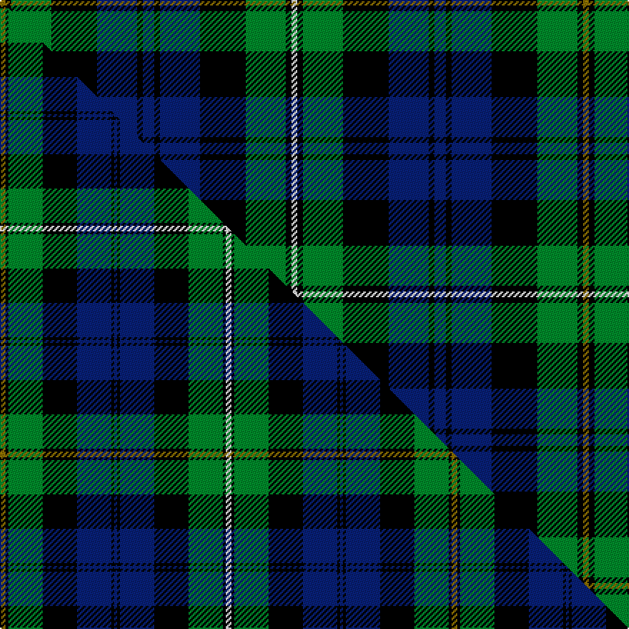

This is one **variant** — a specific cloth: this exact thread count and colourway, with its own
provenance below. It is one weaving of the [sett](/setts/y1k1g7k8db7k1db2k1db7k8g7k1w1/) (the scale-free proportion — the
same cloth at any scale or shade), whose colour order is pattern [GKGKBKBKBKGKW](/stripes/gkgkbkbkbkgkw/).

Part of the [Campbell of Loudoun](/tartans/campbell-of-loudoun/) tartan — the named design grouping this sett with its other cloths.

Sourced from tartans-authority.  It is a [13 stripe tartan](/stripes/stripes13/).

Original link [https://www.tartanregister.gov.uk/tartanDetails.aspx?ref=3](https://www.tartanregister.gov.uk/tartanDetails.aspx?ref=3)

Dataset <small>— provenance for this record, inherited from the source manifest</small>

<dl class="dataset-prov">
<dt>source</dt><dd><a href="/sources/tartans-authority/">Scottish Tartans Authority</a></dd>
<dt>data captured from</dt><dd><a href="https://github.com/thetartan/tartan-database/blob/master/data/tartans-authority/data.csv">https://github.com/thetartan/tartan-database/blob/master/data/tartans-authority/data.csv</a></dd>
<dt>data date</dt><dd>1906 <small>(this record)</small></dd>
<dt>licence</dt><dd><a href="https://creativecommons.org/licenses/by-nc-nd/4.0/">CC BY-NC-ND 4.0</a></dd>
</dl>

Capture chain <small>— the hands this data passed through, oldest first; each capture carries its own licence</small>

<ol class="capture-chain">
<li><a href="https://www.tartansauthority.com/">Scottish Tartans Authority</a> <small>the heritage body's archive — its tartan-ferret record browser is retired (links repaired to the SRT, above)</small></li>
<li><a href="https://github.com/thetartan/tartan-database">thetartan/tartan-database</a> <small>2016-2017</small> · <a href="https://creativecommons.org/licenses/by-nc-nd/4.0/">CC BY-NC-ND 4.0</a> <small>Levko Kravets's frozen compilation — the capture we vendored, and where its CC licence text came from</small></li>
<li>this dictionary <small>captured 2026-06-10 · commit 5bf86c7566</small> <small>each re-capture is a git commit to data/sources</small></li>
</ol>

## Register references

External register numbers recorded for this tartan.

- Scottish Tartans Authority (ITI): 3

## Thread count
Y/4 K4 G28 K32 DB28 K4 DB8 K4 DB28 K32 G28 K4 W/4

One full sett is **408 threads**.

## Palette
<table><thead><tr><th>Colour</th><th>Shade</th><th>OKLCh</th></tr></thead><tbody><tr><td>DB</td><td><code style="background-color:#082077;">#082077</code> <small style="color:#888">#082077</small></td><td><small style="color:#888">oklch(30.0% 0.149 265.1)</small></td></tr><tr><td>G</td><td><code style="background-color:#008B2A;">#008B2A</code> <small style="color:#888">#008B2A</small></td><td><small style="color:#888">oklch(55.4% 0.170 145.9)</small></td></tr><tr><td>K</td><td><code style="background-color:#000000;">#000000</code> <small style="color:#888">#000000</small></td><td><small style="color:#888">oklch(0.0% 0.000 0.0)</small></td></tr><tr><td>W</td><td><code style="background-color:#F7F7F7;">#F7F7F7</code> <small style="color:#888">#F7F7F7</small></td><td><small style="color:#888">oklch(97.6% 0.000 89.9)</small></td></tr><tr><td>Y</td><td><code style="background-color:#8B6E00;">#8B6E00</code> <small style="color:#888">#8B6E00</small></td><td><small style="color:#888">oklch(55.1% 0.113 90.4)</small></td></tr></tbody></table>

# Sample pattern

## Compared to the master

This cloth is one sett of its design; the master sett (the exemplar the design is anchored on) is below for comparison.

Its **ΔTartan distance** from the master is **0.47** — the same measure the nearest-tartans table ranks by (0 is identical; a re-scale of the same cloth is near 0, a recolour or a different proportion further).

<figure class="master-compare" style="margin:0">

this sett
master sett ★

<figcaption style="color:#888;font-size:smaller">One weave of this sett against the <a href="/setts/y2k1g12k12db12k1db1k1db12k12g12k1w2/">master sett ★</a>, split on the diagonal: a shared proportion runs seamlessly across it with only the shades shifting; a different proportion breaks on it.</figcaption>
</figure>

## Nearest tartan variants

The nearest existing variants by ΔTartan distance, with this cloth at the top so the swatches line up against it.

ΔTartan

Threads

Variant

Sett

—

408

<a href="/variants/s13/y1k1g7k8db7k1db2k1db7k8g7k1w1~x4/">Campbell of Loudoun (Clan)</a>

<a href="/ttd/edit/#slug=y2k1g12k12db12k1db1k1db12k12g12k1w2~x2&amp;base=y1k1g7k8db7k1db2k1db7k8g7k1w1~x4" title="compare in the TTD">0.47</a>

316

<a href="/variants/s13/y2k1g12k12db12k1db1k1db12k12g12k1w2~x2/">Campbell of Loudoun</a>

<a href="/ttd/edit/#slug=y2k1g12k12db12k1db2k1db12k12g12k1w2~x2&amp;base=y1k1g7k8db7k1db2k1db7k8g7k1w1~x4" title="compare in the TTD">0.48</a>

320

<a href="/variants/s13/y2k1g12k12db12k1db2k1db12k12g12k1w2~x2/">Campbell of Loudoun Clan Tartan</a>

<a href="/ttd/edit/#slug=r1k1g6k6db6k1db1k1db6k6g6k1ly1~x4&amp;base=y1k1g7k8db7k1db2k1db7k8g7k1w1~x4" title="compare in the TTD">0.54</a>

336

<a href="/variants/s13/r1k1g6k6db6k1db1k1db6k6g6k1ly1~x4/">MacEwen/MacEwan</a>

<a href="/ttd/edit/#slug=y4k1g12k12db12k1db4k1db12k12g12k1w4~x2&amp;base=y1k1g7k8db7k1db2k1db7k8g7k1w1~x4" title="compare in the TTD">0.55</a>

336

<a href="/variants/s13/y4k1g12k12db12k1db4k1db12k12g12k1w4~x2/">Campbell of Loudon</a>

<a href="/ttd/edit/#slug=r2k1g12k12db12k1db2k1db12k12g12k1y2~x2&amp;base=y1k1g7k8db7k1db2k1db7k8g7k1w1~x4" title="compare in the TTD">0.78</a>

320

<a href="/variants/s13/r2k1g12k12db12k1db2k1db12k12g12k1y2~x2/">MacEwen Clan Tartan</a>

<a href="/ttd/edit/#slug=r4k1g12k12db12k1db4k1db12k12g12k1y4~x2&amp;base=y1k1g7k8db7k1db2k1db7k8g7k1w1~x4" title="compare in the TTD">0.84</a>

336

<a href="/variants/s13/r4k1g12k12db12k1db4k1db12k12g12k1y4~x2/">MacEwan</a>

<a href="/ttd/edit/#slug=g1k1g8k8db8r1db8k8g1k1g1k1g3w1~x2&amp;base=y1k1g7k8db7k1db2k1db7k8g7k1w1~x4" title="compare in the TTD">1.00</a>

200

<a href="/variants/s14/g1k1g8k8db8r1db8k8g1k1g1k1g3w1~x2/">Urquhart (Brydone)</a>

<a href="/ttd/edit/#slug=db9k1db1k1db1k7g8y2g8k7db8k1r2~x2&amp;base=y1k1g7k8db7k1db2k1db7k8g7k1w1~x4" title="compare in the TTD">1.19</a>

202

<a href="/variants/s13/db9k1db1k1db1k7g8y2g8k7db8k1r2~x2/">MacLeod of Gesto</a>

<a href="/ttd/edit/#slug=db18k5g3r3g6k2y2k2g6r3g3k10db5k10&amp;base=y1k1g7k8db7k1db2k1db7k8g7k1w1~x4" title="compare in the TTD">1.27</a>

128

<a href="/variants/s14/db18k5g3r3g6k2y2k2g6r3g3k10db5k10/">MacClellan Clan Tartan</a>

<a href="/ttd/edit/#slug=r2k1db8k8g8y2g8k8db1k1db1k1db4r1~x4&amp;base=y1k1g7k8db7k1db2k1db7k8g7k1w1~x4" title="compare in the TTD">1.36</a>

420

<a href="/variants/s14/r2k1db8k8g8y2g8k8db1k1db1k1db4r1~x4/">Farquharson</a>

## Neighbour map

Every grey dot is one of 13621 variants placed by the first two principal components of the ΔTartan feature space (42% of its variance). Red is this tartan; blue dots are its nearest — click one to open its page.

<svg viewBox="0 0 640 380" role="img" style="max-width:100%;height:auto;border:1px solid #e0e0e0;border-radius:4px;display:block" xmlns="http://www.w3.org/2000/svg"><image href="/nn/cloud.v1.png" width="640" height="380"/><a href="/variants/s13/y2k1g12k12db12k1db1k1db12k12g12k1w2~x2/"><circle cx="122.9" cy="144.9" r="4" fill="#3465a4"><title>Campbell of Loudoun</title></circle></a><a href="/variants/s13/y2k1g12k12db12k1db2k1db12k12g12k1w2~x2/"><circle cx="120.8" cy="146.9" r="4" fill="#3465a4"><title>Campbell of Loudoun Clan Tartan</title></circle></a><a href="/variants/s13/r1k1g6k6db6k1db1k1db6k6g6k1ly1~x4/"><circle cx="105.0" cy="177.9" r="4" fill="#3465a4"><title>MacEwen/MacEwan</title></circle></a><a href="/variants/s13/y4k1g12k12db12k1db4k1db12k12g12k1w4~x2/"><circle cx="94.9" cy="155.8" r="4" fill="#3465a4"><title>Campbell of Loudon</title></circle></a><a href="/variants/s13/r2k1g12k12db12k1db2k1db12k12g12k1y2~x2/"><circle cx="124.2" cy="146.4" r="4" fill="#3465a4"><title>MacEwen Clan Tartan</title></circle></a><a href="/variants/s13/r4k1g12k12db12k1db4k1db12k12g12k1y4~x2/"><circle cx="102.2" cy="156.0" r="4" fill="#3465a4"><title>MacEwan</title></circle></a><a href="/variants/s14/g1k1g8k8db8r1db8k8g1k1g1k1g3w1~x2/"><circle cx="124.1" cy="152.0" r="4" fill="#3465a4"><title>Urquhart (Brydone)</title></circle></a><a href="/variants/s13/db9k1db1k1db1k7g8y2g8k7db8k1r2~x2/"><circle cx="107.5" cy="163.8" r="4" fill="#3465a4"><title>MacLeod of Gesto</title></circle></a><a href="/variants/s14/db18k5g3r3g6k2y2k2g6r3g3k10db5k10/"><circle cx="113.3" cy="158.0" r="4" fill="#3465a4"><title>MacClellan Clan Tartan</title></circle></a><a href="/variants/s14/r2k1db8k8g8y2g8k8db1k1db1k1db4r1~x4/"><circle cx="101.5" cy="157.2" r="4" fill="#3465a4"><title>Farquharson</title></circle></a><circle cx="122.4" cy="165.8" r="5" fill="#c00000"/><text x="320" y="376" text-anchor="middle" font-size="11" fill="#999">ground</text><text x="11" y="190" text-anchor="middle" font-size="11" fill="#999" transform="rotate(-90 11 190)">complexity</text></svg>

ID: /variants/s13/y1k1g7k8db7k1db2k1db7k8g7k1w1~x4/
