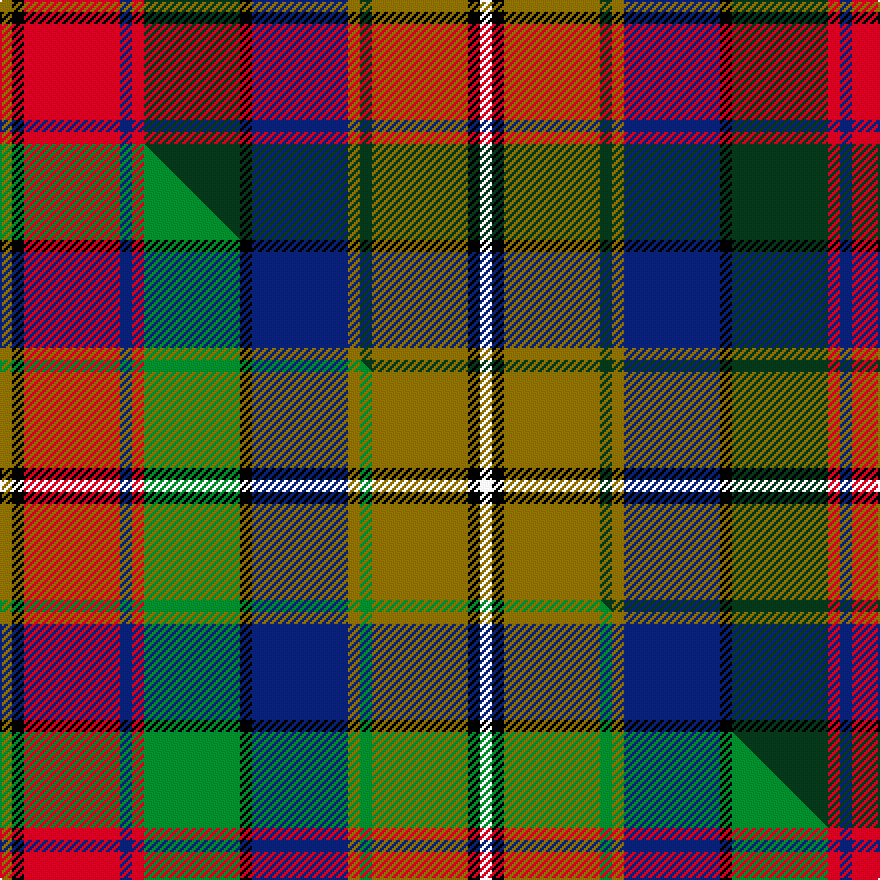

This is one **variant** — a specific cloth: this exact thread count and colourway, with its own
provenance below. It is one weaving of the [sett](/tartans/r/ro/robieson-playfield/) (the scale-free proportion — the
same cloth at any scale or shade), whose colour order is pattern [GKRBRGKBGGGKW](/stripes/gkrbrgkbgggkw/).

Part of the [Robieson Playfield](/tartans/r/ro/robieson-playfield/) tartan — the named design grouping this sett with its other cloths.

Sourced from tartans-authority.  It is a [13 stripe tartan](/stripes/stripes13/).

Original link <code>http://www.tartansauthority.com/tartan-ferret/display/6905/</code> — retired · [Internet Archive copy](https://web.archive.org/web/*/http://www.tartansauthority.com/tartan-ferret/display/6905/*)

Dataset <small>— provenance for this record, inherited from the source manifest</small>

<dl class="dataset-prov">
<dt>source</dt><dd><a href="/sources/tartans-authority/">Scottish Tartans Authority</a></dd>
<dt>data captured from</dt><dd><a href="https://github.com/thetartan/tartan-database/blob/master/data/tartans-authority/data.csv">https://github.com/thetartan/tartan-database/blob/master/data/tartans-authority/data.csv</a></dd>
<dt>data date</dt><dd>Nov 2005 <small>(this record)</small></dd>
<dt>licence</dt><dd><a href="https://creativecommons.org/licenses/by-nc-nd/4.0/">CC BY-NC-ND 4.0</a></dd>
</dl>

Capture chain <small>— the hands this data passed through, oldest first; each capture carries its own licence</small>

<ol class="capture-chain">
<li><a href="https://www.tartansauthority.com/">Scottish Tartans Authority</a> <small>the heritage body’s archive — its tartan-ferret record browser is retired; dead record links are shown unlinked, with an Internet Archive copy (ITI numbers are not SRT references)</small></li>
<li><a href="https://github.com/thetartan/tartan-database">thetartan/tartan-database</a> <small>2016-2017</small> · <a href="https://creativecommons.org/licenses/by-nc-nd/4.0/">CC BY-NC-ND 4.0</a> <small>Levko Kravets's frozen compilation — the capture we vendored, and where its CC licence text came from</small></li>
<li>this dictionary <small>captured 2026-06-10 · commit 5bf86c7566</small> <small>each re-capture is a git commit to data/sources</small></li>
</ol>

## Register references

External register numbers recorded for this tartan.

- Scottish Tartans Authority (ITI): 6905

## Thread count
Y/6 K6 R48 DB6 R6 DG48 K6 DB48 Y6 DG6 Y48 K6 W/6

One full sett is **480 threads**.

## Palette
<table><thead><tr><th>Colour</th><th>Shade</th><th>OKLCh</th></tr></thead><tbody><tr><td>DB</td><td><code style="background-color:#082077;">#082077</code> <small style="color:#888">#082077</small></td><td><small style="color:#888">oklch(30.0% 0.149 265.1)</small></td></tr><tr><td>DG</td><td><code style="background-color:#053819;">#053819</code> <small style="color:#888">#053819</small></td><td><small style="color:#888">oklch(30.0% 0.075 151.3)</small></td></tr><tr><td>K</td><td><code style="background-color:#000000;">#000000</code> <small style="color:#888">#000000</small></td><td><small style="color:#888">oklch(0.0% 0.000 0.0)</small></td></tr><tr><td>W</td><td><code style="background-color:#F7F7F7;">#F7F7F7</code> <small style="color:#888">#F7F7F7</small></td><td><small style="color:#888">oklch(97.6% 0.000 89.9)</small></td></tr><tr><td>R</td><td><code style="background-color:#D60020;">#D60020</code> <small style="color:#888">#D60020</small></td><td><small style="color:#888">oklch(55.2% 0.224 25.5)</small></td></tr><tr><td>Y</td><td><code style="background-color:#8B6E00;">#8B6E00</code> <small style="color:#888">#8B6E00</small></td><td><small style="color:#888">oklch(55.1% 0.113 90.4)</small></td></tr></tbody></table>

# Sample pattern

## Compared to the master

This cloth is one sett of its design; the master sett (the exemplar the design is anchored on) is below for comparison.

Its **ΔTartan distance** from the master is **0.11** — the same measure the nearest-tartans table ranks by (0 is identical; a re-scale of the same cloth is near 0, a recolour or a different proportion further).

<figure class="master-compare" style="margin:0">

this sett
master sett ★

<figcaption style="color:#888;font-size:smaller">One weave of this sett against the <a href="/setts/y1k1r8db1r1g8k1db8y1g1y8k1w1/">master sett ★</a>, split on the diagonal: a shared proportion runs seamlessly across it with only the shades shifting; a different proportion breaks on it.</figcaption>
</figure>

## Nearest tartan variants

The nearest existing variants by ΔTartan distance, with this cloth at the top so the swatches line up against it.

ΔTartan

Threads

Variant

Sett

—

480

<a href="/variants/s13/y1k1r8db1r1dg8k1db8y1dg1y8k1w1~x6/">Robieson Playfield (School)</a>

<a href="/ttd/edit/#slug=y1k1r8db1r1g8k1db8y1g1y8k1w1~x6&amp;base=y1k1r8db1r1dg8k1db8y1dg1y8k1w1~x6" title="compare in the TTD">0.11</a>

480

<a href="/variants/s13/y1k1r8db1r1g8k1db8y1g1y8k1w1~x6/">Robieson Playfield</a>

<a href="/ttd/edit/#slug=lb1dg8k1lb2k1y2k1lb2k1r8w1lb1~x4&amp;base=y1k1r8db1r1dg8k1db8y1dg1y8k1w1~x6" title="compare in the TTD">2.23</a>

224

<a href="/variants/s12/lb1dg8k1lb2k1y2k1lb2k1r8w1lb1~x4/">MacWhirter</a>

<a href="/ttd/edit/#slug=r13w2r13k3dr13g21db3k18db9k2db2k2db15w2~x2&amp;base=y1k1r8db1r1dg8k1db8y1dg1y8k1w1~x6" title="compare in the TTD">2.60</a>

442

<a href="/variants/s14/r13w2r13k3dr13g21db3k18db9k2db2k2db15w2~x2/">Taiwan Scottish</a>

<a href="/ttd/edit/#slug=r3g18r4lb3r4k13r3db18g2y3~x2&amp;base=y1k1r8db1r1dg8k1db8y1dg1y8k1w1~x6" title="compare in the TTD">2.61</a>

272

<a href="/variants/s10/r3g18r4lb3r4k13r3db18g2y3~x2/">Stirling and Bannockburn District Tartan</a>

<a href="/ttd/edit/#slug=g23k3db9k3r20w3r20k3db9k3y20k3y20k3db9k3g23db9~x2&amp;base=y1k1r8db1r1dg8k1db8y1dg1y8k1w1~x6" title="compare in the TTD">2.66</a>

680

<a href="/variants/s18/g23k3db9k3r20w3r20k3db9k3y20k3y20k3db9k3g23db9~x2/">Buchanan</a>

<a href="/ttd/edit/#slug=g12k1db4k1y6k1y6k1db4k1r8w1r8k1db4k1g6db4~x4&amp;base=y1k1r8db1r1dg8k1db8y1dg1y8k1w1~x6" title="compare in the TTD">2.68</a>

496

<a href="/variants/s18/g12k1db4k1y6k1y6k1db4k1r8w1r8k1db4k1g6db4~x4/">Buchanan 2</a>

<a href="/ttd/edit/#slug=g19ri3g19db7r26k3db7k3dp42k3db7k3~x2~ri2806019-r1807008&amp;base=y1k1r8db1r1dg8k1db8y1dg1y8k1w1~x6" title="compare in the TTD">2.69</a>

524

<a href="/variants/s12/g19ri3g19db7r26k3db7k3dp42k3db7k3~x2~ri2806019-r1807008/">Tartan Spirit</a>

<a href="/ttd/edit/#slug=db8k1r4k1r4k1r4k1g8k1y1r1w1~x2&amp;base=y1k1r8db1r1dg8k1db8y1dg1y8k1w1~x6" title="compare in the TTD">2.71</a>

126

<a href="/variants/s13/db8k1r4k1r4k1r4k1g8k1y1r1w1~x2/">Unidentified No 158 Silk Fragment</a>

<a href="/ttd/edit/#slug=g6k1db4k1y6k1y6k1db4k1r8w1r8k1db4k1g6db4~x4&amp;base=y1k1r8db1r1dg8k1db8y1dg1y8k1w1~x6" title="compare in the TTD">2.72</a>

472

<a href="/variants/s18/g6k1db4k1y6k1y6k1db4k1r8w1r8k1db4k1g6db4~x4/">Buchanan (Wilson)</a>

<a href="/ttd/edit/#slug=y6k1db4k1r8w1r8k1db4k1g6db4g6k1db4k1y6k1~x2&amp;base=y1k1r8db1r1dg8k1db8y1dg1y8k1w1~x6" title="compare in the TTD">2.72</a>

242

<a href="/variants/s18/y6k1db4k1r8w1r8k1db4k1g6db4g6k1db4k1y6k1~x2/">Buchanan</a>

## Neighbour map

Every grey dot is one of 13656 variants placed by the first two principal components of the ΔTartan feature space (42% of its variance). Red is this tartan; blue dots are its nearest — click one to open its page. The map is a flat projection of a many-dimensional space — [how to read it](/posts/neighbourhood-maps/).

<svg viewBox="0 0 640 380" role="img" style="max-width:100%;height:auto;border:1px solid #e0e0e0;border-radius:4px;display:block" xmlns="http://www.w3.org/2000/svg"><image href="/nn/cloud.v1.png" width="640" height="380"/><a href="/variants/s13/y1k1r8db1r1g8k1db8y1g1y8k1w1~x6/"><circle cx="64.0" cy="137.5" r="4" fill="#3465a4"><title>Robieson Playfield</title></circle></a><a href="/variants/s12/lb1dg8k1lb2k1y2k1lb2k1r8w1lb1~x4/"><circle cx="60.1" cy="128.3" r="4" fill="#3465a4"><title>MacWhirter</title></circle></a><a href="/variants/s14/r13w2r13k3dr13g21db3k18db9k2db2k2db15w2~x2/"><circle cx="35.6" cy="135.1" r="4" fill="#3465a4"><title>Taiwan Scottish</title></circle></a><a href="/variants/s10/r3g18r4lb3r4k13r3db18g2y3~x2/"><circle cx="60.2" cy="148.4" r="4" fill="#3465a4"><title>Stirling and Bannockburn District Tartan</title></circle></a><a href="/variants/s18/g23k3db9k3r20w3r20k3db9k3y20k3y20k3db9k3g23db9~x2/"><circle cx="32.7" cy="146.4" r="4" fill="#3465a4"><title>Buchanan</title></circle></a><a href="/variants/s18/g12k1db4k1y6k1y6k1db4k1r8w1r8k1db4k1g6db4~x4/"><circle cx="55.0" cy="125.6" r="4" fill="#3465a4"><title>Buchanan 2</title></circle></a><a href="/variants/s12/g19ri3g19db7r26k3db7k3dp42k3db7k3~x2~ri2806019-r1807008/"><circle cx="115.9" cy="123.2" r="4" fill="#3465a4"><title>Tartan Spirit</title></circle></a><a href="/variants/s13/db8k1r4k1r4k1r4k1g8k1y1r1w1~x2/"><circle cx="88.9" cy="131.8" r="4" fill="#3465a4"><title>Unidentified No 158 Silk Fragment</title></circle></a><a href="/variants/s18/g6k1db4k1y6k1y6k1db4k1r8w1r8k1db4k1g6db4~x4/"><circle cx="31.7" cy="147.7" r="4" fill="#3465a4"><title>Buchanan (Wilson)</title></circle></a><a href="/variants/s18/y6k1db4k1r8w1r8k1db4k1g6db4g6k1db4k1y6k1~x2/"><circle cx="31.7" cy="147.7" r="4" fill="#3465a4"><title>Buchanan</title></circle></a><circle cx="70.0" cy="137.1" r="5" fill="#c00000"/><text x="320" y="376" text-anchor="middle" font-size="11" fill="#999">ground</text><text x="11" y="190" text-anchor="middle" font-size="11" fill="#999" transform="rotate(-90 11 190)">complexity</text></svg>

ID: /variants/s13/y1k1r8db1r1dg8k1db8y1dg1y8k1w1~x6/
