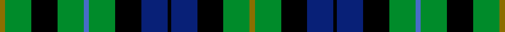
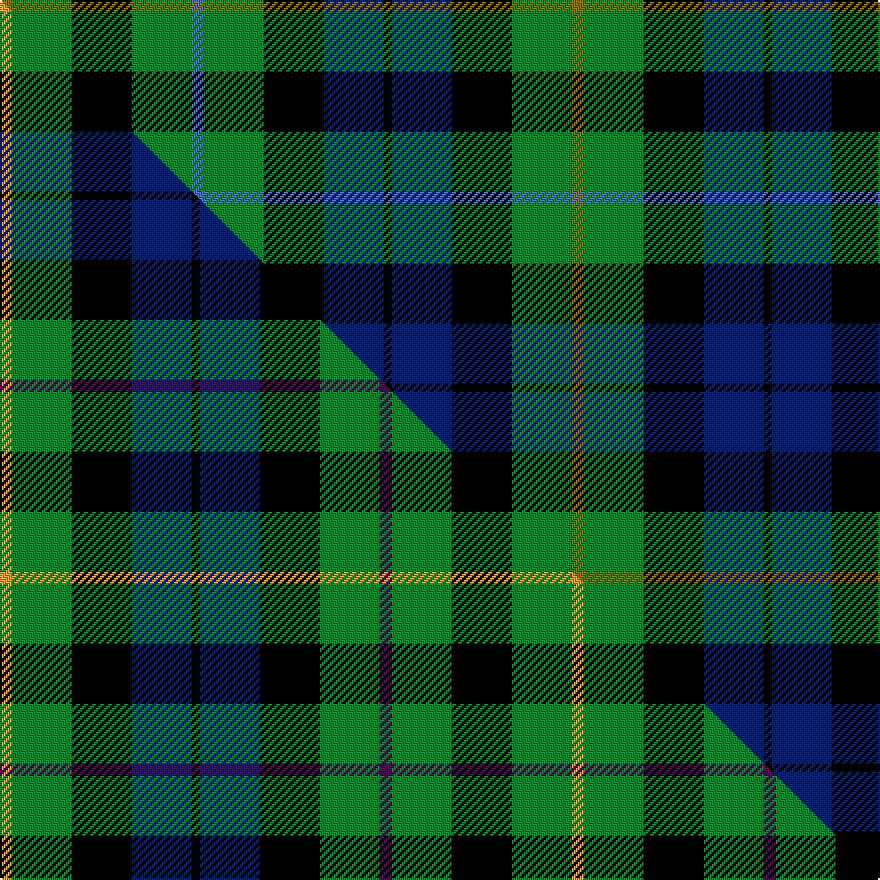

This page is one **sett** — a single exact thread-count. It belongs to the [tartan](/setts/y3g15k15db15k2db15k15g15b3g15k15g15y3/)
(the same proportion at any scale), whose colour order is pattern [GGKBKBKGBGKGG](/stripes/ggkbkbkgbgkgg/).

Part of the [MacBride](/tartans/macbride/) tartan — the named design grouping this sett with its other cloths.

Sourced from weddslist.  It is a [13 stripe tartan](/stripes/stripes13/).

Original link http://www.weddslist.com/cgi-bin/tartans/pg.pl?source=sts

## Thread count
Y/6 G30 K30 G30 B6 G30 K30 DB30 K4 DB30 K30 G30 Y/6

One full sett is **572 threads**.

## Palette
<table><thead><tr><th>Colour</th><th>Shade</th><th>OKLCh</th></tr></thead><tbody><tr><td>DB</td><td><code style="background-color:#082077;">#082077</code> <small style="color:#888">#082077</small></td><td><small style="color:#888">oklch(30.0% 0.149 265.1)</small></td></tr><tr><td>G</td><td><code style="background-color:#008B2A;">#008B2A</code> <small style="color:#888">#008B2A</small></td><td><small style="color:#888">oklch(55.4% 0.170 145.9)</small></td></tr><tr><td>K</td><td><code style="background-color:#000000;">#000000</code> <small style="color:#888">#000000</small></td><td><small style="color:#888">oklch(0.0% 0.000 0.0)</small></td></tr><tr><td>B</td><td><code style="background-color:#466CC8;">#466CC8</code> <small style="color:#888">#466CC8</small></td><td><small style="color:#888">oklch(55.1% 0.149 265.0)</small></td></tr><tr><td>Y</td><td><code style="background-color:#8B6E00;">#8B6E00</code> <small style="color:#888">#8B6E00</small></td><td><small style="color:#888">oklch(55.1% 0.113 90.4)</small></td></tr></tbody></table>

# Sample pattern

## Compared to the master

This cloth is one sett of its design; the master sett (the exemplar the design is anchored on) is below for comparison.

Its **ΔTartan distance** from the master is **0.18** — the same measure the nearest-tartans table ranks by (0 is identical; a re-scale of the same cloth is near 0, a recolour or a different proportion further).

<figure class="master-compare" style="margin:0">

this sett
master sett ★

<figcaption style="color:#888;font-size:smaller">One weave of this sett against the <a href="/setts/lo3g15k15db15k2db15k15g15dp3g15k15g15lo3/">master sett ★</a>, split on the diagonal: a shared proportion runs seamlessly across it with only the shades shifting; a different proportion breaks on it.</figcaption>
</figure>

## Nearest variants

The nearest existing variants by ΔTartan distance, with this cloth at the top so the swatches line up against it.

ΔTartan

Threads

Variant

Sett

—

572

<a href="/variants/s13/y3g15k15db15k2db15k15g15b3g15k15g15y3~x2/">MacBride</a>

<a href="/ttd/edit/#slug=y3g15k15db15k2db15k15g15o3g15k15g15y3~x2&amp;base=y3g15k15db15k2db15k15g15b3g15k15g15y3~x2" title="compare in the TTD">0.30</a>

572

<a href="/variants/s13/y3g15k15db15k2db15k15g15o3g15k15g15y3~x2/">MacBride Family Tartan</a>

<a href="/ttd/edit/#slug=k15g15y3g15k15g15r3g15k15db15k2db15~x2&amp;base=y3g15k15db15k2db15k15g15b3g15k15g15y3~x2" title="compare in the TTD">0.60</a>

512

<a href="/variants/s12/k15g15y3g15k15g15r3g15k15db15k2db15~x2/">Rollo Family Tartan</a>

<a href="/ttd/edit/#slug=k21g21r4g21k21g21y4g21k21db21k3db21~x2&amp;base=y3g15k15db15k2db15k15g15b3g15k15g15y3~x2" title="compare in the TTD">0.70</a>

716

<a href="/variants/s12/k21g21r4g21k21g21y4g21k21db21k3db21~x2/">Rollo</a>

<a href="/ttd/edit/#slug=lo3g15k15db15k2db15k15g15dp3g15k15g15lo3~x2&amp;base=y3g15k15db15k2db15k15g15b3g15k15g15y3~x2" title="compare in the TTD">0.90</a>

572

<a href="/variants/s13/lo3g15k15db15k2db15k15g15dp3g15k15g15lo3~x2/">MacBride</a>

<a href="/ttd/edit/#slug=k2t1g6t2g2k4g5ly1g5k4db4k2db2~x4&amp;base=y3g15k15db15k2db15k15g15b3g15k15g15y3~x2" title="compare in the TTD">1.19</a>

304

<a href="/variants/s13/k2t1g6t2g2k4g5ly1g5k4db4k2db2~x4/">Gordon Dress (US Fashion)</a>

<a href="/ttd/edit/#slug=db9k9g9w2g9k9g9w2g9k9db9k3~x2~db1406275-w4000000&amp;base=y3g15k15db15k2db15k15g15b3g15k15g15y3~x2" title="compare in the TTD">1.36</a>

328

<a href="/variants/s12/db9k9g9w2g9k9g9w2g9k9db9k3~x2~db1406275-w4000000/">Graham of Montrose #2</a>

<a href="/ttd/edit/#slug=k5g4w1g4k1g4r1g4k5db5k1db5~x4&amp;base=y3g15k15db15k2db15k15g15b3g15k15g15y3~x2" title="compare in the TTD">1.41</a>

280

<a href="/variants/s12/k5g4w1g4k1g4r1g4k5db5k1db5~x4/">Lloyd of Dolobran Family Tartan</a>

## Neighbour map

Every grey dot is one of 13620 variants placed by the first two principal components of the ΔTartan feature space (42% of its variance). Red is this tartan; blue dots are its nearest — click one to open its page.

<svg viewBox="0 0 640 380" role="img" style="max-width:100%;height:auto;border:1px solid #e0e0e0;border-radius:4px;display:block" xmlns="http://www.w3.org/2000/svg"><image href="/nn/cloud.v1.png" width="640" height="380"/><a href="/variants/s13/y3g15k15db15k2db15k15g15o3g15k15g15y3~x2/"><circle cx="104.4" cy="199.4" r="4" fill="#3465a4"><title>MacBride Family Tartan</title></circle></a><a href="/variants/s12/k15g15y3g15k15g15r3g15k15db15k2db15~x2/"><circle cx="106.2" cy="209.1" r="4" fill="#3465a4"><title>Rollo Family Tartan</title></circle></a><a href="/variants/s12/k21g21r4g21k21g21y4g21k21db21k3db21~x2/"><circle cx="104.8" cy="211.3" r="4" fill="#3465a4"><title>Rollo</title></circle></a><a href="/variants/s13/lo3g15k15db15k2db15k15g15dp3g15k15g15lo3~x2/"><circle cx="101.7" cy="198.5" r="4" fill="#3465a4"><title>MacBride</title></circle></a><a href="/variants/s13/k2t1g6t2g2k4g5ly1g5k4db4k2db2~x4/"><circle cx="109.1" cy="206.2" r="4" fill="#3465a4"><title>Gordon Dress (US Fashion)</title></circle></a><a href="/variants/s12/db9k9g9w2g9k9g9w2g9k9db9k3~x2~db1406275-w4000000/"><circle cx="91.1" cy="247.8" r="4" fill="#3465a4"><title>Graham of Montrose #2</title></circle></a><a href="/variants/s12/k5g4w1g4k1g4r1g4k5db5k1db5~x4/"><circle cx="85.8" cy="215.0" r="4" fill="#3465a4"><title>Lloyd of Dolobran Family Tartan</title></circle></a><circle cx="104.8" cy="200.0" r="5" fill="#c00000"/><text x="320" y="376" text-anchor="middle" font-size="11" fill="#999">ground</text><text x="11" y="190" text-anchor="middle" font-size="11" fill="#999" transform="rotate(-90 11 190)">complexity</text></svg>

ID: /variants/s13/y3g15k15db15k2db15k15g15b3g15k15g15y3~x2/
