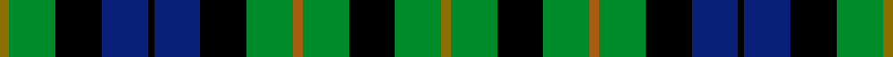
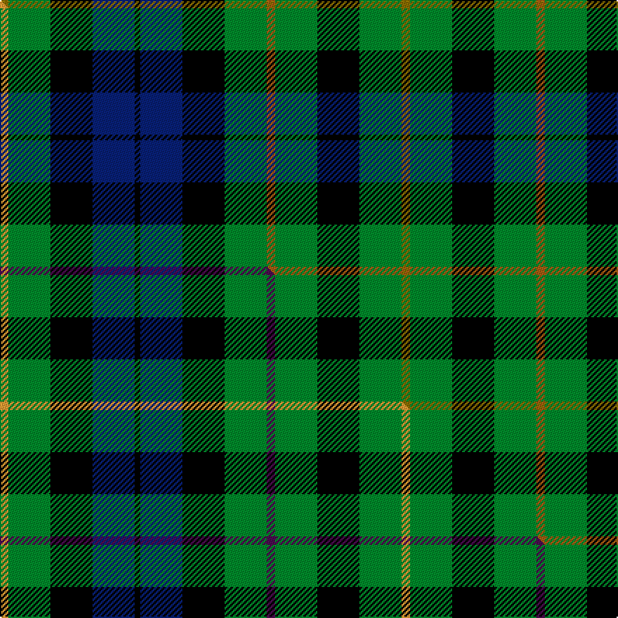

This is one **variant** — a specific cloth: this exact thread count and colourway, with its own
provenance below. It is one weaving of the [sett](/setts/y3g15k15db15k2db15k15g15o3g15k15g15y3/) (the scale-free proportion — the
same cloth at any scale or shade), whose colour order is pattern [GGKBKBKGRGKGG](/stripes/ggkbkbkgrgkgg/).

Part of the [MacBride](/tartans/m/ma/macbride/) tartan — the named design grouping this sett with its other cloths.

Sourced from house-of-tartan.  It is a [13 stripe tartan](/stripes/stripes13/).

Original link [http://www.house-of-tartan.scotland.net/house/TartanViewjs.asp?colr=Def&tnam=2153](http://www.house-of-tartan.scotland.net/house/TartanViewjs.asp?colr=Def&tnam=2153)

## Provenance

Earliest known date: 1992 The family of MacBride, (from SaintBride or Brigid) are known to have been a sept of the MacDonalds. Head of the family, Mr Stuart C. MacBride, commissioned Mr Harry Lindley to create a MacBride tartan from the Ensigns Armorial recently granted by Lord Lyon. Mr MacBride is a member of the Weaver Incorporation of Aberdeen. Traditionally members of the family, as a courtesy, ask permission of the chief or head of the family before wearing his tartan.

Dataset <small>— provenance for this record, inherited from the source manifest</small>

<dl class="dataset-prov">
<dt>source</dt><dd><a href="/sources/house-of-tartan/">House of Tartan</a></dd>
<dt>data captured from</dt><dd><a href="https://github.com/thetartan/tartan-database/blob/master/data/house-of-tartan/data.csv">https://github.com/thetartan/tartan-database/blob/master/data/house-of-tartan/data.csv</a></dd>
<dt>data date</dt><dd>1992 <small>(this record)</small></dd>
<dt>licence</dt><dd><a href="https://creativecommons.org/licenses/by-nc-nd/4.0/">CC BY-NC-ND 4.0</a></dd>
</dl>

Capture chain <small>— the hands this data passed through, oldest first; each capture carries its own licence</small>

<ol class="capture-chain">
<li><a href="http://www.house-of-tartan.scotland.net/">House of Tartan</a> <small>the weaver/retailer's database — the site is now offline; the URL is kept as the ultimate source's identity</small></li>
<li><a href="https://github.com/thetartan/tartan-database">thetartan/tartan-database</a> <small>2016-2017</small> · <a href="https://creativecommons.org/licenses/by-nc-nd/4.0/">CC BY-NC-ND 4.0</a> <small>Levko Kravets's frozen compilation — the capture we vendored, and where its CC licence text came from</small></li>
<li>this dictionary <small>captured 2026-06-10 · commit 5bf86c7566</small> <small>each re-capture is a git commit to data/sources</small></li>
</ol>

## Thread count
Y/6 G30 K30 DB30 K4 DB30 K30 G30 O6 G30 K30 G30 Y/6

One full sett is **572 threads**.

## Palette
<table><thead><tr><th>Colour</th><th>Shade</th><th>OKLCh</th></tr></thead><tbody><tr><td>DB</td><td><code style="background-color:#082077;">#082077</code> <small style="color:#888">#082077</small></td><td><small style="color:#888">oklch(30.0% 0.149 265.1)</small></td></tr><tr><td>G</td><td><code style="background-color:#008B2A;">#008B2A</code> <small style="color:#888">#008B2A</small></td><td><small style="color:#888">oklch(55.4% 0.170 145.9)</small></td></tr><tr><td>K</td><td><code style="background-color:#000000;">#000000</code> <small style="color:#888">#000000</small></td><td><small style="color:#888">oklch(0.0% 0.000 0.0)</small></td></tr><tr><td>O</td><td><code style="background-color:#A65C11;">#A65C11</code> <small style="color:#888">#A65C11</small></td><td><small style="color:#888">oklch(55.0% 0.125 58.3)</small></td></tr><tr><td>Y</td><td><code style="background-color:#8B6E00;">#8B6E00</code> <small style="color:#888">#8B6E00</small></td><td><small style="color:#888">oklch(55.1% 0.113 90.4)</small></td></tr></tbody></table>

# Sample pattern

## Compared to the master

This cloth is one sett of its design; the master sett (the exemplar the design is anchored on) is below for comparison.

Its **ΔTartan distance** from the master is **0.90** — the same measure the nearest-tartans table ranks by (0 is identical; a re-scale of the same cloth is near 0, a recolour or a different proportion further).

<figure class="master-compare" style="margin:0">

this sett
master sett ★

<figcaption style="color:#888;font-size:smaller">One weave of this sett against the <a href="/setts/lo3g15k15db15k2db15k15g15dp3g15k15g15lo3/">master sett ★</a>, split on the diagonal: a shared proportion runs seamlessly across it with only the shades shifting; a different proportion breaks on it.</figcaption>
</figure>

## Nearest tartan variants

The nearest existing variants by ΔTartan distance, with this cloth at the top so the swatches line up against it.

ΔTartan

Threads

Variant

Sett

—

572

<a href="/variants/s13/y3g15k15db15k2db15k15g15o3g15k15g15y3~x2/">MacBride Family Tartan</a>

<a href="/ttd/edit/#slug=y3g15k15db15k2db15k15g15b3g15k15g15y3~x2&amp;base=y3g15k15db15k2db15k15g15o3g15k15g15y3~x2" title="compare in the TTD">0.30</a>

572

<a href="/variants/s13/y3g15k15db15k2db15k15g15b3g15k15g15y3~x2/">MacBride</a>

<a href="/ttd/edit/#slug=k15g15y3g15k15g15r3g15k15db15k2db15~x2&amp;base=y3g15k15db15k2db15k15g15o3g15k15g15y3~x2" title="compare in the TTD">0.60</a>

512

<a href="/variants/s12/k15g15y3g15k15g15r3g15k15db15k2db15~x2/">Rollo Family Tartan</a>

<a href="/ttd/edit/#slug=k21g21r4g21k21g21y4g21k21db21k3db21~x2&amp;base=y3g15k15db15k2db15k15g15o3g15k15g15y3~x2" title="compare in the TTD">0.70</a>

716

<a href="/variants/s12/k21g21r4g21k21g21y4g21k21db21k3db21~x2/">Rollo</a>

<a href="/ttd/edit/#slug=lo3g15k15db15k2db15k15g15dp3g15k15g15lo3~x2&amp;base=y3g15k15db15k2db15k15g15o3g15k15g15y3~x2" title="compare in the TTD">0.90</a>

572

<a href="/variants/s13/lo3g15k15db15k2db15k15g15dp3g15k15g15lo3~x2/">MacBride</a>

<a href="/ttd/edit/#slug=db9k9g9w2g9k9g9w2g9k9db9k3~x2~db1406275-w4000000&amp;base=y3g15k15db15k2db15k15g15o3g15k15g15y3~x2" title="compare in the TTD">1.36</a>

328

<a href="/variants/s12/db9k9g9w2g9k9g9w2g9k9db9k3~x2~db1406275-w4000000/">Graham of Montrose #2</a>

<a href="/ttd/edit/#slug=k5g4w1g4k1g4r1g4k5db5k1db5~x4&amp;base=y3g15k15db15k2db15k15g15o3g15k15g15y3~x2" title="compare in the TTD">1.39</a>

280

<a href="/variants/s12/k5g4w1g4k1g4r1g4k5db5k1db5~x4/">Lloyd of Dolobran Family Tartan</a>

<a href="/ttd/edit/#slug=k2t1g6t2g2k4g5ly1g5k4db4k2db2~x4&amp;base=y3g15k15db15k2db15k15g15o3g15k15g15y3~x2" title="compare in the TTD">1.47</a>

304

<a href="/variants/s13/k2t1g6t2g2k4g5ly1g5k4db4k2db2~x4/">Gordon Dress (US Fashion)</a>

<a href="/ttd/edit/#slug=k10g4w1g4k1g4r1g4k5db5k1db5~x4&amp;base=y3g15k15db15k2db15k15g15o3g15k15g15y3~x2" title="compare in the TTD">1.51</a>

300

<a href="/variants/s12/k10g4w1g4k1g4r1g4k5db5k1db5~x4/">Lloyd of Dolobran (Personal)</a>

<a href="/ttd/edit/#slug=r5db15k15g15w2g15k15g15w2~x2&amp;base=y3g15k15db15k2db15k15g15o3g15k15g15y3~x2" title="compare in the TTD">2.05</a>

382

<a href="/variants/s9/r5db15k15g15w2g15k15g15w2~x2/">Arrol Corporate Tartan</a>

<a href="/ttd/edit/#slug=db9g3db9k4g10r4g10k6g2k7g2k7g2k6g10y4g10k8~x2&amp;base=y3g15k15db15k2db15k15g15o3g15k15g15y3~x2" title="compare in the TTD">2.06</a>

418

<a href="/variants/s18/db9g3db9k4g10r4g10k6g2k7g2k7g2k6g10y4g10k8~x2/">Stuart/Stewart Hunting Plaid</a>

## Neighbour map

Every grey dot is one of 13621 variants placed by the first two principal components of the ΔTartan feature space (42% of its variance). Red is this tartan; blue dots are its nearest — click one to open its page.

<svg viewBox="0 0 640 380" role="img" style="max-width:100%;height:auto;border:1px solid #e0e0e0;border-radius:4px;display:block" xmlns="http://www.w3.org/2000/svg"><image href="/nn/cloud.v1.png" width="640" height="380"/><a href="/variants/s13/y3g15k15db15k2db15k15g15b3g15k15g15y3~x2/"><circle cx="104.9" cy="200.4" r="4" fill="#3465a4"><title>MacBride</title></circle></a><a href="/variants/s12/k15g15y3g15k15g15r3g15k15db15k2db15~x2/"><circle cx="106.3" cy="209.5" r="4" fill="#3465a4"><title>Rollo Family Tartan</title></circle></a><a href="/variants/s12/k21g21r4g21k21g21y4g21k21db21k3db21~x2/"><circle cx="104.9" cy="211.8" r="4" fill="#3465a4"><title>Rollo</title></circle></a><a href="/variants/s13/lo3g15k15db15k2db15k15g15dp3g15k15g15lo3~x2/"><circle cx="101.8" cy="198.9" r="4" fill="#3465a4"><title>MacBride</title></circle></a><a href="/variants/s12/db9k9g9w2g9k9g9w2g9k9db9k3~x2~db1406275-w4000000/"><circle cx="91.2" cy="248.5" r="4" fill="#3465a4"><title>Graham of Montrose #2</title></circle></a><a href="/variants/s12/k5g4w1g4k1g4r1g4k5db5k1db5~x4/"><circle cx="85.9" cy="215.5" r="4" fill="#3465a4"><title>Lloyd of Dolobran Family Tartan</title></circle></a><a href="/variants/s13/k2t1g6t2g2k4g5ly1g5k4db4k2db2~x4/"><circle cx="109.1" cy="206.7" r="4" fill="#3465a4"><title>Gordon Dress (US Fashion)</title></circle></a><a href="/variants/s12/k10g4w1g4k1g4r1g4k5db5k1db5~x4/"><circle cx="114.6" cy="149.9" r="4" fill="#3465a4"><title>Lloyd of Dolobran (Personal)</title></circle></a><a href="/variants/s9/r5db15k15g15w2g15k15g15w2~x2/"><circle cx="123.2" cy="209.3" r="4" fill="#3465a4"><title>Arrol Corporate Tartan</title></circle></a><a href="/variants/s18/db9g3db9k4g10r4g10k6g2k7g2k7g2k6g10y4g10k8~x2/"><circle cx="88.1" cy="204.5" r="4" fill="#3465a4"><title>Stuart/Stewart Hunting Plaid</title></circle></a><circle cx="104.5" cy="199.8" r="5" fill="#c00000"/><text x="320" y="376" text-anchor="middle" font-size="11" fill="#999">ground</text><text x="11" y="190" text-anchor="middle" font-size="11" fill="#999" transform="rotate(-90 11 190)">complexity</text></svg>

ID: /variants/s13/y3g15k15db15k2db15k15g15o3g15k15g15y3~x2/
