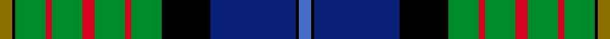

This page is one **sett** — a single exact thread-count. It belongs to the [tartan](/setts/y4k1g10r2g10r4g10r2g10k16db28k1b4/)
(the same proportion at any scale), whose colour order is pattern [BKBKGRGRGRGKG](/stripes/bkbkgrgrgrgkg/).

Sourced from weddslist.  It is a [13 stripe tartan](/stripes/stripes13/).

Original link http://www.weddslist.com/cgi-bin/tartans/pg.pl?source=sts

## Thread count
Y/8 K2 G20 R4 G20 R8 G20 R4 G20 K32 DB56 K2 B/8

One full sett is **392 threads**.

## Palette
<table><thead><tr><th>Colour</th><th>Shade</th><th>OKLCh</th></tr></thead><tbody><tr><td>B</td><td><code style="background-color:#466CC8;">#466CC8</code> <small style="color:#888">#466CC8</small></td><td><small style="color:#888">oklch(55.1% 0.149 265.0)</small></td></tr><tr><td>DB</td><td><code style="background-color:#082077;">#082077</code> <small style="color:#888">#082077</small></td><td><small style="color:#888">oklch(30.0% 0.149 265.1)</small></td></tr><tr><td>G</td><td><code style="background-color:#008B2A;">#008B2A</code> <small style="color:#888">#008B2A</small></td><td><small style="color:#888">oklch(55.4% 0.170 145.9)</small></td></tr><tr><td>K</td><td><code style="background-color:#000000;">#000000</code> <small style="color:#888">#000000</small></td><td><small style="color:#888">oklch(0.0% 0.000 0.0)</small></td></tr><tr><td>R</td><td><code style="background-color:#D60020;">#D60020</code> <small style="color:#888">#D60020</small></td><td><small style="color:#888">oklch(55.2% 0.224 25.5)</small></td></tr><tr><td>Y</td><td><code style="background-color:#8B6E00;">#8B6E00</code> <small style="color:#888">#8B6E00</small></td><td><small style="color:#888">oklch(55.1% 0.113 90.4)</small></td></tr></tbody></table>

# Sample pattern

## Nearest tartan variants

The nearest existing variants by ΔTartan distance, with this cloth at the top so the swatches line up against it.

ΔTartan

Threads

Variant

Sett

—

392

<a href="/variants/s13/y4k1g10r2g10r4g10r2g10k16db28k1b4~x2/">California</a>

<a href="/ttd/edit/#slug=y4k1g10r2g10r4g10r2g10k16t28k1lb4~x2~t2503227-lb3103284&amp;base=y4k1g10r2g10r4g10r2g10k16db28k1b4~x2" title="compare in the TTD">0.16</a>

392

<a href="/variants/s13/y4k1g10r2g10r4g10r2g10k16t28k1lb4~x2~t2503227-lb3103284/">California State</a>

<a href="/ttd/edit/#slug=lo4k1g10r2g10r4g10r2g10k16t28k1lb4~x2~t2503227-lb3103284&amp;base=y4k1g10r2g10r4g10r2g10k16db28k1b4~x2" title="compare in the TTD">0.41</a>

392

<a href="/variants/s13/lo4k1g10r2g10r4g10r2g10k16t28k1lb4~x2~t2503227-lb3103284/">California State American District Tartan</a>

<a href="/ttd/edit/#slug=k24g12k1y3k1g12k1r3k1g12k12dbi12db3dbi12~x4~dbi1605267-db0804274&amp;base=y4k1g10r2g10r4g10r2g10k16db28k1b4~x2" title="compare in the TTD">1.76</a>

728

<a href="/variants/s14/k24g12k1y3k1g12k1r3k1g12k12dbi12db3dbi12~x4~dbi1605267-db0804274/">Gow Hunting #2</a>

<a href="/ttd/edit/#slug=k24g12k1y3k1g12k1r3k1g12k12n12db3n12~x4~n1604274-db0805267&amp;base=y4k1g10r2g10r4g10r2g10k16db28k1b4~x2" title="compare in the TTD">1.77</a>

728

<a href="/variants/s14/k24g12k1y3k1g12k1r3k1g12k12dbi12db3dbi12~x4~dbi1604274-db0805267/">Gow, hunting</a>

<a href="/ttd/edit/#slug=r7g20y2g4k5db4k2db20k3w1~x2&amp;base=y4k1g10r2g10r4g10r2g10k16db28k1b4~x2" title="compare in the TTD">1.86</a>

256

<a href="/variants/s10/r7g20y2g4k5db4k2db20k3w1~x2/">McMeeken</a>

<a href="/ttd/edit/#slug=r7g20ly2g4k5db4k2db20k3w1~x2&amp;base=y4k1g10r2g10r4g10r2g10k16db28k1b4~x2" title="compare in the TTD">1.88</a>

256

<a href="/variants/s10/r7g20ly2g4k5db4k2db20k3w1~x2/">McMeeken (Name)</a>

<a href="/ttd/edit/#slug=g4y2g24dr2k12db3k2db2k2db12w1db1w3~x2&amp;base=y4k1g10r2g10r4g10r2g10k16db28k1b4~x2" title="compare in the TTD">1.94</a>

266

<a href="/variants/s13/g4y2g24dr2k12db3k2db2k2db12w1db1w3~x2/">Baron of Greencastle (Personal)</a>

<a href="/ttd/edit/#slug=g22y2g4dp3g4k20db20k1w3~x2&amp;base=y4k1g10r2g10r4g10r2g10k16db28k1b4~x2" title="compare in the TTD">2.07</a>

266

<a href="/variants/s9/g22y2g4dp3g4k20db20k1w3~x2/">National Wedding</a>

<a href="/ttd/edit/#slug=t6k1r4k1t38k17n12dy5n5dy25k1ly4~x2&amp;base=y4k1g10r2g10r4g10r2g10k16db28k1b4~x2" title="compare in the TTD">2.11</a>

456

<a href="/variants/s12/t6k1r4k1t38k17n12dy5n5dy25k1ly4~x2/">State Seal of New Jersey (Fashion)</a>

<a href="/ttd/edit/#slug=g18dr1g2dr2g16dr1k16n1k2dr2b20dr1w2~x4&amp;base=y4k1g10r2g10r4g10r2g10k16db28k1b4~x2" title="compare in the TTD">2.13</a>

592

<a href="/variants/s13/g18dr1g2dr2g16dr1k16n1k2dr2b20dr1w2~x4/">Canadian Estate</a>

## Neighbour map

Every grey dot is one of 13620 variants placed by the first two principal components of the ΔTartan feature space (42% of its variance). Red is this tartan; blue dots are its nearest — click one to open its page.

<svg viewBox="0 0 640 380" role="img" style="max-width:100%;height:auto;border:1px solid #e0e0e0;border-radius:4px;display:block" xmlns="http://www.w3.org/2000/svg"><image href="/nn/cloud.v1.png" width="640" height="380"/><a href="/variants/s13/y4k1g10r2g10r4g10r2g10k16t28k1lb4~x2~t2503227-lb3103284/"><circle cx="149.6" cy="99.2" r="4" fill="#3465a4"><title>California State</title></circle></a><a href="/variants/s13/lo4k1g10r2g10r4g10r2g10k16t28k1lb4~x2~t2503227-lb3103284/"><circle cx="145.9" cy="97.6" r="4" fill="#3465a4"><title>California State American District Tartan</title></circle></a><a href="/variants/s14/k24g12k1y3k1g12k1r3k1g12k12dbi12db3dbi12~x4~dbi1605267-db0804274/"><circle cx="128.1" cy="100.8" r="4" fill="#3465a4"><title>Gow Hunting #2</title></circle></a><a href="/variants/s14/k24g12k1y3k1g12k1r3k1g12k12dbi12db3dbi12~x4~dbi1604274-db0805267/"><circle cx="128.3" cy="100.8" r="4" fill="#3465a4"><title>Gow, hunting</title></circle></a><a href="/variants/s10/r7g20y2g4k5db4k2db20k3w1~x2/"><circle cx="141.7" cy="114.6" r="4" fill="#3465a4"><title>McMeeken</title></circle></a><a href="/variants/s10/r7g20ly2g4k5db4k2db20k3w1~x2/"><circle cx="139.1" cy="114.2" r="4" fill="#3465a4"><title>McMeeken (Name)</title></circle></a><a href="/variants/s13/g4y2g24dr2k12db3k2db2k2db12w1db1w3~x2/"><circle cx="154.5" cy="83.2" r="4" fill="#3465a4"><title>Baron of Greencastle (Personal)</title></circle></a><a href="/variants/s9/g22y2g4dp3g4k20db20k1w3~x2/"><circle cx="142.3" cy="115.6" r="4" fill="#3465a4"><title>National Wedding</title></circle></a><a href="/variants/s12/t6k1r4k1t38k17n12dy5n5dy25k1ly4~x2/"><circle cx="168.5" cy="77.9" r="4" fill="#3465a4"><title>State Seal of New Jersey (Fashion)</title></circle></a><a href="/variants/s13/g18dr1g2dr2g16dr1k16n1k2dr2b20dr1w2~x4/"><circle cx="164.1" cy="94.4" r="4" fill="#3465a4"><title>Canadian Estate</title></circle></a><circle cx="148.7" cy="96.9" r="5" fill="#c00000"/><text x="320" y="376" text-anchor="middle" font-size="11" fill="#999">ground</text><text x="11" y="190" text-anchor="middle" font-size="11" fill="#999" transform="rotate(-90 11 190)">complexity</text></svg>

ID: /variants/s13/y4k1g10r2g10r4g10r2g10k16db28k1b4~x2/
