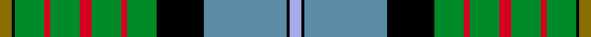

This page is one **sett** — a single exact thread-count. It belongs to the [tartan](/setts/y4k1g10r2g10r4g10r2g10k16t28k1lb4/)
(the same proportion at any scale), whose colour order is pattern [GKGRGRGRGKBKW](/stripes/gkgrgrgrgkbkw/).

Part of the [California State](/tartans/california-state/) tartan — the named design grouping this sett with its other cloths.

Sourced from register-of-tartans.  It is a [13 stripe tartan](/stripes/stripes13/).

Original link https://www.tartanregister.gov.uk/tartanDetails.aspx?ref=482

2 attestations — the source records this cloth was collapsed from (oldest owns this page)

<ul>
<li>01/09/1997 — California State (register-of-tartans, <a href="https://www.tartanregister.gov.uk/tartanDetails.aspx?ref=482">record</a>)  <em>Designed by J Howard Standing, Tarzana, California, and Thomas Ferguson, Sydney, British Columbia. Adopted as the official California State tartan by the State Legislature on July 23rd 2001 by California Governor Gray Davis. For general use by all those living in the State. Closely based on the Muir tartan (STR ref #3039) after the famous botanist and environmentalist, John Muir, who lived in California.</em></li>
<li>1998 — California State (District) (tartans-authority, <a href="http://www.tartansauthority.com/tartan-ferret/display/2454/">record</a>)  <em>Designed by J.Howard Standing of Tarzana, California and Thomas Ferguson of Sydney, British Columbia. Adopted as the 'official' California State tartan by the State Legislature. For general use by all those living in the State. Closely based on the Muir tartan (#345) after the famous botanist/environmentalist John Muir who lived in California. Assembly Bill 2362, February 20th 1998. The legislation approving this as the State tartan was passed on July 23rd 2001 by California Governor Gray Davis.</em></li>
</ul>

## Register references

External register numbers recorded for this tartan.

- Scottish Register of Tartans: [482](https://www.tartanregister.gov.uk/tartanDetails.aspx?ref=482)
- Scottish Tartans Authority (ITI): 2454
- Scottish Tartans World Register: 2454

## Thread count
Y/8 K2 G20 R4 G20 R8 G20 R4 G20 K32 T56 K2 LB/8

One full sett is **392 threads**.

## Palette
<table><thead><tr><th>Colour</th><th>Shade</th><th>OKLCh</th></tr></thead><tbody><tr><td>T</td><td><code style="background-color:#5C8CA8;">#5C8CA8</code> <small style="color:#888">#5C8CA8</small></td><td><small style="color:#888">oklch(61.7% 0.067 235.0)</small></td></tr><tr><td>G</td><td><code style="background-color:#008B2A;">#008B2A</code> <small style="color:#888">#008B2A</small></td><td><small style="color:#888">oklch(55.4% 0.170 145.9)</small></td></tr><tr><td>K</td><td><code style="background-color:#000000;">#000000</code> <small style="color:#888">#000000</small></td><td><small style="color:#888">oklch(0.0% 0.000 0.0)</small></td></tr><tr><td>LB</td><td><code style="background-color:#A8ACE8;">#A8ACE8</code> <small style="color:#888">#A8ACE8</small></td><td><small style="color:#888">oklch(76.3% 0.086 281.2)</small></td></tr><tr><td>R</td><td><code style="background-color:#D60020;">#D60020</code> <small style="color:#888">#D60020</small></td><td><small style="color:#888">oklch(55.2% 0.224 25.5)</small></td></tr><tr><td>Y</td><td><code style="background-color:#8B6E00;">#8B6E00</code> <small style="color:#888">#8B6E00</small></td><td><small style="color:#888">oklch(55.1% 0.113 90.4)</small></td></tr></tbody></table>

# Sample pattern

## Nearest tartan variants

The nearest existing variants by ΔTartan distance, with this cloth at the top so the swatches line up against it.

ΔTartan

Threads

Variant

Sett

—

392

<a href="/variants/s13/y4k1g10r2g10r4g10r2g10k16t28k1lb4~x2~t2503227-lb3103284/">California State</a>

<a href="/ttd/edit/#slug=y4k1g10r2g10r4g10r2g10k16db28k1b4~x2&amp;base=y4k1g10r2g10r4g10r2g10k16t28k1lb4~x2~t2503227-lb3103284" title="compare in the TTD">0.16</a>

392

<a href="/variants/s13/y4k1g10r2g10r4g10r2g10k16db28k1b4~x2/">California</a>

<a href="/ttd/edit/#slug=lo4k1g10r2g10r4g10r2g10k16t28k1lb4~x2~t2503227-lb3103284&amp;base=y4k1g10r2g10r4g10r2g10k16t28k1lb4~x2~t2503227-lb3103284" title="compare in the TTD">0.30</a>

392

<a href="/variants/s13/lo4k1g10r2g10r4g10r2g10k16t28k1lb4~x2~t2503227-lb3103284/">California State American District Tartan</a>

<a href="/ttd/edit/#slug=w4k1r2k1g9k2t24k2r6k2g12y2~x2&amp;base=y4k1g10r2g10r4g10r2g10k16t28k1lb4~x2~t2503227-lb3103284" title="compare in the TTD">1.78</a>

256

<a href="/variants/s12/w4k1r2k1g9k2t24k2r6k2g12y2~x2/">Tait #2</a>

<a href="/ttd/edit/#slug=dr4w6k10db5k3y16k3g33k1w4~x2&amp;base=y4k1g10r2g10r4g10r2g10k16t28k1lb4~x2~t2503227-lb3103284" title="compare in the TTD">2.13</a>

324

<a href="/variants/s10/dr4w6k10db5k3y16k3g33k1w4~x2/">Fermanagh County, Crest Range</a>

<a href="/ttd/edit/#slug=g30dp4r6w6db6dp3k14w14db50g50w2&amp;base=y4k1g10r2g10r4g10r2g10k16t28k1lb4~x2~t2503227-lb3103284" title="compare in the TTD">2.28</a>

338

<a href="/variants/s11/g30dp4r6w6db6dp3k14w14db50g50w2/">Brehat (Personal)</a>

<a href="/ttd/edit/#slug=y9k1o31g30db36g3db3g3db36g30o31k1w9~x2&amp;base=y4k1g10r2g10r4g10r2g10k16t28k1lb4~x2~t2503227-lb3103284" title="compare in the TTD">2.34</a>

856

<a href="/variants/s13/y9k1o31g30db36g3db3g3db36g30o31k1w9~x2/">Campbell, Brown (Personal)</a>

<a href="/ttd/edit/#slug=w4k1db16k1g32dr6k6lo6g4lo2g1~x2&amp;base=y4k1g10r2g10r4g10r2g10k16t28k1lb4~x2~t2503227-lb3103284" title="compare in the TTD">2.40</a>

306

<a href="/variants/s11/w4k1db16k1g32dr6k6lo6g4lo2g1~x2/">Zambia</a>

<a href="/ttd/edit/#slug=g18dr1g2dr2g16dr1k16n1k2dr2b20dr1w2~x4&amp;base=y4k1g10r2g10r4g10r2g10k16t28k1lb4~x2~t2503227-lb3103284" title="compare in the TTD">2.41</a>

592

<a href="/variants/s13/g18dr1g2dr2g16dr1k16n1k2dr2b20dr1w2~x4/">Canadian Estate</a>

<a href="/ttd/edit/#slug=k14r2k2r2k2g18r2g18w1db12lb1r8~x2&amp;base=y4k1g10r2g10r4g10r2g10k16t28k1lb4~x2~t2503227-lb3103284" title="compare in the TTD">2.51</a>

284

<a href="/variants/s12/k14r2k2r2k2g18r2g18w1db12lb1r8~x2/">Princess Diana</a>

<a href="/ttd/edit/#slug=db4k1g18dy2g11dy11lb18k1r4~x2&amp;base=y4k1g10r2g10r4g10r2g10k16t28k1lb4~x2~t2503227-lb3103284" title="compare in the TTD">2.54</a>

264

<a href="/variants/s9/db4k1g18dy2g11dy11lb18k1r4~x2/">Morgan in Maryland (USA) (Name)</a>

## Neighbour map

Every grey dot is one of 13620 variants placed by the first two principal components of the ΔTartan feature space (42% of its variance). Red is this tartan; blue dots are its nearest — click one to open its page.

<svg viewBox="0 0 640 380" role="img" style="max-width:100%;height:auto;border:1px solid #e0e0e0;border-radius:4px;display:block" xmlns="http://www.w3.org/2000/svg"><image href="/nn/cloud.v1.png" width="640" height="380"/><a href="/variants/s13/y4k1g10r2g10r4g10r2g10k16db28k1b4~x2/"><circle cx="148.7" cy="96.9" r="4" fill="#3465a4"><title>California</title></circle></a><a href="/variants/s13/lo4k1g10r2g10r4g10r2g10k16t28k1lb4~x2~t2503227-lb3103284/"><circle cx="145.9" cy="97.6" r="4" fill="#3465a4"><title>California State American District Tartan</title></circle></a><a href="/variants/s12/w4k1r2k1g9k2t24k2r6k2g12y2~x2/"><circle cx="145.1" cy="92.3" r="4" fill="#3465a4"><title>Tait #2</title></circle></a><a href="/variants/s10/dr4w6k10db5k3y16k3g33k1w4~x2/"><circle cx="141.1" cy="86.7" r="4" fill="#3465a4"><title>Fermanagh County, Crest Range</title></circle></a><a href="/variants/s11/g30dp4r6w6db6dp3k14w14db50g50w2/"><circle cx="170.6" cy="100.8" r="4" fill="#3465a4"><title>Brehat (Personal)</title></circle></a><a href="/variants/s13/y9k1o31g30db36g3db3g3db36g30o31k1w9~x2/"><circle cx="160.5" cy="103.2" r="4" fill="#3465a4"><title>Campbell, Brown (Personal)</title></circle></a><a href="/variants/s11/w4k1db16k1g32dr6k6lo6g4lo2g1~x2/"><circle cx="194.0" cy="76.4" r="4" fill="#3465a4"><title>Zambia</title></circle></a><a href="/variants/s13/g18dr1g2dr2g16dr1k16n1k2dr2b20dr1w2~x4/"><circle cx="164.1" cy="94.4" r="4" fill="#3465a4"><title>Canadian Estate</title></circle></a><a href="/variants/s12/k14r2k2r2k2g18r2g18w1db12lb1r8~x2/"><circle cx="145.5" cy="105.3" r="4" fill="#3465a4"><title>Princess Diana</title></circle></a><a href="/variants/s9/db4k1g18dy2g11dy11lb18k1r4~x2/"><circle cx="155.9" cy="138.0" r="4" fill="#3465a4"><title>Morgan in Maryland (USA) (Name)</title></circle></a><circle cx="149.6" cy="99.2" r="5" fill="#c00000"/><text x="320" y="376" text-anchor="middle" font-size="11" fill="#999">ground</text><text x="11" y="190" text-anchor="middle" font-size="11" fill="#999" transform="rotate(-90 11 190)">complexity</text></svg>

ID: /variants/s13/y4k1g10r2g10r4g10r2g10k16t28k1lb4~x2~t2503227-lb3103284/
