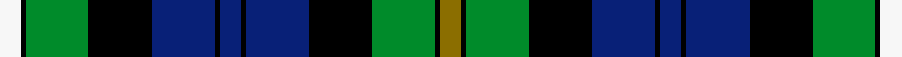

This is one **variant** — a specific cloth: this exact thread count and colourway, with its own
provenance below. It is one weaving of the [sett](/setts/y4k1g12k12db12k1db4k1db12k12g12k1w4/) (the scale-free proportion — the
same cloth at any scale or shade), whose colour order is pattern [GKGKBKBKBKGKW](/stripes/gkgkbkbkbkgkw/).

Part of the [Campbell of Loudon](/tartans/c/ca/campbell-of-loudon/) tartan — the named design grouping this sett with its other cloths.

Sourced from weddslist.  It is a [13 stripe tartan](/stripes/stripes13/).

Original link [http://www.weddslist.com/cgi-bin/tartans/pg.pl?source=x](http://www.weddslist.com/cgi-bin/tartans/pg.pl?source=x)

Dataset <small>— provenance for this record, inherited from the source manifest</small>

<dl class="dataset-prov">
<dt>source</dt><dd><a href="/sources/weddslist/">Weddslist</a></dd>
<dt>data captured from</dt><dd><a href="https://github.com/thetartan/tartan-database/blob/master/data/weddslist/data.csv">https://github.com/thetartan/tartan-database/blob/master/data/weddslist/data.csv</a></dd>
<dt>data date</dt><dd>2016-11-17 <small>(dataset default)</small></dd>
<dt>licence</dt><dd><a href="https://creativecommons.org/licenses/by-nc-nd/4.0/">CC BY-NC-ND 4.0</a></dd>
</dl>

Capture chain <small>— the hands this data passed through, oldest first; each capture carries its own licence</small>

<ol class="capture-chain">
<li><a href="https://www.weddslist.com/tartans/">Weddslist</a> <small>the living privately compiled reference</small></li>
<li><a href="https://github.com/thetartan/tartan-database">thetartan/tartan-database</a> <small>2016-2017</small> · <a href="https://creativecommons.org/licenses/by-nc-nd/4.0/">CC BY-NC-ND 4.0</a> <small>Levko Kravets's frozen compilation — the capture we vendored, and where its CC licence text came from</small></li>
<li>this dictionary <small>captured 2026-06-10 · commit 5bf86c7566</small> <small>each re-capture is a git commit to data/sources</small></li>
</ol>

## Thread count
W/8 K2 G24 K24 DB24 K2 DB8 K2 DB24 K24 G24 K2 Y/8

One full sett is **336 threads**.

## Palette
<table><thead><tr><th>Colour</th><th>Shade</th><th>OKLCh</th></tr></thead><tbody><tr><td>DB</td><td><code style="background-color:#082077;">#082077</code> <small style="color:#888">#082077</small></td><td><small style="color:#888">oklch(30.0% 0.149 265.1)</small></td></tr><tr><td>G</td><td><code style="background-color:#008B2A;">#008B2A</code> <small style="color:#888">#008B2A</small></td><td><small style="color:#888">oklch(55.4% 0.170 145.9)</small></td></tr><tr><td>K</td><td><code style="background-color:#000000;">#000000</code> <small style="color:#888">#000000</small></td><td><small style="color:#888">oklch(0.0% 0.000 0.0)</small></td></tr><tr><td>Y</td><td><code style="background-color:#8B6E00;">#8B6E00</code> <small style="color:#888">#8B6E00</small></td><td><small style="color:#888">oklch(55.1% 0.113 90.4)</small></td></tr><tr><td>W</td><td><code style="background-color:#F7F7F7;">#F7F7F7</code> <small style="color:#888">#F7F7F7</small></td><td><small style="color:#888">oklch(97.6% 0.000 89.9)</small></td></tr></tbody></table>

# Sample pattern

## Nearest tartan variants

The nearest existing variants by ΔTartan distance, with this cloth at the top so the swatches line up against it.

ΔTartan

Threads

Variant

Sett

—

336

<a href="/variants/s13/y4k1g12k12db12k1db4k1db12k12g12k1w4~x2/">Campbell of Loudon</a>

<a href="/ttd/edit/#slug=y2k1g12k12db12k1db2k1db12k12g12k1w2~x2&amp;base=y4k1g12k12db12k1db4k1db12k12g12k1w4~x2" title="compare in the TTD">0.14</a>

320

<a href="/variants/s13/y2k1g12k12db12k1db2k1db12k12g12k1w2~x2/">Campbell of Loudoun Clan Tartan</a>

<a href="/ttd/edit/#slug=y2k1g12k12db12k1db1k1db12k12g12k1w2~x2&amp;base=y4k1g12k12db12k1db4k1db12k12g12k1w4~x2" title="compare in the TTD">0.17</a>

316

<a href="/variants/s13/y2k1g12k12db12k1db1k1db12k12g12k1w2~x2/">Campbell of Loudoun</a>

<a href="/ttd/edit/#slug=r4k1g12k12db12k1db4k1db12k12g12k1y4~x2&amp;base=y4k1g12k12db12k1db4k1db12k12g12k1w4~x2" title="compare in the TTD">0.30</a>

336

<a href="/variants/s13/r4k1g12k12db12k1db4k1db12k12g12k1y4~x2/">MacEwan</a>

<a href="/ttd/edit/#slug=r2k1g12k12db12k1db2k1db12k12g12k1y2~x2&amp;base=y4k1g12k12db12k1db4k1db12k12g12k1w4~x2" title="compare in the TTD">0.41</a>

320

<a href="/variants/s13/r2k1g12k12db12k1db2k1db12k12g12k1y2~x2/">MacEwen Clan Tartan</a>

<a href="/ttd/edit/#slug=y1k1g7k8db7k1db2k1db7k8g7k1w1~x4&amp;base=y4k1g12k12db12k1db4k1db12k12g12k1w4~x2" title="compare in the TTD">0.55</a>

408

<a href="/variants/s13/y1k1g7k8db7k1db2k1db7k8g7k1w1~x4/">Campbell of Loudoun (Clan)</a>

<a href="/ttd/edit/#slug=r3k1g21k19db19k3db3k3db19k19g21k1w3~x2&amp;base=y4k1g12k12db12k1db4k1db12k12g12k1w4~x2" title="compare in the TTD">0.77</a>

528

<a href="/variants/s13/r3k1g21k19db19k3db3k3db19k19g21k1w3~x2/">Campbell Red</a>

<a href="/ttd/edit/#slug=r5db30k19g23k2w2k5w2k2g23k19db25g5~x2&amp;base=y4k1g12k12db12k1db4k1db12k12g12k1w4~x2" title="compare in the TTD">1.16</a>

628

<a href="/variants/s13/r5db30k19g23k2w2k5w2k2g23k19db25g5~x2/">Loch Carron</a>

<a href="/ttd/edit/#slug=r2db10k10g10w1k4w1g10k10db10r1~x4&amp;base=y4k1g12k12db12k1db4k1db12k12g12k1w4~x2" title="compare in the TTD">1.34</a>

540

<a href="/variants/s11/r2db10k10g10w1k4w1g10k10db10r1~x4/">Rose</a>

<a href="/ttd/edit/#slug=db6lb2db20k15g20y2g6lb2g20k15db20y4~x2&amp;base=y4k1g12k12db12k1db4k1db12k12g12k1w4~x2" title="compare in the TTD">1.35</a>

508

<a href="/variants/s12/db6lb2db20k15g20y2g6lb2g20k15db20y4~x2/">Scottish Women's Rural Institutes</a>

<a href="/ttd/edit/#slug=db9k1db1k1db1k7g8y2g8k7db8k1r2~x2&amp;base=y4k1g12k12db12k1db4k1db12k12g12k1w4~x2" title="compare in the TTD">1.35</a>

202

<a href="/variants/s13/db9k1db1k1db1k7g8y2g8k7db8k1r2~x2/">MacLeod of Gesto</a>

## Neighbour map

Every grey dot is one of 13621 variants placed by the first two principal components of the ΔTartan feature space (42% of its variance). Red is this tartan; blue dots are its nearest — click one to open its page.

<svg viewBox="0 0 640 380" role="img" style="max-width:100%;height:auto;border:1px solid #e0e0e0;border-radius:4px;display:block" xmlns="http://www.w3.org/2000/svg"><image href="/nn/cloud.v1.png" width="640" height="380"/><a href="/variants/s13/y2k1g12k12db12k1db2k1db12k12g12k1w2~x2/"><circle cx="120.8" cy="146.9" r="4" fill="#3465a4"><title>Campbell of Loudoun Clan Tartan</title></circle></a><a href="/variants/s13/y2k1g12k12db12k1db1k1db12k12g12k1w2~x2/"><circle cx="122.9" cy="144.9" r="4" fill="#3465a4"><title>Campbell of Loudoun</title></circle></a><a href="/variants/s13/r4k1g12k12db12k1db4k1db12k12g12k1y4~x2/"><circle cx="102.2" cy="155.9" r="4" fill="#3465a4"><title>MacEwan</title></circle></a><a href="/variants/s13/r2k1g12k12db12k1db2k1db12k12g12k1y2~x2/"><circle cx="124.2" cy="146.4" r="4" fill="#3465a4"><title>MacEwen Clan Tartan</title></circle></a><a href="/variants/s13/y1k1g7k8db7k1db2k1db7k8g7k1w1~x4/"><circle cx="122.4" cy="165.8" r="4" fill="#3465a4"><title>Campbell of Loudoun (Clan)</title></circle></a><a href="/variants/s13/r3k1g21k19db19k3db3k3db19k19g21k1w3~x2/"><circle cx="136.5" cy="125.8" r="4" fill="#3465a4"><title>Campbell Red</title></circle></a><a href="/variants/s13/r5db30k19g23k2w2k5w2k2g23k19db25g5~x2/"><circle cx="125.3" cy="139.8" r="4" fill="#3465a4"><title>Loch Carron</title></circle></a><a href="/variants/s11/r2db10k10g10w1k4w1g10k10db10r1~x4/"><circle cx="103.7" cy="176.3" r="4" fill="#3465a4"><title>Rose</title></circle></a><a href="/variants/s12/db6lb2db20k15g20y2g6lb2g20k15db20y4~x2/"><circle cx="113.3" cy="174.2" r="4" fill="#3465a4"><title>Scottish Women's Rural Institutes</title></circle></a><a href="/variants/s13/db9k1db1k1db1k7g8y2g8k7db8k1r2~x2/"><circle cx="107.5" cy="163.8" r="4" fill="#3465a4"><title>MacLeod of Gesto</title></circle></a><circle cx="94.9" cy="155.8" r="5" fill="#c00000"/><text x="320" y="376" text-anchor="middle" font-size="11" fill="#999">ground</text><text x="11" y="190" text-anchor="middle" font-size="11" fill="#999" transform="rotate(-90 11 190)">complexity</text></svg>

ID: /variants/s13/y4k1g12k12db12k1db4k1db12k12g12k1w4~x2/
