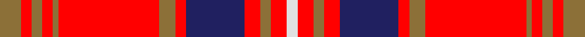

This page is one **sett** — a single exact thread-count. It belongs to the [tartan](/setts/y4r2y2r2y1r19y3r2db11r3y2r3w2/)
(the same proportion at any scale), whose colour order is pattern [GRGRGRGRBRGRW](/stripes/grgrgrgrbrgrw/).

Sourced from register-of-tartans.  It is a [13 stripe tartan](/stripes/stripes13/).

Original link https://www.tartanregister.gov.uk/tartanDetails.aspx?ref=11532

## Register references

External register numbers recorded for this tartan.

- Scottish Register of Tartans: [11532](https://www.tartanregister.gov.uk/tartanDetails.aspx?ref=11532)

## Thread count
LT/8 R4 LT4 R4 LT2 R38 LT6 R4 DB22 R6 LT4 R6 LN/4

One full sett is **212 threads**.

## Palette

Palette: <strong>Tartan Register</strong>
<table><thead><tr><th>Colour</th><th>Threads</th><th>Shade</th><th>Base</th><th>OKLCh</th></tr></thead><tbody><tr><td>LT/</td><td style="text-align:right;font-variant-numeric:tabular-nums">8</td><td><code style="background-color:#8C7038;">#8C7038</code> <small style="color:#888">#8C7038</small></td><td>G <code style="background-color:#006100;">#006100</code></td><td><small style="color:#888">oklch(56.0% 0.082 83.0)</small></td></tr><tr><td>R</td><td style="text-align:right;font-variant-numeric:tabular-nums">4</td><td><code style="background-color:#FF0000;">#FF0000</code> <small style="color:#888">#FF0000</small></td><td>R <code style="background-color:#CC0000;">#CC0000</code></td><td><small style="color:#888">oklch(62.8% 0.258 29.2)</small></td></tr><tr><td>LT</td><td style="text-align:right;font-variant-numeric:tabular-nums">4</td><td><code style="background-color:#8C7038;">#8C7038</code> <small style="color:#888">#8C7038</small></td><td>G <code style="background-color:#006100;">#006100</code></td><td><small style="color:#888">oklch(56.0% 0.082 83.0)</small></td></tr><tr><td>R</td><td style="text-align:right;font-variant-numeric:tabular-nums">4</td><td><code style="background-color:#FF0000;">#FF0000</code> <small style="color:#888">#FF0000</small></td><td>R <code style="background-color:#CC0000;">#CC0000</code></td><td><small style="color:#888">oklch(62.8% 0.258 29.2)</small></td></tr><tr><td>LT</td><td style="text-align:right;font-variant-numeric:tabular-nums">2</td><td><code style="background-color:#8C7038;">#8C7038</code> <small style="color:#888">#8C7038</small></td><td>G <code style="background-color:#006100;">#006100</code></td><td><small style="color:#888">oklch(56.0% 0.082 83.0)</small></td></tr><tr><td>R</td><td style="text-align:right;font-variant-numeric:tabular-nums">38</td><td><code style="background-color:#FF0000;">#FF0000</code> <small style="color:#888">#FF0000</small></td><td>R <code style="background-color:#CC0000;">#CC0000</code></td><td><small style="color:#888">oklch(62.8% 0.258 29.2)</small></td></tr><tr><td>LT</td><td style="text-align:right;font-variant-numeric:tabular-nums">6</td><td><code style="background-color:#8C7038;">#8C7038</code> <small style="color:#888">#8C7038</small></td><td>G <code style="background-color:#006100;">#006100</code></td><td><small style="color:#888">oklch(56.0% 0.082 83.0)</small></td></tr><tr><td>R</td><td style="text-align:right;font-variant-numeric:tabular-nums">4</td><td><code style="background-color:#FF0000;">#FF0000</code> <small style="color:#888">#FF0000</small></td><td>R <code style="background-color:#CC0000;">#CC0000</code></td><td><small style="color:#888">oklch(62.8% 0.258 29.2)</small></td></tr><tr><td>DB</td><td style="text-align:right;font-variant-numeric:tabular-nums">22</td><td><code style="background-color:#202060;">#202060</code> <small style="color:#888">#202060</small></td><td>B <code style="background-color:#2A418A;">#2A418A</code></td><td><small style="color:#888">oklch(28.9% 0.111 276.9)</small></td></tr><tr><td>R</td><td style="text-align:right;font-variant-numeric:tabular-nums">6</td><td><code style="background-color:#FF0000;">#FF0000</code> <small style="color:#888">#FF0000</small></td><td>R <code style="background-color:#CC0000;">#CC0000</code></td><td><small style="color:#888">oklch(62.8% 0.258 29.2)</small></td></tr><tr><td>LT</td><td style="text-align:right;font-variant-numeric:tabular-nums">4</td><td><code style="background-color:#8C7038;">#8C7038</code> <small style="color:#888">#8C7038</small></td><td>G <code style="background-color:#006100;">#006100</code></td><td><small style="color:#888">oklch(56.0% 0.082 83.0)</small></td></tr><tr><td>R</td><td style="text-align:right;font-variant-numeric:tabular-nums">6</td><td><code style="background-color:#FF0000;">#FF0000</code> <small style="color:#888">#FF0000</small></td><td>R <code style="background-color:#CC0000;">#CC0000</code></td><td><small style="color:#888">oklch(62.8% 0.258 29.2)</small></td></tr><tr><td>LN/</td><td style="text-align:right;font-variant-numeric:tabular-nums">4</td><td><code style="background-color:#E0E0E0;">#E0E0E0</code> <small style="color:#888">#E0E0E0</small></td><td>W <code style="background-color:#F7F7F7;">#F7F7F7</code></td><td><small style="color:#888">oklch(90.7% 0.000 89.9)</small></td></tr></tbody></table>

## Nearest tartans

The nearest existing variants by ΔTartan distance, with this tartan at the top so the swatches line up against it.

ΔTartan

Tartan

Sett

—

<a href="/ttd/edit/#slug=y4r2y2r2y1r19y3r2db11r3y2r3w2~x2">Châine des Rôtisseurs, (Grande Bretagne)</a> <a class="nn-out" href="/variants/s13/y4r2y2r2y1r19y3r2db11r3y2r3w2~x2/" title="open its dictionary page">↗</a>

1.06

<a href="/ttd/edit/#slug=w5dr1r20dr4w2dr4w2dr24o2dr1o4dr4~x2&amp;base=y4r2y2r2y1r19y3r2db11r3y2r3w2~x2">Chrysanthemum (Japanese Four Seasons)</a> <a class="nn-out" href="/variants/s12/w5dr1r20dr4w2dr4w2dr24o2dr1o4dr4~x2/" title="open its dictionary page">↗</a>

1.12

<a href="/ttd/edit/#slug=db4r1db1r18db10r1dg1r6dg10r6w1r4db1~x2&amp;base=y4r2y2r2y1r19y3r2db11r3y2r3w2~x2">Cameron of Locheil</a> <a class="nn-out" href="/variants/s13/db4r1db1r18db10r1dg1r6dg10r6w1r4db1~x2/" title="open its dictionary page">↗</a>

1.22

<a href="/ttd/edit/#slug=ly27k4w4r64w4r4k4r4k12~x2&amp;base=y4r2y2r2y1r19y3r2db11r3y2r3w2~x2">O'Meehan (Name)</a> <a class="nn-out" href="/variants/s9/ly27k4w4r64w4r4k4r4k12~x2/" title="open its dictionary page">↗</a>

1.22

<a href="/ttd/edit/#slug=r6lo2r32lo15r2lo3r2lo6w3db4~x2&amp;base=y4r2y2r2y1r19y3r2db11r3y2r3w2~x2">Virginia Tech</a> <a class="nn-out" href="/variants/s10/r6lo2r32lo15r2lo3r2lo6w3db4~x2/" title="open its dictionary page">↗</a>

1.23

<a href="/ttd/edit/#slug=r4dg8k6ri8r6dg2r2dg2r24dg1r3~x2&amp;base=y4r2y2r2y1r19y3r2db11r3y2r3w2~x2">MacDougall #8</a> <a class="nn-out" href="/variants/s11/r4dg8k6ri8r6dg2r2dg2r24dg1r3~x2/" title="open its dictionary page">↗</a>

1.26

<a href="/ttd/edit/#slug=lb6k2r32lo2k6lo2r4k2lb3~x2&amp;base=y4r2y2r2y1r19y3r2db11r3y2r3w2~x2">Lantern, The</a> <a class="nn-out" href="/variants/s9/lb6k2r32lo2k6lo2r4k2lb3~x2/" title="open its dictionary page">↗</a>

1.26

<a href="/ttd/edit/#slug=r6lo2r36lo18r2lo4r2lo6w3db4~x2&amp;base=y4r2y2r2y1r19y3r2db11r3y2r3w2~x2">Virginia Tech (Corporate)</a> <a class="nn-out" href="/variants/s10/r6lo2r36lo18r2lo4r2lo6w3db4~x2/" title="open its dictionary page">↗</a>

1.32

<a href="/ttd/edit/#slug=dp4dg8db6dp8r6dg2r2dg2r24dg1r3~x2&amp;base=y4r2y2r2y1r19y3r2db11r3y2r3w2~x2">MacDougall</a> <a class="nn-out" href="/variants/s11/dp4dg8db6dp8r6dg2r2dg2r24dg1r3~x2/" title="open its dictionary page">↗</a>

1.33

<a href="/ttd/edit/#slug=r2lb2db6r2db2r2db1r20lo1r2lo2r2lo6lb2lo2~x2&amp;base=y4r2y2r2y1r19y3r2db11r3y2r3w2~x2">Winthrop University (Corporate)</a> <a class="nn-out" href="/variants/s15/r2lb2db6r2db2r2db1r20lo1r2lo2r2lo6lb2lo2~x2/" title="open its dictionary page">↗</a>

1.34

<a href="/ttd/edit/#slug=w2r4dg2db2r6dg4r2db5dg2r20dg7w2r4w2~x2&amp;base=y4r2y2r2y1r19y3r2db11r3y2r3w2~x2">MacKinnon #12</a> <a class="nn-out" href="/variants/s14/w2r4dg2db2r6dg4r2db5dg2r20dg7w2r4w2~x2/" title="open its dictionary page">↗</a>

## Neighbour map

Every grey dot is one of 14360 variants placed by the first two principal components of the ΔTartan feature space (44% of its variance). Red is this tartan; blue dots are its nearest — click one to open its page.

<svg viewBox="0 0 640 380" role="img" style="max-width:100%;height:auto;border:1px solid #e0e0e0;border-radius:4px;display:block" xmlns="http://www.w3.org/2000/svg"><image href="/nn/cloud.v1.png" width="640" height="380"/><a href="/variants/s12/w5dr1r20dr4w2dr4w2dr24o2dr1o4dr4~x2/"><circle cx="318.7" cy="105.5" r="4" fill="#3465a4"><title>Chrysanthemum (Japanese Four Seasons)</title></circle></a><a href="/variants/s13/db4r1db1r18db10r1dg1r6dg10r6w1r4db1~x2/"><circle cx="336.4" cy="134.2" r="4" fill="#3465a4"><title>Cameron of Locheil</title></circle></a><a href="/variants/s9/ly27k4w4r64w4r4k4r4k12~x2/"><circle cx="325.6" cy="110.0" r="4" fill="#3465a4"><title>O'Meehan (Name)</title></circle></a><a href="/variants/s10/r6lo2r32lo15r2lo3r2lo6w3db4~x2/"><circle cx="368.5" cy="138.3" r="4" fill="#3465a4"><title>Virginia Tech</title></circle></a><a href="/variants/s11/r4dg8k6ri8r6dg2r2dg2r24dg1r3~x2/"><circle cx="375.5" cy="131.4" r="4" fill="#3465a4"><title>MacDougall #8</title></circle></a><a href="/variants/s9/lb6k2r32lo2k6lo2r4k2lb3~x2/"><circle cx="368.4" cy="117.2" r="4" fill="#3465a4"><title>Lantern, The</title></circle></a><a href="/variants/s10/r6lo2r36lo18r2lo4r2lo6w3db4~x2/"><circle cx="376.1" cy="132.4" r="4" fill="#3465a4"><title>Virginia Tech (Corporate)</title></circle></a><a href="/variants/s11/dp4dg8db6dp8r6dg2r2dg2r24dg1r3~x2/"><circle cx="327.5" cy="129.1" r="4" fill="#3465a4"><title>MacDougall</title></circle></a><a href="/variants/s15/r2lb2db6r2db2r2db1r20lo1r2lo2r2lo6lb2lo2~x2/"><circle cx="336.1" cy="106.4" r="4" fill="#3465a4"><title>Winthrop University (Corporate)</title></circle></a><a href="/variants/s14/w2r4dg2db2r6dg4r2db5dg2r20dg7w2r4w2~x2/"><circle cx="291.1" cy="142.0" r="4" fill="#3465a4"><title>MacKinnon #12</title></circle></a><circle cx="329.3" cy="109.6" r="5" fill="#c00000"/></svg>

ID: /variants/s13/y4r2y2r2y1r19y3r2db11r3y2r3w2~x2/
