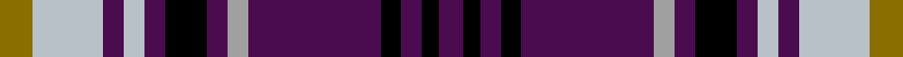

This page is one **sett** — a single exact thread-count. It belongs to the [tartan](/setts/y8lb17dp5lb5dp5k10dp5lr5dp32k5dp5k4dp6/)
(the same proportion at any scale), whose colour order is pattern [BKBKBYBKBWBWG](/stripes/bkbkbybkbwbwg/).

Part of the [Life Goes on Foundation](/tartans/life-goes-on-foundation/) tartan — the named design grouping this sett with its other cloths.

Sourced from tartans-authority.  It is a [13 stripe tartan](/stripes/stripes13/).

Original link http://www.tartansauthority.com/tartan-ferret/display/8033/

## Register references

External register numbers recorded for this tartan.

- Scottish Register of Tartans: [8033](https://www.tartanregister.gov.uk/tartanDetails?ref=8033)
- Scottish Tartans Authority (ITI): 8033

## Thread count
Y/8 LB17 DP5 LB5 DP5 K10 DP5 LR5 DP32 K5 DP5 K4 DP/6

One full sett is **210 threads**.

## Palette
<table><thead><tr><th>Colour</th><th>Shade</th><th>OKLCh</th></tr></thead><tbody><tr><td>K</td><td><code style="background-color:#000000;">#000000</code> <small style="color:#888">#000000</small></td><td><small style="color:#888">oklch(0.0% 0.000 0.0)</small></td></tr><tr><td>N</td><td><code style="background-color:#A0A0A0;">#A0A0A0</code> <small style="color:#888">#A0A0A0</small></td><td><small style="color:#888">oklch(70.6% 0.000 89.9)</small></td></tr><tr><td>Na</td><td><code style="background-color:#B8C0C8;">#B8C0C8</code> <small style="color:#888">#B8C0C8</small></td><td><small style="color:#888">oklch(80.4% 0.014 248.0)</small></td></tr><tr><td>P</td><td><code style="background-color:#4B0B4F;">#4B0B4F</code> <small style="color:#888">#4B0B4F</small></td><td><small style="color:#888">oklch(30.1% 0.125 325.4)</small></td></tr><tr><td>Y</td><td><code style="background-color:#8B6E00;">#8B6E00</code> <small style="color:#888">#8B6E00</small></td><td><small style="color:#888">oklch(55.1% 0.113 90.4)</small></td></tr></tbody></table>

# Sample pattern

## Compared to the master

This cloth is one sett of its design; the master sett (the exemplar the design is anchored on) is below for comparison.

<figure style="margin:0"><figcaption style="color:#888;font-size:smaller">this sett</figcaption></figure>
<figure style="margin:0"><figcaption style="color:#888;font-size:smaller"><a href="/setts/p12k4p5k4p32lb5p5k10p5lbi5p5lbi18w4/">master sett →</a></figcaption></figure>

ID: /variants/s13/y8lb17dp5lb5dp5k10dp5lr5dp32k5dp5k4dp6~lb3201240-lr2800000/
