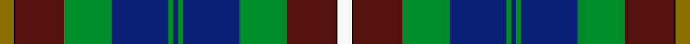

This is one **variant** — a specific cloth: this exact thread count and colourway, with its own
provenance below. It is one weaving of the [sett](/setts/y9k1dr31g30db36g3db3g3db36g30dr31k1w9/) (the scale-free proportion — the
same cloth at any scale or shade), whose colour order is pattern [GKBGBGBGBGBKW](/stripes/gkbgbgbgbgbkw/).

Part of the [Campbell](/tartans/c/ca/campbell-2/) tartan — the named design grouping this sett with its other cloths.

Sourced from house-of-tartan.  It is a [13 stripe tartan](/stripes/stripes13/).

Original link [http://www.house-of-tartan.scotland.net/house/TartanViewjs.asp?colr=Def&tnam=17](http://www.house-of-tartan.scotland.net/house/TartanViewjs.asp?colr=Def&tnam=17)

## Provenance

Earliest known date: pre 1992 Specially made for Captain Campbell of the Blythswood family.

Dataset <small>— provenance for this record, inherited from the source manifest</small>

<dl class="dataset-prov">
<dt>source</dt><dd><a href="/sources/house-of-tartan/">House of Tartan</a></dd>
<dt>data captured from</dt><dd><a href="https://github.com/thetartan/tartan-database/blob/master/data/house-of-tartan/data.csv">https://github.com/thetartan/tartan-database/blob/master/data/house-of-tartan/data.csv</a></dd>
<dt>data date</dt><dd>pre 1992 <small>(this record)</small></dd>
<dt>licence</dt><dd><a href="https://creativecommons.org/licenses/by-nc-nd/4.0/">CC BY-NC-ND 4.0</a></dd>
</dl>

Capture chain <small>— the hands this data passed through, oldest first; each capture carries its own licence</small>

<ol class="capture-chain">
<li><a href="http://www.house-of-tartan.scotland.net/">House of Tartan</a> <small>the weaver/retailer's database — the site is now offline; the URL is kept as the ultimate source's identity</small></li>
<li><a href="https://github.com/thetartan/tartan-database">thetartan/tartan-database</a> <small>2016-2017</small> · <a href="https://creativecommons.org/licenses/by-nc-nd/4.0/">CC BY-NC-ND 4.0</a> <small>Levko Kravets's frozen compilation — the capture we vendored, and where its CC licence text came from</small></li>
<li>this dictionary <small>captured 2026-06-10 · commit 5bf86c7566</small> <small>each re-capture is a git commit to data/sources</small></li>
</ol>

## Thread count
Y/18 K2 DR62 G60 DB72 G6 DB6 G6 DB72 G60 DR62 K2 W/18

One full sett is **856 threads**.

## Palette
<table><thead><tr><th>Colour</th><th>Shade</th><th>OKLCh</th></tr></thead><tbody><tr><td>DB</td><td><code style="background-color:#082077;">#082077</code> <small style="color:#888">#082077</small></td><td><small style="color:#888">oklch(30.0% 0.149 265.1)</small></td></tr><tr><td>DR</td><td><code style="background-color:#55120C;">#55120C</code> <small style="color:#888">#55120C</small></td><td><small style="color:#888">oklch(30.0% 0.099 29.3)</small></td></tr><tr><td>G</td><td><code style="background-color:#008B2A;">#008B2A</code> <small style="color:#888">#008B2A</small></td><td><small style="color:#888">oklch(55.4% 0.170 145.9)</small></td></tr><tr><td>K</td><td><code style="background-color:#000000;">#000000</code> <small style="color:#888">#000000</small></td><td><small style="color:#888">oklch(0.0% 0.000 0.0)</small></td></tr><tr><td>W</td><td><code style="background-color:#F7F7F7;">#F7F7F7</code> <small style="color:#888">#F7F7F7</small></td><td><small style="color:#888">oklch(97.6% 0.000 89.9)</small></td></tr><tr><td>Y</td><td><code style="background-color:#8B6E00;">#8B6E00</code> <small style="color:#888">#8B6E00</small></td><td><small style="color:#888">oklch(55.1% 0.113 90.4)</small></td></tr></tbody></table>

# Sample pattern

## Nearest tartan variants

The nearest existing variants by ΔTartan distance, with this cloth at the top so the swatches line up against it.

ΔTartan

Threads

Variant

Sett

—

856

<a href="/variants/s13/y9k1dr31g30db36g3db3g3db36g30dr31k1w9~x2/">Campbell Brown Personal Tartan</a>

<a href="/ttd/edit/#slug=y9k1o31g30db36g3db3g3db36g30o31k1w9~x2&amp;base=y9k1dr31g30db36g3db3g3db36g30dr31k1w9~x2" title="compare in the TTD">2.00</a>

856

<a href="/variants/s13/y9k1o31g30db36g3db3g3db36g30o31k1w9~x2/">Campbell, Brown (Personal)</a>

<a href="/ttd/edit/#slug=t6k1r4k1t38k17n12dy5n5dy25k1ly4~x2&amp;base=y9k1dr31g30db36g3db3g3db36g30dr31k1w9~x2" title="compare in the TTD">2.11</a>

456

<a href="/variants/s12/t6k1r4k1t38k17n12dy5n5dy25k1ly4~x2/">State Seal of New Jersey (Fashion)</a>

<a href="/ttd/edit/#slug=y4k1g10r2g10r4g10r2g10k16db28k1b4~x2&amp;base=y9k1dr31g30db36g3db3g3db36g30dr31k1w9~x2" title="compare in the TTD">2.21</a>

392

<a href="/variants/s13/y4k1g10r2g10r4g10r2g10k16db28k1b4~x2/">California</a>

<a href="/ttd/edit/#slug=y9k1dy31g30db36g3db3g3db36g30dy31k1w9~x2&amp;base=y9k1dr31g30db36g3db3g3db36g30dr31k1w9~x2" title="compare in the TTD">2.23</a>

856

<a href="/variants/s13/y9k1dy31g30db36g3db3g3db36g30dy31k1w9~x2/">Campbell, Brown (Personal)</a>

<a href="/ttd/edit/#slug=dr4g4k2g17do5g5do17g6lb1db22dr2~x2&amp;base=y9k1dr31g30db36g3db3g3db36g30dr31k1w9~x2" title="compare in the TTD">2.63</a>

328

<a href="/variants/s11/dr4g4k2g17do5g5do17g6lb1db22dr2~x2/">Adams (Name)</a>

<a href="/ttd/edit/#slug=dr4g4k2g15do5g5do15g6w1db19dr2~x2&amp;base=y9k1dr31g30db36g3db3g3db36g30dr31k1w9~x2" title="compare in the TTD">2.84</a>

300

<a href="/variants/s11/dr4g4k2g15do5g5do15g6w1db19dr2~x2/">Adams</a>

<a href="/ttd/edit/#slug=dg19w2dg5k4db21k4w2dg5w1y1w1dr14~x2&amp;base=y9k1dr31g30db36g3db3g3db36g30dr31k1w9~x2" title="compare in the TTD">2.86</a>

250

<a href="/variants/s12/dg19w2dg5k4db21k4w2dg5w1y1w1dr14~x2/">Womack (2014)</a>

<a href="/ttd/edit/#slug=y4k1g10r2g10r4g10r2g10k16t28k1lb4~x2~t2503227-lb3103284&amp;base=y9k1dr31g30db36g3db3g3db36g30dr31k1w9~x2" title="compare in the TTD">2.89</a>

392

<a href="/variants/s13/y4k1g10r2g10r4g10r2g10k16t28k1lb4~x2~t2503227-lb3103284/">California State</a>

<a href="/ttd/edit/#slug=r7g20y2g4k5db4k2db20k3w1~x2&amp;base=y9k1dr31g30db36g3db3g3db36g30dr31k1w9~x2" title="compare in the TTD">2.91</a>

256

<a href="/variants/s10/r7g20y2g4k5db4k2db20k3w1~x2/">McMeeken</a>

<a href="/ttd/edit/#slug=dg19w2dg5k4db21k4w2dg5w1y1w1do14~x2&amp;base=y9k1dr31g30db36g3db3g3db36g30dr31k1w9~x2" title="compare in the TTD">2.92</a>

250

<a href="/variants/s12/dg19w2dg5k4db21k4w2dg5w1y1w1do14~x2/">Womack (2014)</a>

## Neighbour map

Every grey dot is one of 13656 variants placed by the first two principal components of the ΔTartan feature space (42% of its variance). Red is this tartan; blue dots are its nearest — click one to open its page. The map is a flat projection of a many-dimensional space — [how to read it](/posts/neighbourhood-maps/).

<svg viewBox="0 0 640 380" role="img" style="max-width:100%;height:auto;border:1px solid #e0e0e0;border-radius:4px;display:block" xmlns="http://www.w3.org/2000/svg"><image href="/nn/cloud.v1.png" width="640" height="380"/><a href="/variants/s13/y9k1o31g30db36g3db3g3db36g30o31k1w9~x2/"><circle cx="160.4" cy="103.2" r="4" fill="#3465a4"><title>Campbell, Brown (Personal)</title></circle></a><a href="/variants/s12/t6k1r4k1t38k17n12dy5n5dy25k1ly4~x2/"><circle cx="168.3" cy="77.9" r="4" fill="#3465a4"><title>State Seal of New Jersey (Fashion)</title></circle></a><a href="/variants/s13/y4k1g10r2g10r4g10r2g10k16db28k1b4~x2/"><circle cx="148.4" cy="96.9" r="4" fill="#3465a4"><title>California</title></circle></a><a href="/variants/s13/y9k1dy31g30db36g3db3g3db36g30dy31k1w9~x2/"><circle cx="166.7" cy="108.0" r="4" fill="#3465a4"><title>Campbell, Brown (Personal)</title></circle></a><a href="/variants/s11/dr4g4k2g17do5g5do17g6lb1db22dr2~x2/"><circle cx="187.7" cy="131.3" r="4" fill="#3465a4"><title>Adams (Name)</title></circle></a><a href="/variants/s11/dr4g4k2g15do5g5do15g6w1db19dr2~x2/"><circle cx="175.1" cy="140.1" r="4" fill="#3465a4"><title>Adams</title></circle></a><a href="/variants/s12/dg19w2dg5k4db21k4w2dg5w1y1w1dr14~x2/"><circle cx="160.3" cy="108.7" r="4" fill="#3465a4"><title>Womack (2014)</title></circle></a><a href="/variants/s13/y4k1g10r2g10r4g10r2g10k16t28k1lb4~x2~t2503227-lb3103284/"><circle cx="149.5" cy="99.2" r="4" fill="#3465a4"><title>California State</title></circle></a><a href="/variants/s10/r7g20y2g4k5db4k2db20k3w1~x2/"><circle cx="141.4" cy="114.5" r="4" fill="#3465a4"><title>McMeeken</title></circle></a><a href="/variants/s12/dg19w2dg5k4db21k4w2dg5w1y1w1do14~x2/"><circle cx="164.2" cy="111.7" r="4" fill="#3465a4"><title>Womack (2014)</title></circle></a><circle cx="163.2" cy="104.3" r="5" fill="#c00000"/><text x="320" y="376" text-anchor="middle" font-size="11" fill="#999">ground</text><text x="11" y="190" text-anchor="middle" font-size="11" fill="#999" transform="rotate(-90 11 190)">complexity</text></svg>

ID: /variants/s13/y9k1dr31g30db36g3db3g3db36g30dr31k1w9~x2/
