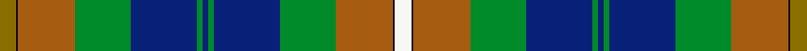

This is one **variant** — a specific cloth: this exact thread count and colourway, with its own
provenance below. It is one weaving of the [sett](/setts/y9k1o31g30db36g3db3g3db36g30o31k1w9/) (the scale-free proportion — the
same cloth at any scale or shade), whose colour order is pattern [GKRGBGBGBGRKW](/stripes/gkrgbgbgbgrkw/).

Sourced from tartans-authority.  It is a [13 stripe tartan](/stripes/stripes13/).

Original link [https://www.tartanregister.gov.uk/tartanDetails.aspx?ref=17](https://www.tartanregister.gov.uk/tartanDetails.aspx?ref=17)

3 attestations — the source records this cloth was collapsed from (oldest owns this page)

<ul>
<li>pre 2002 — Campbell, Brown (Personal) (tartans-authority, <a href="https://www.tartanregister.gov.uk/tartanDetails.aspx?ref=17">record</a>)  <em>Said to have been a personal tartan for a Captain Campbell of the Blythswood family. Sample in the MacGregor-Hastie Collection. Count has been halved to show sett.</em></li>
<li>undated — Campbell, Brown (weddslist, <a href="http://www.weddslist.com/cgi-bin/tartans/pg.pl?source=sts">record</a>) </li>
<li>undated — Campbell, Brown (weddslist, <a href="http://www.weddslist.com/cgi-bin/tartans/pg.pl?source=sts">record</a>) </li>
</ul>

Dataset <small>— provenance for this record, inherited from the source manifest</small>

<dl class="dataset-prov">
<dt>source</dt><dd><a href="/sources/tartans-authority/">Scottish Tartans Authority</a></dd>
<dt>data captured from</dt><dd><a href="https://github.com/thetartan/tartan-database/blob/master/data/tartans-authority/data.csv">https://github.com/thetartan/tartan-database/blob/master/data/tartans-authority/data.csv</a></dd>
<dt>data date</dt><dd>pre 2002 <small>(this record)</small></dd>
<dt>licence</dt><dd><a href="https://creativecommons.org/licenses/by-nc-nd/4.0/">CC BY-NC-ND 4.0</a></dd>
</dl>

Capture chain <small>— the hands this data passed through, oldest first; each capture carries its own licence</small>

<ol class="capture-chain">
<li><a href="https://www.tartansauthority.com/">Scottish Tartans Authority</a> <small>the heritage body's archive — its tartan-ferret record browser is retired (links repaired to the SRT, above)</small></li>
<li><a href="https://github.com/thetartan/tartan-database">thetartan/tartan-database</a> <small>2016-2017</small> · <a href="https://creativecommons.org/licenses/by-nc-nd/4.0/">CC BY-NC-ND 4.0</a> <small>Levko Kravets's frozen compilation — the capture we vendored, and where its CC licence text came from</small></li>
<li>this dictionary <small>captured 2026-06-10 · commit 5bf86c7566</small> <small>each re-capture is a git commit to data/sources</small></li>
</ol>

## Register references

External register numbers recorded for this tartan.

- Scottish Tartans Authority (ITI): 17

## Thread count
Y/18 K2 O62 G60 DB72 G6 DB6 G6 DB72 G60 O62 K2 W/18

One full sett is **856 threads**.

## Palette
<table><thead><tr><th>Colour</th><th>Shade</th><th>OKLCh</th></tr></thead><tbody><tr><td>DB</td><td><code style="background-color:#082077;">#082077</code> <small style="color:#888">#082077</small></td><td><small style="color:#888">oklch(30.0% 0.149 265.1)</small></td></tr><tr><td>O</td><td><code style="background-color:#A65C11;">#A65C11</code> <small style="color:#888">#A65C11</small></td><td><small style="color:#888">oklch(55.0% 0.125 58.3)</small></td></tr><tr><td>G</td><td><code style="background-color:#008B2A;">#008B2A</code> <small style="color:#888">#008B2A</small></td><td><small style="color:#888">oklch(55.4% 0.170 145.9)</small></td></tr><tr><td>K</td><td><code style="background-color:#000000;">#000000</code> <small style="color:#888">#000000</small></td><td><small style="color:#888">oklch(0.0% 0.000 0.0)</small></td></tr><tr><td>W</td><td><code style="background-color:#F7F7F7;">#F7F7F7</code> <small style="color:#888">#F7F7F7</small></td><td><small style="color:#888">oklch(97.6% 0.000 89.9)</small></td></tr><tr><td>Y</td><td><code style="background-color:#8B6E00;">#8B6E00</code> <small style="color:#888">#8B6E00</small></td><td><small style="color:#888">oklch(55.1% 0.113 90.4)</small></td></tr></tbody></table>

# Sample pattern

## Nearest tartan variants

The nearest existing variants by ΔTartan distance, with this cloth at the top so the swatches line up against it.

ΔTartan

Threads

Variant

Sett

—

856

<a href="/variants/s13/y9k1o31g30db36g3db3g3db36g30o31k1w9~x2/">Campbell, Brown (Personal)</a>

<a href="/ttd/edit/#slug=y9k1dr31g30db36g3db3g3db36g30dr31k1w9~x2&amp;base=y9k1o31g30db36g3db3g3db36g30o31k1w9~x2" title="compare in the TTD">2.00</a>

856

<a href="/variants/s13/y9k1dr31g30db36g3db3g3db36g30dr31k1w9~x2/">Campbell Brown Personal Tartan</a>

<a href="/ttd/edit/#slug=y9k1dy31g30db36g3db3g3db36g30dy31k1w9~x2&amp;base=y9k1o31g30db36g3db3g3db36g30o31k1w9~x2" title="compare in the TTD">2.25</a>

856

<a href="/variants/s13/y9k1dy31g30db36g3db3g3db36g30dy31k1w9~x2/">Campbell, Brown (Personal)</a>

<a href="/ttd/edit/#slug=y4k1g10r2g10r4g10r2g10k16t28k1lb4~x2~t2503227-lb3103284&amp;base=y9k1o31g30db36g3db3g3db36g30o31k1w9~x2" title="compare in the TTD">2.34</a>

392

<a href="/variants/s13/y4k1g10r2g10r4g10r2g10k16t28k1lb4~x2~t2503227-lb3103284/">California State</a>

<a href="/ttd/edit/#slug=t6k1r4k1t38k17n12dy5n5dy25k1ly4~x2&amp;base=y9k1o31g30db36g3db3g3db36g30o31k1w9~x2" title="compare in the TTD">2.42</a>

456

<a href="/variants/s12/t6k1r4k1t38k17n12dy5n5dy25k1ly4~x2/">State Seal of New Jersey (Fashion)</a>

<a href="/ttd/edit/#slug=lo4k1g10r2g10r4g10r2g10k16t28k1lb4~x2~t2503227-lb3103284&amp;base=y9k1o31g30db36g3db3g3db36g30o31k1w9~x2" title="compare in the TTD">2.46</a>

392

<a href="/variants/s13/lo4k1g10r2g10r4g10r2g10k16t28k1lb4~x2~t2503227-lb3103284/">California State American District Tartan</a>

<a href="/ttd/edit/#slug=y4k1g10r2g10r4g10r2g10k16db28k1b4~x2&amp;base=y9k1o31g30db36g3db3g3db36g30o31k1w9~x2" title="compare in the TTD">2.66</a>

392

<a href="/variants/s13/y4k1g10r2g10r4g10r2g10k16db28k1b4~x2/">California</a>

<a href="/ttd/edit/#slug=dr4g4k2g17do5g5do17g6lb1db22dr2~x2&amp;base=y9k1o31g30db36g3db3g3db36g30o31k1w9~x2" title="compare in the TTD">2.75</a>

328

<a href="/variants/s11/dr4g4k2g17do5g5do17g6lb1db22dr2~x2/">Adams (Name)</a>

<a href="/ttd/edit/#slug=dr4g4k2g15do5g5do15g6w1db19dr2~x2&amp;base=y9k1o31g30db36g3db3g3db36g30o31k1w9~x2" title="compare in the TTD">2.90</a>

300

<a href="/variants/s11/dr4g4k2g15do5g5do15g6w1db19dr2~x2/">Adams</a>

<a href="/ttd/edit/#slug=w4k1r2k1g9k2t24k2r6k2g12y2~x2&amp;base=y9k1o31g30db36g3db3g3db36g30o31k1w9~x2" title="compare in the TTD">2.97</a>

256

<a href="/variants/s12/w4k1r2k1g9k2t24k2r6k2g12y2~x2/">Tait #2</a>

<a href="/ttd/edit/#slug=g15db3g3db3g3db16o16k5y2k5o16db16g15r1k4~x2&amp;base=y9k1o31g30db36g3db3g3db36g30o31k1w9~x2" title="compare in the TTD">3.08</a>

454

<a href="/variants/s15/g15db3g3db3g3db16o16k5y2k5o16db16g15r1k4~x2/">Loseby, Luke (Personal)</a>

## Neighbour map

Every grey dot is one of 13621 variants placed by the first two principal components of the ΔTartan feature space (42% of its variance). Red is this tartan; blue dots are its nearest — click one to open its page.

<svg viewBox="0 0 640 380" role="img" style="max-width:100%;height:auto;border:1px solid #e0e0e0;border-radius:4px;display:block" xmlns="http://www.w3.org/2000/svg"><image href="/nn/cloud.v1.png" width="640" height="380"/><a href="/variants/s13/y9k1dr31g30db36g3db3g3db36g30dr31k1w9~x2/"><circle cx="163.3" cy="104.2" r="4" fill="#3465a4"><title>Campbell Brown Personal Tartan</title></circle></a><a href="/variants/s13/y9k1dy31g30db36g3db3g3db36g30dy31k1w9~x2/"><circle cx="166.9" cy="107.8" r="4" fill="#3465a4"><title>Campbell, Brown (Personal)</title></circle></a><a href="/variants/s13/y4k1g10r2g10r4g10r2g10k16t28k1lb4~x2~t2503227-lb3103284/"><circle cx="149.5" cy="99.2" r="4" fill="#3465a4"><title>California State</title></circle></a><a href="/variants/s12/t6k1r4k1t38k17n12dy5n5dy25k1ly4~x2/"><circle cx="168.3" cy="77.8" r="4" fill="#3465a4"><title>State Seal of New Jersey (Fashion)</title></circle></a><a href="/variants/s13/lo4k1g10r2g10r4g10r2g10k16t28k1lb4~x2~t2503227-lb3103284/"><circle cx="145.8" cy="97.6" r="4" fill="#3465a4"><title>California State American District Tartan</title></circle></a><a href="/variants/s13/y4k1g10r2g10r4g10r2g10k16db28k1b4~x2/"><circle cx="148.6" cy="96.9" r="4" fill="#3465a4"><title>California</title></circle></a><a href="/variants/s11/dr4g4k2g17do5g5do17g6lb1db22dr2~x2/"><circle cx="187.9" cy="131.2" r="4" fill="#3465a4"><title>Adams (Name)</title></circle></a><a href="/variants/s11/dr4g4k2g15do5g5do15g6w1db19dr2~x2/"><circle cx="175.3" cy="140.1" r="4" fill="#3465a4"><title>Adams</title></circle></a><a href="/variants/s12/w4k1r2k1g9k2t24k2r6k2g12y2~x2/"><circle cx="145.0" cy="92.3" r="4" fill="#3465a4"><title>Tait #2</title></circle></a><a href="/variants/s15/g15db3g3db3g3db16o16k5y2k5o16db16g15r1k4~x2/"><circle cx="100.3" cy="130.8" r="4" fill="#3465a4"><title>Loseby, Luke (Personal)</title></circle></a><circle cx="160.4" cy="103.1" r="5" fill="#c00000"/><text x="320" y="376" text-anchor="middle" font-size="11" fill="#999">ground</text><text x="11" y="190" text-anchor="middle" font-size="11" fill="#999" transform="rotate(-90 11 190)">complexity</text></svg>

ID: /variants/s13/y9k1o31g30db36g3db3g3db36g30o31k1w9~x2/
