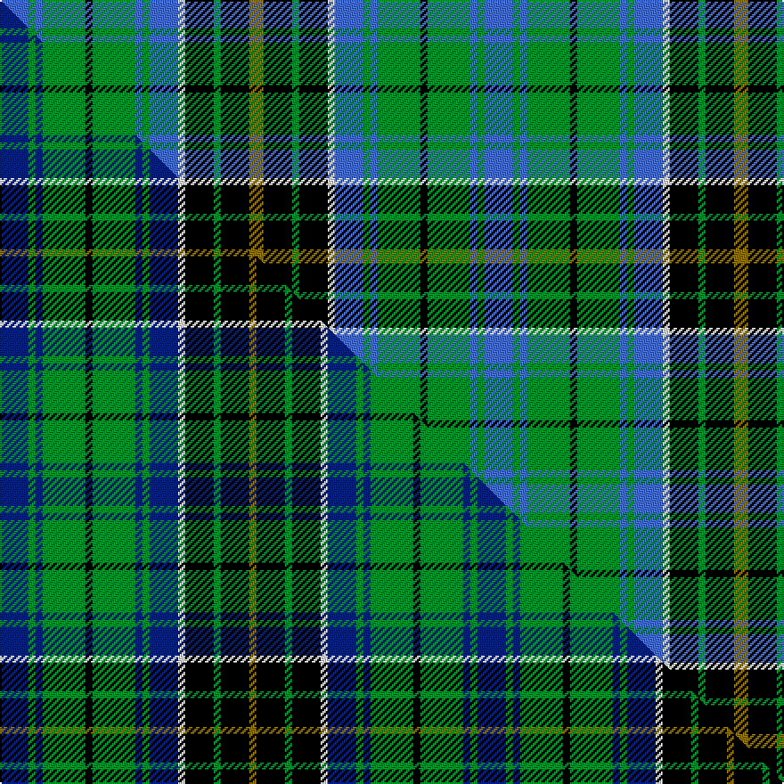

This is one **variant** — a specific cloth: this exact thread count and colourway, with its own
provenance below. It is one weaving of the [sett](/tartans/m/ma/macalpine/) (the scale-free proportion — the
same cloth at any scale or shade), whose colour order is pattern [BGBGKGBGBWKGKG](/stripes/bgbgkgbgbwkgkg/).

Part of the [MacAlpine](/tartans/m/ma/macalpine/) tartan — the named design grouping this sett with its other cloths.

Sourced from weddslist.  It is a [14 stripe tartan](/stripes/stripes14/).

Original link [http://www.weddslist.com/cgi-bin/tartans/pg.pl?source=sts](http://www.weddslist.com/cgi-bin/tartans/pg.pl?source=sts)

Dataset <small>— provenance for this record, inherited from the source manifest</small>

<dl class="dataset-prov">
<dt>source</dt><dd><a href="/sources/weddslist/">Weddslist</a></dd>
<dt>data captured from</dt><dd><a href="https://github.com/thetartan/tartan-database/blob/master/data/weddslist/data.csv">https://github.com/thetartan/tartan-database/blob/master/data/weddslist/data.csv</a></dd>
<dt>data date</dt><dd>2016-11-17 <small>(dataset default)</small></dd>
<dt>licence</dt><dd><a href="https://creativecommons.org/licenses/by-nc-nd/4.0/">CC BY-NC-ND 4.0</a></dd>
</dl>

Capture chain <small>— the hands this data passed through, oldest first; each capture carries its own licence</small>

<ol class="capture-chain">
<li><a href="https://www.weddslist.com/tartans/">Weddslist</a> <small>the living privately compiled reference</small></li>
<li><a href="https://github.com/thetartan/tartan-database">thetartan/tartan-database</a> <small>2016-2017</small> · <a href="https://creativecommons.org/licenses/by-nc-nd/4.0/">CC BY-NC-ND 4.0</a> <small>Levko Kravets's frozen compilation — the capture we vendored, and where its CC licence text came from</small></li>
<li>this dictionary <small>captured 2026-06-10 · commit 5bf86c7566</small> <small>each re-capture is a git commit to data/sources</small></li>
</ol>

## Thread count
B/16 G4 B4 G24 K4 G24 B4 G4 B16 W4 K16 G4 K16 Y/8

One full sett is **272 threads**.

## Palette
<table><thead><tr><th>Colour</th><th>Shade</th><th>OKLCh</th></tr></thead><tbody><tr><td>B</td><td><code style="background-color:#466CC8;">#466CC8</code> <small style="color:#888">#466CC8</small></td><td><small style="color:#888">oklch(55.1% 0.149 265.0)</small></td></tr><tr><td>G</td><td><code style="background-color:#008B2A;">#008B2A</code> <small style="color:#888">#008B2A</small></td><td><small style="color:#888">oklch(55.4% 0.170 145.9)</small></td></tr><tr><td>K</td><td><code style="background-color:#000000;">#000000</code> <small style="color:#888">#000000</small></td><td><small style="color:#888">oklch(0.0% 0.000 0.0)</small></td></tr><tr><td>W</td><td><code style="background-color:#F7F7F7;">#F7F7F7</code> <small style="color:#888">#F7F7F7</small></td><td><small style="color:#888">oklch(97.6% 0.000 89.9)</small></td></tr><tr><td>Y</td><td><code style="background-color:#8B6E00;">#8B6E00</code> <small style="color:#888">#8B6E00</small></td><td><small style="color:#888">oklch(55.1% 0.113 90.4)</small></td></tr></tbody></table>

# Sample pattern

## Compared to the master

This cloth is one sett of its design; the master sett (the exemplar the design is anchored on) is below for comparison.

Its **ΔTartan distance** from the master is **0.16** — the same measure the nearest-tartans table ranks by (0 is identical; a re-scale of the same cloth is near 0, a recolour or a different proportion further).

<figure class="master-compare" style="margin:0">

this sett
master sett ★

<figcaption style="color:#888;font-size:smaller">One weave of this sett against the <a href="/setts/db4g1db1g6k1g6db1g1db4w1k4g1k4y1/">master sett ★</a>, split on the diagonal: a shared proportion runs seamlessly across it with only the shades shifting; a different proportion breaks on it.</figcaption>
</figure>

## Nearest tartan variants

The nearest existing variants by ΔTartan distance, with this cloth at the top so the swatches line up against it.

ΔTartan

Threads

Variant

Sett

—

272

<a href="/variants/s14/b4g1b1g6k1g6b1g1b4w1k4g1k4y2~x4/">MacAlpine</a>

<a href="/ttd/edit/#slug=db4g1db1g6k1g6db1g1db4w1k4g1k4y1~x4&amp;base=b4g1b1g6k1g6b1g1b4w1k4g1k4y2~x4" title="compare in the TTD">0.16</a>

268

<a href="/variants/s14/db4g1db1g6k1g6db1g1db4w1k4g1k4y1~x4/">MacAlpine (1906)</a>

<a href="/ttd/edit/#slug=g5r4g19k10g8w4db18r4~x2&amp;base=b4g1b1g6k1g6b1g1b4w1k4g1k4y2~x4" title="compare in the TTD">1.37</a>

270

<a href="/variants/s8/g5r4g19k10g8w4db18r4~x2/">CSCA</a>

<a href="/ttd/edit/#slug=t12k2t2k2t2k10g5r3w2r3g5k10t11k2t2~x2&amp;base=b4g1b1g6k1g6b1g1b4w1k4g1k4y2~x4" title="compare in the TTD">1.60</a>

264

<a href="/variants/s15/t12k2t2k2t2k10g5r3w2r3g5k10t11k2t2~x2/">Blanton (Dress)</a>

<a href="/ttd/edit/#slug=db18g4k4w4g16db4g16w4k4r5g4w4g4r5k4~x2&amp;base=b4g1b1g6k1g6b1g1b4w1k4g1k4y2~x4" title="compare in the TTD">1.80</a>

356

<a href="/variants/s15/db18g4k4w4g16db4g16w4k4r5g4w4g4r5k4~x2/">Gayre</a>

<a href="/ttd/edit/#slug=g12r2g2r2k12db12y2db12k2g11r2g2~x2&amp;base=b4g1b1g6k1g6b1g1b4w1k4g1k4y2~x4" title="compare in the TTD">1.92</a>

264

<a href="/variants/s12/g12r2g2r2k12db12y2db12k2g11r2g2~x2/">Akins of Candler (Personal)</a>

<a href="/ttd/edit/#slug=t9k1t1k1t1k7g8k1y2k1g8k7t8r2~x4&amp;base=b4g1b1g6k1g6b1g1b4w1k4g1k4y2~x4" title="compare in the TTD">2.10</a>

412

<a href="/variants/s14/t9k1t1k1t1k7g8k1y2k1g8k7t8r2~x4/">MacLeod of Skye (Johnston)</a>

<a href="/ttd/edit/#slug=k8w2g11lb2k2lb2g11db6k7db6g8~x2&amp;base=b4g1b1g6k1g6b1g1b4w1k4g1k4y2~x4" title="compare in the TTD">2.17</a>

228

<a href="/variants/s11/k8w2g11lb2k2lb2g11db6k7db6g8~x2/">Wilson's No.149</a>

<a href="/ttd/edit/#slug=ly3k1g10k7db10g2db2g2db10k7g10k1lg3~x2&amp;base=b4g1b1g6k1g6b1g1b4w1k4g1k4y2~x4" title="compare in the TTD">2.19</a>

260

<a href="/variants/s13/ly3k1g10k7db10g2db2g2db10k7g10k1lg3~x2/">Doon Valley Crafters (Corporate)</a>

<a href="/ttd/edit/#slug=k8w2g11lb2k2lb2g11db6k2db6g8~x2&amp;base=b4g1b1g6k1g6b1g1b4w1k4g1k4y2~x4" title="compare in the TTD">2.23</a>

208

<a href="/variants/s11/k8w2g11lb2k2lb2g11db6k2db6g8~x2/">Wilson's, No 149</a>

<a href="/ttd/edit/#slug=db4k1db1k1db1k5g6k1g6k6db3w1r1w1~x4&amp;base=b4g1b1g6k1g6b1g1b4w1k4g1k4y2~x4" title="compare in the TTD">2.24</a>

284

<a href="/variants/s14/db4k1db1k1db1k5g6k1g6k6db3w1r1w1~x4/">Gemmell Clan Tartan</a>

## Neighbour map

Every grey dot is one of 13662 variants placed by the first two principal components of the ΔTartan feature space (42% of its variance). Red is this tartan; blue dots are its nearest — click one to open its page. The map is a flat projection of a many-dimensional space — [how to read it](/posts/neighbourhood-maps/).

<svg viewBox="0 0 640 380" role="img" style="max-width:100%;height:auto;border:1px solid #e0e0e0;border-radius:4px;display:block" xmlns="http://www.w3.org/2000/svg"><image href="/nn/cloud.v1.png" width="640" height="380"/><a href="/variants/s14/db4g1db1g6k1g6db1g1db4w1k4g1k4y1~x4/"><circle cx="114.9" cy="177.5" r="4" fill="#3465a4"><title>MacAlpine (1906)</title></circle></a><a href="/variants/s8/g5r4g19k10g8w4db18r4~x2/"><circle cx="96.8" cy="197.2" r="4" fill="#3465a4"><title>CSCA</title></circle></a><a href="/variants/s15/t12k2t2k2t2k10g5r3w2r3g5k10t11k2t2~x2/"><circle cx="101.6" cy="169.2" r="4" fill="#3465a4"><title>Blanton (Dress)</title></circle></a><a href="/variants/s15/db18g4k4w4g16db4g16w4k4r5g4w4g4r5k4~x2/"><circle cx="92.8" cy="179.7" r="4" fill="#3465a4"><title>Gayre</title></circle></a><a href="/variants/s12/g12r2g2r2k12db12y2db12k2g11r2g2~x2/"><circle cx="107.2" cy="179.0" r="4" fill="#3465a4"><title>Akins of Candler (Personal)</title></circle></a><a href="/variants/s14/t9k1t1k1t1k7g8k1y2k1g8k7t8r2~x4/"><circle cx="99.3" cy="158.7" r="4" fill="#3465a4"><title>MacLeod of Skye (Johnston)</title></circle></a><a href="/variants/s11/k8w2g11lb2k2lb2g11db6k7db6g8~x2/"><circle cx="100.4" cy="182.6" r="4" fill="#3465a4"><title>Wilson's No.149</title></circle></a><a href="/variants/s13/ly3k1g10k7db10g2db2g2db10k7g10k1lg3~x2/"><circle cx="100.1" cy="167.3" r="4" fill="#3465a4"><title>Doon Valley Crafters (Corporate)</title></circle></a><a href="/variants/s11/k8w2g11lb2k2lb2g11db6k2db6g8~x2/"><circle cx="138.2" cy="199.6" r="4" fill="#3465a4"><title>Wilson's, No 149</title></circle></a><a href="/variants/s14/db4k1db1k1db1k5g6k1g6k6db3w1r1w1~x4/"><circle cx="89.5" cy="170.2" r="4" fill="#3465a4"><title>Gemmell Clan Tartan</title></circle></a><circle cx="102.4" cy="181.4" r="5" fill="#c00000"/><text x="320" y="376" text-anchor="middle" font-size="11" fill="#999">ground</text><text x="11" y="190" text-anchor="middle" font-size="11" fill="#999" transform="rotate(-90 11 190)">complexity</text></svg>

ID: /variants/s14/b4g1b1g6k1g6b1g1b4w1k4g1k4y2~x4/
