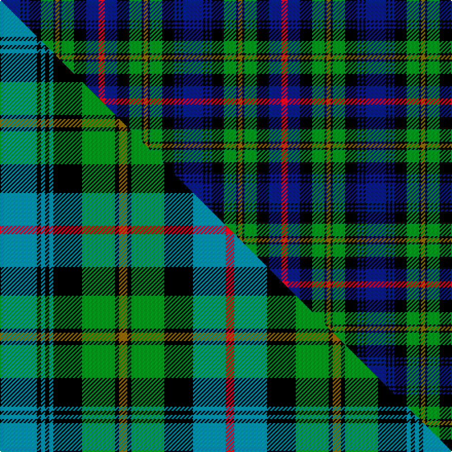

This page is one **sett** — a single exact thread-count. It belongs to the [tartan](/setts/db10k1db1k1db1k6g6k1y2k1g6k6db6r3/)
(the same proportion at any scale), whose colour order is pattern [BKBKBKGKGKGKBR](/stripes/bkbkbkgkgkgkbr/).

Part of the [MacLeod of Skye](/tartans/macleod-of-skye/) tartan — the named design grouping this sett with its other cloths.

Sourced from weddslist.  It is a [14 stripe tartan](/stripes/stripes14/).

Original link http://www.weddslist.com/cgi-bin/tartans/pg.pl?source=sts

## Thread count
DB/20 K2 DB2 K2 DB2 K12 G12 K2 Y4 K2 G12 K12 DB12 R/6

One full sett is **178 threads**.

## Palette
<table><thead><tr><th>Colour</th><th>Shade</th><th>OKLCh</th></tr></thead><tbody><tr><td>DB</td><td><code style="background-color:#082077;">#082077</code> <small style="color:#888">#082077</small></td><td><small style="color:#888">oklch(30.0% 0.149 265.1)</small></td></tr><tr><td>G</td><td><code style="background-color:#008B2A;">#008B2A</code> <small style="color:#888">#008B2A</small></td><td><small style="color:#888">oklch(55.4% 0.170 145.9)</small></td></tr><tr><td>K</td><td><code style="background-color:#000000;">#000000</code> <small style="color:#888">#000000</small></td><td><small style="color:#888">oklch(0.0% 0.000 0.0)</small></td></tr><tr><td>R</td><td><code style="background-color:#D60020;">#D60020</code> <small style="color:#888">#D60020</small></td><td><small style="color:#888">oklch(55.2% 0.224 25.5)</small></td></tr><tr><td>Y</td><td><code style="background-color:#8B6E00;">#8B6E00</code> <small style="color:#888">#8B6E00</small></td><td><small style="color:#888">oklch(55.1% 0.113 90.4)</small></td></tr></tbody></table>

# Sample pattern

## Compared to the master

This cloth is one sett of its design; the master sett (the exemplar the design is anchored on) is below for comparison.

Its **ΔTartan distance** from the master is **0.37** — the same measure the nearest-tartans table ranks by (0 is identical; a re-scale of the same cloth is near 0, a recolour or a different proportion further).

<figure class="master-compare" style="margin:0">

this sett
master sett ★

<figcaption style="color:#888;font-size:smaller">One weave of this sett against the <a href="/setts/t9k1t1k1t1k7g8k1y2k1g8k7t8r2/">master sett ★</a>, split on the diagonal: a shared proportion runs seamlessly across it with only the shades shifting; a different proportion breaks on it.</figcaption>
</figure>

## Nearest tartan variants

The nearest existing variants by ΔTartan distance, with this cloth at the top so the swatches line up against it.

ΔTartan

Threads

Variant

Sett

—

178

<a href="/variants/s14/db10k1db1k1db1k6g6k1y2k1g6k6db6r3~x2/">MacLeod of Skye</a>

<a href="/ttd/edit/#slug=db10k2db2k2db2k8g8k1w2k1g8k8db9r2~x2&amp;base=db10k1db1k1db1k6g6k1y2k1g6k6db6r3~x2" title="compare in the TTD">0.64</a>

236

<a href="/variants/s14/db10k2db2k2db2k8g8k1w2k1g8k8db9r2~x2/">MacKenzie</a>

<a href="/ttd/edit/#slug=db16k4db4k4db6k14dg17k2r3k2dg17k14db18w4~x2&amp;base=db10k1db1k1db1k6g6k1y2k1g6k6db6r3~x2" title="compare in the TTD">0.95</a>

460

<a href="/variants/s14/db16k4db4k4db6k14dg17k2r3k2dg17k14db18w4~x2/">Humphries (Personal)</a>

<a href="/ttd/edit/#slug=db18k5g3r3g6k2y2k2g6r3g3k10db5k10&amp;base=db10k1db1k1db1k6g6k1y2k1g6k6db6r3~x2" title="compare in the TTD">1.00</a>

128

<a href="/variants/s14/db18k5g3r3g6k2y2k2g6r3g3k10db5k10/">MacClellan</a>

<a href="/ttd/edit/#slug=db23k2dr2k2dr2k16g17k2g17k15db17k2r2~x2&amp;base=db10k1db1k1db1k6g6k1y2k1g6k6db6r3~x2" title="compare in the TTD">1.15</a>

426

<a href="/variants/s13/db23k2dr2k2dr2k16g17k2g17k15db17k2r2~x2/">The Red Hackle</a>

<a href="/ttd/edit/#slug=k2db10k9g9w1g2r1g9k9db10k1db2~x4&amp;base=db10k1db1k1db1k6g6k1y2k1g6k6db6r3~x2" title="compare in the TTD">1.34</a>

504

<a href="/variants/s12/k2db10k9g9w1g2r1g9k9db10k1db2~x4/">Spar (UK) Ltd</a>

<a href="/ttd/edit/#slug=db20k2db4k2db20k17g18dr2g4lb2g18k18~x2&amp;base=db10k1db1k1db1k6g6k1y2k1g6k6db6r3~x2" title="compare in the TTD">1.35</a>

432

<a href="/variants/s12/db20k2db4k2db20k17g18dr2g4lb2g18k18~x2/">Spar (UK) Ltd Corporate Tartan</a>

<a href="/ttd/edit/#slug=r2k1db8k8g8y2g8k8db1k1db1k1db4r1~x4&amp;base=db10k1db1k1db1k6g6k1y2k1g6k6db6r3~x2" title="compare in the TTD">1.36</a>

420

<a href="/variants/s14/r2k1db8k8g8y2g8k8db1k1db1k1db4r1~x4/">Farquharson</a>

<a href="/ttd/edit/#slug=r2db4k1db1k1db1k8g8y2g8k8db8k1r2&amp;base=db10k1db1k1db1k6g6k1y2k1g6k6db6r3~x2" title="compare in the TTD">1.37</a>

106

<a href="/variants/s14/r2db4k1db1k1db1k8g8y2g8k8db8k1r2/">Farquharson</a>

<a href="/ttd/edit/#slug=r2db4k1db1k1db1k8g8y2g8k8db8k1r2~x2&amp;base=db10k1db1k1db1k6g6k1y2k1g6k6db6r3~x2" title="compare in the TTD">1.37</a>

212

<a href="/variants/s14/r2db4k1db1k1db1k8g8y2g8k8db8k1r2~x2/">Farquharson</a>

<a href="/ttd/edit/#slug=db11k1db1w1db1k8g8y1g8k8db8w1db1~x2&amp;base=db10k1db1k1db1k6g6k1y2k1g6k6db6r3~x2" title="compare in the TTD">1.38</a>

208

<a href="/variants/s13/db11k1db1w1db1k8g8y1g8k8db8w1db1~x2/">Logan Rogers Hunting</a>

## Neighbour map

Every grey dot is one of 13620 variants placed by the first two principal components of the ΔTartan feature space (42% of its variance). Red is this tartan; blue dots are its nearest — click one to open its page.

<svg viewBox="0 0 640 380" role="img" style="max-width:100%;height:auto;border:1px solid #e0e0e0;border-radius:4px;display:block" xmlns="http://www.w3.org/2000/svg"><image href="/nn/cloud.v1.png" width="640" height="380"/><a href="/variants/s14/db10k2db2k2db2k8g8k1w2k1g8k8db9r2~x2/"><circle cx="109.3" cy="158.6" r="4" fill="#3465a4"><title>MacKenzie</title></circle></a><a href="/variants/s14/db16k4db4k4db6k14dg17k2r3k2dg17k14db18w4~x2/"><circle cx="132.2" cy="171.9" r="4" fill="#3465a4"><title>Humphries (Personal)</title></circle></a><a href="/variants/s14/db18k5g3r3g6k2y2k2g6r3g3k10db5k10/"><circle cx="113.3" cy="157.8" r="4" fill="#3465a4"><title>MacClellan</title></circle></a><a href="/variants/s13/db23k2dr2k2dr2k16g17k2g17k15db17k2r2~x2/"><circle cx="127.4" cy="146.9" r="4" fill="#3465a4"><title>The Red Hackle</title></circle></a><a href="/variants/s12/k2db10k9g9w1g2r1g9k9db10k1db2~x4/"><circle cx="115.0" cy="167.6" r="4" fill="#3465a4"><title>Spar (UK) Ltd</title></circle></a><a href="/variants/s12/db20k2db4k2db20k17g18dr2g4lb2g18k18~x2/"><circle cx="124.3" cy="167.3" r="4" fill="#3465a4"><title>Spar (UK) Ltd Corporate Tartan</title></circle></a><a href="/variants/s14/r2k1db8k8g8y2g8k8db1k1db1k1db4r1~x4/"><circle cx="101.5" cy="157.0" r="4" fill="#3465a4"><title>Farquharson</title></circle></a><a href="/variants/s14/r2db4k1db1k1db1k8g8y2g8k8db8k1r2/"><circle cx="94.6" cy="159.1" r="4" fill="#3465a4"><title>Farquharson</title></circle></a><a href="/variants/s14/r2db4k1db1k1db1k8g8y2g8k8db8k1r2~x2/"><circle cx="94.6" cy="159.1" r="4" fill="#3465a4"><title>Farquharson</title></circle></a><a href="/variants/s13/db11k1db1w1db1k8g8y1g8k8db8w1db1~x2/"><circle cx="133.5" cy="148.5" r="4" fill="#3465a4"><title>Logan Rogers Hunting</title></circle></a><circle cx="114.1" cy="155.6" r="5" fill="#c00000"/><text x="320" y="376" text-anchor="middle" font-size="11" fill="#999">ground</text><text x="11" y="190" text-anchor="middle" font-size="11" fill="#999" transform="rotate(-90 11 190)">complexity</text></svg>

ID: /variants/s14/db10k1db1k1db1k6g6k1y2k1g6k6db6r3~x2/
