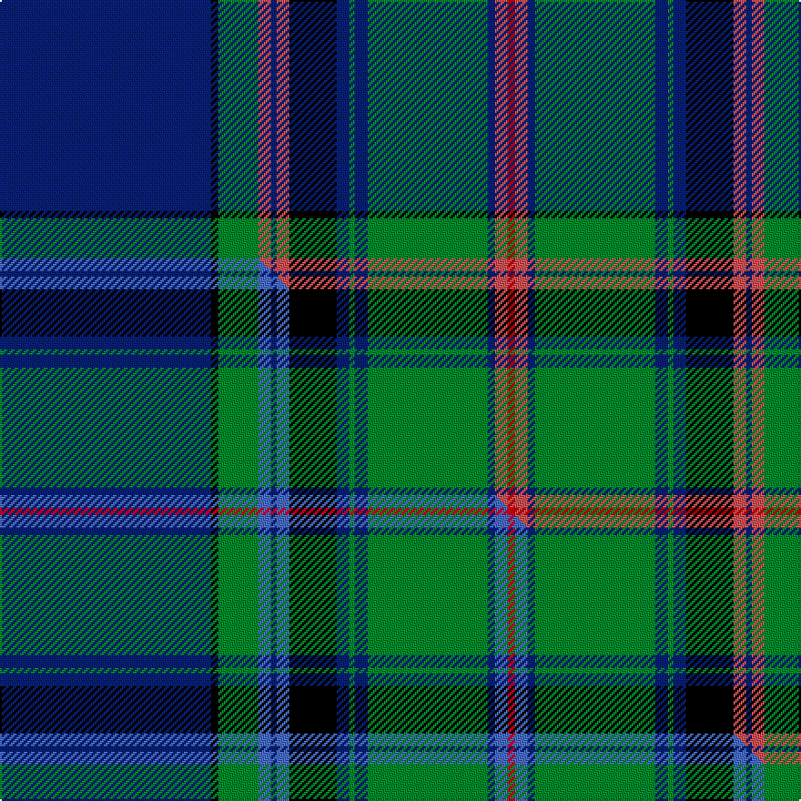

This is one **variant** — a specific cloth: this exact thread count and colourway, with its own
provenance below. It is one weaving of the [sett](/setts/db116k4g22ri7db3ri7k26db7g3db7g66db4ri7r4/) (the scale-free proportion — the
same cloth at any scale or shade), whose colour order is pattern [BKGRBRKBGBGBRR](/stripes/bkgrbrkbgbgbrr/).

Part of the [Cooper](/tartans/c/co/cooper/) tartan — the named design grouping this sett with its other cloths.

Sourced from house-of-tartan.  It is a [14 stripe tartan](/stripes/stripes14/).

Original link [http://www.house-of-tartan.scotland.net/house/TartanViewjs.asp?colr=Def&tnam=332](http://www.house-of-tartan.scotland.net/house/TartanViewjs.asp?colr=Def&tnam=332)

## Provenance

Earliest known date: pre 2003 See Couper. (Couper of Gogar)

Dataset <small>— provenance for this record, inherited from the source manifest</small>

<dl class="dataset-prov">
<dt>source</dt><dd><a href="/sources/house-of-tartan/">House of Tartan</a></dd>
<dt>data captured from</dt><dd><a href="https://github.com/thetartan/tartan-database/blob/master/data/house-of-tartan/data.csv">https://github.com/thetartan/tartan-database/blob/master/data/house-of-tartan/data.csv</a></dd>
<dt>data date</dt><dd>pre 2003 <small>(this record)</small></dd>
<dt>licence</dt><dd><a href="https://creativecommons.org/licenses/by-nc-nd/4.0/">CC BY-NC-ND 4.0</a></dd>
</dl>

Capture chain <small>— the hands this data passed through, oldest first; each capture carries its own licence</small>

<ol class="capture-chain">
<li><a href="http://www.house-of-tartan.scotland.net/">House of Tartan</a> <small>the weaver/retailer's database — the site is now offline; the URL is kept as the ultimate source's identity</small></li>
<li><a href="https://github.com/thetartan/tartan-database">thetartan/tartan-database</a> <small>2016-2017</small> · <a href="https://creativecommons.org/licenses/by-nc-nd/4.0/">CC BY-NC-ND 4.0</a> <small>Levko Kravets's frozen compilation — the capture we vendored, and where its CC licence text came from</small></li>
<li>this dictionary <small>captured 2026-06-10 · commit 5bf86c7566</small> <small>each re-capture is a git commit to data/sources</small></li>
</ol>

## Thread count
DB/116 K4 G22 Ri7 DB3 Ri7 K26 DB7 G3 DB7 G66 DB4 Ri7 R/4

One full sett is **446 threads**.

## Palette
<table><thead><tr><th>Colour</th><th>Shade</th><th>OKLCh</th></tr></thead><tbody><tr><td>DB</td><td><code style="background-color:#082077;">#082077</code> <small style="color:#888">#082077</small></td><td><small style="color:#888">oklch(30.0% 0.149 265.1)</small></td></tr><tr><td>R</td><td><code style="background-color:#D05054;">#D05054</code> <small style="color:#888">#D05054</small></td><td><small style="color:#888">oklch(60.2% 0.162 21.5)</small></td></tr><tr><td>G</td><td><code style="background-color:#008B2A;">#008B2A</code> <small style="color:#888">#008B2A</small></td><td><small style="color:#888">oklch(55.4% 0.170 145.9)</small></td></tr><tr><td>K</td><td><code style="background-color:#000000;">#000000</code> <small style="color:#888">#000000</small></td><td><small style="color:#888">oklch(0.0% 0.000 0.0)</small></td></tr><tr><td>R</td><td><code style="background-color:#C80000;">#C80000</code> <small style="color:#888">#C80000</small></td><td><small style="color:#888">oklch(52.3% 0.215 29.2)</small></td></tr></tbody></table>

# Sample pattern

## Compared to the master

This cloth is one sett of its design; the master sett (the exemplar the design is anchored on) is below for comparison.

Its **ΔTartan distance** from the master is **0.90** — the same measure the nearest-tartans table ranks by (0 is identical; a re-scale of the same cloth is near 0, a recolour or a different proportion further).

<figure class="master-compare" style="margin:0">

this sett
master sett ★

<figcaption style="color:#888;font-size:smaller">One weave of this sett against the <a href="/setts/db116k4g22b7db3b7k26db7g3db7g66db4b7r4/">master sett ★</a>, split on the diagonal: a shared proportion runs seamlessly across it with only the shades shifting; a different proportion breaks on it.</figcaption>
</figure>

## Nearest tartan variants

The nearest existing variants by ΔTartan distance, with this cloth at the top so the swatches line up against it.

ΔTartan

Threads

Variant

Sett

—

446

<a href="/variants/s14/db116k4g22ri7db3ri7k26db7g3db7g66db4ri7r4~ri2406019-r2109032/">Cooper Family Tartan</a>

<a href="/ttd/edit/#slug=db116k4g22b7db3b7k26db7g3db7g66db4b7r4&amp;base=db116k4g22ri7db3ri7k26db7g3db7g66db4ri7r4~ri2406019-r2109032" title="compare in the TTD">0.90</a>

446

<a href="/variants/s14/db116k4g22b7db3b7k26db7g3db7g66db4b7r4/">Cooper</a>

<a href="/ttd/edit/#slug=g3lb2g3r4g15k2g2k2g3db35k2db2k1db2~x2&amp;base=db116k4g22ri7db3ri7k26db7g3db7g66db4ri7r4~ri2406019-r2109032" title="compare in the TTD">1.00</a>

302

<a href="/variants/s14/g3lb2g3r4g15k2g2k2g3db35k2db2k1db2~x2/">Prestoungrange (Personal)</a>

<a href="/ttd/edit/#slug=g3b2g3r4g15k2g2k2g3db35k2db2k1db2~x2&amp;base=db116k4g22ri7db3ri7k26db7g3db7g66db4ri7r4~ri2406019-r2109032" title="compare in the TTD">1.00</a>

302

<a href="/variants/s14/g3b2g3r4g15k2g2k2g3db35k2db2k1db2~x2/">Prestoungrange/Dolphinstoun/Wills</a>

<a href="/ttd/edit/#slug=db60k15g10r2g10r2g10r2g10k1y4~x2&amp;base=db116k4g22ri7db3ri7k26db7g3db7g66db4ri7r4~ri2406019-r2109032" title="compare in the TTD">1.52</a>

376

<a href="/variants/s11/db60k15g10r2g10r2g10r2g10k1y4~x2/">Muir/Moore</a>

<a href="/ttd/edit/#slug=db60k15g10dr2g10dr2g10dr2g10k1lo4~x2&amp;base=db116k4g22ri7db3ri7k26db7g3db7g66db4ri7r4~ri2406019-r2109032" title="compare in the TTD">1.58</a>

376

<a href="/variants/s11/db60k15g10dr2g10dr2g10dr2g10k1lo4~x2/">Muir (Clan)</a>

<a href="/ttd/edit/#slug=db60ly2db2ly2db5k15db5g20r2k3r2g20db5k15g5db20ly2g4~x2&amp;base=db116k4g22ri7db3ri7k26db7g3db7g66db4ri7r4~ri2406019-r2109032" title="compare in the TTD">1.93</a>

628

<a href="/variants/s18/db60ly2db2ly2db5k15db5g20r2k3r2g20db5k15g5db20ly2g4~x2/">Whitworth (Name)</a>

<a href="/ttd/edit/#slug=k3db42k3y2k3g22k3r2k3g22k3y2k3db42k3r2~x2~db1406275&amp;base=db116k4g22ri7db3ri7k26db7g3db7g66db4ri7r4~ri2406019-r2109032" title="compare in the TTD">2.39</a>

630

<a href="/variants/s16/k3db42k3y2k3g22k3r2k3g22k3y2k3db42k3r2~x2~db1406275/">Strachan</a>

<a href="/ttd/edit/#slug=r10db4r3db6w3db4w3db40dg73k4db2ly6&amp;base=db116k4g22ri7db3ri7k26db7g3db7g66db4ri7r4~ri2406019-r2109032" title="compare in the TTD">2.50</a>

300

<a href="/variants/s12/r10db4r3db6w3db4w3db40dg73k4db2ly6/">Johnston, Diana Dress (Personal)</a>

<a href="/ttd/edit/#slug=db80lo1k4lo4k4lo4k22g36db4t6lb2&amp;base=db116k4g22ri7db3ri7k26db7g3db7g66db4ri7r4~ri2406019-r2109032" title="compare in the TTD">2.53</a>

252

<a href="/variants/s11/db80lo1k4lo4k4lo4k22g36db4t6lb2/">Swedish #2</a>

<a href="/ttd/edit/#slug=dp4db5dp3db50k15g3k5g32w2g3&amp;base=db116k4g22ri7db3ri7k26db7g3db7g66db4ri7r4~ri2406019-r2109032" title="compare in the TTD">2.56</a>

237

<a href="/variants/s10/dp4db5dp3db50k15g3k5g32w2g3/">Spirit of Morningside (Fashion)</a>

## Neighbour map

Every grey dot is one of 13621 variants placed by the first two principal components of the ΔTartan feature space (42% of its variance). Red is this tartan; blue dots are its nearest — click one to open its page.

<svg viewBox="0 0 640 380" role="img" style="max-width:100%;height:auto;border:1px solid #e0e0e0;border-radius:4px;display:block" xmlns="http://www.w3.org/2000/svg"><image href="/nn/cloud.v1.png" width="640" height="380"/><a href="/variants/s14/db116k4g22b7db3b7k26db7g3db7g66db4b7r4/"><circle cx="276.1" cy="64.6" r="4" fill="#3465a4"><title>Cooper</title></circle></a><a href="/variants/s14/g3lb2g3r4g15k2g2k2g3db35k2db2k1db2~x2/"><circle cx="277.4" cy="61.9" r="4" fill="#3465a4"><title>Prestoungrange (Personal)</title></circle></a><a href="/variants/s14/g3b2g3r4g15k2g2k2g3db35k2db2k1db2~x2/"><circle cx="282.1" cy="63.4" r="4" fill="#3465a4"><title>Prestoungrange/Dolphinstoun/Wills</title></circle></a><a href="/variants/s11/db60k15g10r2g10r2g10r2g10k1y4~x2/"><circle cx="272.1" cy="67.6" r="4" fill="#3465a4"><title>Muir/Moore</title></circle></a><a href="/variants/s11/db60k15g10dr2g10dr2g10dr2g10k1lo4~x2/"><circle cx="272.1" cy="68.3" r="4" fill="#3465a4"><title>Muir (Clan)</title></circle></a><a href="/variants/s18/db60ly2db2ly2db5k15db5g20r2k3r2g20db5k15g5db20ly2g4~x2/"><circle cx="249.4" cy="66.6" r="4" fill="#3465a4"><title>Whitworth (Name)</title></circle></a><a href="/variants/s16/k3db42k3y2k3g22k3r2k3g22k3y2k3db42k3r2~x2~db1406275/"><circle cx="261.7" cy="82.7" r="4" fill="#3465a4"><title>Strachan</title></circle></a><a href="/variants/s12/r10db4r3db6w3db4w3db40dg73k4db2ly6/"><circle cx="265.8" cy="59.2" r="4" fill="#3465a4"><title>Johnston, Diana Dress (Personal)</title></circle></a><a href="/variants/s11/db80lo1k4lo4k4lo4k22g36db4t6lb2/"><circle cx="257.0" cy="45.3" r="4" fill="#3465a4"><title>Swedish #2</title></circle></a><a href="/variants/s10/dp4db5dp3db50k15g3k5g32w2g3/"><circle cx="230.0" cy="103.4" r="4" fill="#3465a4"><title>Spirit of Morningside (Fashion)</title></circle></a><circle cx="267.5" cy="59.0" r="5" fill="#c00000"/><text x="320" y="376" text-anchor="middle" font-size="11" fill="#999">ground</text><text x="11" y="190" text-anchor="middle" font-size="11" fill="#999" transform="rotate(-90 11 190)">complexity</text></svg>

ID: /variants/s14/db116k4g22ri7db3ri7k26db7g3db7g66db4ri7r4~ri2406019-r2109032/
