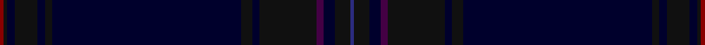

This page is one **sett** — a single exact thread-count. It belongs to the [tartan](/setts/db1ki4k3dp2ki15k2ki3k50ki2k2ki6k2ki1r1/)
(the same proportion at any scale), whose colour order is pattern [BKKBKKKKKKKKKR](/stripes/bkkbkkkkkkkkkr/).

Sourced from tartans-authority.  It is a [14 stripe tartan](/stripes/stripes14/).

Original link http://www.tartansauthority.com/tartan-ferret/display/10495/

## Register references

External register numbers recorded for this tartan.

- Scottish Register of Tartans: [10495](https://www.tartanregister.gov.uk/tartanDetails?ref=10495)
- Scottish Tartans Authority (ITI): 10495

## Thread count
DR/2 K2 DBa4 K12 DBa4 K4 DBa100 K6 DBa4 K30 DP4 DBa6 K8 DB/2

One full sett is **372 threads**.

## Palette

Palette: <strong>Tartan Register</strong> <small style="color:#888">(4 of 5 colours)</small>
<table><thead><tr><th>Colour</th><th>Threads</th><th>Shade</th><th>Base</th><th>OKLCh</th></tr></thead><tbody><tr><td>DR/</td><td style="text-align:right;font-variant-numeric:tabular-nums">2</td><td><code style="background-color:#880000;">#880000</code> <small style="color:#888">#880000</small></td><td>R <code style="background-color:#CC0000;">#CC0000</code></td><td><small style="color:#888">oklch(39.4% 0.162 29.2)</small></td></tr><tr><td>K</td><td style="text-align:right;font-variant-numeric:tabular-nums">2</td><td><code style="background-color:#101010;">#101010</code> <small style="color:#888">#101010</small></td><td>K <code style="background-color:#000000;">#000000</code></td><td><small style="color:#888">oklch(17.3% 0.000 89.9)</small></td></tr><tr><td>DBa</td><td style="text-align:right;font-variant-numeric:tabular-nums">4</td><td><code style="background-color:#00002C;">#00002C</code> <small style="color:#888">#00002C</small></td><td>K <code style="background-color:#000000;">#000000</code></td><td><small style="color:#888">oklch(13.2% 0.092 264.1)</small></td></tr><tr><td>K</td><td style="text-align:right;font-variant-numeric:tabular-nums">12</td><td><code style="background-color:#101010;">#101010</code> <small style="color:#888">#101010</small></td><td>K <code style="background-color:#000000;">#000000</code></td><td><small style="color:#888">oklch(17.3% 0.000 89.9)</small></td></tr><tr><td>DBa</td><td style="text-align:right;font-variant-numeric:tabular-nums">4</td><td><code style="background-color:#00002C;">#00002C</code> <small style="color:#888">#00002C</small></td><td>K <code style="background-color:#000000;">#000000</code></td><td><small style="color:#888">oklch(13.2% 0.092 264.1)</small></td></tr><tr><td>K</td><td style="text-align:right;font-variant-numeric:tabular-nums">4</td><td><code style="background-color:#101010;">#101010</code> <small style="color:#888">#101010</small></td><td>K <code style="background-color:#000000;">#000000</code></td><td><small style="color:#888">oklch(17.3% 0.000 89.9)</small></td></tr><tr><td>DBa</td><td style="text-align:right;font-variant-numeric:tabular-nums">100</td><td><code style="background-color:#00002C;">#00002C</code> <small style="color:#888">#00002C</small></td><td>K <code style="background-color:#000000;">#000000</code></td><td><small style="color:#888">oklch(13.2% 0.092 264.1)</small></td></tr><tr><td>K</td><td style="text-align:right;font-variant-numeric:tabular-nums">6</td><td><code style="background-color:#101010;">#101010</code> <small style="color:#888">#101010</small></td><td>K <code style="background-color:#000000;">#000000</code></td><td><small style="color:#888">oklch(17.3% 0.000 89.9)</small></td></tr><tr><td>DBa</td><td style="text-align:right;font-variant-numeric:tabular-nums">4</td><td><code style="background-color:#00002C;">#00002C</code> <small style="color:#888">#00002C</small></td><td>K <code style="background-color:#000000;">#000000</code></td><td><small style="color:#888">oklch(13.2% 0.092 264.1)</small></td></tr><tr><td>K</td><td style="text-align:right;font-variant-numeric:tabular-nums">30</td><td><code style="background-color:#101010;">#101010</code> <small style="color:#888">#101010</small></td><td>K <code style="background-color:#000000;">#000000</code></td><td><small style="color:#888">oklch(17.3% 0.000 89.9)</small></td></tr><tr><td>DP</td><td style="text-align:right;font-variant-numeric:tabular-nums">4</td><td><code style="background-color:#440044;">#440044</code> <small style="color:#888">#440044</small></td><td>B <code style="background-color:#2A418A;">#2A418A</code></td><td><small style="color:#888">oklch(27.1% 0.125 328.4)</small></td></tr><tr><td>DBa</td><td style="text-align:right;font-variant-numeric:tabular-nums">6</td><td><code style="background-color:#00002C;">#00002C</code> <small style="color:#888">#00002C</small></td><td>K <code style="background-color:#000000;">#000000</code></td><td><small style="color:#888">oklch(13.2% 0.092 264.1)</small></td></tr><tr><td>K</td><td style="text-align:right;font-variant-numeric:tabular-nums">8</td><td><code style="background-color:#101010;">#101010</code> <small style="color:#888">#101010</small></td><td>K <code style="background-color:#000000;">#000000</code></td><td><small style="color:#888">oklch(17.3% 0.000 89.9)</small></td></tr><tr><td>DB/</td><td style="text-align:right;font-variant-numeric:tabular-nums">2</td><td><code style="background-color:#2C2C80;">#2C2C80</code> <small style="color:#888">#2C2C80</small></td><td>B <code style="background-color:#2A418A;">#2A418A</code></td><td><small style="color:#888">oklch(35.0% 0.138 276.6)</small></td></tr></tbody></table>

## Nearest tartans

The nearest existing variants by ΔTartan distance, with this tartan at the top so the swatches line up against it.

ΔTartan

Tartan

Sett

—

<a href="/ttd/edit/#slug=db1ki4k3dp2ki15k2ki3k50ki2k2ki6k2ki1r1~x2">Bowcutt, David (Personal)</a> <a class="nn-out" href="/variants/s14/db1ki4k3dp2ki15k2ki3k50ki2k2ki6k2ki1r1~x2/" title="open its dictionary page">↗</a>

2.54

<a href="/variants/s9/ki10k3ki3k32dg1k1dg1k2n2~x2/">Orman (Personal)</a>

2.81

<a href="/variants/s14/dbi2ki1dbi4db5dp3db20ki8dbi4ki1dbi2ki1dbi33k1dbi1~x2/">Payne</a>

2.89

<a href="/ttd/edit/#slug=k120db4k12dt36dg3k6&amp;base=db1ki4k3dp2ki15k2ki3k50ki2k2ki6k2ki1r1~x2">Scottish Football Association (Corp)</a> <a class="nn-out" href="/variants/s6/k120db4k12dt36dg3k6/" title="open its dictionary page">↗</a>

3.14

<a href="/ttd/edit/#slug=db34dt20db4dt8db6r2db5dt2db3g4db3dt2db5r2db6dt8db4dt20db34g4&amp;base=db1ki4k3dp2ki15k2ki3k50ki2k2ki6k2ki1r1~x2">Hughes of Wales</a> <a class="nn-out" href="/variants/s20/db34dt20db4dt8db6r2db5dt2db3g4db3dt2db5r2db6dt8db4dt20db34g4/" title="open its dictionary page">↗</a>

3.31

<a href="/ttd/edit/#slug=dg23db3k8db4dg4db56dy8&amp;base=db1ki4k3dp2ki15k2ki3k50ki2k2ki6k2ki1r1~x2">Tern House</a> <a class="nn-out" href="/variants/s7/dg23db3k8db4dg4db56dy8/" title="open its dictionary page">↗</a>

3.32

<a href="/ttd/edit/#slug=db24k2dt1db2dt1k2dt22dp2dt4dp2dt22k2dt1db2dt1k2db24w2~x2&amp;base=db1ki4k3dp2ki15k2ki3k50ki2k2ki6k2ki1r1~x2">Spirit of Wales</a> <a class="nn-out" href="/variants/s18/db24k2dt1db2dt1k2dt22dp2dt4dp2dt22k2dt1db2dt1k2db24w2~x2/" title="open its dictionary page">↗</a>

3.37

<a href="/variants/s5/dt4k43ki20dt7y2~x2/">Deighan (Edinburgh)</a>

3.49

<a href="/ttd/edit/#slug=dbi2k1dbi4db5dp3db20k8dbi4k1dbi2k1dbi33ly1dbi1~x2&amp;base=db1ki4k3dp2ki15k2ki3k50ki2k2ki6k2ki1r1~x2">Payne (Name)</a> <a class="nn-out" href="/variants/s14/dbi2k1dbi4db5dp3db20k8dbi4k1dbi2k1dbi33ly1dbi1~x2/" title="open its dictionary page">↗</a>

3.51

<a href="/ttd/edit/#slug=r3dt32db2dt3db4dt2db16w1db1~x2&amp;base=db1ki4k3dp2ki15k2ki3k50ki2k2ki6k2ki1r1~x2">Dauphinee, Andrew Hunter (Personal)</a> <a class="nn-out" href="/variants/s9/r3dt32db2dt3db4dt2db16w1db1~x2/" title="open its dictionary page">↗</a>

3.54

<a href="/ttd/edit/#slug=k44dg12dt1o6~x2&amp;base=db1ki4k3dp2ki15k2ki3k50ki2k2ki6k2ki1r1~x2">Heslop, William D Name Tartan</a> <a class="nn-out" href="/variants/s4/k44dg12dt1o6~x2/" title="open its dictionary page">↗</a>

## Neighbour map

Every grey dot is one of 14360 variants placed by the first two principal components of the ΔTartan feature space (44% of its variance). Red is this tartan; blue dots are its nearest — click one to open its page.

<svg viewBox="0 0 640 380" role="img" style="max-width:100%;height:auto;border:1px solid #e0e0e0;border-radius:4px;display:block" xmlns="http://www.w3.org/2000/svg"><image href="/nn/cloud.v1.png" width="640" height="380"/><a href="/variants/s9/ki10k3ki3k32dg1k1dg1k2n2~x2/"><circle cx="626.0" cy="222.8" r="4" fill="#3465a4"><title>Orman (Personal)</title></circle></a><a href="/variants/s14/dbi2ki1dbi4db5dp3db20ki8dbi4ki1dbi2ki1dbi33k1dbi1~x2/"><circle cx="492.4" cy="181.3" r="4" fill="#3465a4"><title>Payne</title></circle></a><a href="/variants/s6/k120db4k12dt36dg3k6/"><circle cx="626.0" cy="264.3" r="4" fill="#3465a4"><title>Scottish Football Association (Corp)</title></circle></a><a href="/variants/s20/db34dt20db4dt8db6r2db5dt2db3g4db3dt2db5r2db6dt8db4dt20db34g4/"><circle cx="515.3" cy="233.4" r="4" fill="#3465a4"><title>Hughes of Wales</title></circle></a><a href="/variants/s7/dg23db3k8db4dg4db56dy8/"><circle cx="527.6" cy="265.1" r="4" fill="#3465a4"><title>Tern House</title></circle></a><a href="/variants/s18/db24k2dt1db2dt1k2dt22dp2dt4dp2dt22k2dt1db2dt1k2db24w2~x2/"><circle cx="428.8" cy="183.9" r="4" fill="#3465a4"><title>Spirit of Wales</title></circle></a><a href="/variants/s5/dt4k43ki20dt7y2~x2/"><circle cx="533.9" cy="302.9" r="4" fill="#3465a4"><title>Deighan (Edinburgh)</title></circle></a><a href="/variants/s14/dbi2k1dbi4db5dp3db20k8dbi4k1dbi2k1dbi33ly1dbi1~x2/"><circle cx="463.4" cy="165.9" r="4" fill="#3465a4"><title>Payne (Name)</title></circle></a><a href="/variants/s9/r3dt32db2dt3db4dt2db16w1db1~x2/"><circle cx="529.5" cy="204.6" r="4" fill="#3465a4"><title>Dauphinee, Andrew Hunter (Personal)</title></circle></a><a href="/variants/s4/k44dg12dt1o6~x2/"><circle cx="626.0" cy="296.9" r="4" fill="#3465a4"><title>Heslop, William D Name Tartan</title></circle></a><circle cx="626.0" cy="188.5" r="5" fill="#c00000"/></svg>

ID: /variants/s14/db1ki4k3dp2ki15k2ki3k50ki2k2ki6k2ki1r1~x2/
