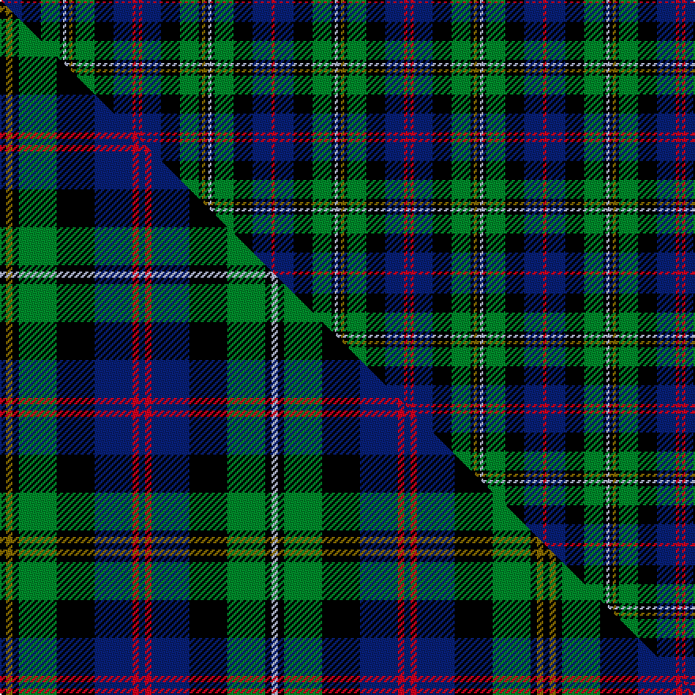

This is one **variant** — a specific cloth: this exact thread count and colourway, with its own
provenance below. It is one weaving of the [sett](/setts/db1r1db6k6g6k1y1k1lb1k1g6k6db6r1/) (the scale-free proportion — the
same cloth at any scale or shade), whose colour order is pattern [BRBKGKGKWKGKBR](/stripes/brbkgkgkwkgkbr/).

Part of the [Malcolm](/tartans/m/ma/malcolm/) tartan — the named design grouping this sett with its other cloths.

Sourced from weddslist.  It is a [14 stripe tartan](/stripes/stripes14/).

Original link [http://www.weddslist.com/cgi-bin/tartans/pg.pl?source=tinsel](http://www.weddslist.com/cgi-bin/tartans/pg.pl?source=tinsel)

2 attestations — the source records this cloth was collapsed from (oldest owns this page)

<ul>
<li>undated — Malcolm (a) (weddslist, <a href="http://www.weddslist.com/cgi-bin/tartans/pg.pl?source=tinsel">record</a>) </li>
<li>undated — Malcolm (weddslist, <a href="http://www.weddslist.com/cgi-bin/tartans/pg.pl?source=x">record</a>) </li>
</ul>

Dataset <small>— provenance for this record, inherited from the source manifest</small>

<dl class="dataset-prov">
<dt>source</dt><dd><a href="/sources/weddslist/">Weddslist</a></dd>
<dt>data captured from</dt><dd><a href="https://github.com/thetartan/tartan-database/blob/master/data/weddslist/data.csv">https://github.com/thetartan/tartan-database/blob/master/data/weddslist/data.csv</a></dd>
<dt>data date</dt><dd>2016-11-17 <small>(dataset default)</small></dd>
<dt>licence</dt><dd><a href="https://creativecommons.org/licenses/by-nc-nd/4.0/">CC BY-NC-ND 4.0</a></dd>
</dl>

Capture chain <small>— the hands this data passed through, oldest first; each capture carries its own licence</small>

<ol class="capture-chain">
<li><a href="https://www.weddslist.com/tartans/">Weddslist</a> <small>the living privately compiled reference</small></li>
<li><a href="https://github.com/thetartan/tartan-database">thetartan/tartan-database</a> <small>2016-2017</small> · <a href="https://creativecommons.org/licenses/by-nc-nd/4.0/">CC BY-NC-ND 4.0</a> <small>Levko Kravets's frozen compilation — the capture we vendored, and where its CC licence text came from</small></li>
<li>this dictionary <small>captured 2026-06-10 · commit 5bf86c7566</small> <small>each re-capture is a git commit to data/sources</small></li>
</ol>

## Thread count
R/2 DB12 K12 G12 K2 LB2 K2 Y2 K2 G12 K12 DB12 R2 DB/2

One full sett is **172 threads**.

## Palette
<table><thead><tr><th>Colour</th><th>Shade</th><th>OKLCh</th></tr></thead><tbody><tr><td>LB</td><td><code style="background-color:#B5BBDE;">#B5BBDE</code> <small style="color:#888">#B5BBDE</small></td><td><small style="color:#888">oklch(79.9% 0.050 277.6)</small></td></tr><tr><td>DB</td><td><code style="background-color:#082077;">#082077</code> <small style="color:#888">#082077</small></td><td><small style="color:#888">oklch(30.0% 0.149 265.1)</small></td></tr><tr><td>G</td><td><code style="background-color:#008B2A;">#008B2A</code> <small style="color:#888">#008B2A</small></td><td><small style="color:#888">oklch(55.4% 0.170 145.9)</small></td></tr><tr><td>R</td><td><code style="background-color:#D60020;">#D60020</code> <small style="color:#888">#D60020</small></td><td><small style="color:#888">oklch(55.2% 0.224 25.5)</small></td></tr><tr><td>K</td><td><code style="background-color:#000000;">#000000</code> <small style="color:#888">#000000</small></td><td><small style="color:#888">oklch(0.0% 0.000 0.0)</small></td></tr><tr><td>Y</td><td><code style="background-color:#8B6E00;">#8B6E00</code> <small style="color:#888">#8B6E00</small></td><td><small style="color:#888">oklch(55.1% 0.113 90.4)</small></td></tr></tbody></table>

# Sample pattern

## Compared to the master

This cloth is one sett of its design; the master sett (the exemplar the design is anchored on) is below for comparison.

Its **ΔTartan distance** from the master is **0.00** — the same measure the nearest-tartans table ranks by (0 is identical; a re-scale of the same cloth is near 0, a recolour or a different proportion further).

<figure class="master-compare" style="margin:0">

this sett
master sett ★

<figcaption style="color:#888;font-size:smaller">One weave of this sett against the <a href="/setts/k1y1k1g6k6db6r1db1r1db6k6g6k1lb1/">master sett ★</a>, split on the diagonal: a shared proportion runs seamlessly across it with only the shades shifting; a different proportion breaks on it.</figcaption>
</figure>

## Nearest tartan variants

The nearest existing variants by ΔTartan distance, with this cloth at the top so the swatches line up against it.

ΔTartan

Threads

Variant

Sett

—

172

<a href="/variants/s14/db1r1db6k6g6k1y1k1lb1k1g6k6db6r1~x2/">Malcolm (a)</a>

<a href="/ttd/edit/#slug=k1y1k1g6k6db6r1db1r1db6k6g6k1lb1~x4&amp;base=db1r1db6k6g6k1y1k1lb1k1g6k6db6r1~x2" title="compare in the TTD">0.00</a>

344

<a href="/variants/s14/k1y1k1g6k6db6r1db1r1db6k6g6k1lb1~x4/">Malcolm Clan Tartan</a>

<a href="/ttd/edit/#slug=k1y1k1g6k6db6r1db1r1db6k6g6k1t1~x4&amp;base=db1r1db6k6g6k1y1k1lb1k1g6k6db6r1~x2" title="compare in the TTD">0.01</a>

344

<a href="/variants/s14/k1y1k1g6k6db6r1db1r1db6k6g6k1t1~x4/">Malcolm</a>

<a href="/ttd/edit/#slug=db1r1db6k6g6k1y1k1w1k1g6k6db6r1&amp;base=db1r1db6k6g6k1y1k1lb1k1g6k6db6r1~x2" title="compare in the TTD">0.30</a>

86

<a href="/variants/s14/db1r1db6k6g6k1y1k1w1k1g6k6db6r1/">Malcolm</a>

<a href="/ttd/edit/#slug=db12k2g2k2g2k2db13dr6k10dr6g13k2lo2k2lb2k2g12~x2&amp;base=db1r1db6k6g6k1y1k1lb1k1g6k6db6r1~x2" title="compare in the TTD">1.45</a>

320

<a href="/variants/s17/db12k2g2k2g2k2db13dr6k10dr6g13k2lo2k2lb2k2g12~x2/">Cunningham Hunting</a>

<a href="/ttd/edit/#slug=r1ki6g1k1g1k1g6k1b1k1ki3k3g3w1~x8~ki0604259&amp;base=db1r1db6k6g6k1y1k1lb1k1g6k6db6r1~x2" title="compare in the TTD">1.45</a>

464

<a href="/variants/s14/r1ki6g1k1g1k1g6k1b1k1ki3k3g3w1~x8~ki0604259/">Elgin - Landshut</a>

<a href="/ttd/edit/#slug=r1db6g1k1g1k1g6k1lb1k1db3k3g3w1~x8&amp;base=db1r1db6k6g6k1y1k1lb1k1g6k6db6r1~x2" title="compare in the TTD">1.49</a>

464

<a href="/variants/s14/r1db6g1k1g1k1g6k1lb1k1db3k3g3w1~x8/">Elgin-Landshut</a>

<a href="/ttd/edit/#slug=r3dg2k7t3k3t3dg14t3k3t3k3t3dg10dp6r2w2t3~x2&amp;base=db1r1db6k6g6k1y1k1lb1k1g6k6db6r1~x2" title="compare in the TTD">1.75</a>

280

<a href="/variants/s17/r3dg2k7t3k3t3dg14t3k3t3k3t3dg10dp6r2w2t3~x2/">Lee Cox (Personal)</a>

<a href="/ttd/edit/#slug=w7k11lb3db9g19y3k22db9lb3k3db6~x2&amp;base=db1r1db6k6g6k1y1k1lb1k1g6k6db6r1~x2" title="compare in the TTD">1.88</a>

354

<a href="/variants/s11/w7k11lb3db9g19y3k22db9lb3k3db6~x2/">Veere</a>

<a href="/ttd/edit/#slug=g4k8lo1k1db4lb1db1lb2db1lb1db4k1lo1k8g4dp2~x8&amp;base=db1r1db6k6g6k1y1k1lb1k1g6k6db6r1~x2" title="compare in the TTD">1.88</a>

656

<a href="/variants/s16/g4k8lo1k1db4lb1db1lb2db1lb1db4k1lo1k8g4dp2~x8/">Scottish Cultural Society</a>

<a href="/ttd/edit/#slug=db12k2db2k2db2k12g12r2w2r2g12k12db12r3db2~x2&amp;base=db1r1db6k6g6k1y1k1lb1k1g6k6db6r1~x2" title="compare in the TTD">1.88</a>

336

<a href="/variants/s15/db12k2db2k2db2k12g12r2w2r2g12k12db12r3db2~x2/">MacKenzie Morgan</a>

## Neighbour map

Every grey dot is one of 13621 variants placed by the first two principal components of the ΔTartan feature space (42% of its variance). Red is this tartan; blue dots are its nearest — click one to open its page.

<svg viewBox="0 0 640 380" role="img" style="max-width:100%;height:auto;border:1px solid #e0e0e0;border-radius:4px;display:block" xmlns="http://www.w3.org/2000/svg"><image href="/nn/cloud.v1.png" width="640" height="380"/><a href="/variants/s14/k1y1k1g6k6db6r1db1r1db6k6g6k1lb1~x4/"><circle cx="71.9" cy="159.6" r="4" fill="#3465a4"><title>Malcolm Clan Tartan</title></circle></a><a href="/variants/s14/k1y1k1g6k6db6r1db1r1db6k6g6k1t1~x4/"><circle cx="74.6" cy="160.6" r="4" fill="#3465a4"><title>Malcolm</title></circle></a><a href="/variants/s14/db1r1db6k6g6k1y1k1w1k1g6k6db6r1/"><circle cx="69.0" cy="158.7" r="4" fill="#3465a4"><title>Malcolm</title></circle></a><a href="/variants/s17/db12k2g2k2g2k2db13dr6k10dr6g13k2lo2k2lb2k2g12~x2/"><circle cx="59.2" cy="148.7" r="4" fill="#3465a4"><title>Cunningham Hunting</title></circle></a><a href="/variants/s14/r1ki6g1k1g1k1g6k1b1k1ki3k3g3w1~x8~ki0604259/"><circle cx="68.5" cy="150.8" r="4" fill="#3465a4"><title>Elgin - Landshut</title></circle></a><a href="/variants/s14/r1db6g1k1g1k1g6k1lb1k1db3k3g3w1~x8/"><circle cx="76.1" cy="156.2" r="4" fill="#3465a4"><title>Elgin-Landshut</title></circle></a><a href="/variants/s17/r3dg2k7t3k3t3dg14t3k3t3k3t3dg10dp6r2w2t3~x2/"><circle cx="73.9" cy="154.5" r="4" fill="#3465a4"><title>Lee Cox (Personal)</title></circle></a><a href="/variants/s11/w7k11lb3db9g19y3k22db9lb3k3db6~x2/"><circle cx="68.5" cy="162.9" r="4" fill="#3465a4"><title>Veere</title></circle></a><a href="/variants/s16/g4k8lo1k1db4lb1db1lb2db1lb1db4k1lo1k8g4dp2~x8/"><circle cx="89.2" cy="133.5" r="4" fill="#3465a4"><title>Scottish Cultural Society</title></circle></a><a href="/variants/s15/db12k2db2k2db2k12g12r2w2r2g12k12db12r3db2~x2/"><circle cx="83.0" cy="169.0" r="4" fill="#3465a4"><title>MacKenzie Morgan</title></circle></a><circle cx="71.9" cy="159.6" r="5" fill="#c00000"/><text x="320" y="376" text-anchor="middle" font-size="11" fill="#999">ground</text><text x="11" y="190" text-anchor="middle" font-size="11" fill="#999" transform="rotate(-90 11 190)">complexity</text></svg>

ID: /variants/s14/db1r1db6k6g6k1y1k1lb1k1g6k6db6r1~x2/
