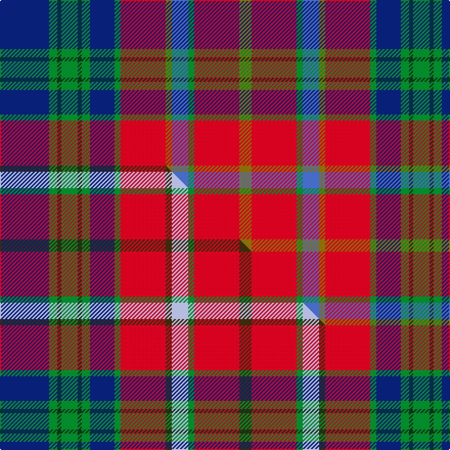

This page is one **sett** — a single exact thread-count. It belongs to the [tartan](/setts/db24g4dg2g8dg2g4db12g3r22y3b8g3r22y6/)
(the same proportion at any scale), whose colour order is pattern [BGGGGGBGRGBGRG](/stripes/bgggggbgrgbgrg/).

Part of the [Devon 2000](/tartans/devon-2000/) tartan — the named design grouping this sett with its other cloths.

Sourced from weddslist.  It is a [14 stripe tartan](/stripes/stripes14/).

Original link http://www.weddslist.com/cgi-bin/tartans/pg.pl?source=sts

Dataset <small>— provenance for this record, inherited from the source manifest</small>

<dl class="dataset-prov">
<dt>source</dt><dd><a href="/sources/weddslist/">Weddslist</a></dd>
<dt>data captured from</dt><dd><a href="https://github.com/thetartan/tartan-database/blob/master/data/weddslist/data.csv">https://github.com/thetartan/tartan-database/blob/master/data/weddslist/data.csv</a></dd>
<dt>data date</dt><dd>2016-11-17 <small>(dataset default)</small></dd>
<dt>licence</dt><dd><a href="https://creativecommons.org/licenses/by-nc-nd/4.0/">CC BY-NC-ND 4.0</a></dd>
</dl>

Capture chain <small>— the hands this data passed through, oldest first; each capture carries its own licence</small>

<ol class="capture-chain">
<li><a href="https://www.weddslist.com/tartans/">Weddslist</a> <small>the living privately compiled reference</small></li>
<li><a href="https://github.com/thetartan/tartan-database">thetartan/tartan-database</a> <small>2016-2017</small> · <a href="https://creativecommons.org/licenses/by-nc-nd/4.0/">CC BY-NC-ND 4.0</a> <small>Levko Kravets's frozen compilation — the capture we vendored, and where its CC licence text came from</small></li>
<li>this dictionary <small>captured 2026-06-10 · commit 5bf86c7566</small> <small>each re-capture is a git commit to data/sources</small></li>
</ol>

## Thread count
DB/48 G8 DG4 G16 DG4 G8 DB24 G6 R44 Y6 B16 G6 R44 Y/12

One full sett is **432 threads**.

## Palette
<table><thead><tr><th>Colour</th><th>Shade</th><th>OKLCh</th></tr></thead><tbody><tr><td>B</td><td><code style="background-color:#466CC8;">#466CC8</code> <small style="color:#888">#466CC8</small></td><td><small style="color:#888">oklch(55.1% 0.149 265.0)</small></td></tr><tr><td>DB</td><td><code style="background-color:#082077;">#082077</code> <small style="color:#888">#082077</small></td><td><small style="color:#888">oklch(30.0% 0.149 265.1)</small></td></tr><tr><td>DG</td><td><code style="background-color:#053819;">#053819</code> <small style="color:#888">#053819</small></td><td><small style="color:#888">oklch(30.0% 0.075 151.3)</small></td></tr><tr><td>G</td><td><code style="background-color:#008B2A;">#008B2A</code> <small style="color:#888">#008B2A</small></td><td><small style="color:#888">oklch(55.4% 0.170 145.9)</small></td></tr><tr><td>R</td><td><code style="background-color:#D60020;">#D60020</code> <small style="color:#888">#D60020</small></td><td><small style="color:#888">oklch(55.2% 0.224 25.5)</small></td></tr><tr><td>Y</td><td><code style="background-color:#8B6E00;">#8B6E00</code> <small style="color:#888">#8B6E00</small></td><td><small style="color:#888">oklch(55.1% 0.113 90.4)</small></td></tr></tbody></table>

# Sample pattern

## Compared to the master

This cloth is one sett of its design; the master sett (the exemplar the design is anchored on) is below for comparison.

Its **ΔTartan distance** from the master is **0.08** — the same measure the nearest-tartans table ranks by (0 is identical; a re-scale of the same cloth is near 0, a recolour or a different proportion further).

<figure class="master-compare" style="margin:0">

this sett
master sett ★

<figcaption style="color:#888;font-size:smaller">One weave of this sett against the <a href="/setts/db24g4dg2g8dg2g4db12g3r22dy3lb8g3r22dy6/">master sett ★</a>, split on the diagonal: a shared proportion runs seamlessly across it with only the shades shifting; a different proportion breaks on it.</figcaption>
</figure>

## Nearest tartan variants

The nearest existing variants by ΔTartan distance, with this cloth at the top so the swatches line up against it.

ΔTartan

Threads

Variant

Sett

—

432

<a href="/variants/s14/db24g4dg2g8dg2g4db12g3r22y3b8g3r22y6~x2/">Devon 2000</a>

<a href="/ttd/edit/#slug=db24g4dg2g8dg2g4db12g3r22dy3lb8g3r22dy6~x2&amp;base=db24g4dg2g8dg2g4db12g3r22y3b8g3r22y6~x2" title="compare in the TTD">0.08</a>

432

<a href="/variants/s14/db24g4dg2g8dg2g4db12g3r22dy3lb8g3r22dy6~x2/">Devon 2000</a>

<a href="/ttd/edit/#slug=db12dg4r2y3g4dg4r20w4r14dg4g4y3r2dg4db12y2db8y2~x2~dg1503152-g2407139&amp;base=db24g4dg2g8dg2g4db12g3r22y3b8g3r22y6~x2" title="compare in the TTD">1.45</a>

404

<a href="/variants/s18/db12dg4r2y3g4dg4r20w4r14dg4g4y3r2dg4db12y2db8y2~x2~dg1503152-g2407139/">Béguinot, Stéphane (Personal)</a>

<a href="/ttd/edit/#slug=dg18ri4dg4r6dg28dp28r4lb3y4lb13r6~ri2806019-r2109032&amp;base=db24g4dg2g8dg2g4db12g3r22y3b8g3r22y6~x2" title="compare in the TTD">2.03</a>

212

<a href="/variants/s11/dg18ri4dg4r6dg28dp28r4lb3y4lb13r6~ri2806019-r2109032/">Unidentified (Woven sample)</a>

<a href="/ttd/edit/#slug=r22y3db5ly2r2w2dg11db4w3~x2&amp;base=db24g4dg2g8dg2g4db12g3r22y3b8g3r22y6~x2" title="compare in the TTD">2.11</a>

166

<a href="/variants/s9/r22y3db5ly2r2w2dg11db4w3~x2/">Norwich No.014</a>

<a href="/ttd/edit/#slug=ly5db2r14do9dg8db3r3db3r3db3dg18lyi3~x2~ly2705081-lyi3103095&amp;base=db24g4dg2g8dg2g4db12g3r22y3b8g3r22y6~x2" title="compare in the TTD">2.13</a>

280

<a href="/variants/s12/ly5db2r14do9dg8db3r3db3r3db3dg18lyi3~x2~ly2705081-lyi3103095/">Meath, County</a>

<a href="/ttd/edit/#slug=lb24dp3lb3dp3lb3dp10o12dpi12g12o2n3~x2~o2104072-dpi1105325&amp;base=db24g4dg2g8dg2g4db12g3r22y3b8g3r22y6~x2" title="compare in the TTD">2.24</a>

294

<a href="/variants/s11/lb24dp3lb3dp3lb3dp10o12dpi12g12o2n3~x2~o2104072-dpi1105325/">Isle of Skye (District)</a>

<a href="/ttd/edit/#slug=r26lb7dp8y3r3w3g20dp10w2~x2&amp;base=db24g4dg2g8dg2g4db12g3r22y3b8g3r22y6~x2" title="compare in the TTD">2.27</a>

272

<a href="/variants/s9/r26lb7dp8y3r3w3g20dp10w2~x2/">Wilson's No.227</a>

<a href="/ttd/edit/#slug=r6w1r6db2r6g12ly1db8t4r4~x4~r2109032-db1406275-ly3307090-t2405244&amp;base=db24g4dg2g8dg2g4db12g3r22y3b8g3r22y6~x2" title="compare in the TTD">2.32</a>

688

<a href="/variants/s18/r4t4db8ly1g12r6db2r6w1r6w1r6db2r6g12ly1db8t4~x4~r2109032-t2405244-db1406275-ly3307090/">Norwich No.057</a>

<a href="/ttd/edit/#slug=w2n1lr12o2lr2o2lr2o2lr2dp10o1dp10g12n2g4lr2~x2~n1900000-lr3000000-o2404317-dp1105325&amp;base=db24g4dg2g8dg2g4db12g3r22y3b8g3r22y6~x2" title="compare in the TTD">2.46</a>

264

<a href="/variants/s16/w2n1lr12o2lr2o2lr2o2lr2dp10o1dp10g12n2g4lr2~x2~n1900000-lr3000000-o2404317-dp1105325/">Cribb (2016)</a>

<a href="/ttd/edit/#slug=t12dg4r2dy3g4dg4r20w4r14dg4g4dy3r2dg4t12dy2t8dy2~x2~dg1806142-g2408144&amp;base=db24g4dg2g8dg2g4db12g3r22y3b8g3r22y6~x2" title="compare in the TTD">2.56</a>

404

<a href="/variants/s18/t12dg4r2dy3g4dg4r20w4r14dg4g4dy3r2dg4t12dy2t8dy2~x2~dg1806142-g2408144/">Beguinot, (Personal)</a>

## Neighbour map

Every grey dot is one of 13620 variants placed by the first two principal components of the ΔTartan feature space (42% of its variance). Red is this tartan; blue dots are its nearest — click one to open its page.

<svg viewBox="0 0 640 380" role="img" style="max-width:100%;height:auto;border:1px solid #e0e0e0;border-radius:4px;display:block" xmlns="http://www.w3.org/2000/svg"><image href="/nn/cloud.v1.png" width="640" height="380"/><a href="/variants/s14/db24g4dg2g8dg2g4db12g3r22dy3lb8g3r22dy6~x2/"><circle cx="147.4" cy="142.5" r="4" fill="#3465a4"><title>Devon 2000</title></circle></a><a href="/variants/s18/db12dg4r2y3g4dg4r20w4r14dg4g4y3r2dg4db12y2db8y2~x2~dg1503152-g2407139/"><circle cx="131.5" cy="144.1" r="4" fill="#3465a4"><title>Béguinot, Stéphane (Personal)</title></circle></a><a href="/variants/s11/dg18ri4dg4r6dg28dp28r4lb3y4lb13r6~ri2806019-r2109032/"><circle cx="175.4" cy="163.8" r="4" fill="#3465a4"><title>Unidentified (Woven sample)</title></circle></a><a href="/variants/s9/r22y3db5ly2r2w2dg11db4w3~x2/"><circle cx="112.2" cy="128.0" r="4" fill="#3465a4"><title>Norwich No.014</title></circle></a><a href="/variants/s12/ly5db2r14do9dg8db3r3db3r3db3dg18lyi3~x2~ly2705081-lyi3103095/"><circle cx="150.3" cy="174.8" r="4" fill="#3465a4"><title>Meath, County</title></circle></a><a href="/variants/s11/lb24dp3lb3dp3lb3dp10o12dpi12g12o2n3~x2~o2104072-dpi1105325/"><circle cx="127.6" cy="159.0" r="4" fill="#3465a4"><title>Isle of Skye (District)</title></circle></a><a href="/variants/s9/r26lb7dp8y3r3w3g20dp10w2~x2/"><circle cx="107.9" cy="139.3" r="4" fill="#3465a4"><title>Wilson's No.227</title></circle></a><a href="/variants/s18/r4t4db8ly1g12r6db2r6w1r6w1r6db2r6g12ly1db8t4~x4~r2109032-t2405244-db1406275-ly3307090/"><circle cx="148.4" cy="156.5" r="4" fill="#3465a4"><title>Norwich No.057</title></circle></a><a href="/variants/s16/w2n1lr12o2lr2o2lr2o2lr2dp10o1dp10g12n2g4lr2~x2~n1900000-lr3000000-o2404317-dp1105325/"><circle cx="121.3" cy="140.0" r="4" fill="#3465a4"><title>Cribb (2016)</title></circle></a><a href="/variants/s18/t12dg4r2dy3g4dg4r20w4r14dg4g4dy3r2dg4t12dy2t8dy2~x2~dg1806142-g2408144/"><circle cx="147.7" cy="154.0" r="4" fill="#3465a4"><title>Beguinot, (Personal)</title></circle></a><circle cx="157.3" cy="146.1" r="5" fill="#c00000"/><text x="320" y="376" text-anchor="middle" font-size="11" fill="#999">ground</text><text x="11" y="190" text-anchor="middle" font-size="11" fill="#999" transform="rotate(-90 11 190)">complexity</text></svg>

ID: /variants/s14/db24g4dg2g8dg2g4db12g3r22y3b8g3r22y6~x2/
