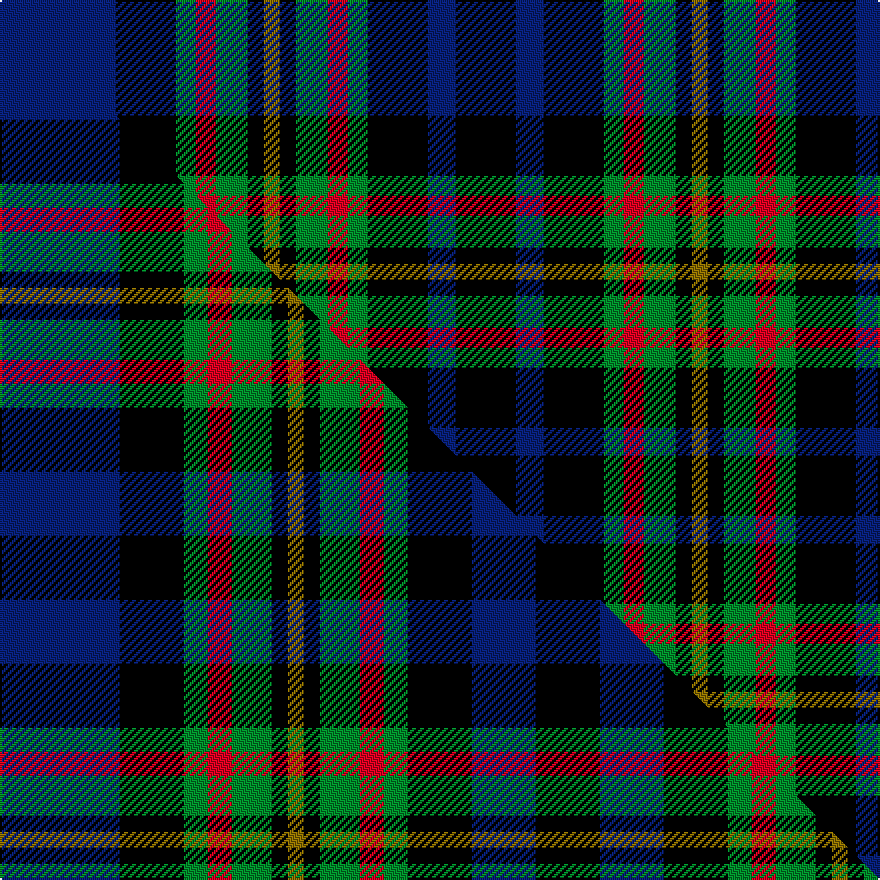

This page is one **sett** — a single exact thread-count. It belongs to the [tartan](/setts/db29k15g5r5g8k4y4k4g8r5g5k15db7k15/)
(the same proportion at any scale), whose colour order is pattern [BKGRGKGKGRGKBK](/stripes/bkgrgkgkgrgkbk/).

Part of the [MacLellan](/tartans/maclellan/) tartan — the named design grouping this sett with its other cloths.

Sourced from house-of-tartan.  It is a [14 stripe tartan](/stripes/stripes14/).

Original link [http://www.house-of-tartan.scotland.net/house/TartanViewjs.asp?colr=Def&tnam=323](http://www.house-of-tartan.scotland.net/house/TartanViewjs.asp?colr=Def&tnam=323)

## Provenance

Earliest known date: pre 2003 Very similar to MacLaren

Dataset <small>— provenance for this record, inherited from the source manifest</small>

<dl class="dataset-prov">
<dt>source</dt><dd><a href="/sources/house-of-tartan/">House of Tartan</a></dd>
<dt>data captured from</dt><dd><a href="https://github.com/thetartan/tartan-database/blob/master/data/house-of-tartan/data.csv">https://github.com/thetartan/tartan-database/blob/master/data/house-of-tartan/data.csv</a></dd>
<dt>data date</dt><dd>2017-01-10 <small>(dataset default)</small></dd>
<dt>licence</dt><dd><a href="https://creativecommons.org/licenses/by-nc-nd/4.0/">CC BY-NC-ND 4.0</a></dd>
</dl>

Capture chain <small>— the hands this data passed through, oldest first; each capture carries its own licence</small>

<ol class="capture-chain">
<li><a href="http://www.house-of-tartan.scotland.net/">House of Tartan</a> <small>the weaver/retailer's database — the site is now offline; the URL is kept as the ultimate source's identity</small></li>
<li><a href="https://github.com/thetartan/tartan-database">thetartan/tartan-database</a> <small>2016-2017</small> · <a href="https://creativecommons.org/licenses/by-nc-nd/4.0/">CC BY-NC-ND 4.0</a> <small>Levko Kravets's frozen compilation — the capture we vendored, and where its CC licence text came from</small></li>
<li>this dictionary <small>captured 2026-06-10 · commit 5bf86c7566</small> <small>each re-capture is a git commit to data/sources</small></li>
</ol>

## Thread count
DB/58 K30 G10 R10 G16 K8 Y8 K8 G16 R10 G10 K30 DB14 K/30

One full sett is **428 threads**.

## Palette
<table><thead><tr><th>Colour</th><th>Shade</th><th>OKLCh</th></tr></thead><tbody><tr><td>DB</td><td><code style="background-color:#082077;">#082077</code> <small style="color:#888">#082077</small></td><td><small style="color:#888">oklch(30.0% 0.149 265.1)</small></td></tr><tr><td>G</td><td><code style="background-color:#008B2A;">#008B2A</code> <small style="color:#888">#008B2A</small></td><td><small style="color:#888">oklch(55.4% 0.170 145.9)</small></td></tr><tr><td>K</td><td><code style="background-color:#000000;">#000000</code> <small style="color:#888">#000000</small></td><td><small style="color:#888">oklch(0.0% 0.000 0.0)</small></td></tr><tr><td>R</td><td><code style="background-color:#D60020;">#D60020</code> <small style="color:#888">#D60020</small></td><td><small style="color:#888">oklch(55.2% 0.224 25.5)</small></td></tr><tr><td>Y</td><td><code style="background-color:#8B6E00;">#8B6E00</code> <small style="color:#888">#8B6E00</small></td><td><small style="color:#888">oklch(55.1% 0.113 90.4)</small></td></tr></tbody></table>

# Sample pattern

## Compared to the master

This cloth is one sett of its design; the master sett (the exemplar the design is anchored on) is below for comparison.

Its **ΔTartan distance** from the master is **0.28** — the same measure the nearest-tartans table ranks by (0 is identical; a re-scale of the same cloth is near 0, a recolour or a different proportion further).

<figure class="master-compare" style="margin:0">

this sett
master sett ★

<figcaption style="color:#888;font-size:smaller">One weave of this sett against the <a href="/setts/db15k8g3r3g5k2y2k2g5r3g3k8db8k8/">master sett ★</a>, split on the diagonal: a shared proportion runs seamlessly across it with only the shades shifting; a different proportion breaks on it.</figcaption>
</figure>

## Nearest tartan variants

The nearest existing variants by ΔTartan distance, with this cloth at the top so the swatches line up against it.

ΔTartan

Threads

Variant

Sett

—

428

<a href="/variants/s14/db29k15g5r5g8k4y4k4g8r5g5k15db7k15~x2/">MacLellan Clan Tartan</a>

<a href="/ttd/edit/#slug=db15k8g3r3g5k2y2k2g5r3g3k8db8k8~x4&amp;base=db29k15g5r5g8k4y4k4g8r5g5k15db7k15~x2" title="compare in the TTD">0.28</a>

508

<a href="/variants/s14/db15k8g3r3g5k2y2k2g5r3g3k8db8k8~x4/">MacLellan</a>

<a href="/ttd/edit/#slug=db18k5g3r3g6k2y2k2g6r3g3k10db5k10&amp;base=db29k15g5r5g8k4y4k4g8r5g5k15db7k15~x2" title="compare in the TTD">0.37</a>

128

<a href="/variants/s14/db18k5g3r3g6k2y2k2g6r3g3k10db5k10/">MacClellan</a>

<a href="/ttd/edit/#slug=y1k1g7k8db7k1db2k1db7k8g7k1w1~x4&amp;base=db29k15g5r5g8k4y4k4g8r5g5k15db7k15~x2" title="compare in the TTD">1.43</a>

408

<a href="/variants/s13/y1k1g7k8db7k1db2k1db7k8g7k1w1~x4/">Campbell of Loudoun (Clan)</a>

<a href="/ttd/edit/#slug=r1k1g6k6db6k1db1k1db6k6g6k1ly1~x4&amp;base=db29k15g5r5g8k4y4k4g8r5g5k15db7k15~x2" title="compare in the TTD">1.44</a>

336

<a href="/variants/s13/r1k1g6k6db6k1db1k1db6k6g6k1ly1~x4/">MacEwen/MacEwan</a>

<a href="/ttd/edit/#slug=db6k1db1k1db1k6g6k1w2k1g6k6db6k1r2~x2&amp;base=db29k15g5r5g8k4y4k4g8r5g5k15db7k15~x2" title="compare in the TTD">1.53</a>

172

<a href="/variants/s15/db6k1db1k1db1k6g6k1w2k1g6k6db6k1r2~x2/">MacKenzie MINI Clan Miniature Tartan</a>

<a href="/ttd/edit/#slug=r2k1db8k8g8y2g8k8db1k1db1k1db4r1~x4&amp;base=db29k15g5r5g8k4y4k4g8r5g5k15db7k15~x2" title="compare in the TTD">1.66</a>

420

<a href="/variants/s14/r2k1db8k8g8y2g8k8db1k1db1k1db4r1~x4/">Farquharson</a>

<a href="/ttd/edit/#slug=r2db4k1db1k1db1k8g8y2g8k8db8k1r2&amp;base=db29k15g5r5g8k4y4k4g8r5g5k15db7k15~x2" title="compare in the TTD">1.67</a>

106

<a href="/variants/s14/r2db4k1db1k1db1k8g8y2g8k8db8k1r2/">Farquharson</a>

<a href="/ttd/edit/#slug=r2db4k1db1k1db1k8g8y2g8k8db8k1r2~x2&amp;base=db29k15g5r5g8k4y4k4g8r5g5k15db7k15~x2" title="compare in the TTD">1.67</a>

212

<a href="/variants/s14/r2db4k1db1k1db1k8g8y2g8k8db8k1r2~x2/">Farquharson</a>

<a href="/ttd/edit/#slug=db10k1db1k1db1k6g6k1y2k1g6k6db6r3~x2&amp;base=db29k15g5r5g8k4y4k4g8r5g5k15db7k15~x2" title="compare in the TTD">1.67</a>

178

<a href="/variants/s14/db10k1db1k1db1k6g6k1y2k1g6k6db6r3~x2/">MacLeod of Skye</a>

<a href="/ttd/edit/#slug=db12k2r2k2r2k12g11y2g11k12db11k2r2~x2&amp;base=db29k15g5r5g8k4y4k4g8r5g5k15db7k15~x2" title="compare in the TTD">1.69</a>

304

<a href="/variants/s13/db12k2r2k2r2k12g11y2g11k12db11k2r2~x2/">Black Watch, Plaid of Pipers...</a>

## Neighbour map

Every grey dot is one of 13621 variants placed by the first two principal components of the ΔTartan feature space (42% of its variance). Red is this tartan; blue dots are its nearest — click one to open its page.

<svg viewBox="0 0 640 380" role="img" style="max-width:100%;height:auto;border:1px solid #e0e0e0;border-radius:4px;display:block" xmlns="http://www.w3.org/2000/svg"><image href="/nn/cloud.v1.png" width="640" height="380"/><a href="/variants/s14/db15k8g3r3g5k2y2k2g5r3g3k8db8k8~x4/"><circle cx="101.1" cy="175.5" r="4" fill="#3465a4"><title>MacLellan</title></circle></a><a href="/variants/s14/db18k5g3r3g6k2y2k2g6r3g3k10db5k10/"><circle cx="113.3" cy="158.2" r="4" fill="#3465a4"><title>MacClellan</title></circle></a><a href="/variants/s13/y1k1g7k8db7k1db2k1db7k8g7k1w1~x4/"><circle cx="122.4" cy="165.9" r="4" fill="#3465a4"><title>Campbell of Loudoun (Clan)</title></circle></a><a href="/variants/s13/r1k1g6k6db6k1db1k1db6k6g6k1ly1~x4/"><circle cx="104.9" cy="178.0" r="4" fill="#3465a4"><title>MacEwen/MacEwan</title></circle></a><a href="/variants/s15/db6k1db1k1db1k6g6k1w2k1g6k6db6k1r2~x2/"><circle cx="84.5" cy="169.6" r="4" fill="#3465a4"><title>MacKenzie MINI Clan Miniature Tartan</title></circle></a><a href="/variants/s14/r2k1db8k8g8y2g8k8db1k1db1k1db4r1~x4/"><circle cx="101.5" cy="157.4" r="4" fill="#3465a4"><title>Farquharson</title></circle></a><a href="/variants/s14/r2db4k1db1k1db1k8g8y2g8k8db8k1r2/"><circle cx="94.6" cy="159.5" r="4" fill="#3465a4"><title>Farquharson</title></circle></a><a href="/variants/s14/r2db4k1db1k1db1k8g8y2g8k8db8k1r2~x2/"><circle cx="94.6" cy="159.5" r="4" fill="#3465a4"><title>Farquharson</title></circle></a><a href="/variants/s14/db10k1db1k1db1k6g6k1y2k1g6k6db6r3~x2/"><circle cx="114.1" cy="155.9" r="4" fill="#3465a4"><title>MacLeod of Skye</title></circle></a><a href="/variants/s13/db12k2r2k2r2k12g11y2g11k12db11k2r2~x2/"><circle cx="91.8" cy="176.8" r="4" fill="#3465a4"><title>Black Watch, Plaid of Pipers...</title></circle></a><circle cx="119.4" cy="167.5" r="5" fill="#c00000"/><text x="320" y="376" text-anchor="middle" font-size="11" fill="#999">ground</text><text x="11" y="190" text-anchor="middle" font-size="11" fill="#999" transform="rotate(-90 11 190)">complexity</text></svg>

ID: /variants/s14/db29k15g5r5g8k4y4k4g8r5g5k15db7k15~x2/
