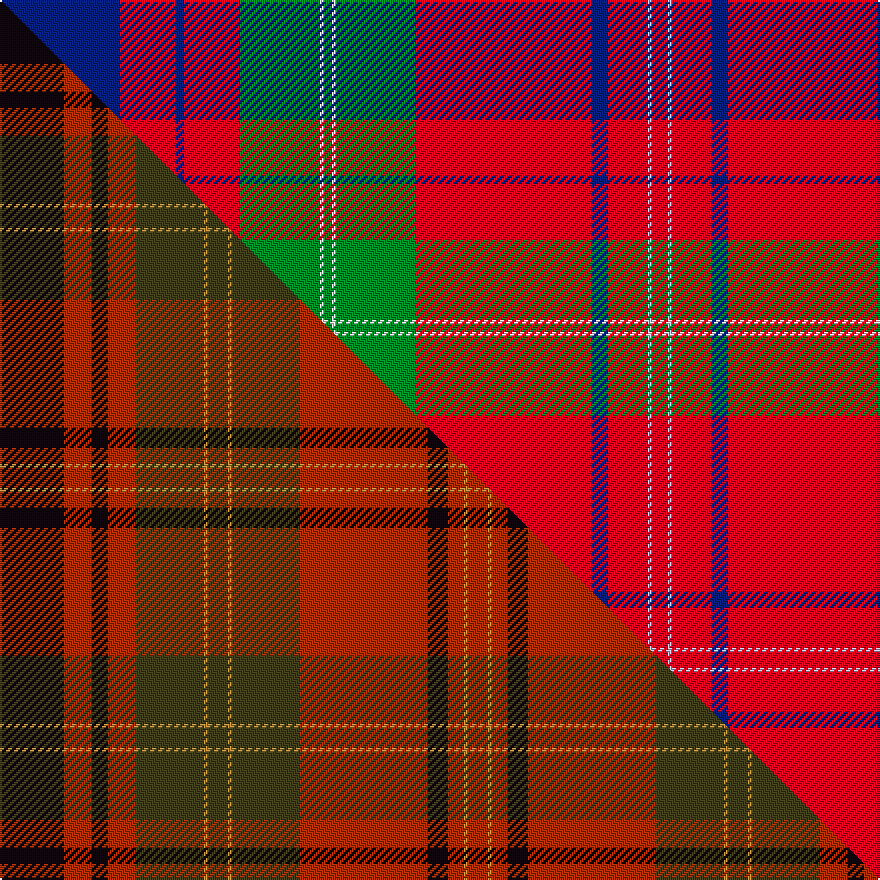

This is one **variant** — a specific cloth: this exact thread count and colourway, with its own
provenance below. It is one weaving of the [sett](/tartans/d/du/duke-of-perth-1739/) (the scale-free proportion — the
same cloth at any scale or shade), whose colour order is pattern [BRBRGWGWGRBRWR](/stripes/brbrgwgwgrbrwr/).

Part of the [Duke of Perth 1739](/tartans/d/du/duke-of-perth-1739/) tartan — the named design grouping this sett with its other cloths.

Sourced from house-of-tartan.  It is a [14 stripe tartan](/stripes/stripes14/).

Original link [http://www.house-of-tartan.scotland.net/house/TartanViewjs.asp?colr=Def&tnam=460](http://www.house-of-tartan.scotland.net/house/TartanViewjs.asp?colr=Def&tnam=460)

## Provenance

Earliest known date: 1739 From a painting by Dominique Dupra which hangs in the National Portrait Gallery in Edinburgh. The white stripe could be yellow.

3 attestations — the source records this cloth was collapsed from (oldest owns this page)

<ul>
<li>1739 — Perth (Duke of.. ) Portrait Tartan (house-of-tartan, <a href="http://www.house-of-tartan.scotland.net/house/TartanViewjs.asp?colr=Def&tnam=460">record</a>) </li>
<li>01/01/2002 — Unnamed C18th - Duke of Perth (register-of-tartans, <a href="https://www.tartanregister.gov.uk/tartanDetails.aspx?ref=4417">record</a>)  <em>From a painting by Dominique Dupra which hangs in the National Portrait Gallery in Edinburgh. The white stripe could be yellow.</em></li>
<li>undated — Perth, (Duke of.. ) (weddslist, <a href="http://www.weddslist.com/cgi-bin/tartans/pg.pl?source=sts">record</a>) </li>
</ul>

Dataset <small>— provenance for this record, inherited from the source manifest</small>

<dl class="dataset-prov">
<dt>source</dt><dd><a href="/sources/house-of-tartan/">House of Tartan</a></dd>
<dt>data captured from</dt><dd><a href="https://github.com/thetartan/tartan-database/blob/master/data/house-of-tartan/data.csv">https://github.com/thetartan/tartan-database/blob/master/data/house-of-tartan/data.csv</a></dd>
<dt>data date</dt><dd>1739 <small>(this record)</small></dd>
<dt>licence</dt><dd><a href="https://creativecommons.org/licenses/by-nc-nd/4.0/">CC BY-NC-ND 4.0</a></dd>
</dl>

Capture chain <small>— the hands this data passed through, oldest first; each capture carries its own licence</small>

<ol class="capture-chain">
<li><a href="http://www.house-of-tartan.scotland.net/">House of Tartan</a> <small>the weaver/retailer's database — the site is now offline; the URL is kept as the ultimate source's identity</small></li>
<li><a href="https://github.com/thetartan/tartan-database">thetartan/tartan-database</a> <small>2016-2017</small> · <a href="https://creativecommons.org/licenses/by-nc-nd/4.0/">CC BY-NC-ND 4.0</a> <small>Levko Kravets's frozen compilation — the capture we vendored, and where its CC licence text came from</small></li>
<li>this dictionary <small>captured 2026-06-10 · commit 5bf86c7566</small> <small>each re-capture is a git commit to data/sources</small></li>
</ol>

## Register references

External register numbers recorded for this tartan.

- Scottish Register of Tartans: [4417](https://www.tartanregister.gov.uk/tartanDetails.aspx?ref=4417)
- Scottish Tartans Authority (ITI): 460
- Scottish Tartans World Register: 460

## Thread count
DB/60 R28 DB4 R28 G40 W2 G4 W2 G40 R88 DB8 R20 LB2 R/8

One full sett is **600 threads**.

## Palette
<table><thead><tr><th>Colour</th><th>Shade</th><th>OKLCh</th></tr></thead><tbody><tr><td>LB</td><td><code style="background-color:#B5BBDE;">#B5BBDE</code> <small style="color:#888">#B5BBDE</small></td><td><small style="color:#888">oklch(79.9% 0.050 277.6)</small></td></tr><tr><td>DB</td><td><code style="background-color:#082077;">#082077</code> <small style="color:#888">#082077</small></td><td><small style="color:#888">oklch(30.0% 0.149 265.1)</small></td></tr><tr><td>G</td><td><code style="background-color:#008B2A;">#008B2A</code> <small style="color:#888">#008B2A</small></td><td><small style="color:#888">oklch(55.4% 0.170 145.9)</small></td></tr><tr><td>W</td><td><code style="background-color:#F7F7F7;">#F7F7F7</code> <small style="color:#888">#F7F7F7</small></td><td><small style="color:#888">oklch(97.6% 0.000 89.9)</small></td></tr><tr><td>R</td><td><code style="background-color:#D60020;">#D60020</code> <small style="color:#888">#D60020</small></td><td><small style="color:#888">oklch(55.2% 0.224 25.5)</small></td></tr></tbody></table>

# Sample pattern

## Compared to the master

This cloth is one sett of its design; the master sett (the exemplar the design is anchored on) is below for comparison.

Its **ΔTartan distance** from the master is **6.10** — the same measure the nearest-tartans table ranks by (0 is identical; a re-scale of the same cloth is near 0, a recolour or a different proportion further).

<figure class="master-compare" style="margin:0">

this sett
master sett ★

<figcaption style="color:#888;font-size:smaller">One weave of this sett against the <a href="/setts/k16r7k4r7dg17ly1dg5ly1dg17r32k5r4ly1r5/">master sett ★</a>, split on the diagonal: a shared proportion runs seamlessly across it with only the shades shifting; a different proportion breaks on it.</figcaption>
</figure>

## Nearest tartan variants

The nearest existing variants by ΔTartan distance, with this cloth at the top so the swatches line up against it.

ΔTartan

Threads

Variant

Sett

—

600

<a href="/variants/s14/db30r14db2r14g20w1g2w1g20r44db4r10lb1r4~x2/">Perth (Duke of.. ) Portrait Tartan</a>

<a href="/ttd/edit/#slug=db3lb1r30db32r3w1r3g23r31db3w1&amp;base=db30r14db2r14g20w1g2w1g20r44db4r10lb1r4~x2" title="compare in the TTD">1.80</a>

258

<a href="/variants/s11/db3lb1r30db32r3w1r3g23r31db3w1/">MacDonald of Glenaladale Artifact Tartan</a>

<a href="/ttd/edit/#slug=r4lb2r50db26r10g44b4r10b4g44r51db2r4lb2~x2&amp;base=db30r14db2r14g20w1g2w1g20r44db4r10lb1r4~x2" title="compare in the TTD">2.37</a>

1016

<a href="/variants/s14/r4lb2r50db26r10g44b4r10b4g44r51db2r4lb2~x2/">MacQuarrie 1</a>

<a href="/ttd/edit/#slug=g36r3g3r3db9r3lb2r40db3r3db2r6~x2&amp;base=db30r14db2r14g20w1g2w1g20r44db4r10lb1r4~x2" title="compare in the TTD">2.45</a>

368

<a href="/variants/s12/g36r3g3r3db9r3lb2r40db3r3db2r6~x2/">MacLintock Clan Tartan</a>

<a href="/ttd/edit/#slug=g28r2lb2r18db9r9lb9y1r3~x2&amp;base=db30r14db2r14g20w1g2w1g20r44db4r10lb1r4~x2" title="compare in the TTD">2.54</a>

262

<a href="/variants/s9/g28r2lb2r18db9r9lb9y1r3~x2/">Unidentified Scarlett #10</a>

<a href="/ttd/edit/#slug=ri4lb2ri50db26ri10g44r4ri10r4g44ri51db2ri4lb2~x2~ri5623030-r5419027&amp;base=db30r14db2r14g20w1g2w1g20r44db4r10lb1r4~x2" title="compare in the TTD">2.60</a>

1016

<a href="/variants/s14/ri4lb2ri50db26ri10g44r4ri10r4g44ri51db2ri4lb2~x2~ri5623030-r5419027/">MacQuarrie #2</a>

<a href="/ttd/edit/#slug=r6b1db2r2g40r6db13lb1r48g2r4b1g4~x2&amp;base=db30r14db2r14g20w1g2w1g20r44db4r10lb1r4~x2" title="compare in the TTD">2.61</a>

500

<a href="/variants/s13/r6b1db2r2g40r6db13lb1r48g2r4b1g4~x2/">MacDonald of Glencoe</a>

<a href="/ttd/edit/#slug=r5y1db2r2g30r5db10lb1r42g2r4y1g4~x2&amp;base=db30r14db2r14g20w1g2w1g20r44db4r10lb1r4~x2" title="compare in the TTD">2.63</a>

418

<a href="/variants/s13/r5y1db2r2g30r5db10lb1r42g2r4y1g4~x2/">MacDonald of Glencoe #2</a>

<a href="/ttd/edit/#slug=r24w1dp2r4dg32r4dp2w1r4dp6r4w1dp2r32dg6dr6dg6~x2&amp;base=db30r14db2r14g20w1g2w1g20r44db4r10lb1r4~x2" title="compare in the TTD">2.68</a>

488

<a href="/variants/s17/r24w1dp2r4dg32r4dp2w1r4dp6r4w1dp2r32dg6dr6dg6~x2/">Dalziel (Clan)</a>

<a href="/ttd/edit/#slug=r12dp2r4dp4r39lb2r4dp11r6g4r6g45r4dp4db10&amp;base=db30r14db2r14g20w1g2w1g20r44db4r10lb1r4~x2" title="compare in the TTD">2.69</a>

292

<a href="/variants/s15/r12dp2r4dp4r39lb2r4dp11r6g4r6g45r4dp4db10/">Grant or New Bruce Clan Tartan</a>

<a href="/ttd/edit/#slug=r3db1r1g21r3db18r35db1y1r4g1&amp;base=db30r14db2r14g20w1g2w1g20r44db4r10lb1r4~x2" title="compare in the TTD">2.71</a>

174

<a href="/variants/s11/r3db1r1g21r3db18r35db1y1r4g1/">MacPherson Of Cluny</a>

## Neighbour map

Every grey dot is one of 13662 variants placed by the first two principal components of the ΔTartan feature space (42% of its variance). Red is this tartan; blue dots are its nearest — click one to open its page. The map is a flat projection of a many-dimensional space — [how to read it](/posts/neighbourhood-maps/).

<svg viewBox="0 0 640 380" role="img" style="max-width:100%;height:auto;border:1px solid #e0e0e0;border-radius:4px;display:block" xmlns="http://www.w3.org/2000/svg"><image href="/nn/cloud.v1.png" width="640" height="380"/><a href="/variants/s11/db3lb1r30db32r3w1r3g23r31db3w1/"><circle cx="300.8" cy="104.9" r="4" fill="#3465a4"><title>MacDonald of Glenaladale Artifact Tartan</title></circle></a><a href="/variants/s14/r4lb2r50db26r10g44b4r10b4g44r51db2r4lb2~x2/"><circle cx="298.4" cy="115.6" r="4" fill="#3465a4"><title>MacQuarrie 1</title></circle></a><a href="/variants/s12/g36r3g3r3db9r3lb2r40db3r3db2r6~x2/"><circle cx="332.6" cy="122.6" r="4" fill="#3465a4"><title>MacLintock Clan Tartan</title></circle></a><a href="/variants/s9/g28r2lb2r18db9r9lb9y1r3~x2/"><circle cx="243.1" cy="114.4" r="4" fill="#3465a4"><title>Unidentified Scarlett #10</title></circle></a><a href="/variants/s14/ri4lb2ri50db26ri10g44r4ri10r4g44ri51db2ri4lb2~x2~ri5623030-r5419027/"><circle cx="296.3" cy="112.9" r="4" fill="#3465a4"><title>MacQuarrie #2</title></circle></a><a href="/variants/s13/r6b1db2r2g40r6db13lb1r48g2r4b1g4~x2/"><circle cx="345.1" cy="69.5" r="4" fill="#3465a4"><title>MacDonald of Glencoe</title></circle></a><a href="/variants/s13/r5y1db2r2g30r5db10lb1r42g2r4y1g4~x2/"><circle cx="353.6" cy="75.4" r="4" fill="#3465a4"><title>MacDonald of Glencoe #2</title></circle></a><a href="/variants/s17/r24w1dp2r4dg32r4dp2w1r4dp6r4w1dp2r32dg6dr6dg6~x2/"><circle cx="327.0" cy="81.9" r="4" fill="#3465a4"><title>Dalziel (Clan)</title></circle></a><a href="/variants/s15/r12dp2r4dp4r39lb2r4dp11r6g4r6g45r4dp4db10/"><circle cx="282.3" cy="105.2" r="4" fill="#3465a4"><title>Grant or New Bruce Clan Tartan</title></circle></a><a href="/variants/s11/r3db1r1g21r3db18r35db1y1r4g1/"><circle cx="341.1" cy="103.7" r="4" fill="#3465a4"><title>MacPherson Of Cluny</title></circle></a><circle cx="307.6" cy="91.3" r="5" fill="#c00000"/><text x="320" y="376" text-anchor="middle" font-size="11" fill="#999">ground</text><text x="11" y="190" text-anchor="middle" font-size="11" fill="#999" transform="rotate(-90 11 190)">complexity</text></svg>

ID: /variants/s14/db30r14db2r14g20w1g2w1g20r44db4r10lb1r4~x2/
