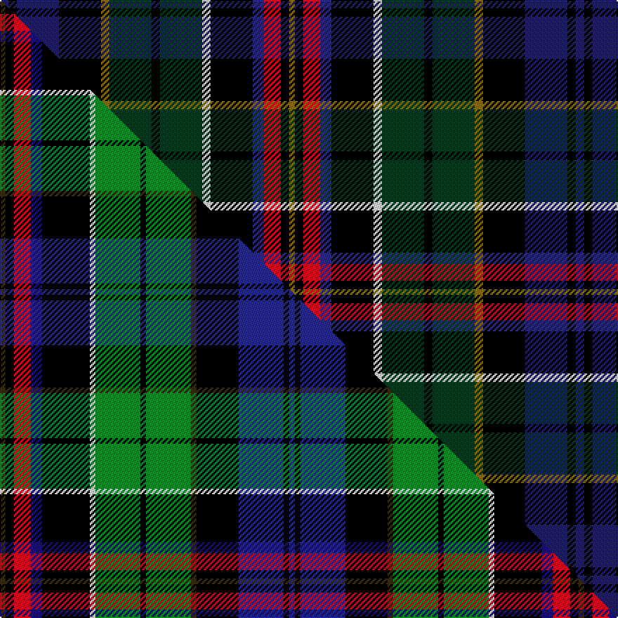

This is one **variant** — a specific cloth: this exact thread count and colourway, with its own
provenance below. It is one weaving of the [sett](/setts/db3k3db15k15y3dg15k3dg15w3k15dbi4r6k3y2/) (the scale-free proportion — the
same cloth at any scale or shade), whose colour order is pattern [BKBKGGKGWKBRKG](/stripes/bkbkggkgwkbrkg/).

Part of the [Allison](/tartans/allison-3/) tartan — the named design grouping this sett with its other cloths.

Sourced from house-of-tartan.  It is a [14 stripe tartan](/stripes/stripes14/).

Original link [http://www.house-of-tartan.scotland.net/house/TartanViewjs.asp?colr=Def&tnam=314](http://www.house-of-tartan.scotland.net/house/TartanViewjs.asp?colr=Def&tnam=314)

## Provenance

Earliest known date: 1880 This sample comes from the MacGregor-Hastie collection which forms the basis of the cloth archive of the Scottish Tartans Society. First recorded in the Clans Originaux in 1880.

Dataset <small>— provenance for this record, inherited from the source manifest</small>

<dl class="dataset-prov">
<dt>source</dt><dd><a href="/sources/house-of-tartan/">House of Tartan</a></dd>
<dt>data captured from</dt><dd><a href="https://github.com/thetartan/tartan-database/blob/master/data/house-of-tartan/data.csv">https://github.com/thetartan/tartan-database/blob/master/data/house-of-tartan/data.csv</a></dd>
<dt>data date</dt><dd>1880 <small>(this record)</small></dd>
<dt>licence</dt><dd><a href="https://creativecommons.org/licenses/by-nc-nd/4.0/">CC BY-NC-ND 4.0</a></dd>
</dl>

Capture chain <small>— the hands this data passed through, oldest first; each capture carries its own licence</small>

<ol class="capture-chain">
<li><a href="http://www.house-of-tartan.scotland.net/">House of Tartan</a> <small>the weaver/retailer's database — the site is now offline; the URL is kept as the ultimate source's identity</small></li>
<li><a href="https://github.com/thetartan/tartan-database">thetartan/tartan-database</a> <small>2016-2017</small> · <a href="https://creativecommons.org/licenses/by-nc-nd/4.0/">CC BY-NC-ND 4.0</a> <small>Levko Kravets's frozen compilation — the capture we vendored, and where its CC licence text came from</small></li>
<li>this dictionary <small>captured 2026-06-10 · commit 5bf86c7566</small> <small>each re-capture is a git commit to data/sources</small></li>
</ol>

## Thread count
DB/6 K6 DB30 K30 Y6 DG30 K6 DG30 W6 K30 DBi8 R12 K6 Y/4

One full sett is **410 threads**.

## Palette
<table><thead><tr><th>Colour</th><th>Shade</th><th>OKLCh</th></tr></thead><tbody><tr><td>DB</td><td><code style="background-color:#2C2C80;">#2C2C80</code> <small style="color:#888">#2C2C80</small></td><td><small style="color:#888">oklch(35.0% 0.138 276.6)</small></td></tr><tr><td>DB</td><td><code style="background-color:#202060;">#202060</code> <small style="color:#888">#202060</small></td><td><small style="color:#888">oklch(28.9% 0.111 276.9)</small></td></tr><tr><td>DG</td><td><code style="background-color:#003820;">#003820</code> <small style="color:#888">#003820</small></td><td><small style="color:#888">oklch(30.0% 0.070 158.3)</small></td></tr><tr><td>DG</td><td><code style="background-color:#285800;">#285800</code> <small style="color:#888">#285800</small></td><td><small style="color:#888">oklch(41.0% 0.122 135.8)</small></td></tr><tr><td>K</td><td><code style="background-color:#000000;">#000000</code> <small style="color:#888">#000000</small></td><td><small style="color:#888">oklch(0.0% 0.000 0.0)</small></td></tr><tr><td>W</td><td><code style="background-color:#F7F7F7;">#F7F7F7</code> <small style="color:#888">#F7F7F7</small></td><td><small style="color:#888">oklch(97.6% 0.000 89.9)</small></td></tr><tr><td>R</td><td><code style="background-color:#D60020;">#D60020</code> <small style="color:#888">#D60020</small></td><td><small style="color:#888">oklch(55.2% 0.224 25.5)</small></td></tr><tr><td>Y</td><td><code style="background-color:#8B6E00;">#8B6E00</code> <small style="color:#888">#8B6E00</small></td><td><small style="color:#888">oklch(55.1% 0.113 90.4)</small></td></tr></tbody></table>

# Sample pattern

## Compared to the master

This cloth is one sett of its design; the master sett (the exemplar the design is anchored on) is below for comparison.

Its **ΔTartan distance** from the master is **2.45** — the same measure the nearest-tartans table ranks by (0 is identical; a re-scale of the same cloth is near 0, a recolour or a different proportion further).

<figure class="master-compare" style="margin:0">

this sett
master sett ★

<figcaption style="color:#888;font-size:smaller">One weave of this sett against the <a href="/setts/dy2k3r6db4k17w2g16k2g16dy2k15dbi16k2dbi2/">master sett ★</a>, split on the diagonal: a shared proportion runs seamlessly across it with only the shades shifting; a different proportion breaks on it.</figcaption>
</figure>

## Nearest tartan variants

The nearest existing variants by ΔTartan distance, with this cloth at the top so the swatches line up against it.

ΔTartan

Threads

Variant

Sett

—

410

<a href="/variants/s14/db3k3db15k15y3dg15k3dg15w3k15dbi4r6k3y2~x2~db1204274-dbi1406275/">Allison Family Tartan</a>

<a href="/ttd/edit/#slug=k21dg21k6lb4k6y4k6dg21k21db25lr4db6r4db21~lr2805035-r2109032&amp;base=db3k3db15k15y3dg15k3dg15w3k15dbi4r6k3y2~x2~db1204274-dbi1406275" title="compare in the TTD">1.67</a>

298

<a href="/variants/s14/k21dg21k6lb4k6y4k6dg21k21db25lr4db6r4db21~lr2805035-r2109032/">Malcolm (1840)</a>

<a href="/ttd/edit/#slug=r4y3g12k16dy5db20k4w2~x2&amp;base=db3k3db15k15y3dg15k3dg15w3k15dbi4r6k3y2~x2~db1204274-dbi1406275" title="compare in the TTD">2.04</a>

252

<a href="/variants/s8/r4y3g12k16dy5db20k4w2~x2/">Iowa</a>

<a href="/ttd/edit/#slug=g12k16dy5db20k4w2k4db20dy5k16g12y3r4y3~x2&amp;base=db3k3db15k15y3dg15k3dg15w3k15dbi4r6k3y2~x2~db1204274-dbi1406275" title="compare in the TTD">2.04</a>

474

<a href="/variants/s14/g12k16dy5db20k4w2k4db20dy5k16g12y3r4y3~x2/">Iowa American District Tartan</a>

<a href="/ttd/edit/#slug=db3k2db12k18g14k2g14k8y2k8lb4r4k2w3~x2&amp;base=db3k3db15k15y3dg15k3dg15w3k15dbi4r6k3y2~x2~db1204274-dbi1406275" title="compare in the TTD">2.23</a>

372

<a href="/variants/s14/db3k2db12k18g14k2g14k8y2k8lb4r4k2w3~x2/">Allison (MacBean and Bishop)</a>

<a href="/ttd/edit/#slug=db3k3db12k18g14k2g14k8y2k8lb4r4k2w3~x2&amp;base=db3k3db15k15y3dg15k3dg15w3k15dbi4r6k3y2~x2~db1204274-dbi1406275" title="compare in the TTD">2.23</a>

376

<a href="/variants/s14/db3k3db12k18g14k2g14k8y2k8lb4r4k2w3~x2/">Alison / Allison</a>

<a href="/ttd/edit/#slug=db11r3db2n3k12dg20y2k12db11ly3~x2&amp;base=db3k3db15k15y3dg15k3dg15w3k15dbi4r6k3y2~x2~db1204274-dbi1406275" title="compare in the TTD">2.32</a>

288

<a href="/variants/s10/db11r3db2n3k12dg20y2k12db11ly3~x2/">Wisconsin (US State)</a>

<a href="/ttd/edit/#slug=w3dy3k3g15db3dy3db8dy3y3dy18k3dy3k4dy3k18lb3~x2&amp;base=db3k3db15k15y3dg15k3dg15w3k15dbi4r6k3y2~x2~db1204274-dbi1406275" title="compare in the TTD">2.34</a>

372

<a href="/variants/s16/w3dy3k3g15db3dy3db8dy3y3dy18k3dy3k4dy3k18lb3~x2/">Innes Hunting Clan Tartan</a>

<a href="/ttd/edit/#slug=db11r3db2n3k12dg20y2k12db11ly3~x2~ly2705081&amp;base=db3k3db15k15y3dg15k3dg15w3k15dbi4r6k3y2~x2~db1204274-dbi1406275" title="compare in the TTD">2.43</a>

288

<a href="/variants/s10/db11r3db2n3k12dg20y2k12db11ly3~x2~ly2705081/">Wisconsin State American District Tartan</a>

<a href="/ttd/edit/#slug=dy2k3r6db4k17w2g16k2g16dy2k15dbi16k2dbi2~x2~db1106275-dbi1406275&amp;base=db3k3db15k15y3dg15k3dg15w3k15dbi4r6k3y2~x2~db1204274-dbi1406275" title="compare in the TTD">2.44</a>

412

<a href="/variants/s14/dy2k3r6db4k17w2g16k2g16dy2k15dbi16k2dbi2~x2~db1106275-dbi1406275/">Allison (MacGregor-Hastie)</a>

<a href="/ttd/edit/#slug=r2dg6db12k3lb3k3dg16k2dg2k2dg2k12y2~x2&amp;base=db3k3db15k15y3dg15k3dg15w3k15dbi4r6k3y2~x2~db1204274-dbi1406275" title="compare in the TTD">2.49</a>

260

<a href="/variants/s13/r2dg6db12k3lb3k3dg16k2dg2k2dg2k12y2~x2/">MacInnes (Clan)</a>

## Neighbour map

Every grey dot is one of 13621 variants placed by the first two principal components of the ΔTartan feature space (42% of its variance). Red is this tartan; blue dots are its nearest — click one to open its page.

<svg viewBox="0 0 640 380" role="img" style="max-width:100%;height:auto;border:1px solid #e0e0e0;border-radius:4px;display:block" xmlns="http://www.w3.org/2000/svg"><image href="/nn/cloud.v1.png" width="640" height="380"/><a href="/variants/s14/k21dg21k6lb4k6y4k6dg21k21db25lr4db6r4db21~lr2805035-r2109032/"><circle cx="84.7" cy="161.9" r="4" fill="#3465a4"><title>Malcolm (1840)</title></circle></a><a href="/variants/s8/r4y3g12k16dy5db20k4w2~x2/"><circle cx="56.1" cy="136.5" r="4" fill="#3465a4"><title>Iowa</title></circle></a><a href="/variants/s14/g12k16dy5db20k4w2k4db20dy5k16g12y3r4y3~x2/"><circle cx="56.1" cy="136.5" r="4" fill="#3465a4"><title>Iowa American District Tartan</title></circle></a><a href="/variants/s14/db3k2db12k18g14k2g14k8y2k8lb4r4k2w3~x2/"><circle cx="78.7" cy="126.1" r="4" fill="#3465a4"><title>Allison (MacBean and Bishop)</title></circle></a><a href="/variants/s14/db3k3db12k18g14k2g14k8y2k8lb4r4k2w3~x2/"><circle cx="80.2" cy="127.5" r="4" fill="#3465a4"><title>Alison / Allison</title></circle></a><a href="/variants/s10/db11r3db2n3k12dg20y2k12db11ly3~x2/"><circle cx="84.5" cy="153.5" r="4" fill="#3465a4"><title>Wisconsin (US State)</title></circle></a><a href="/variants/s16/w3dy3k3g15db3dy3db8dy3y3dy18k3dy3k4dy3k18lb3~x2/"><circle cx="56.2" cy="131.7" r="4" fill="#3465a4"><title>Innes Hunting Clan Tartan</title></circle></a><a href="/variants/s10/db11r3db2n3k12dg20y2k12db11ly3~x2~ly2705081/"><circle cx="92.0" cy="155.8" r="4" fill="#3465a4"><title>Wisconsin State American District Tartan</title></circle></a><a href="/variants/s14/dy2k3r6db4k17w2g16k2g16dy2k15dbi16k2dbi2~x2~db1106275-dbi1406275/"><circle cx="69.6" cy="123.3" r="4" fill="#3465a4"><title>Allison (MacGregor-Hastie)</title></circle></a><a href="/variants/s13/r2dg6db12k3lb3k3dg16k2dg2k2dg2k12y2~x2/"><circle cx="138.6" cy="148.3" r="4" fill="#3465a4"><title>MacInnes (Clan)</title></circle></a><circle cx="81.0" cy="142.7" r="5" fill="#c00000"/><text x="320" y="376" text-anchor="middle" font-size="11" fill="#999">ground</text><text x="11" y="190" text-anchor="middle" font-size="11" fill="#999" transform="rotate(-90 11 190)">complexity</text></svg>

ID: /variants/s14/db3k3db15k15y3dg15k3dg15w3k15dbi4r6k3y2~x2~db1204274-dbi1406275/
