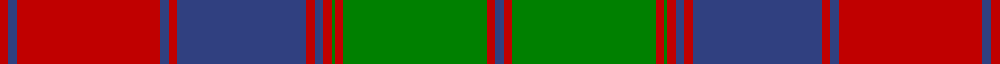

This page is one **sett** — a single exact thread-count. It belongs to the [tartan](/setts/db3r3g50r3g1r3db3r3db45r3db3r50db3r3/)
(the same proportion at any scale), whose colour order is pattern [BRGRGRBRBRBRBR](/stripes/brgrgrbrbrbrbr/).

Sourced from weddslist.  It is a [14 stripe tartan](/stripes/stripes14/).

Original link http://www.weddslist.com/cgi-bin/tartans/pg.pl?source=sts

## Thread count
R/6 B6 R100 B6 R6 B90 R6 B6 R6 G2 R6 G100 R6 B/6

One full sett is **692 threads**.

## Palette

Palette: <strong>custom</strong>
<table><thead><tr><th>Colour</th><th>Threads</th><th>Shade</th><th>Base</th><th>OKLCh</th></tr></thead><tbody><tr><td>R/</td><td style="text-align:right;font-variant-numeric:tabular-nums">6</td><td><code style="background-color:#C00000;">#C00000</code> <small style="color:#888">#C00000</small></td><td>R <code style="background-color:#CC0000;">#CC0000</code></td><td><small style="color:#888">oklch(50.7% 0.208 29.2)</small></td></tr><tr><td>B</td><td style="text-align:right;font-variant-numeric:tabular-nums">6</td><td><code style="background-color:#304080;">#304080</code> <small style="color:#888">#304080</small></td><td>B <code style="background-color:#2A418A;">#2A418A</code></td><td><small style="color:#888">oklch(39.4% 0.109 270.2)</small></td></tr><tr><td>R</td><td style="text-align:right;font-variant-numeric:tabular-nums">100</td><td><code style="background-color:#C00000;">#C00000</code> <small style="color:#888">#C00000</small></td><td>R <code style="background-color:#CC0000;">#CC0000</code></td><td><small style="color:#888">oklch(50.7% 0.208 29.2)</small></td></tr><tr><td>B</td><td style="text-align:right;font-variant-numeric:tabular-nums">6</td><td><code style="background-color:#304080;">#304080</code> <small style="color:#888">#304080</small></td><td>B <code style="background-color:#2A418A;">#2A418A</code></td><td><small style="color:#888">oklch(39.4% 0.109 270.2)</small></td></tr><tr><td>R</td><td style="text-align:right;font-variant-numeric:tabular-nums">6</td><td><code style="background-color:#C00000;">#C00000</code> <small style="color:#888">#C00000</small></td><td>R <code style="background-color:#CC0000;">#CC0000</code></td><td><small style="color:#888">oklch(50.7% 0.208 29.2)</small></td></tr><tr><td>B</td><td style="text-align:right;font-variant-numeric:tabular-nums">90</td><td><code style="background-color:#304080;">#304080</code> <small style="color:#888">#304080</small></td><td>B <code style="background-color:#2A418A;">#2A418A</code></td><td><small style="color:#888">oklch(39.4% 0.109 270.2)</small></td></tr><tr><td>R</td><td style="text-align:right;font-variant-numeric:tabular-nums">6</td><td><code style="background-color:#C00000;">#C00000</code> <small style="color:#888">#C00000</small></td><td>R <code style="background-color:#CC0000;">#CC0000</code></td><td><small style="color:#888">oklch(50.7% 0.208 29.2)</small></td></tr><tr><td>B</td><td style="text-align:right;font-variant-numeric:tabular-nums">6</td><td><code style="background-color:#304080;">#304080</code> <small style="color:#888">#304080</small></td><td>B <code style="background-color:#2A418A;">#2A418A</code></td><td><small style="color:#888">oklch(39.4% 0.109 270.2)</small></td></tr><tr><td>R</td><td style="text-align:right;font-variant-numeric:tabular-nums">6</td><td><code style="background-color:#C00000;">#C00000</code> <small style="color:#888">#C00000</small></td><td>R <code style="background-color:#CC0000;">#CC0000</code></td><td><small style="color:#888">oklch(50.7% 0.208 29.2)</small></td></tr><tr><td>G</td><td style="text-align:right;font-variant-numeric:tabular-nums">2</td><td><code style="background-color:#008000;">#008000</code> <small style="color:#888">#008000</small></td><td>G <code style="background-color:#006100;">#006100</code></td><td><small style="color:#888">oklch(52.0% 0.177 142.5)</small></td></tr><tr><td>R</td><td style="text-align:right;font-variant-numeric:tabular-nums">6</td><td><code style="background-color:#C00000;">#C00000</code> <small style="color:#888">#C00000</small></td><td>R <code style="background-color:#CC0000;">#CC0000</code></td><td><small style="color:#888">oklch(50.7% 0.208 29.2)</small></td></tr><tr><td>G</td><td style="text-align:right;font-variant-numeric:tabular-nums">100</td><td><code style="background-color:#008000;">#008000</code> <small style="color:#888">#008000</small></td><td>G <code style="background-color:#006100;">#006100</code></td><td><small style="color:#888">oklch(52.0% 0.177 142.5)</small></td></tr><tr><td>R</td><td style="text-align:right;font-variant-numeric:tabular-nums">6</td><td><code style="background-color:#C00000;">#C00000</code> <small style="color:#888">#C00000</small></td><td>R <code style="background-color:#CC0000;">#CC0000</code></td><td><small style="color:#888">oklch(50.7% 0.208 29.2)</small></td></tr><tr><td>B/</td><td style="text-align:right;font-variant-numeric:tabular-nums">6</td><td><code style="background-color:#304080;">#304080</code> <small style="color:#888">#304080</small></td><td>B <code style="background-color:#2A418A;">#2A418A</code></td><td><small style="color:#888">oklch(39.4% 0.109 270.2)</small></td></tr></tbody></table>

## Nearest tartans

The nearest existing variants by ΔTartan distance, with this tartan at the top so the swatches line up against it.

ΔTartan

Tartan

Sett

—

<a href="/ttd/edit/#slug=db3r3g50r3g1r3db3r3db45r3db3r50db3r3~x2">Culloden, Unidentified</a> <a class="nn-out" href="/variants/s14/db3r3g50r3g1r3db3r3db45r3db3r50db3r3~x2/" title="open its dictionary page">↗</a>

0.57

<a href="/ttd/edit/#slug=db3r3dg50r3dg1r3db3r3db45r3db3r50db3r3~x2&amp;base=db3r3g50r3g1r3db3r3db45r3db3r50db3r3~x2">Culloden Unidentified</a> <a class="nn-out" href="/variants/s14/db3r3dg50r3dg1r3db3r3db45r3db3r50db3r3~x2/" title="open its dictionary page">↗</a>

1.23

<a href="/ttd/edit/#slug=r9db4r89db4r4db80r9db9r4db4r4g80r4db4&amp;base=db3r3g50r3g1r3db3r3db45r3db3r50db3r3~x2">Fraser of Altyre</a> <a class="nn-out" href="/variants/s14/r9db4r89db4r4db80r9db9r4db4r4g80r4db4/" title="open its dictionary page">↗</a>

1.27

<a href="/ttd/edit/#slug=g2r3g2r52g2r2db28r2g42r2g2r3g2~x2&amp;base=db3r3g50r3g1r3db3r3db45r3db3r50db3r3~x2">MacQuarrie 3</a> <a class="nn-out" href="/variants/s13/g2r3g2r52g2r2db28r2g42r2g2r3g2~x2/" title="open its dictionary page">↗</a>

1.30

<a href="/ttd/edit/#slug=dg2r3dg2r52dg2r2db28r2dg42r2dg2r3dg2~x2&amp;base=db3r3g50r3g1r3db3r3db45r3db3r50db3r3~x2">MacQuarrie #3</a> <a class="nn-out" href="/variants/s13/dg2r3dg2r52dg2r2db28r2dg42r2dg2r3dg2~x2/" title="open its dictionary page">↗</a>

1.43

<a href="/ttd/edit/#slug=r3g50r3g1r3t3r3t45r3t3r50t3r3t3r50t3r3t45r3t3r3g1r3g50r3t3~x2&amp;base=db3r3g50r3g1r3db3r3db45r3db3r50db3r3~x2">Not Specified</a> <a class="nn-out" href="/variants/s26/r3g50r3g1r3t3r3t45r3t3r50t3r3t3r50t3r3t45r3t3r3g1r3g50r3t3~x2/" title="open its dictionary page">↗</a>

1.45

<a href="/ttd/edit/#slug=r4db2r45db2r2db40r4db4r2db2r2g40r2db2~x2&amp;base=db3r3g50r3g1r3db3r3db45r3db3r50db3r3~x2">Fraser of Altyre</a> <a class="nn-out" href="/variants/s14/r4db2r45db2r2db40r4db4r2db2r2g40r2db2~x2/" title="open its dictionary page">↗</a>

1.46

<a href="/ttd/edit/#slug=dg2r3dg2r52dg2r2db28r2dg42r2dg2r3dg2&amp;base=db3r3g50r3g1r3db3r3db45r3db3r50db3r3~x2">MacQuarrie 1815</a> <a class="nn-out" href="/variants/s13/dg2r3dg2r52dg2r2db28r2dg42r2dg2r3dg2/" title="open its dictionary page">↗</a>

1.48

<a href="/ttd/edit/#slug=g36t2m2t2m2t2m30dg1m1dg4~x2&amp;base=db3r3g50r3g1r3db3r3db45r3db3r50db3r3~x2">Connaught (Lochcarron)</a> <a class="nn-out" href="/variants/s10/g36t2m2t2m2t2m30dg1m1dg4~x2/" title="open its dictionary page">↗</a>

1.51

<a href="/ttd/edit/#slug=dg6r2dg2r24t1db1r2db12r2db1t1r2dg24r2~x2&amp;base=db3r3g50r3g1r3db3r3db45r3db3r50db3r3~x2">Unidentified Coat</a> <a class="nn-out" href="/variants/s14/dg6r2dg2r24t1db1r2db12r2db1t1r2dg24r2~x2/" title="open its dictionary page">↗</a>

1.51

<a href="/ttd/edit/#slug=ri2r6g4r70g4r2dp21r2g85r2g4r6ri2&amp;base=db3r3g50r3g1r3db3r3db45r3db3r50db3r3~x2">Crieff</a> <a class="nn-out" href="/variants/s13/ri2r6g4r70g4r2dp21r2g85r2g4r6ri2/" title="open its dictionary page">↗</a>

## Neighbour map

Every grey dot is one of 14360 variants placed by the first two principal components of the ΔTartan feature space (44% of its variance). Red is this tartan; blue dots are its nearest — click one to open its page.

<svg viewBox="0 0 640 380" role="img" style="max-width:100%;height:auto;border:1px solid #e0e0e0;border-radius:4px;display:block" xmlns="http://www.w3.org/2000/svg"><image href="/nn/cloud.v1.png" width="640" height="380"/><a href="/variants/s14/db3r3dg50r3dg1r3db3r3db45r3db3r50db3r3~x2/"><circle cx="334.1" cy="93.2" r="4" fill="#3465a4"><title>Culloden Unidentified</title></circle></a><a href="/variants/s14/r9db4r89db4r4db80r9db9r4db4r4g80r4db4/"><circle cx="309.8" cy="125.1" r="4" fill="#3465a4"><title>Fraser of Altyre</title></circle></a><a href="/variants/s13/g2r3g2r52g2r2db28r2g42r2g2r3g2~x2/"><circle cx="341.7" cy="118.2" r="4" fill="#3465a4"><title>MacQuarrie 3</title></circle></a><a href="/variants/s13/dg2r3dg2r52dg2r2db28r2dg42r2dg2r3dg2~x2/"><circle cx="341.2" cy="115.2" r="4" fill="#3465a4"><title>MacQuarrie #3</title></circle></a><a href="/variants/s26/r3g50r3g1r3t3r3t45r3t3r50t3r3t3r50t3r3t45r3t3r3g1r3g50r3t3~x2/"><circle cx="326.5" cy="73.5" r="4" fill="#3465a4"><title>Not Specified</title></circle></a><a href="/variants/s14/r4db2r45db2r2db40r4db4r2db2r2g40r2db2~x2/"><circle cx="310.9" cy="123.4" r="4" fill="#3465a4"><title>Fraser of Altyre</title></circle></a><a href="/variants/s13/dg2r3dg2r52dg2r2db28r2dg42r2dg2r3dg2/"><circle cx="349.1" cy="126.4" r="4" fill="#3465a4"><title>MacQuarrie 1815</title></circle></a><a href="/variants/s10/g36t2m2t2m2t2m30dg1m1dg4~x2/"><circle cx="348.8" cy="108.8" r="4" fill="#3465a4"><title>Connaught (Lochcarron)</title></circle></a><a href="/variants/s14/dg6r2dg2r24t1db1r2db12r2db1t1r2dg24r2~x2/"><circle cx="297.4" cy="109.1" r="4" fill="#3465a4"><title>Unidentified Coat</title></circle></a><a href="/variants/s13/ri2r6g4r70g4r2dp21r2g85r2g4r6ri2/"><circle cx="376.5" cy="83.9" r="4" fill="#3465a4"><title>Crieff</title></circle></a><circle cx="333.7" cy="95.2" r="5" fill="#c00000"/></svg>

ID: /variants/s14/db3r3g50r3g1r3db3r3db45r3db3r50db3r3~x2/
