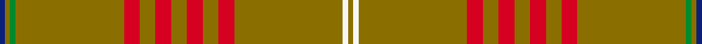
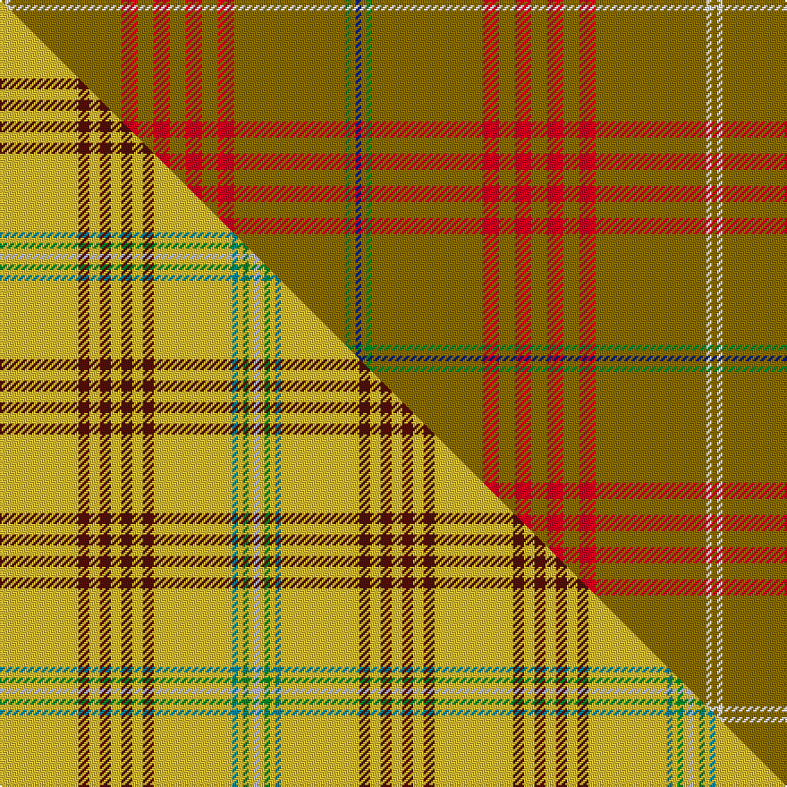

This page is one **sett** — a single exact thread-count. It belongs to the [tartan](/setts/db3y3g3y62r9y9r9y9r9y9r9y62w3y3/)
(the same proportion at any scale), whose colour order is pattern [BGGGRGRGRGRGWG](/stripes/bgggrgrgrgrgwg/).

Part of the [Catalan](/tartans/catalan/) tartan — the named design grouping this sett with its other cloths.

Sourced from weddslist.  It is a [14 stripe tartan](/stripes/stripes14/).

Original link http://www.weddslist.com/cgi-bin/tartans/pg.pl?source=sts

## Provenance

Earliest known date: 1991 The 10th century Compte de Barcelona, Guifre Pilos, with his dying breath brushed his four bloodstained fingers down his shield leaving four vertical stripes creating the heraldic device of Catalunya. Later the stripes were turned sideways for the Bandera. (flag). The tartan also incorporates white for the snow, green for the flora and blue for the Mediterranean Sea. It was first seen at the Barcelona Olympic Games, 1992.

2 attestations — the source records this cloth was collapsed from (oldest owns this page)

<ul>
<li>undated — Catalan (weddslist, <a href="http://www.weddslist.com/cgi-bin/tartans/pg.pl?source=sts">record</a>) </li>
<li>undated — Catalan District Tartan (house-of-tartan, <a href="http://www.house-of-tartan.scotland.net/house/TartanViewjs.asp?colr=Def&tnam=2071">record</a>) </li>
</ul>

## Thread count
Y/3 W3 Y62 R9 Y9 R9 Y9 R9 Y9 R9 Y62 G3 Y3 DB/3

One full sett is **398 threads**.

## Palette
<table><thead><tr><th>Colour</th><th>Shade</th><th>OKLCh</th></tr></thead><tbody><tr><td>DB</td><td><code style="background-color:#082077;">#082077</code> <small style="color:#888">#082077</small></td><td><small style="color:#888">oklch(30.0% 0.149 265.1)</small></td></tr><tr><td>G</td><td><code style="background-color:#008B2A;">#008B2A</code> <small style="color:#888">#008B2A</small></td><td><small style="color:#888">oklch(55.4% 0.170 145.9)</small></td></tr><tr><td>W</td><td><code style="background-color:#F7F7F7;">#F7F7F7</code> <small style="color:#888">#F7F7F7</small></td><td><small style="color:#888">oklch(97.6% 0.000 89.9)</small></td></tr><tr><td>R</td><td><code style="background-color:#D60020;">#D60020</code> <small style="color:#888">#D60020</small></td><td><small style="color:#888">oklch(55.2% 0.224 25.5)</small></td></tr><tr><td>Y</td><td><code style="background-color:#8B6E00;">#8B6E00</code> <small style="color:#888">#8B6E00</small></td><td><small style="color:#888">oklch(55.1% 0.113 90.4)</small></td></tr></tbody></table>

# Sample pattern

## Compared to the master

This cloth is one sett of its design; the master sett (the exemplar the design is anchored on) is below for comparison.

Its **ΔTartan distance** from the master is **4.32** — the same measure the nearest-tartans table ranks by (0 is identical; a re-scale of the same cloth is near 0, a recolour or a different proportion further).

<figure class="master-compare" style="margin:0">

this sett
master sett ★

<figcaption style="color:#888;font-size:smaller">One weave of this sett against the <a href="/setts/ly44dr6ly6dr6ly6dr6ly6dr6ly44t3ly3g3ly3lb3/">master sett ★</a>, split on the diagonal: a shared proportion runs seamlessly across it with only the shades shifting; a different proportion breaks on it.</figcaption>
</figure>

ID: /variants/s14/db3y3g3y62r9y9r9y9r9y9r9y62w3y3/
