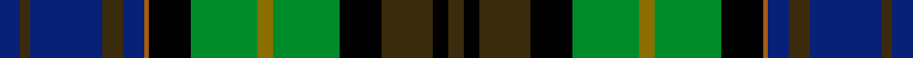

This page is one **sett** — a single exact thread-count. It belongs to the [tartan](/setts/db4dy2db14dy4db4o1k8g13y3g13k8dy10k3dy3/)
(the same proportion at any scale), whose colour order is pattern [BGBGBRKGGGKGKG](/stripes/bgbgbrkgggkgkg/).

Sourced from register-of-tartans.  It is a [14 stripe tartan](/stripes/stripes14/).

Original link https://www.tartanregister.gov.uk/tartanDetails.aspx?ref=11520

## Register references

External register numbers recorded for this tartan.

- Scottish Register of Tartans: [11520](https://www.tartanregister.gov.uk/tartanDetails.aspx?ref=11520)

## Thread count
DB/8 DY4 DB28 DY8 DB8 O2 K16 G26 Y6 G26 K16 DY20 K6 DY/6

One full sett is **346 threads**.

## Palette
<table><thead><tr><th>Colour</th><th>Shade</th><th>OKLCh</th></tr></thead><tbody><tr><td>DG</td><td><code style="background-color:#008B2A;">#008B2A</code> <small style="color:#888">#008B2A</small></td><td><small style="color:#888">oklch(55.4% 0.170 145.9)</small></td></tr><tr><td>K</td><td><code style="background-color:#000000;">#000000</code> <small style="color:#888">#000000</small></td><td><small style="color:#888">oklch(0.0% 0.000 0.0)</small></td></tr><tr><td>N</td><td><code style="background-color:#082077;">#082077</code> <small style="color:#888">#082077</small></td><td><small style="color:#888">oklch(30.0% 0.149 265.1)</small></td></tr><tr><td>P</td><td><code style="background-color:#A65C11;">#A65C11</code> <small style="color:#888">#A65C11</small></td><td><small style="color:#888">oklch(55.0% 0.125 58.3)</small></td></tr><tr><td>T</td><td><code style="background-color:#3A2B0D;">#3A2B0D</code> <small style="color:#888">#3A2B0D</small></td><td><small style="color:#888">oklch(30.0% 0.049 82.0)</small></td></tr><tr><td>Y</td><td><code style="background-color:#8B6E00;">#8B6E00</code> <small style="color:#888">#8B6E00</small></td><td><small style="color:#888">oklch(55.1% 0.113 90.4)</small></td></tr></tbody></table>

# Sample pattern

ID: /variants/s14/db4dy2db14dy4db4o1k8g13y3g13k8dy10k3dy3~x2/
