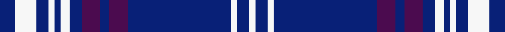

This page is one **sett** — a single exact thread-count. It belongs to the [tartan](/setts/db5w7db4w2db2w3db4dp6db3dp6db34w2db4w2/)
(the same proportion at any scale), whose colour order is pattern [BWBWBWBBBBBWBW](/stripes/bwbwbwbbbbbwbw/).

Sourced from register-of-tartans.  It is a [14 stripe tartan](/stripes/stripes14/).

Original link https://www.tartanregister.gov.uk/tartanDetails.aspx?ref=10823

2 attestations — the source records this cloth was collapsed from (oldest owns this page)

<ul>
<li>23/04/2013 — Majewski-White (Personal) (register-of-tartans, <a href="https://www.tartanregister.gov.uk/tartanDetails.aspx?ref=10823">record</a>)  <em>Designed by Joe White for himself and his partner and their immediate family, this tartan is based on the Ross Hunting STR ref #3560. Colours: navy blue, the base colour for this tartan, is the corporate colour of Rolls-Royce which represents both an industry they are passionate about as well as where they met; purple links to their universities: Loughborough and Glasgow; white is for the designer’s surname.</em></li>
<li>23/04/2013 — Majewski-White (Personal) (tartans-authority, <a href="http://www.tartansauthority.com/tartan-ferret/display/10823/">record</a>)  <em>Designed by Joe White for himself and his partner and their immediate family, this tartan is based on the Ross Hunting STR ref #3560. Colours: navy blue, the base colour for this tartan, is the corporate colour of Rolls-Royce which represents both an industry they are passionate about as well as where they met; purple links to their universities: Loughborough and Glasgow; white is for the designer?s surname.</em></li>
</ul>

## Register references

External register numbers recorded for this tartan.

- Scottish Register of Tartans: [10823](https://www.tartanregister.gov.uk/tartanDetails?ref=10823)
- Scottish Tartans Authority (ITI): 10823

## Thread count
DB/10 W14 DB8 W4 DB4 W6 DB8 DP12 DB6 DP12 DB68 W4 DB8 W/4

One full sett is **322 threads**.

## Palette
<table><thead><tr><th>Colour</th><th>Shade</th><th>OKLCh</th></tr></thead><tbody><tr><td>DB</td><td><code style="background-color:#082077;">#082077</code> <small style="color:#888">#082077</small></td><td><small style="color:#888">oklch(30.0% 0.149 265.1)</small></td></tr><tr><td>P</td><td><code style="background-color:#4B0B4F;">#4B0B4F</code> <small style="color:#888">#4B0B4F</small></td><td><small style="color:#888">oklch(30.1% 0.125 325.4)</small></td></tr><tr><td>W</td><td><code style="background-color:#F7F7F7;">#F7F7F7</code> <small style="color:#888">#F7F7F7</small></td><td><small style="color:#888">oklch(97.6% 0.000 89.9)</small></td></tr></tbody></table>

# Sample pattern

ID: /variants/s14/db5w7db4w2db2w3db4dp6db3dp6db34w2db4w2~x2/
