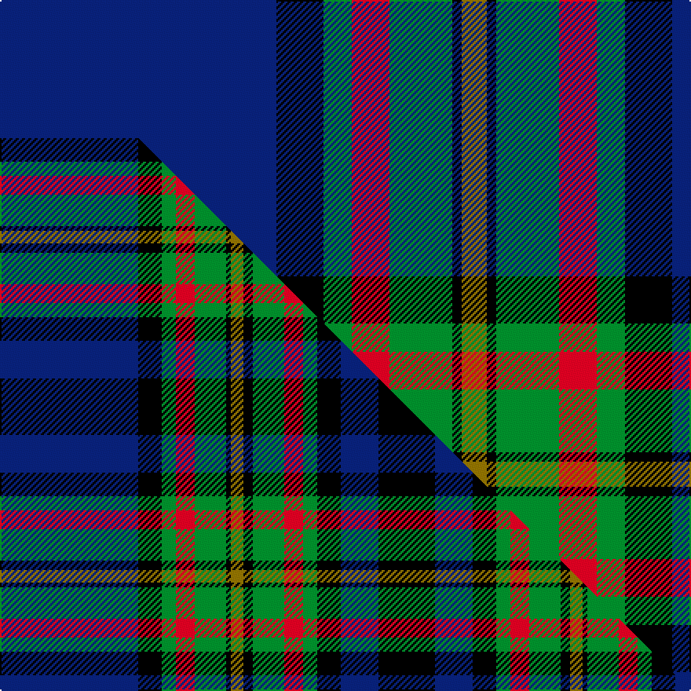

This page is one **sett** — a single exact thread-count. It belongs to the [tartan](/setts/db88k15g9r12g20k3y8k3g20r12g9k15db24k36/)
(the same proportion at any scale), whose colour order is pattern [BKGRGKGKGRGKBK](/stripes/bkgrgkgkgrgkbk/).

Part of the [Gillies](/tartans/gillies-2/) tartan — the named design grouping this sett with its other cloths.

Sourced from weddslist.  It is a [14 stripe tartan](/stripes/stripes14/).

Original link http://www.weddslist.com/cgi-bin/tartans/pg.pl?source=sts

## Thread count
DB/176 K30 G18 R24 G40 K6 Y16 K6 G40 R24 G18 K30 DB48 K/72

One full sett is **848 threads**.

## Palette
<table><thead><tr><th>Colour</th><th>Shade</th><th>OKLCh</th></tr></thead><tbody><tr><td>DB</td><td><code style="background-color:#082077;">#082077</code> <small style="color:#888">#082077</small></td><td><small style="color:#888">oklch(30.0% 0.149 265.1)</small></td></tr><tr><td>G</td><td><code style="background-color:#008B2A;">#008B2A</code> <small style="color:#888">#008B2A</small></td><td><small style="color:#888">oklch(55.4% 0.170 145.9)</small></td></tr><tr><td>K</td><td><code style="background-color:#000000;">#000000</code> <small style="color:#888">#000000</small></td><td><small style="color:#888">oklch(0.0% 0.000 0.0)</small></td></tr><tr><td>R</td><td><code style="background-color:#D60020;">#D60020</code> <small style="color:#888">#D60020</small></td><td><small style="color:#888">oklch(55.2% 0.224 25.5)</small></td></tr><tr><td>Y</td><td><code style="background-color:#8B6E00;">#8B6E00</code> <small style="color:#888">#8B6E00</small></td><td><small style="color:#888">oklch(55.1% 0.113 90.4)</small></td></tr></tbody></table>

# Sample pattern

## Compared to the master

This cloth is one sett of its design; the master sett (the exemplar the design is anchored on) is below for comparison.

Its **ΔTartan distance** from the master is **0.04** — the same measure the nearest-tartans table ranks by (0 is identical; a re-scale of the same cloth is near 0, a recolour or a different proportion further).

<figure class="master-compare" style="margin:0">

this sett
master sett ★

<figcaption style="color:#888;font-size:smaller">One weave of this sett against the <a href="/setts/db88k15g9r12g20k3y8k6g20r12g9k15db24k36/">master sett ★</a>, split on the diagonal: a shared proportion runs seamlessly across it with only the shades shifting; a different proportion breaks on it.</figcaption>
</figure>

## Nearest tartan variants

The nearest existing variants by ΔTartan distance, with this cloth at the top so the swatches line up against it.

ΔTartan

Threads

Variant

Sett

—

848

<a href="/variants/s14/db88k15g9r12g20k3y8k3g20r12g9k15db24k36~x2/">Gillies</a>

<a href="/ttd/edit/#slug=db88k15g9r12g20k3y8k6g20r12g9k15db24k36&amp;base=db88k15g9r12g20k3y8k3g20r12g9k15db24k36~x2" title="compare in the TTD">0.04</a>

430

<a href="/variants/s14/db88k15g9r12g20k3y8k6g20r12g9k15db24k36/">Gillies</a>

<a href="/ttd/edit/#slug=db20r2db3r6db32r2k32w2g30r6g4r2g4w1~x2&amp;base=db88k15g9r12g20k3y8k3g20r12g9k15db24k36~x2" title="compare in the TTD">1.20</a>

542

<a href="/variants/s14/db20r2db3r6db32r2k32w2g30r6g4r2g4w1~x2/">MacDonald of Clanranald #4</a>

<a href="/ttd/edit/#slug=db20k2g3k2db20r3k20r2k20r3g30y3g1y2~x2&amp;base=db88k15g9r12g20k3y8k3g20r12g9k15db24k36~x2" title="compare in the TTD">1.64</a>

480

<a href="/variants/s14/db20k2g3k2db20r3k20r2k20r3g30y3g1y2~x2/">Glynn of Glynstewart (Personal)</a>

<a href="/ttd/edit/#slug=db24k2db2k2db2k12g16k1r3k1g16k12db12k1w3~x2&amp;base=db88k15g9r12g20k3y8k3g20r12g9k15db24k36~x2" title="compare in the TTD">1.67</a>

382

<a href="/variants/s15/db24k2db2k2db2k12g16k1r3k1g16k12db12k1w3~x2/">Robertson Htg - 1816 (Clan)</a>

<a href="/ttd/edit/#slug=db24k2db2k2db2k12g16k1r2k1g16k12db12k1w3~x2&amp;base=db88k15g9r12g20k3y8k3g20r12g9k15db24k36~x2" title="compare in the TTD">1.69</a>

378

<a href="/variants/s15/db24k2db2k2db2k12g16k1r2k1g16k12db12k1w3~x2/">Robertson Hunting</a>

<a href="/ttd/edit/#slug=r3g2k1g2db26k12db4g15k1db1y3~x2&amp;base=db88k15g9r12g20k3y8k3g20r12g9k15db24k36~x2" title="compare in the TTD">1.80</a>

268

<a href="/variants/s11/r3g2k1g2db26k12db4g15k1db1y3~x2/">King (Personal)</a>

<a href="/ttd/edit/#slug=g19k1dg3k1g3k9db20k1y1k7y1k1db21k12g2dg1~x2~g2408144-dg1806142&amp;base=db88k15g9r12g20k3y8k3g20r12g9k15db24k36~x2" title="compare in the TTD">1.83</a>

372

<a href="/variants/s16/g19k1dg3k1g3k9db20k1y1k7y1k1db21k12g2dg1~x2~g2408144-dg1806142/">Hope Vere Family Tartan</a>

<a href="/ttd/edit/#slug=db22k3db3k3db3k15r2g19k1lb3k1g19r2k15db19k3db3~x2&amp;base=db88k15g9r12g20k3y8k3g20r12g9k15db24k36~x2" title="compare in the TTD">1.86</a>

494

<a href="/variants/s17/db22k3db3k3db3k15r2g19k1lb3k1g19r2k15db19k3db3~x2/">Sempill</a>

<a href="/ttd/edit/#slug=dp4db2g2dp2g12dp2k2dp1k10db25w2~x2&amp;base=db88k15g9r12g20k3y8k3g20r12g9k15db24k36~x2" title="compare in the TTD">1.86</a>

244

<a href="/variants/s11/dp4db2g2dp2g12dp2k2dp1k10db25w2~x2/">O'Reilly Irish Fashion Tartan</a>

<a href="/ttd/edit/#slug=db22g1db2g1db4k16ly1g16r2g16ly1k16db16g1~x2&amp;base=db88k15g9r12g20k3y8k3g20r12g9k15db24k36~x2" title="compare in the TTD">1.90</a>

414

<a href="/variants/s14/db22g1db2g1db4k16ly1g16r2g16ly1k16db16g1~x2/">Milne of Corstorphine #2 (Personal)</a>

## Neighbour map

Every grey dot is one of 13620 variants placed by the first two principal components of the ΔTartan feature space (42% of its variance). Red is this tartan; blue dots are its nearest — click one to open its page.

<svg viewBox="0 0 640 380" role="img" style="max-width:100%;height:auto;border:1px solid #e0e0e0;border-radius:4px;display:block" xmlns="http://www.w3.org/2000/svg"><image href="/nn/cloud.v1.png" width="640" height="380"/><a href="/variants/s14/db88k15g9r12g20k3y8k6g20r12g9k15db24k36/"><circle cx="183.6" cy="94.1" r="4" fill="#3465a4"><title>Gillies</title></circle></a><a href="/variants/s14/db20r2db3r6db32r2k32w2g30r6g4r2g4w1~x2/"><circle cx="168.6" cy="82.4" r="4" fill="#3465a4"><title>MacDonald of Clanranald #4</title></circle></a><a href="/variants/s14/db20k2g3k2db20r3k20r2k20r3g30y3g1y2~x2/"><circle cx="151.2" cy="92.0" r="4" fill="#3465a4"><title>Glynn of Glynstewart (Personal)</title></circle></a><a href="/variants/s15/db24k2db2k2db2k12g16k1r3k1g16k12db12k1w3~x2/"><circle cx="152.8" cy="101.4" r="4" fill="#3465a4"><title>Robertson Htg - 1816 (Clan)</title></circle></a><a href="/variants/s15/db24k2db2k2db2k12g16k1r2k1g16k12db12k1w3~x2/"><circle cx="156.6" cy="100.5" r="4" fill="#3465a4"><title>Robertson Hunting</title></circle></a><a href="/variants/s11/r3g2k1g2db26k12db4g15k1db1y3~x2/"><circle cx="217.7" cy="100.5" r="4" fill="#3465a4"><title>King (Personal)</title></circle></a><a href="/variants/s16/g19k1dg3k1g3k9db20k1y1k7y1k1db21k12g2dg1~x2~g2408144-dg1806142/"><circle cx="175.0" cy="97.1" r="4" fill="#3465a4"><title>Hope Vere Family Tartan</title></circle></a><a href="/variants/s17/db22k3db3k3db3k15r2g19k1lb3k1g19r2k15db19k3db3~x2/"><circle cx="152.4" cy="103.1" r="4" fill="#3465a4"><title>Sempill</title></circle></a><a href="/variants/s11/dp4db2g2dp2g12dp2k2dp1k10db25w2~x2/"><circle cx="204.8" cy="104.0" r="4" fill="#3465a4"><title>O'Reilly Irish Fashion Tartan</title></circle></a><a href="/variants/s14/db22g1db2g1db4k16ly1g16r2g16ly1k16db16g1~x2/"><circle cx="172.5" cy="116.9" r="4" fill="#3465a4"><title>Milne of Corstorphine #2 (Personal)</title></circle></a><circle cx="186.4" cy="92.8" r="5" fill="#c00000"/><text x="320" y="376" text-anchor="middle" font-size="11" fill="#999">ground</text><text x="11" y="190" text-anchor="middle" font-size="11" fill="#999" transform="rotate(-90 11 190)">complexity</text></svg>

ID: /variants/s14/db88k15g9r12g20k3y8k3g20r12g9k15db24k36~x2/
