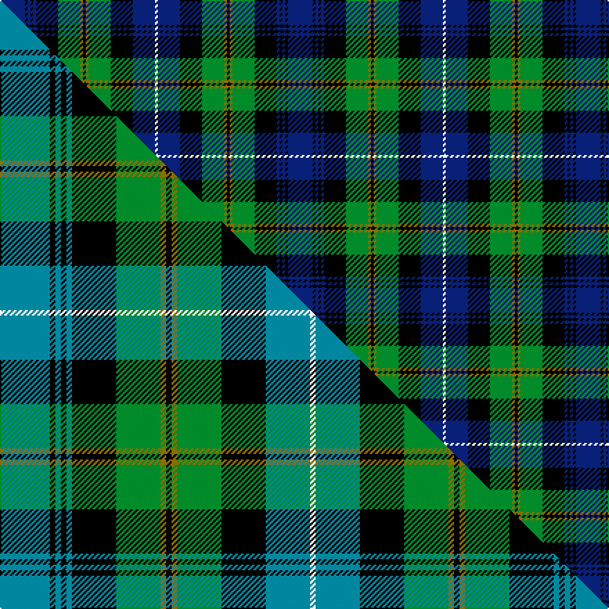

This is one **variant** — a specific cloth: this exact thread count and colourway, with its own
provenance below. It is one weaving of the [sett](/setts/db9k1db1k1db1k8g8y1k1y1g8k8db8w1/) (the scale-free proportion — the
same cloth at any scale or shade), whose colour order is pattern [BKBKBKGGKGGKBW](/stripes/bkbkbkggkggkbw/).

Part of the [Dyce](/tartans/d/dy/dyce-3/) tartan — the named design grouping this sett with its other cloths.

Sourced from house-of-tartan.  It is a [14 stripe tartan](/stripes/stripes14/).

Original link [http://www.house-of-tartan.scotland.net/house/TartanViewjs.asp?colr=Def&tnam=291](http://www.house-of-tartan.scotland.net/house/TartanViewjs.asp?colr=Def&tnam=291)

## Provenance

Earliest known date: 1906 From W & A.K. Johnston 1906. A Dyce appears in J Claude's 1880 pattern books 'Clans Originaux' which shows single black lines on the blue rather than the tramlines shown here. This is the modern accepted version as woven by The House of Edgar.

2 attestations — the source records this cloth was collapsed from (oldest owns this page)

<ul>
<li>1906 — Dyce Clan Tartan (house-of-tartan, <a href="http://www.house-of-tartan.scotland.net/house/TartanViewjs.asp?colr=Def&tnam=291">record</a>) </li>
<li>undated — Dyce (weddslist, <a href="http://www.weddslist.com/cgi-bin/tartans/pg.pl?source=sts">record</a>) </li>
</ul>

Dataset <small>— provenance for this record, inherited from the source manifest</small>

<dl class="dataset-prov">
<dt>source</dt><dd><a href="/sources/house-of-tartan/">House of Tartan</a></dd>
<dt>data captured from</dt><dd><a href="https://github.com/thetartan/tartan-database/blob/master/data/house-of-tartan/data.csv">https://github.com/thetartan/tartan-database/blob/master/data/house-of-tartan/data.csv</a></dd>
<dt>data date</dt><dd>1906 <small>(this record)</small></dd>
<dt>licence</dt><dd><a href="https://creativecommons.org/licenses/by-nc-nd/4.0/">CC BY-NC-ND 4.0</a></dd>
</dl>

Capture chain <small>— the hands this data passed through, oldest first; each capture carries its own licence</small>

<ol class="capture-chain">
<li><a href="http://www.house-of-tartan.scotland.net/">House of Tartan</a> <small>the weaver/retailer's database — the site is now offline; the URL is kept as the ultimate source's identity</small></li>
<li><a href="https://github.com/thetartan/tartan-database">thetartan/tartan-database</a> <small>2016-2017</small> · <a href="https://creativecommons.org/licenses/by-nc-nd/4.0/">CC BY-NC-ND 4.0</a> <small>Levko Kravets's frozen compilation — the capture we vendored, and where its CC licence text came from</small></li>
<li>this dictionary <small>captured 2026-06-10 · commit 5bf86c7566</small> <small>each re-capture is a git commit to data/sources</small></li>
</ol>

## Thread count
DB/18 K2 DB2 K2 DB2 K16 G16 Y2 K2 Y2 G16 K16 DB16 W/2

One full sett is **208 threads**.

## Palette
<table><thead><tr><th>Colour</th><th>Shade</th><th>OKLCh</th></tr></thead><tbody><tr><td>DB</td><td><code style="background-color:#082077;">#082077</code> <small style="color:#888">#082077</small></td><td><small style="color:#888">oklch(30.0% 0.149 265.1)</small></td></tr><tr><td>G</td><td><code style="background-color:#008B2A;">#008B2A</code> <small style="color:#888">#008B2A</small></td><td><small style="color:#888">oklch(55.4% 0.170 145.9)</small></td></tr><tr><td>K</td><td><code style="background-color:#000000;">#000000</code> <small style="color:#888">#000000</small></td><td><small style="color:#888">oklch(0.0% 0.000 0.0)</small></td></tr><tr><td>W</td><td><code style="background-color:#F7F7F7;">#F7F7F7</code> <small style="color:#888">#F7F7F7</small></td><td><small style="color:#888">oklch(97.6% 0.000 89.9)</small></td></tr><tr><td>Y</td><td><code style="background-color:#8B6E00;">#8B6E00</code> <small style="color:#888">#8B6E00</small></td><td><small style="color:#888">oklch(55.1% 0.113 90.4)</small></td></tr></tbody></table>

# Sample pattern

## Compared to the master

This cloth is one sett of its design; the master sett (the exemplar the design is anchored on) is below for comparison.

Its **ΔTartan distance** from the master is **0.16** — the same measure the nearest-tartans table ranks by (0 is identical; a re-scale of the same cloth is near 0, a recolour or a different proportion further).

<figure class="master-compare" style="margin:0">

this sett
master sett ★

<figcaption style="color:#888;font-size:smaller">One weave of this sett against the <a href="/setts/t9k1t1k1t1k8g8y1k1y1g8k8t8w1/">master sett ★</a>, split on the diagonal: a shared proportion runs seamlessly across it with only the shades shifting; a different proportion breaks on it.</figcaption>
</figure>

## Nearest tartan variants

The nearest existing variants by ΔTartan distance, with this cloth at the top so the swatches line up against it.

ΔTartan

Threads

Variant

Sett

—

208

<a href="/variants/s14/db9k1db1k1db1k8g8y1k1y1g8k8db8w1~x2/">Dyce Clan Tartan</a>

<a href="/ttd/edit/#slug=t9k1t1k1t1k8g8y1k1y1g8k8t8w1~x4&amp;base=db9k1db1k1db1k8g8y1k1y1g8k8db8w1~x2" title="compare in the TTD">0.16</a>

416

<a href="/variants/s14/t9k1t1k1t1k8g8y1k1y1g8k8t8w1~x4/">Dyce</a>

<a href="/ttd/edit/#slug=g1k1g8k8db8r1db8k8g1k1g1k1g3w1~x2&amp;base=db9k1db1k1db1k8g8y1k1y1g8k8db8w1~x2" title="compare in the TTD">1.00</a>

200

<a href="/variants/s14/g1k1g8k8db8r1db8k8g1k1g1k1g3w1~x2/">Urquhart (Brydone)</a>

<a href="/ttd/edit/#slug=r5k3db25k25g25k3w3k6w3k3g25k25db25k3g5~x2&amp;base=db9k1db1k1db1k8g8y1k1y1g8k8db8w1~x2" title="compare in the TTD">1.04</a>

716

<a href="/variants/s15/r5k3db25k25g25k3w3k6w3k3g25k25db25k3g5~x2/">Stephenson, hunting</a>

<a href="/ttd/edit/#slug=r5k3db25k25g25k3w3k6w3k3g25k25db25k3g5&amp;base=db9k1db1k1db1k8g8y1k1y1g8k8db8w1~x2" title="compare in the TTD">1.04</a>

358

<a href="/variants/s15/r5k3db25k25g25k3w3k6w3k3g25k25db25k3g5/">Stephenson Hunting Tartan</a>

<a href="/ttd/edit/#slug=db23k2dr2k2dr2k16g17k2g17k15db17k2r2~x2&amp;base=db9k1db1k1db1k8g8y1k1y1g8k8db8w1~x2" title="compare in the TTD">1.08</a>

426

<a href="/variants/s13/db23k2dr2k2dr2k16g17k2g17k15db17k2r2~x2/">The Red Hackle</a>

<a href="/ttd/edit/#slug=g26k4g6r4g6k26db26k3w7k3db26k26g26k3r7~x2&amp;base=db9k1db1k1db1k8g8y1k1y1g8k8db8w1~x2" title="compare in the TTD">1.35</a>

730

<a href="/variants/s15/g26k4g6r4g6k26db26k3w7k3db26k26g26k3r7~x2/">MacRae Hunting (Wilsons)</a>

<a href="/ttd/edit/#slug=db6k1db1k1db1k7g6y1g1n1g1y1g6k7db7k1db1~x4~db0805267-n1604274&amp;base=db9k1db1k1db1k8g8y1k1y1g8k8db8w1~x2" title="compare in the TTD">1.45</a>

372

<a href="/variants/s17/db6k1db1k1db1k7g6y1g1dbi1g1y1g6k7db7k1db1~x4~db0805267-dbi1604274/">Polaris</a>

<a href="/ttd/edit/#slug=db16k2db2k2db2k12g12y2k2y2g12k16db16k1w3~x2&amp;base=db9k1db1k1db1k8g8y1k1y1g8k8db8w1~x2" title="compare in the TTD">1.47</a>

370

<a href="/variants/s15/db16k2db2k2db2k12g12y2k2y2g12k16db16k1w3~x2/">Dyce #2</a>

<a href="/ttd/edit/#slug=dr1db6k6g1t2g9t2g1k6db6dr1db1~x8&amp;base=db9k1db1k1db1k8g8y1k1y1g8k8db8w1~x2" title="compare in the TTD">1.49</a>

656

<a href="/variants/s12/dr1db6k6g1t2g9t2g1k6db6dr1db1~x8/">MacTaggart (Johnstons)</a>

<a href="/ttd/edit/#slug=db18k5g3r3g6k2y2k2g6r3g3k10db5k10&amp;base=db9k1db1k1db1k8g8y1k1y1g8k8db8w1~x2" title="compare in the TTD">1.51</a>

128

<a href="/variants/s14/db18k5g3r3g6k2y2k2g6r3g3k10db5k10/">MacClellan Clan Tartan</a>

## Neighbour map

Every grey dot is one of 13656 variants placed by the first two principal components of the ΔTartan feature space (42% of its variance). Red is this tartan; blue dots are its nearest — click one to open its page. The map is a flat projection of a many-dimensional space — [how to read it](/posts/neighbourhood-maps/).

<svg viewBox="0 0 640 380" role="img" style="max-width:100%;height:auto;border:1px solid #e0e0e0;border-radius:4px;display:block" xmlns="http://www.w3.org/2000/svg"><image href="/nn/cloud.v1.png" width="640" height="380"/><a href="/variants/s14/t9k1t1k1t1k8g8y1k1y1g8k8t8w1~x4/"><circle cx="104.4" cy="153.7" r="4" fill="#3465a4"><title>Dyce</title></circle></a><a href="/variants/s14/g1k1g8k8db8r1db8k8g1k1g1k1g3w1~x2/"><circle cx="123.8" cy="151.7" r="4" fill="#3465a4"><title>Urquhart (Brydone)</title></circle></a><a href="/variants/s15/r5k3db25k25g25k3w3k6w3k3g25k25db25k3g5~x2/"><circle cx="107.6" cy="148.9" r="4" fill="#3465a4"><title>Stephenson, hunting</title></circle></a><a href="/variants/s15/r5k3db25k25g25k3w3k6w3k3g25k25db25k3g5/"><circle cx="107.6" cy="148.9" r="4" fill="#3465a4"><title>Stephenson Hunting Tartan</title></circle></a><a href="/variants/s13/db23k2dr2k2dr2k16g17k2g17k15db17k2r2~x2/"><circle cx="127.0" cy="146.8" r="4" fill="#3465a4"><title>The Red Hackle</title></circle></a><a href="/variants/s15/g26k4g6r4g6k26db26k3w7k3db26k26g26k3r7~x2/"><circle cx="84.5" cy="153.5" r="4" fill="#3465a4"><title>MacRae Hunting (Wilsons)</title></circle></a><a href="/variants/s17/db6k1db1k1db1k7g6y1g1dbi1g1y1g6k7db7k1db1~x4~db0805267-dbi1604274/"><circle cx="109.7" cy="154.1" r="4" fill="#3465a4"><title>Polaris</title></circle></a><a href="/variants/s15/db16k2db2k2db2k12g12y2k2y2g12k16db16k1w3~x2/"><circle cx="133.6" cy="126.4" r="4" fill="#3465a4"><title>Dyce #2</title></circle></a><a href="/variants/s12/dr1db6k6g1t2g9t2g1k6db6dr1db1~x8/"><circle cx="97.0" cy="170.4" r="4" fill="#3465a4"><title>MacTaggart (Johnstons)</title></circle></a><a href="/variants/s14/db18k5g3r3g6k2y2k2g6r3g3k10db5k10/"><circle cx="113.0" cy="157.6" r="4" fill="#3465a4"><title>MacClellan Clan Tartan</title></circle></a><circle cx="113.1" cy="152.8" r="5" fill="#c00000"/><text x="320" y="376" text-anchor="middle" font-size="11" fill="#999">ground</text><text x="11" y="190" text-anchor="middle" font-size="11" fill="#999" transform="rotate(-90 11 190)">complexity</text></svg>

ID: /variants/s14/db9k1db1k1db1k8g8y1k1y1g8k8db8w1~x2/
