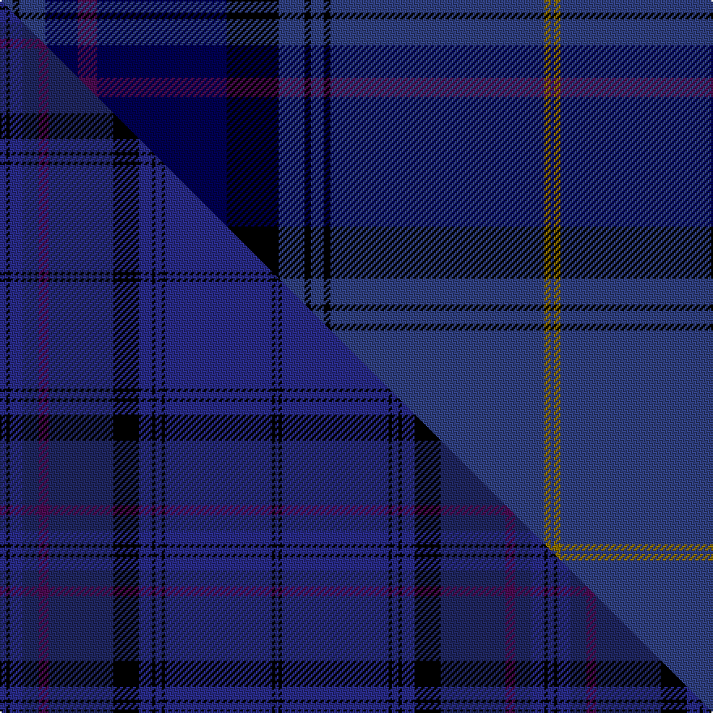

This page is one **sett** — a single exact thread-count. It belongs to the [tartan](/setts/dbi4k2dbi8db10dp6db40k16dbi8k2dbi4k2dbi66y2dbi1/)
(the same proportion at any scale), whose colour order is pattern [BGBKBKBKBBBBKB](/stripes/bgbkbkbkbbbbkb/).

Part of the [Payne](/tartans/payne/) tartan — the named design grouping this sett with its other cloths.

Sourced from weddslist.  It is a [14 stripe tartan](/stripes/stripes14/).

Original link http://www.weddslist.com/cgi-bin/tartans/pg.pl?source=sts

## Thread count
DBi/8 K4 DBi16 DB20 DP12 DB80 K32 DBi16 K4 DBi8 K4 DBi132 Y4 DBi/2

One full sett is **674 threads**.

## Palette
<table><thead><tr><th>Colour</th><th>Shade</th><th>OKLCh</th></tr></thead><tbody><tr><td>DB</td><td><code style="background-color:#304080;">#304080</code> <small style="color:#888">#304080</small></td><td><small style="color:#888">oklch(39.4% 0.109 270.2)</small></td></tr><tr><td>DB</td><td><code style="background-color:#000050;">#000050</code> <small style="color:#888">#000050</small></td><td><small style="color:#888">oklch(19.5% 0.135 264.1)</small></td></tr><tr><td>K</td><td><code style="background-color:#000000;">#000000</code> <small style="color:#888">#000000</small></td><td><small style="color:#888">oklch(0.0% 0.000 0.0)</small></td></tr><tr><td>DP</td><td><code style="background-color:#4B0B4F;">#4B0B4F</code> <small style="color:#888">#4B0B4F</small></td><td><small style="color:#888">oklch(30.1% 0.125 325.4)</small></td></tr><tr><td>Y</td><td><code style="background-color:#8B6E00;">#8B6E00</code> <small style="color:#888">#8B6E00</small></td><td><small style="color:#888">oklch(55.1% 0.113 90.4)</small></td></tr></tbody></table>

# Sample pattern

## Compared to the master

This cloth is one sett of its design; the master sett (the exemplar the design is anchored on) is below for comparison.

Its **ΔTartan distance** from the master is **2.48** — the same measure the nearest-tartans table ranks by (0 is identical; a re-scale of the same cloth is near 0, a recolour or a different proportion further).

<figure class="master-compare" style="margin:0">

this sett
master sett ★

<figcaption style="color:#888;font-size:smaller">One weave of this sett against the <a href="/setts/dbi2k1dbi4db5dp3db20k8dbi4k1dbi2k1dbi33k1dbi1/">master sett ★</a>, split on the diagonal: a shared proportion runs seamlessly across it with only the shades shifting; a different proportion breaks on it.</figcaption>
</figure>

## Nearest variants

The nearest existing variants by ΔTartan distance, with this cloth at the top so the swatches line up against it.

ΔTartan

Threads

Variant

Sett

—

674

<a href="/variants/s14/dbi4k2dbi8db10dp6db40k16dbi8k2dbi4k2dbi66y2dbi1~x2~dbi1604274-db0805267/">Payne</a>

0.50

—

<a href="/variants/s14/dbi2k1dbi4db5dp3db20k8dbi4k1dbi2k1dbi33ly1dbi1~x2~dbi1406275-db1204274/">Payne (Name)</a>

## Neighbour map

Every grey dot is one of 13620 variants placed by the first two principal components of the ΔTartan feature space (42% of its variance). Red is this tartan; blue dots are its nearest — click one to open its page.

<svg viewBox="0 0 640 380" role="img" style="max-width:100%;height:auto;border:1px solid #e0e0e0;border-radius:4px;display:block" xmlns="http://www.w3.org/2000/svg"><image href="/nn/cloud.v1.png" width="640" height="380"/><a href="/variants/s14/dbi2k1dbi4db5dp3db20k8dbi4k1dbi2k1dbi33ly1dbi1~x2~dbi1406275-db1204274/"><circle cx="422.7" cy="113.3" r="4" fill="#3465a4"><title>Payne (Name)</title></circle></a><circle cx="386.1" cy="79.7" r="5" fill="#c00000"/><text x="320" y="376" text-anchor="middle" font-size="11" fill="#999">ground</text><text x="11" y="190" text-anchor="middle" font-size="11" fill="#999" transform="rotate(-90 11 190)">complexity</text></svg>

ID: /variants/s14/dbi4k2dbi8db10dp6db40k16dbi8k2dbi4k2dbi66y2dbi1~x2~dbi1604274-db0805267/
