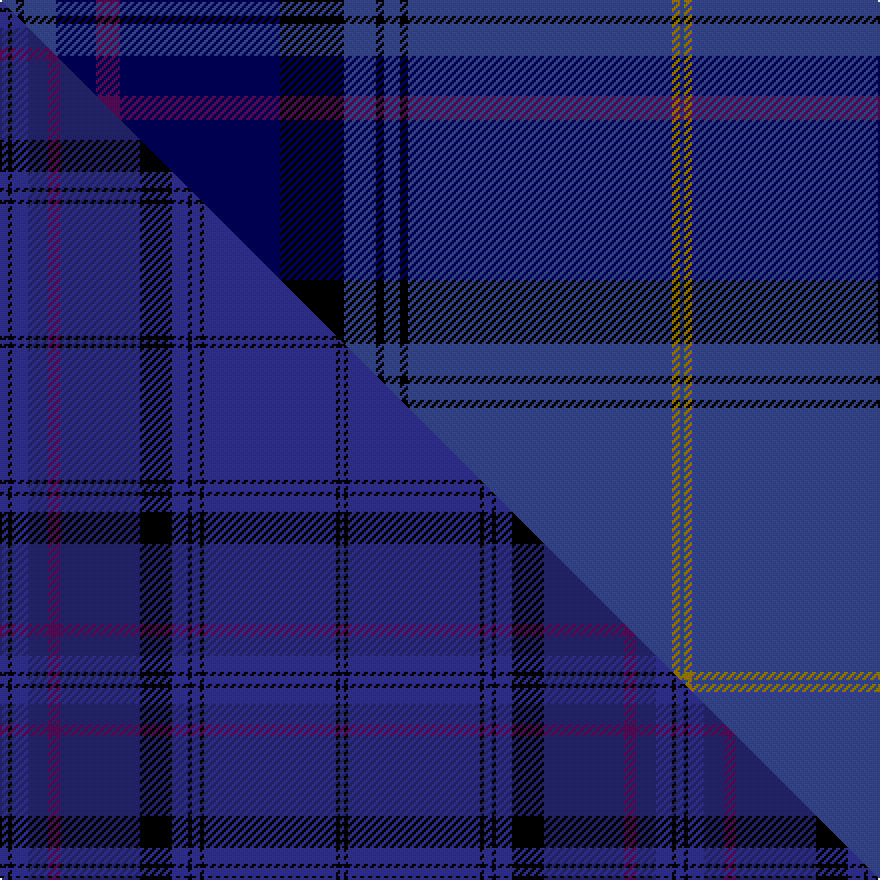

This is one **variant** — a specific cloth: this exact thread count and colourway, with its own
provenance below. It is one weaving of the [sett](/tartans/p/pa/payne/) (the scale-free proportion — the
same cloth at any scale or shade), whose colour order is pattern [BGBKBKBKBBBBKB](/stripes/bgbkbkbkbbbbkb/).

Part of the [Payne](/tartans/p/pa/payne/) tartan — the named design grouping this sett with its other cloths.

Sourced from weddslist.  It is a [14 stripe tartan](/stripes/stripes14/).

Original link [http://www.weddslist.com/cgi-bin/tartans/pg.pl?source=sts](http://www.weddslist.com/cgi-bin/tartans/pg.pl?source=sts)

Dataset <small>— provenance for this record, inherited from the source manifest</small>

<dl class="dataset-prov">
<dt>source</dt><dd><a href="/sources/weddslist/">Weddslist</a></dd>
<dt>data captured from</dt><dd><a href="https://github.com/thetartan/tartan-database/blob/master/data/weddslist/data.csv">https://github.com/thetartan/tartan-database/blob/master/data/weddslist/data.csv</a></dd>
<dt>data date</dt><dd>2016-11-17 <small>(dataset default)</small></dd>
<dt>licence</dt><dd><a href="https://creativecommons.org/licenses/by-nc-nd/4.0/">CC BY-NC-ND 4.0</a></dd>
</dl>

Capture chain <small>— the hands this data passed through, oldest first; each capture carries its own licence</small>

<ol class="capture-chain">
<li><a href="https://www.weddslist.com/tartans/">Weddslist</a> <small>the living privately compiled reference</small></li>
<li><a href="https://github.com/thetartan/tartan-database">thetartan/tartan-database</a> <small>2016-2017</small> · <a href="https://creativecommons.org/licenses/by-nc-nd/4.0/">CC BY-NC-ND 4.0</a> <small>Levko Kravets's frozen compilation — the capture we vendored, and where its CC licence text came from</small></li>
<li>this dictionary <small>captured 2026-06-10 · commit 5bf86c7566</small> <small>each re-capture is a git commit to data/sources</small></li>
</ol>

## Thread count
DBi/8 K4 DBi16 DB20 DP12 DB80 K32 DBi16 K4 DBi8 K4 DBi132 Y4 DBi/2

One full sett is **674 threads**.

## Palette
<table><thead><tr><th>Colour</th><th>Shade</th><th>OKLCh</th></tr></thead><tbody><tr><td>DB</td><td><code style="background-color:#304080;">#304080</code> <small style="color:#888">#304080</small></td><td><small style="color:#888">oklch(39.4% 0.109 270.2)</small></td></tr><tr><td>DB</td><td><code style="background-color:#000050;">#000050</code> <small style="color:#888">#000050</small></td><td><small style="color:#888">oklch(19.5% 0.135 264.1)</small></td></tr><tr><td>K</td><td><code style="background-color:#000000;">#000000</code> <small style="color:#888">#000000</small></td><td><small style="color:#888">oklch(0.0% 0.000 0.0)</small></td></tr><tr><td>DP</td><td><code style="background-color:#4B0B4F;">#4B0B4F</code> <small style="color:#888">#4B0B4F</small></td><td><small style="color:#888">oklch(30.1% 0.125 325.4)</small></td></tr><tr><td>Y</td><td><code style="background-color:#8B6E00;">#8B6E00</code> <small style="color:#888">#8B6E00</small></td><td><small style="color:#888">oklch(55.1% 0.113 90.4)</small></td></tr></tbody></table>

# Sample pattern

[Sample sheet (PDF)](swatch.pdf) — the woven sample, thread count and palette on one printable A4, rendered on demand (the same sheet the TTD print page downloads).

## Compared to the master

This cloth is one sett of its design; the master sett (the exemplar the design is anchored on) is below for comparison.

Its **ΔTartan distance** from the master is **0.82** — the same measure the nearest-tartans table ranks by (0 is identical; a re-scale of the same cloth is near 0, a recolour or a different proportion further).

<figure class="master-compare" style="margin:0">

this sett
master sett ★

<figcaption style="color:#888;font-size:smaller">One weave of this sett against the <a href="/setts/dbi2k1dbi4db5dp3db20k8dbi4k1dbi2k1dbi33k1dbi1/">master sett ★</a>, split on the diagonal: a shared proportion runs seamlessly across it with only the shades shifting; a different proportion breaks on it.</figcaption>
</figure>

## Nearest tartan variants

The nearest existing variants by ΔTartan distance, with this cloth at the top so the swatches line up against it.

ΔTartan

Threads

Variant

Sett

—

674

<a href="/variants/s14/dbi4k2dbi8db10dp6db40k16dbi8k2dbi4k2dbi66y2dbi1~x2~dbi3911270-db1913264/">Payne</a>

<a href="/ttd/edit/#slug=dbi2k1dbi4db5dp3db20k8dbi4k1dbi2k1dbi33ly1dbi1~x2~dbi3514276-db2911276&amp;base=dbi4k2dbi8db10dp6db40k16dbi8k2dbi4k2dbi66y2dbi1~x2~dbi3911270-db1913264" title="compare in the TTD">0.56</a>

338

<a href="/variants/s14/dbi2k1dbi4db5dp3db20k8dbi4k1dbi2k1dbi33ly1dbi1~x2~dbi3514276-db2911276/">Payne (Name)</a>

<a href="/ttd/edit/#slug=db2ki3db33k11ki3db3dp15db4lb1db2~x2~db3409246-ki1207288&amp;base=dbi4k2dbi8db10dp6db40k16dbi8k2dbi4k2dbi66y2dbi1~x2~dbi3911270-db1913264" title="compare in the TTD">2.93</a>

300

<a href="/variants/s10/db2ki3db33k11ki3db3dp15db4lb1db2~x2~db3409246-ki1207288/">Scottish Thistle</a>

<a href="/ttd/edit/#slug=db3n3db36dbi7k3dbi6g5k1y3~x2~db2616276-dbi3514276&amp;base=dbi4k2dbi8db10dp6db40k16dbi8k2dbi4k2dbi66y2dbi1~x2~dbi3911270-db1913264" title="compare in the TTD">3.11</a>

256

<a href="/variants/s9/db3n3db36dbi7k3dbi6g5k1y3~x2~db2616276-dbi3514276/">Incorporation of Weavers (Glasgow)</a>

<a href="/ttd/edit/#slug=db66k20dbi7n4dbi5n4dbi5n4dbi7k2lr6~db2508270-dbi3912267&amp;base=dbi4k2dbi8db10dp6db40k16dbi8k2dbi4k2dbi66y2dbi1~x2~dbi3911270-db1913264" title="compare in the TTD">3.65</a>

188

<a href="/variants/s11/db66k20dbi7n4dbi5n4dbi5n4dbi7k2lr6~db2508270-dbi3912267/">Muir Homes</a>

<a href="/ttd/edit/#slug=ki6w1ki40dp1k12dg12dp6dg2b2dg4~x2~ki1410264&amp;base=dbi4k2dbi8db10dp6db40k16dbi8k2dbi4k2dbi66y2dbi1~x2~dbi3911270-db1913264" title="compare in the TTD">3.67</a>

324

<a href="/variants/s10/ki6w1ki40dp1k12dg12dp6dg2b2dg4~x2~ki1410264/">Scotland the Brave</a>

<a href="/ttd/edit/#slug=dbi56dg11r2dg7k2dg7r2dg7db3lo4~x2~dbi3514276-db2911276&amp;base=dbi4k2dbi8db10dp6db40k16dbi8k2dbi4k2dbi66y2dbi1~x2~dbi3911270-db1913264" title="compare in the TTD">3.71</a>

284

<a href="/variants/s10/dbi56dg11r2dg7k2dg7r2dg7db3lo4~x2~dbi3514276-db2911276/">CAL FIRE Local 2881</a>

<a href="/ttd/edit/#slug=ki76db22k1y3k1db3k1w2k1db10~x2~ki1510264&amp;base=dbi4k2dbi8db10dp6db40k16dbi8k2dbi4k2dbi66y2dbi1~x2~dbi3911270-db1913264" title="compare in the TTD">3.71</a>

308

<a href="/variants/s10/ki76db22k1y3k1db3k1w2k1db10~x2~ki1510264/">Canberra, City of District Tartan</a>

<a href="/ttd/edit/#slug=dt4dp2dt22k2dt1db2dt1k2db24w2~x2&amp;base=dbi4k2dbi8db10dp6db40k16dbi8k2dbi4k2dbi66y2dbi1~x2~dbi3911270-db1913264" title="compare in the TTD">3.74</a>

236

<a href="/variants/s10/dt4dp2dt22k2dt1db2dt1k2db24w2~x2/">Spirit of Wales (Fashion)</a>

<a href="/ttd/edit/#slug=dg38k3dg3k3db6n1k2r2k2n1db6k3db3k3db19~x2&amp;base=dbi4k2dbi8db10dp6db40k16dbi8k2dbi4k2dbi66y2dbi1~x2~dbi3911270-db1913264" title="compare in the TTD">3.82</a>

266

<a href="/variants/s15/dg38k3dg3k3db6n1k2r2k2n1db6k3db3k3db19~x2/">Doyel (Name)</a>

<a href="/ttd/edit/#slug=db4n21db8k4db4dy4db9n9db38k1w3~x2&amp;base=dbi4k2dbi8db10dp6db40k16dbi8k2dbi4k2dbi66y2dbi1~x2~dbi3911270-db1913264" title="compare in the TTD">3.84</a>

406

<a href="/variants/s11/db4n21db8k4db4dy4db9n9db38k1w3~x2/">Connaught Ancestry (Fashion)</a>

## Neighbour map

Every grey dot is one of 13662 variants placed by the first two principal components of the ΔTartan feature space (42% of its variance). Red is this tartan; blue dots are its nearest — click one to open its page. The map is a flat projection of a many-dimensional space — [how to read it](/posts/neighbourhood-maps/).

<svg viewBox="0 0 640 380" role="img" style="max-width:100%;height:auto;border:1px solid #e0e0e0;border-radius:4px;display:block" xmlns="http://www.w3.org/2000/svg"><image href="/nn/cloud.v1.png" width="640" height="380"/><a href="/variants/s14/dbi2k1dbi4db5dp3db20k8dbi4k1dbi2k1dbi33ly1dbi1~x2~dbi3514276-db2911276/"><circle cx="422.3" cy="113.9" r="4" fill="#3465a4"><title>Payne (Name)</title></circle></a><a href="/variants/s10/db2ki3db33k11ki3db3dp15db4lb1db2~x2~db3409246-ki1207288/"><circle cx="377.7" cy="114.0" r="4" fill="#3465a4"><title>Scottish Thistle</title></circle></a><a href="/variants/s9/db3n3db36dbi7k3dbi6g5k1y3~x2~db2616276-dbi3514276/"><circle cx="371.3" cy="94.5" r="4" fill="#3465a4"><title>Incorporation of Weavers (Glasgow)</title></circle></a><a href="/variants/s11/db66k20dbi7n4dbi5n4dbi5n4dbi7k2lr6~db2508270-dbi3912267/"><circle cx="315.3" cy="89.8" r="4" fill="#3465a4"><title>Muir Homes</title></circle></a><a href="/variants/s10/ki6w1ki40dp1k12dg12dp6dg2b2dg4~x2~ki1410264/"><circle cx="346.8" cy="93.4" r="4" fill="#3465a4"><title>Scotland the Brave</title></circle></a><a href="/variants/s10/dbi56dg11r2dg7k2dg7r2dg7db3lo4~x2~dbi3514276-db2911276/"><circle cx="367.2" cy="92.4" r="4" fill="#3465a4"><title>CAL FIRE Local 2881</title></circle></a><a href="/variants/s10/ki76db22k1y3k1db3k1w2k1db10~x2~ki1510264/"><circle cx="481.4" cy="78.1" r="4" fill="#3465a4"><title>Canberra, City of District Tartan</title></circle></a><a href="/variants/s10/dt4dp2dt22k2dt1db2dt1k2db24w2~x2/"><circle cx="343.6" cy="132.0" r="4" fill="#3465a4"><title>Spirit of Wales (Fashion)</title></circle></a><a href="/variants/s15/dg38k3dg3k3db6n1k2r2k2n1db6k3db3k3db19~x2/"><circle cx="312.1" cy="81.8" r="4" fill="#3465a4"><title>Doyel (Name)</title></circle></a><a href="/variants/s11/db4n21db8k4db4dy4db9n9db38k1w3~x2/"><circle cx="372.5" cy="108.3" r="4" fill="#3465a4"><title>Connaught Ancestry (Fashion)</title></circle></a><circle cx="385.7" cy="80.1" r="5" fill="#c00000"/><text x="320" y="376" text-anchor="middle" font-size="11" fill="#999">ground</text><text x="11" y="190" text-anchor="middle" font-size="11" fill="#999" transform="rotate(-90 11 190)">complexity</text></svg>

ID: /variants/s14/dbi4k2dbi8db10dp6db40k16dbi8k2dbi4k2dbi66y2dbi1~x2~dbi3911270-db1913264/
