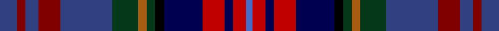
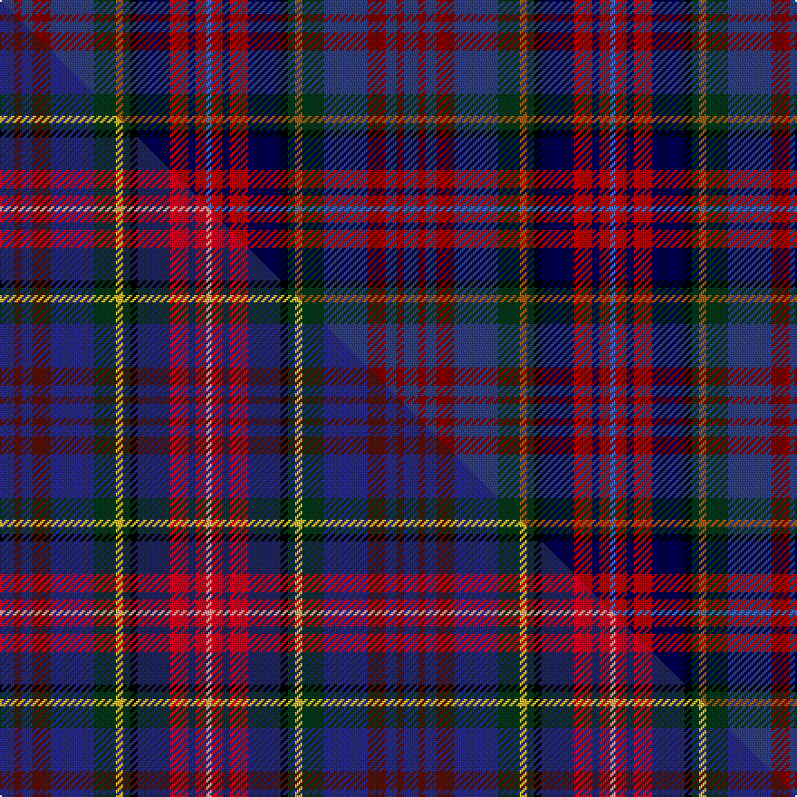

This page is one **sett** — a single exact thread-count. It belongs to the [tartan](/setts/dbi8r4dbi6r10dbi24dg12o4dg4k4db18ri10db4ri6b3/)
(the same proportion at any scale), whose colour order is pattern [BRBRBGRGKBRBRB](/stripes/brbrbgrgkbrbrb/).

Part of the [Hyndman](/tartans/hyndman-2/) tartan — the named design grouping this sett with its other cloths.

Sourced from weddslist.  It is a [14 stripe tartan](/stripes/stripes14/).

Original link http://www.weddslist.com/cgi-bin/tartans/pg.pl?source=sts

## Thread count
DBi/8 R4 DBi6 R10 DBi24 DG12 O4 DG4 K4 DB18 Ri10 DB4 Ri6 B/3

One full sett is **223 threads**.

## Palette
<table><thead><tr><th>Colour</th><th>Shade</th><th>OKLCh</th></tr></thead><tbody><tr><td>DB</td><td><code style="background-color:#304080;">#304080</code> <small style="color:#888">#304080</small></td><td><small style="color:#888">oklch(39.4% 0.109 270.2)</small></td></tr><tr><td>DB</td><td><code style="background-color:#000050;">#000050</code> <small style="color:#888">#000050</small></td><td><small style="color:#888">oklch(19.5% 0.135 264.1)</small></td></tr><tr><td>DG</td><td><code style="background-color:#053819;">#053819</code> <small style="color:#888">#053819</small></td><td><small style="color:#888">oklch(30.0% 0.075 151.3)</small></td></tr><tr><td>R</td><td><code style="background-color:#800000;">#800000</code> <small style="color:#888">#800000</small></td><td><small style="color:#888">oklch(37.7% 0.155 29.2)</small></td></tr><tr><td>K</td><td><code style="background-color:#000000;">#000000</code> <small style="color:#888">#000000</small></td><td><small style="color:#888">oklch(0.0% 0.000 0.0)</small></td></tr><tr><td>O</td><td><code style="background-color:#A65C11;">#A65C11</code> <small style="color:#888">#A65C11</small></td><td><small style="color:#888">oklch(55.0% 0.125 58.3)</small></td></tr><tr><td>B</td><td><code style="background-color:#466CC8;">#466CC8</code> <small style="color:#888">#466CC8</small></td><td><small style="color:#888">oklch(55.1% 0.149 265.0)</small></td></tr><tr><td>R</td><td><code style="background-color:#C00000;">#C00000</code> <small style="color:#888">#C00000</small></td><td><small style="color:#888">oklch(50.7% 0.208 29.2)</small></td></tr></tbody></table>

# Sample pattern

## Compared to the master

This cloth is one sett of its design; the master sett (the exemplar the design is anchored on) is below for comparison.

Its **ΔTartan distance** from the master is **0.50** — the same measure the nearest-tartans table ranks by (0 is identical; a re-scale of the same cloth is near 0, a recolour or a different proportion further).

<figure class="master-compare" style="margin:0">

this sett
master sett ★

<figcaption style="color:#888;font-size:smaller">One weave of this sett against the <a href="/setts/dbi8dr4dbi6dr10dbi24dg12ly4dg4k4db18r10db4r6lr3/">master sett ★</a>, split on the diagonal: a shared proportion runs seamlessly across it with only the shades shifting; a different proportion breaks on it.</figcaption>
</figure>

## Nearest variants

The nearest existing variants by ΔTartan distance, with this cloth at the top so the swatches line up against it.

ΔTartan

Threads

Variant

Sett

—

223

<a href="/variants/s14/dbi8r4dbi6r10dbi24dg12o4dg4k4db18ri10db4ri6b3~dbi1604274-r1506028-db0805267-ri2008029/">Hyndman (Omagh)</a>

0.60

—

<a href="/variants/s14/dbi8dr4dbi6dr10dbi24dg12ly4dg4k4db18r10db4r6lr3~dbi1406275-db1204274/">Hyndman Family Tartan</a>

## Neighbour map

Every grey dot is one of 13620 variants placed by the first two principal components of the ΔTartan feature space (42% of its variance). Red is this tartan; blue dots are its nearest — click one to open its page.

<svg viewBox="0 0 640 380" role="img" style="max-width:100%;height:auto;border:1px solid #e0e0e0;border-radius:4px;display:block" xmlns="http://www.w3.org/2000/svg"><image href="/nn/cloud.v1.png" width="640" height="380"/><a href="/variants/s14/dbi8dr4dbi6dr10dbi24dg12ly4dg4k4db18r10db4r6lr3~dbi1406275-db1204274/"><circle cx="73.5" cy="146.3" r="4" fill="#3465a4"><title>Hyndman Family Tartan</title></circle></a><circle cx="85.3" cy="150.1" r="5" fill="#c00000"/><text x="320" y="376" text-anchor="middle" font-size="11" fill="#999">ground</text><text x="11" y="190" text-anchor="middle" font-size="11" fill="#999" transform="rotate(-90 11 190)">complexity</text></svg>

ID: /variants/s14/dbi8r4dbi6r10dbi24dg12o4dg4k4db18ri10db4ri6b3~dbi1604274-r1506028-db0805267-ri2008029/
