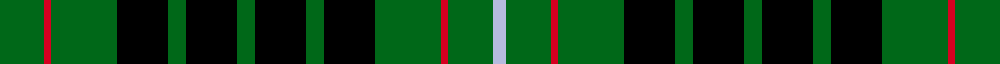

This page is one **sett** — a single exact thread-count. It belongs to the [tartan](/setts/dg13r2dg19k15dg5k15dg5k15dg5k15dg19r2dg13lb4/)
(the same proportion at any scale), whose colour order is pattern [GRGKGKGKGKGRGW](/stripes/grgkgkgkgkgrgw/).

Sourced from register-of-tartans.  It is a [14 stripe tartan](/stripes/stripes14/).

Original link https://www.tartanregister.gov.uk/tartanDetails.aspx?ref=3977

Dataset <small>— provenance for this record, inherited from the source manifest</small>

<dl class="dataset-prov">
<dt>source</dt><dd><a href="/sources/register-of-tartans/">Scottish Register of Tartans</a></dd>
<dt>data captured from</dt><dd><a href="https://github.com/thetartan/tartan-database/blob/master/data/register-of-tartans/data.csv">https://github.com/thetartan/tartan-database/blob/master/data/register-of-tartans/data.csv</a></dd>
<dt>data date</dt><dd>1998 <small>(this record)</small></dd>
<dt>licence</dt><dd><a href="https://www.tartanregister.gov.uk/copyright">Crown copyright</a></dd>
</dl>

Capture chain <small>— the hands this data passed through, oldest first; each capture carries its own licence</small>

<ol class="capture-chain">
<li><a href="https://www.tartanregister.gov.uk/">Scottish Register of Tartans</a> · <a href="https://www.tartanregister.gov.uk/copyright">Crown copyright</a> <small>the living register — still published by National Records of Scotland</small></li>
<li><a href="https://github.com/thetartan/tartan-database">thetartan/tartan-database</a> <small>2016-2017</small> · <a href="https://creativecommons.org/licenses/by-nc-nd/4.0/">CC BY-NC-ND 4.0</a> <small>Levko Kravets's frozen compilation — the capture we vendored, and where its CC licence text came from</small></li>
<li>this dictionary <small>captured 2026-06-10 · commit 5bf86c7566</small> <small>each re-capture is a git commit to data/sources</small></li>
</ol>

## Register references

External register numbers recorded for this tartan.

- Scottish Register of Tartans: [3977](https://www.tartanregister.gov.uk/tartanDetails.aspx?ref=3977)
- Scottish Tartans Authority (ITI): 2570
- Scottish Tartans World Register: 2570

## Thread count
DG/26 R4 DG38 K30 DG10 K30 DG10 K30 DG10 K30 DG38 R4 DG26 LB/8

One full sett is **554 threads**.

## Palette
<table><thead><tr><th>Colour</th><th>Shade</th><th>OKLCh</th></tr></thead><tbody><tr><td>DG</td><td><code style="background-color:#053819;">#053819</code> <small style="color:#888">#053819</small></td><td><small style="color:#888">oklch(30.0% 0.075 151.3)</small></td></tr><tr><td>G</td><td><code style="background-color:#289C18;">#289C18</code> <small style="color:#888">#289C18</small></td><td><small style="color:#888">oklch(60.6% 0.191 141.6)</small></td></tr><tr><td>DG</td><td><code style="background-color:#006818;">#006818</code> <small style="color:#888">#006818</small></td><td><small style="color:#888">oklch(45.0% 0.142 145.0)</small></td></tr><tr><td>K</td><td><code style="background-color:#000000;">#000000</code> <small style="color:#888">#000000</small></td><td><small style="color:#888">oklch(0.0% 0.000 0.0)</small></td></tr><tr><td>LB</td><td><code style="background-color:#B5BBDE;">#B5BBDE</code> <small style="color:#888">#B5BBDE</small></td><td><small style="color:#888">oklch(79.9% 0.050 277.6)</small></td></tr><tr><td>R</td><td><code style="background-color:#D60020;">#D60020</code> <small style="color:#888">#D60020</small></td><td><small style="color:#888">oklch(55.2% 0.224 25.5)</small></td></tr></tbody></table>

# Sample pattern

## Nearest tartan variants

The nearest existing variants by ΔTartan distance, with this cloth at the top so the swatches line up against it.

ΔTartan

Threads

Variant

Sett

—

554

<a href="/variants/s14/dg13r2dg19k15dg5k15dg5k15dg5k15dg19r2dg13lb4~x2~dg1806142/">Strath Hallidale (Sutherland)</a>

<a href="/ttd/edit/#slug=k4w1k4g1k1g6k1g6k1g1k4y1k4g1~x2&amp;base=dg13r2dg19k15dg5k15dg5k15dg5k15dg19r2dg13lb4~x2~dg1806142" title="compare in the TTD">2.34</a>

134

<a href="/variants/s14/k4w1k4g1k1g6k1g6k1g1k4y1k4g1~x2/">MacAlpine</a>

<a href="/ttd/edit/#slug=k4y1k4g1k4w1k4g1k1g6k1g6k1g1~x4&amp;base=dg13r2dg19k15dg5k15dg5k15dg5k15dg19r2dg13lb4~x2~dg1806142" title="compare in the TTD">2.34</a>

268

<a href="/variants/s14/k4y1k4g1k4w1k4g1k1g6k1g6k1g1~x4/">MacAlpine</a>

<a href="/ttd/edit/#slug=g7k12g12k9dr3k9g20k16g7t3~x2&amp;base=dg13r2dg19k15dg5k15dg5k15dg5k15dg19r2dg13lb4~x2~dg1806142" title="compare in the TTD">2.40</a>

372

<a href="/variants/s10/g7k12g12k9dr3k9g20k16g7t3~x2/">Holman (Personal)</a>

<a href="/ttd/edit/#slug=k8y1k4g1k4w1k4g1k1g6k1g6k1g1~x4&amp;base=dg13r2dg19k15dg5k15dg5k15dg5k15dg19r2dg13lb4~x2~dg1806142" title="compare in the TTD">2.54</a>

284

<a href="/variants/s14/k8y1k4g1k4w1k4g1k1g6k1g6k1g1~x4/">MacAlpine</a>

<a href="/ttd/edit/#slug=k4g20dy4g20dy26g4k10dr3k16g18dy4g20k4&amp;base=dg13r2dg19k15dg5k15dg5k15dg5k15dg19r2dg13lb4~x2~dg1806142" title="compare in the TTD">2.65</a>

298

<a href="/variants/s13/k4g20dy4g20dy26g4k10dr3k16g18dy4g20k4/">Greenshields, Alan (Personal)</a>

<a href="/ttd/edit/#slug=g25k4g4k4g4k26g25r9g25k26g25k2r9~x2&amp;base=dg13r2dg19k15dg5k15dg5k15dg5k15dg19r2dg13lb4~x2~dg1806142" title="compare in the TTD">2.68</a>

684

<a href="/variants/s13/g25k4g4k4g4k26g25r9g25k26g25k2r9~x2/">Moncrieffe (1998)</a>

<a href="/ttd/edit/#slug=k3g10y2g10k9g2k9g10r2g10k3g2k5g2k5g2~x2&amp;base=dg13r2dg19k15dg5k15dg5k15dg5k15dg19r2dg13lb4~x2~dg1806142" title="compare in the TTD">2.71</a>

334

<a href="/variants/s16/k3g10y2g10k9g2k9g10r2g10k3g2k5g2k5g2~x2/">Stuart/Stewart Hunting #4</a>

<a href="/ttd/edit/#slug=g20k3g3k3g3k18g21r4g21k18g19k2r4~x2&amp;base=dg13r2dg19k15dg5k15dg5k15dg5k15dg19r2dg13lb4~x2~dg1806142" title="compare in the TTD">2.83</a>

508

<a href="/variants/s13/g20k3g3k3g3k18g21r4g21k18g19k2r4~x2/">Moncrieffe Athol</a>

<a href="/ttd/edit/#slug=k20lb2k6g16dp4k9~x2~dp1105325&amp;base=dg13r2dg19k15dg5k15dg5k15dg5k15dg19r2dg13lb4~x2~dg1806142" title="compare in the TTD">2.92</a>

170

<a href="/variants/s6/k20lb2k6g16dp4k9~x2~dp1105325/">Wilson's No.167</a>

<a href="/ttd/edit/#slug=k14r3k7g26w6g26k16r3k16r3k16g26w6g26k7r3k14r4&amp;base=dg13r2dg19k15dg5k15dg5k15dg5k15dg19r2dg13lb4~x2~dg1806142" title="compare in the TTD">2.94</a>

426

<a href="/variants/s18/k14r3k7g26w6g26k16r3k16r3k16g26w6g26k7r3k14r4/">J &amp; B Whisky (Original)</a>

## Neighbour map

Every grey dot is one of 13620 variants placed by the first two principal components of the ΔTartan feature space (42% of its variance). Red is this tartan; blue dots are its nearest — click one to open its page.

<svg viewBox="0 0 640 380" role="img" style="max-width:100%;height:auto;border:1px solid #e0e0e0;border-radius:4px;display:block" xmlns="http://www.w3.org/2000/svg"><image href="/nn/cloud.v1.png" width="640" height="380"/><a href="/variants/s14/k4w1k4g1k1g6k1g6k1g1k4y1k4g1~x2/"><circle cx="202.2" cy="183.6" r="4" fill="#3465a4"><title>MacAlpine</title></circle></a><a href="/variants/s14/k4y1k4g1k4w1k4g1k1g6k1g6k1g1~x4/"><circle cx="202.2" cy="183.6" r="4" fill="#3465a4"><title>MacAlpine</title></circle></a><a href="/variants/s10/g7k12g12k9dr3k9g20k16g7t3~x2/"><circle cx="177.7" cy="221.1" r="4" fill="#3465a4"><title>Holman (Personal)</title></circle></a><a href="/variants/s14/k8y1k4g1k4w1k4g1k1g6k1g6k1g1~x4/"><circle cx="238.5" cy="164.1" r="4" fill="#3465a4"><title>MacAlpine</title></circle></a><a href="/variants/s13/k4g20dy4g20dy26g4k10dr3k16g18dy4g20k4/"><circle cx="207.6" cy="185.1" r="4" fill="#3465a4"><title>Greenshields, Alan (Personal)</title></circle></a><a href="/variants/s13/g25k4g4k4g4k26g25r9g25k26g25k2r9~x2/"><circle cx="255.4" cy="175.1" r="4" fill="#3465a4"><title>Moncrieffe (1998)</title></circle></a><a href="/variants/s16/k3g10y2g10k9g2k9g10r2g10k3g2k5g2k5g2~x2/"><circle cx="203.1" cy="198.0" r="4" fill="#3465a4"><title>Stuart/Stewart Hunting #4</title></circle></a><a href="/variants/s13/g20k3g3k3g3k18g21r4g21k18g19k2r4~x2/"><circle cx="285.4" cy="177.9" r="4" fill="#3465a4"><title>Moncrieffe Athol</title></circle></a><a href="/variants/s6/k20lb2k6g16dp4k9~x2~dp1105325/"><circle cx="193.3" cy="181.1" r="4" fill="#3465a4"><title>Wilson's No.167</title></circle></a><a href="/variants/s18/k14r3k7g26w6g26k16r3k16r3k16g26w6g26k7r3k14r4/"><circle cx="159.0" cy="162.8" r="4" fill="#3465a4"><title>J &amp; B Whisky (Original)</title></circle></a><circle cx="223.1" cy="189.1" r="5" fill="#c00000"/><text x="320" y="376" text-anchor="middle" font-size="11" fill="#999">ground</text><text x="11" y="190" text-anchor="middle" font-size="11" fill="#999" transform="rotate(-90 11 190)">complexity</text></svg>

ID: /variants/s14/dg13r2dg19k15dg5k15dg5k15dg5k15dg19r2dg13lb4~x2~dg1806142/
