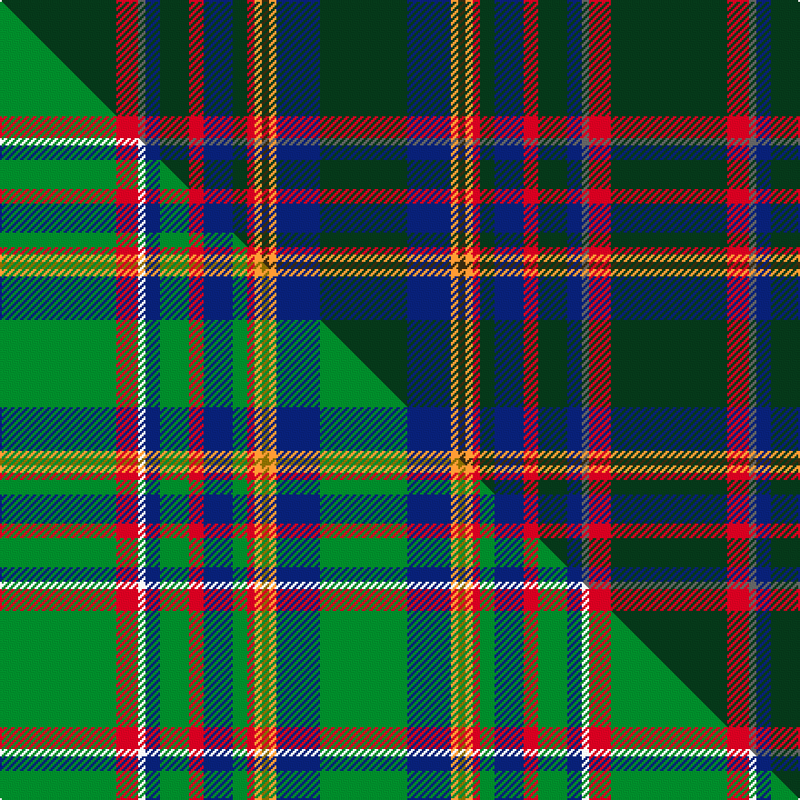

This page is one **sett** — a single exact thread-count. It belongs to the [tartan](/setts/dg16r3n1db2dg4r2db4dg2r1lo1dy1lo1db6dg12/)
(the same proportion at any scale), whose colour order is pattern [GBYGYRGBRGBBRG](/stripes/gbygyrgbrgbbrg/).

Part of the [Heneghan](/tartans/heneghan/) tartan — the named design grouping this sett with its other cloths.

Sourced from tartans-authority.  It is a [14 stripe tartan](/stripes/stripes14/).

Original link [https://www.tartanregister.gov.uk/tartanDetails.aspx?ref=3841](https://www.tartanregister.gov.uk/tartanDetails.aspx?ref=3841)

Dataset <small>— provenance for this record, inherited from the source manifest</small>

<dl class="dataset-prov">
<dt>source</dt><dd><a href="/sources/tartans-authority/">Scottish Tartans Authority</a></dd>
<dt>data captured from</dt><dd><a href="https://github.com/thetartan/tartan-database/blob/master/data/tartans-authority/data.csv">https://github.com/thetartan/tartan-database/blob/master/data/tartans-authority/data.csv</a></dd>
<dt>data date</dt><dd>2002 <small>(this record)</small></dd>
<dt>licence</dt><dd><a href="https://creativecommons.org/licenses/by-nc-nd/4.0/">CC BY-NC-ND 4.0</a></dd>
</dl>

Capture chain <small>— the hands this data passed through, oldest first; each capture carries its own licence</small>

<ol class="capture-chain">
<li><a href="https://www.tartansauthority.com/">Scottish Tartans Authority</a> <small>the heritage body's archive — its tartan-ferret record browser is retired (links repaired to the SRT, above)</small></li>
<li><a href="https://github.com/thetartan/tartan-database">thetartan/tartan-database</a> <small>2016-2017</small> · <a href="https://creativecommons.org/licenses/by-nc-nd/4.0/">CC BY-NC-ND 4.0</a> <small>Levko Kravets's frozen compilation — the capture we vendored, and where its CC licence text came from</small></li>
<li>this dictionary <small>captured 2026-06-10 · commit 5bf86c7566</small> <small>each re-capture is a git commit to data/sources</small></li>
</ol>

## Register references

External register numbers recorded for this tartan.

- Scottish Tartans Authority (ITI): 3841

## Thread count
DG/64 R12 N4 DB8 DG16 R8 DB16 DG8 R4 LO4 DY4 LO4 DB24 DG/48

One full sett is **336 threads**.

## Palette
<table><thead><tr><th>Colour</th><th>Shade</th><th>OKLCh</th></tr></thead><tbody><tr><td>DB</td><td><code style="background-color:#082077;">#082077</code> <small style="color:#888">#082077</small></td><td><small style="color:#888">oklch(30.0% 0.149 265.1)</small></td></tr><tr><td>DG</td><td><code style="background-color:#053819;">#053819</code> <small style="color:#888">#053819</small></td><td><small style="color:#888">oklch(30.0% 0.075 151.3)</small></td></tr><tr><td>N</td><td><code style="background-color:#636363;">#636363</code> <small style="color:#888">#636363</small></td><td><small style="color:#888">oklch(50.0% 0.000 89.9)</small></td></tr><tr><td>LO</td><td><code style="background-color:#FF9C34;">#FF9C34</code> <small style="color:#888">#FF9C34</small></td><td><small style="color:#888">oklch(77.9% 0.161 61.8)</small></td></tr><tr><td>R</td><td><code style="background-color:#D60020;">#D60020</code> <small style="color:#888">#D60020</small></td><td><small style="color:#888">oklch(55.2% 0.224 25.5)</small></td></tr><tr><td>DY</td><td><code style="background-color:#3A2B0D;">#3A2B0D</code> <small style="color:#888">#3A2B0D</small></td><td><small style="color:#888">oklch(30.0% 0.049 82.0)</small></td></tr></tbody></table>

# Sample pattern

## Compared to the master

This cloth is one sett of its design; the master sett (the exemplar the design is anchored on) is below for comparison.

Its **ΔTartan distance** from the master is **0.21** — the same measure the nearest-tartans table ranks by (0 is identical; a re-scale of the same cloth is near 0, a recolour or a different proportion further).

<figure class="master-compare" style="margin:0">

this sett
master sett ★

<figcaption style="color:#888;font-size:smaller">One weave of this sett against the <a href="/setts/g16r3w1db2g4r2db4g2r1lo1y1lo1db6g12/">master sett ★</a>, split on the diagonal: a shared proportion runs seamlessly across it with only the shades shifting; a different proportion breaks on it.</figcaption>
</figure>

## Nearest tartan variants

The nearest existing variants by ΔTartan distance, with this cloth at the top so the swatches line up against it.

ΔTartan

Threads

Variant

Sett

—

336

<a href="/variants/s14/dg16r3n1db2dg4r2db4dg2r1lo1dy1lo1db6dg12~x4/">Heneghan (Personal)</a>

<a href="/ttd/edit/#slug=g16r3w1db2g4r2db4g2r1lo1dy1lo1db6g12~x4&amp;base=dg16r3n1db2dg4r2db4dg2r1lo1dy1lo1db6dg12~x4" title="compare in the TTD">0.21</a>

336

<a href="/variants/s14/g16r3w1db2g4r2db4g2r1lo1dy1lo1db6g12~x4/">Heneghan Commemorative Family Tartan</a>

<a href="/ttd/edit/#slug=g16r3w1db2g4r2db4g2r1lo1y1lo1db6g12~x4&amp;base=dg16r3n1db2dg4r2db4dg2r1lo1dy1lo1db6dg12~x4" title="compare in the TTD">0.21</a>

336

<a href="/variants/s14/g16r3w1db2g4r2db4g2r1lo1y1lo1db6g12~x4/">Heneghan (Personal)</a>

<a href="/ttd/edit/#slug=dt15dy2dt2r2dt6dg30dt6r2dt2dy2dt15w2~x2~dt1204274-dg1605139&amp;base=dg16r3n1db2dg4r2db4dg2r1lo1dy1lo1db6dg12~x4" title="compare in the TTD">2.67</a>

310

<a href="/variants/s12/db15dy2db2r2db6dg30db6r2db2dy2db15w2~x2~db1204274-dg1605139/">Hydesville Tower</a>

<a href="/ttd/edit/#slug=n38db4n8o2n4w3n4dr14b7n2b4w2~x2&amp;base=dg16r3n1db2dg4r2db4dg2r1lo1dy1lo1db6dg12~x4" title="compare in the TTD">3.22</a>

288

<a href="/variants/s12/n38db4n8o2n4w3n4dr14b7n2b4w2~x2/">Portree, Check</a>

<a href="/ttd/edit/#slug=k3db10dg25y2dg2y3dg2y2dg25db10w3~x2&amp;base=dg16r3n1db2dg4r2db4dg2r1lo1dy1lo1db6dg12~x4" title="compare in the TTD">3.35</a>

336

<a href="/variants/s11/k3db10dg25y2dg2y3dg2y2dg25db10w3~x2/">William and Mary GALA, Inc, The</a>

<a href="/ttd/edit/#slug=db6y2db15g12dg39w3dg39g12db15y2db6r3~x2~dg1605139&amp;base=dg16r3n1db2dg4r2db4dg2r1lo1dy1lo1db6dg12~x4" title="compare in the TTD">3.52</a>

598

<a href="/variants/s12/db6y2db15g12dg39w3dg39g12db15y2db6r3~x2~dg1605139/">Wagland</a>

<a href="/ttd/edit/#slug=y3g6dg32r4y2r2dp7dg2w2~x2&amp;base=dg16r3n1db2dg4r2db4dg2r1lo1dy1lo1db6dg12~x4" title="compare in the TTD">3.53</a>

230

<a href="/variants/s9/y3g6dg32r4y2r2dp7dg2w2~x2/">Pienaar (Personal)</a>

<a href="/ttd/edit/#slug=dy6w1dy24db6g2db1g2db1g12r1~x2&amp;base=dg16r3n1db2dg4r2db4dg2r1lo1dy1lo1db6dg12~x4" title="compare in the TTD">3.54</a>

210

<a href="/variants/s10/dy6w1dy24db6g2db1g2db1g12r1~x2/">Chisholm Hunting Clan Tartan</a>

<a href="/ttd/edit/#slug=w2dy14g7dy1db7dy1db7dy1g7dy14r2dy14g7dy1db7dy1~x4&amp;base=dg16r3n1db2dg4r2db4dg2r1lo1dy1lo1db6dg12~x4" title="compare in the TTD">3.62</a>

732

<a href="/variants/s16/w2dy14g7dy1db7dy1db7dy1g7dy14r2dy14g7dy1db7dy1~x4/">Fraser Hunting (unmarked sample)</a>

<a href="/ttd/edit/#slug=n4db2n7dt30n8dt7r5db1w2~x2&amp;base=dg16r3n1db2dg4r2db4dg2r1lo1dy1lo1db6dg12~x4" title="compare in the TTD">3.64</a>

252

<a href="/variants/s9/n4db2n7dt30n8dt7r5db1w2~x2/">Hebridean Heather (Fashion)</a>

## Neighbour map

Every grey dot is one of 13621 variants placed by the first two principal components of the ΔTartan feature space (42% of its variance). Red is this tartan; blue dots are its nearest — click one to open its page.

<svg viewBox="0 0 640 380" role="img" style="max-width:100%;height:auto;border:1px solid #e0e0e0;border-radius:4px;display:block" xmlns="http://www.w3.org/2000/svg"><image href="/nn/cloud.v1.png" width="640" height="380"/><a href="/variants/s14/g16r3w1db2g4r2db4g2r1lo1dy1lo1db6g12~x4/"><circle cx="301.9" cy="122.6" r="4" fill="#3465a4"><title>Heneghan Commemorative Family Tartan</title></circle></a><a href="/variants/s14/g16r3w1db2g4r2db4g2r1lo1y1lo1db6g12~x4/"><circle cx="303.6" cy="123.3" r="4" fill="#3465a4"><title>Heneghan (Personal)</title></circle></a><a href="/variants/s12/db15dy2db2r2db6dg30db6r2db2dy2db15w2~x2~db1204274-dg1605139/"><circle cx="346.2" cy="153.1" r="4" fill="#3465a4"><title>Hydesville Tower</title></circle></a><a href="/variants/s12/n38db4n8o2n4w3n4dr14b7n2b4w2~x2/"><circle cx="377.6" cy="126.4" r="4" fill="#3465a4"><title>Portree, Check</title></circle></a><a href="/variants/s11/k3db10dg25y2dg2y3dg2y2dg25db10w3~x2/"><circle cx="343.9" cy="152.4" r="4" fill="#3465a4"><title>William and Mary GALA, Inc, The</title></circle></a><a href="/variants/s12/db6y2db15g12dg39w3dg39g12db15y2db6r3~x2~dg1605139/"><circle cx="296.6" cy="148.9" r="4" fill="#3465a4"><title>Wagland</title></circle></a><a href="/variants/s9/y3g6dg32r4y2r2dp7dg2w2~x2/"><circle cx="309.8" cy="125.1" r="4" fill="#3465a4"><title>Pienaar (Personal)</title></circle></a><a href="/variants/s10/dy6w1dy24db6g2db1g2db1g12r1~x2/"><circle cx="343.1" cy="132.9" r="4" fill="#3465a4"><title>Chisholm Hunting Clan Tartan</title></circle></a><a href="/variants/s16/w2dy14g7dy1db7dy1db7dy1g7dy14r2dy14g7dy1db7dy1~x4/"><circle cx="268.8" cy="165.1" r="4" fill="#3465a4"><title>Fraser Hunting (unmarked sample)</title></circle></a><a href="/variants/s9/n4db2n7dt30n8dt7r5db1w2~x2/"><circle cx="385.0" cy="142.7" r="4" fill="#3465a4"><title>Hebridean Heather (Fashion)</title></circle></a><circle cx="347.2" cy="131.4" r="5" fill="#c00000"/><text x="320" y="376" text-anchor="middle" font-size="11" fill="#999">ground</text><text x="11" y="190" text-anchor="middle" font-size="11" fill="#999" transform="rotate(-90 11 190)">complexity</text></svg>

ID: /variants/s14/dg16r3n1db2dg4r2db4dg2r1lo1dy1lo1db6dg12~x4/
