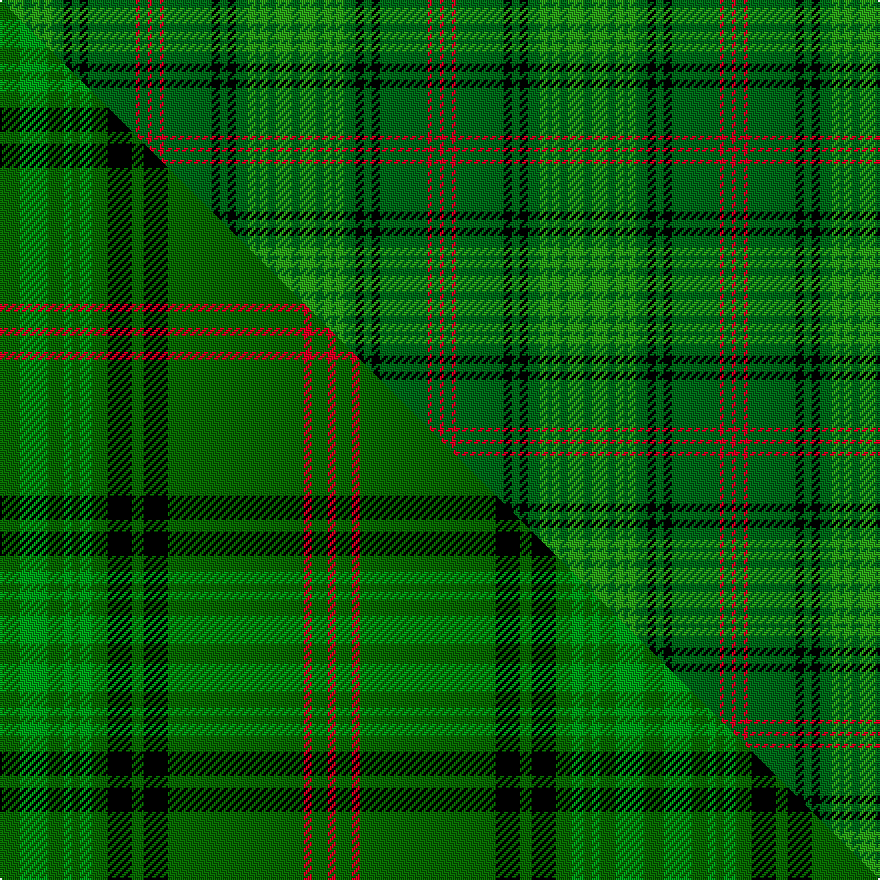

This is one **variant** — a specific cloth: this exact thread count and colourway, with its own
provenance below. It is one weaving of the [sett](/setts/dg2g4dg2g2dg1g2dg3k2dg2k2dg12r1dg2r1/) (the scale-free proportion — the
same cloth at any scale or shade), whose colour order is pattern [GGGGGGGKGKGRGR](/stripes/gggggggkgkgrgr/).

Part of the [Ross Hunting](/tartans/r/ro/ross-hunting/) tartan — the named design grouping this sett with its other cloths.

Sourced from house-of-tartan.  It is a [14 stripe tartan](/stripes/stripes14/).

Original link [http://www.house-of-tartan.scotland.net/house/TartanViewjs.asp?colr=Def&tnam=757](http://www.house-of-tartan.scotland.net/house/TartanViewjs.asp?colr=Def&tnam=757)

## Provenance

Earliest known date: 1908 Adam shows the six light green stripes in his publication of 1908

Dataset <small>— provenance for this record, inherited from the source manifest</small>

<dl class="dataset-prov">
<dt>source</dt><dd><a href="/sources/house-of-tartan/">House of Tartan</a></dd>
<dt>data captured from</dt><dd><a href="https://github.com/thetartan/tartan-database/blob/master/data/house-of-tartan/data.csv">https://github.com/thetartan/tartan-database/blob/master/data/house-of-tartan/data.csv</a></dd>
<dt>data date</dt><dd>1908 <small>(this record)</small></dd>
<dt>licence</dt><dd><a href="https://creativecommons.org/licenses/by-nc-nd/4.0/">CC BY-NC-ND 4.0</a></dd>
</dl>

Capture chain <small>— the hands this data passed through, oldest first; each capture carries its own licence</small>

<ol class="capture-chain">
<li><a href="http://www.house-of-tartan.scotland.net/">House of Tartan</a> <small>the weaver/retailer's database — the site is now offline; the URL is kept as the ultimate source's identity</small></li>
<li><a href="https://github.com/thetartan/tartan-database">thetartan/tartan-database</a> <small>2016-2017</small> · <a href="https://creativecommons.org/licenses/by-nc-nd/4.0/">CC BY-NC-ND 4.0</a> <small>Levko Kravets's frozen compilation — the capture we vendored, and where its CC licence text came from</small></li>
<li>this dictionary <small>captured 2026-06-10 · commit 5bf86c7566</small> <small>each re-capture is a git commit to data/sources</small></li>
</ol>

## Thread count
DG/4 G8 DG4 G4 DG2 G4 DG6 K4 DG4 K4 DG24 R2 DG4 R/2

One full sett is **146 threads**.

## Palette
<table><thead><tr><th>Colour</th><th>Shade</th><th>OKLCh</th></tr></thead><tbody><tr><td>DG</td><td><code style="background-color:#006818;">#006818</code> <small style="color:#888">#006818</small></td><td><small style="color:#888">oklch(45.0% 0.142 145.0)</small></td></tr><tr><td>G</td><td><code style="background-color:#289C18;">#289C18</code> <small style="color:#888">#289C18</small></td><td><small style="color:#888">oklch(60.6% 0.191 141.6)</small></td></tr><tr><td>K</td><td><code style="background-color:#000000;">#000000</code> <small style="color:#888">#000000</small></td><td><small style="color:#888">oklch(0.0% 0.000 0.0)</small></td></tr><tr><td>R</td><td><code style="background-color:#D60020;">#D60020</code> <small style="color:#888">#D60020</small></td><td><small style="color:#888">oklch(55.2% 0.224 25.5)</small></td></tr></tbody></table>

# Sample pattern

## Compared to the master

This cloth is one sett of its design; the master sett (the exemplar the design is anchored on) is below for comparison.

Its **ΔTartan distance** from the master is **0.42** — the same measure the nearest-tartans table ranks by (0 is identical; a re-scale of the same cloth is near 0, a recolour or a different proportion further).

<figure class="master-compare" style="margin:0">

this sett
master sett ★

<figcaption style="color:#888;font-size:smaller">One weave of this sett against the <a href="/setts/dg5g7dg4g2dg2g3dg4k6dg3k6dg34r2dg4r2/">master sett ★</a>, split on the diagonal: a shared proportion runs seamlessly across it with only the shades shifting; a different proportion breaks on it.</figcaption>
</figure>

## Nearest tartan variants

The nearest existing variants by ΔTartan distance, with this cloth at the top so the swatches line up against it.

ΔTartan

Threads

Variant

Sett

—

146

<a href="/variants/s14/dg2g4dg2g2dg1g2dg3k2dg2k2dg12r1dg2r1~x2~dg1806142-g2408144/">Ross Hunting Clan Tartan</a>

<a href="/ttd/edit/#slug=dg5g7dg4g2dg2g3dg4k6dg3k6dg34r2dg4r2~x2~dg1806142-g2408144&amp;base=dg2g4dg2g2dg1g2dg3k2dg2k2dg12r1dg2r1~x2~dg1806142-g2408144" title="compare in the TTD">0.41</a>

322

<a href="/variants/s14/dg5g7dg4g2dg2g3dg4k6dg3k6dg34r2dg4r2~x2~dg1806142-g2408144/">Ross Hunting #3</a>

<a href="/ttd/edit/#slug=g2dg4g2dg1g1dg1g3k2g2k2g12r1g2r1~x2&amp;base=dg2g4dg2g2dg1g2dg3k2dg2k2dg12r1dg2r1~x2~dg1806142-g2408144" title="compare in the TTD">1.84</a>

138

<a href="/variants/s14/g2dg4g2dg1g1dg1g3k2g2k2g12r1g2r1~x2/">Ross Hunting</a>

<a href="/ttd/edit/#slug=dg6g3dg3g4dg4k5dg3k5dg28r2dg4r2~x2~dg1806142-g2408144&amp;base=dg2g4dg2g2dg1g2dg3k2dg2k2dg12r1dg2r1~x2~dg1806142-g2408144" title="compare in the TTD">2.45</a>

260

<a href="/variants/s12/dg6g3dg3g4dg4k5dg3k5dg28r2dg4r2~x2~dg1806142-g2408144/">Ross Hunting Clan Tartan</a>

<a href="/ttd/edit/#slug=g2b4g2b1g1b1g3k2g2k2g12r1g2r1~x2&amp;base=dg2g4dg2g2dg1g2dg3k2dg2k2dg12r1dg2r1~x2~dg1806142-g2408144" title="compare in the TTD">2.95</a>

138

<a href="/variants/s14/g2b4g2b1g1b1g3k2g2k2g12r1g2r1~x2/">Ross, hunting</a>

<a href="/ttd/edit/#slug=k3g3y2g4k2g3k2g24db10y2db10g30r3~x2&amp;base=dg2g4dg2g2dg1g2dg3k2dg2k2dg12r1dg2r1~x2~dg1806142-g2408144" title="compare in the TTD">3.33</a>

380

<a href="/variants/s13/k3g3y2g4k2g3k2g24db10y2db10g30r3~x2/">Bartlett from Winnetka, Illinois</a>

<a href="/ttd/edit/#slug=g13k2g34k6t16r2t16k2g13~x2&amp;base=dg2g4dg2g2dg1g2dg3k2dg2k2dg12r1dg2r1~x2~dg1806142-g2408144" title="compare in the TTD">3.41</a>

364

<a href="/variants/s9/g13k2g34k6t16r2t16k2g13~x2/">Lockhart</a>

<a href="/ttd/edit/#slug=g28dr2g28dr7lb2dr7lb2dr7k5dp4lb2~x2&amp;base=dg2g4dg2g2dg1g2dg3k2dg2k2dg12r1dg2r1~x2~dg1806142-g2408144" title="compare in the TTD">3.47</a>

316

<a href="/variants/s11/g28dr2g28dr7lb2dr7lb2dr7k5dp4lb2~x2/">Hynde (Sir John)</a>

<a href="/ttd/edit/#slug=g10k1g10dr1g1k1g1k1dr10k1lo1k1~x4&amp;base=dg2g4dg2g2dg1g2dg3k2dg2k2dg12r1dg2r1~x2~dg1806142-g2408144" title="compare in the TTD">3.52</a>

268

<a href="/variants/s12/g10k1g10dr1g1k1g1k1dr10k1lo1k1~x4/">Ulster Red (District)</a>

<a href="/ttd/edit/#slug=y4g24k3g2k3g24y20k3y2k3y20g4&amp;base=dg2g4dg2g2dg1g2dg3k2dg2k2dg12r1dg2r1~x2~dg1806142-g2408144" title="compare in the TTD">3.72</a>

216

<a href="/variants/s12/y4g24k3g2k3g24y20k3y2k3y20g4/">Meredith of Wales</a>

<a href="/ttd/edit/#slug=y8g77db18k7db9k6db18g64r4g5r4g9y4g5r6&amp;base=dg2g4dg2g2dg1g2dg3k2dg2k2dg12r1dg2r1~x2~dg1806142-g2408144" title="compare in the TTD">3.72</a>

474

<a href="/variants/s15/y8g77db18k7db9k6db18g64r4g5r4g9y4g5r6/">Kennedy #2</a>

## Neighbour map

Every grey dot is one of 13621 variants placed by the first two principal components of the ΔTartan feature space (42% of its variance). Red is this tartan; blue dots are its nearest — click one to open its page.

<svg viewBox="0 0 640 380" role="img" style="max-width:100%;height:auto;border:1px solid #e0e0e0;border-radius:4px;display:block" xmlns="http://www.w3.org/2000/svg"><image href="/nn/cloud.v1.png" width="640" height="380"/><a href="/variants/s14/dg5g7dg4g2dg2g3dg4k6dg3k6dg34r2dg4r2~x2~dg1806142-g2408144/"><circle cx="367.3" cy="121.4" r="4" fill="#3465a4"><title>Ross Hunting #3</title></circle></a><a href="/variants/s14/g2dg4g2dg1g1dg1g3k2g2k2g12r1g2r1~x2/"><circle cx="334.9" cy="147.2" r="4" fill="#3465a4"><title>Ross Hunting</title></circle></a><a href="/variants/s12/dg6g3dg3g4dg4k5dg3k5dg28r2dg4r2~x2~dg1806142-g2408144/"><circle cx="377.1" cy="140.5" r="4" fill="#3465a4"><title>Ross Hunting Clan Tartan</title></circle></a><a href="/variants/s14/g2b4g2b1g1b1g3k2g2k2g12r1g2r1~x2/"><circle cx="329.0" cy="144.8" r="4" fill="#3465a4"><title>Ross, hunting</title></circle></a><a href="/variants/s13/k3g3y2g4k2g3k2g24db10y2db10g30r3~x2/"><circle cx="322.2" cy="120.6" r="4" fill="#3465a4"><title>Bartlett from Winnetka, Illinois</title></circle></a><a href="/variants/s9/g13k2g34k6t16r2t16k2g13~x2/"><circle cx="319.8" cy="181.1" r="4" fill="#3465a4"><title>Lockhart</title></circle></a><a href="/variants/s11/g28dr2g28dr7lb2dr7lb2dr7k5dp4lb2~x2/"><circle cx="295.3" cy="137.7" r="4" fill="#3465a4"><title>Hynde (Sir John)</title></circle></a><a href="/variants/s12/g10k1g10dr1g1k1g1k1dr10k1lo1k1~x4/"><circle cx="275.5" cy="145.9" r="4" fill="#3465a4"><title>Ulster Red (District)</title></circle></a><a href="/variants/s12/y4g24k3g2k3g24y20k3y2k3y20g4/"><circle cx="301.4" cy="188.0" r="4" fill="#3465a4"><title>Meredith of Wales</title></circle></a><a href="/variants/s15/y8g77db18k7db9k6db18g64r4g5r4g9y4g5r6/"><circle cx="345.6" cy="100.9" r="4" fill="#3465a4"><title>Kennedy #2</title></circle></a><circle cx="332.3" cy="161.7" r="5" fill="#c00000"/><text x="320" y="376" text-anchor="middle" font-size="11" fill="#999">ground</text><text x="11" y="190" text-anchor="middle" font-size="11" fill="#999" transform="rotate(-90 11 190)">complexity</text></svg>

ID: /variants/s14/dg2g4dg2g2dg1g2dg3k2dg2k2dg12r1dg2r1~x2~dg1806142-g2408144/
