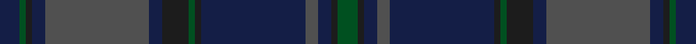

This page is one **sett** — a single exact thread-count. It belongs to the [tartan](/setts/dg3dt1db2n2db16dt1dg1dt4db2n16db2dt1dg1db3/)
(the same proportion at any scale), whose colour order is pattern [BGBBBBBGBBBBBG](/stripes/bgbbbbbgbbbbbg/).

Part of the [Tiger of Sweden](/tartans/tiger-of-sweden/) tartan — the named design grouping this sett with its other cloths.

Sourced from register-of-tartans.  It is a [14 stripe tartan](/stripes/stripes14/).

Original link https://www.tartanregister.gov.uk/tartanDetails.aspx?ref=10870

## Register references

External register numbers recorded for this tartan.

- Scottish Register of Tartans: [10870](https://www.tartanregister.gov.uk/tartanDetails.aspx?ref=10870)

## Thread count
DB/6 G2 K2 DB4 N32 DB4 K8 G2 K2 DB32 N4 DB4 K2 G/6

One full sett is **208 threads**.

## Palette

Palette: <strong>Tartan Register</strong>
<table><thead><tr><th>Colour</th><th>Threads</th><th>Shade</th><th>Base</th><th>OKLCh</th></tr></thead><tbody><tr><td>DB/</td><td style="text-align:right;font-variant-numeric:tabular-nums">6</td><td><code style="background-color:#141E46;">#141E46</code> <small style="color:#888">#141E46</small></td><td>B <code style="background-color:#2A418A;">#2A418A</code></td><td><small style="color:#888">oklch(25.2% 0.076 269.7)</small></td></tr><tr><td>G</td><td style="text-align:right;font-variant-numeric:tabular-nums">2</td><td><code style="background-color:#005020;">#005020</code> <small style="color:#888">#005020</small></td><td>G <code style="background-color:#006100;">#006100</code></td><td><small style="color:#888">oklch(37.7% 0.105 149.6)</small></td></tr><tr><td>K</td><td style="text-align:right;font-variant-numeric:tabular-nums">2</td><td><code style="background-color:#1C1C1C;">#1C1C1C</code> <small style="color:#888">#1C1C1C</small></td><td>B <code style="background-color:#2A418A;">#2A418A</code></td><td><small style="color:#888">oklch(22.6% 0.000 89.9)</small></td></tr><tr><td>DB</td><td style="text-align:right;font-variant-numeric:tabular-nums">4</td><td><code style="background-color:#141E46;">#141E46</code> <small style="color:#888">#141E46</small></td><td>B <code style="background-color:#2A418A;">#2A418A</code></td><td><small style="color:#888">oklch(25.2% 0.076 269.7)</small></td></tr><tr><td>N</td><td style="text-align:right;font-variant-numeric:tabular-nums">32</td><td><code style="background-color:#505050;">#505050</code> <small style="color:#888">#505050</small></td><td>B <code style="background-color:#2A418A;">#2A418A</code></td><td><small style="color:#888">oklch(43.1% 0.000 89.9)</small></td></tr><tr><td>DB</td><td style="text-align:right;font-variant-numeric:tabular-nums">4</td><td><code style="background-color:#141E46;">#141E46</code> <small style="color:#888">#141E46</small></td><td>B <code style="background-color:#2A418A;">#2A418A</code></td><td><small style="color:#888">oklch(25.2% 0.076 269.7)</small></td></tr><tr><td>K</td><td style="text-align:right;font-variant-numeric:tabular-nums">8</td><td><code style="background-color:#1C1C1C;">#1C1C1C</code> <small style="color:#888">#1C1C1C</small></td><td>B <code style="background-color:#2A418A;">#2A418A</code></td><td><small style="color:#888">oklch(22.6% 0.000 89.9)</small></td></tr><tr><td>G</td><td style="text-align:right;font-variant-numeric:tabular-nums">2</td><td><code style="background-color:#005020;">#005020</code> <small style="color:#888">#005020</small></td><td>G <code style="background-color:#006100;">#006100</code></td><td><small style="color:#888">oklch(37.7% 0.105 149.6)</small></td></tr><tr><td>K</td><td style="text-align:right;font-variant-numeric:tabular-nums">2</td><td><code style="background-color:#1C1C1C;">#1C1C1C</code> <small style="color:#888">#1C1C1C</small></td><td>B <code style="background-color:#2A418A;">#2A418A</code></td><td><small style="color:#888">oklch(22.6% 0.000 89.9)</small></td></tr><tr><td>DB</td><td style="text-align:right;font-variant-numeric:tabular-nums">32</td><td><code style="background-color:#141E46;">#141E46</code> <small style="color:#888">#141E46</small></td><td>B <code style="background-color:#2A418A;">#2A418A</code></td><td><small style="color:#888">oklch(25.2% 0.076 269.7)</small></td></tr><tr><td>N</td><td style="text-align:right;font-variant-numeric:tabular-nums">4</td><td><code style="background-color:#505050;">#505050</code> <small style="color:#888">#505050</small></td><td>B <code style="background-color:#2A418A;">#2A418A</code></td><td><small style="color:#888">oklch(43.1% 0.000 89.9)</small></td></tr><tr><td>DB</td><td style="text-align:right;font-variant-numeric:tabular-nums">4</td><td><code style="background-color:#141E46;">#141E46</code> <small style="color:#888">#141E46</small></td><td>B <code style="background-color:#2A418A;">#2A418A</code></td><td><small style="color:#888">oklch(25.2% 0.076 269.7)</small></td></tr><tr><td>K</td><td style="text-align:right;font-variant-numeric:tabular-nums">2</td><td><code style="background-color:#1C1C1C;">#1C1C1C</code> <small style="color:#888">#1C1C1C</small></td><td>B <code style="background-color:#2A418A;">#2A418A</code></td><td><small style="color:#888">oklch(22.6% 0.000 89.9)</small></td></tr><tr><td>G/</td><td style="text-align:right;font-variant-numeric:tabular-nums">6</td><td><code style="background-color:#005020;">#005020</code> <small style="color:#888">#005020</small></td><td>G <code style="background-color:#006100;">#006100</code></td><td><small style="color:#888">oklch(37.7% 0.105 149.6)</small></td></tr></tbody></table>

## Nearest tartans

The nearest existing variants by ΔTartan distance, with this tartan at the top so the swatches line up against it.

ΔTartan

Tartan

Sett

—

<a href="/ttd/edit/#slug=dg3dt1db2n2db16dt1dg1dt4db2n16db2dt1dg1db3~x2">Tiger of Sweden</a> <a class="nn-out" href="/variants/s14/dg3dt1db2n2db16dt1dg1dt4db2n16db2dt1dg1db3~x2/" title="open its dictionary page">↗</a>

1.22

<a href="/ttd/edit/#slug=dgi10dg2db2dy14dg2dgi2dg2dgi2dg2db25dy8dgi4dg4db3dg1db3dg1db4~x2&amp;base=dg3dt1db2n2db16dt1dg1dt4db2n16db2dt1dg1db3~x2">Nova Scotia</a> <a class="nn-out" href="/variants/s18/dgi10dg2db2dy14dg2dgi2dg2dgi2dg2db25dy8dgi4dg4db3dg1db3dg1db4~x2/" title="open its dictionary page">↗</a>

1.26

<a href="/ttd/edit/#slug=do8y2do27k10n4k2n3k2n16do2~x2&amp;base=dg3dt1db2n2db16dt1dg1dt4db2n16db2dt1dg1db3~x2">Highland Granite</a> <a class="nn-out" href="/variants/s10/do8y2do27k10n4k2n3k2n16do2~x2/" title="open its dictionary page">↗</a>

1.48

<a href="/ttd/edit/#slug=db3r1db14dg14r1dg1r1dg1r2~x4&amp;base=dg3dt1db2n2db16dt1dg1dt4db2n16db2dt1dg1db3~x2">Breckon Hunting (Name)</a> <a class="nn-out" href="/variants/s9/db3r1db14dg14r1dg1r1dg1r2~x4/" title="open its dictionary page">↗</a>

1.61

<a href="/ttd/edit/#slug=dg28k2dbi3k11dbi3k2dbi17db4lr2~x2&amp;base=dg3dt1db2n2db16dt1dg1dt4db2n16db2dt1dg1db3~x2">West of Wells (Personal)</a> <a class="nn-out" href="/variants/s9/dg28k2dbi3k11dbi3k2dbi17db4lr2~x2/" title="open its dictionary page">↗</a>

1.64

<a href="/ttd/edit/#slug=dt30dp4dt5dg3dt2dg2dt2dg10dp7k2dp9~x2&amp;base=dg3dt1db2n2db16dt1dg1dt4db2n16db2dt1dg1db3~x2">Paxton Tartan</a> <a class="nn-out" href="/variants/s11/dt30dp4dt5dg3dt2dg2dt2dg10dp7k2dp9~x2/" title="open its dictionary page">↗</a>

1.64

<a href="/variants/s13/r2ki2k21ki8dg16k3dg16ki8k3ki3k21ki2r2~x2/">Metropolitan Atlanta Police</a>

1.64

<a href="/ttd/edit/#slug=k3dg4dt25k16dg3k3dg3k3dg6o3~x2&amp;base=dg3dt1db2n2db16dt1dg1dt4db2n16db2dt1dg1db3~x2">MacAndreis</a> <a class="nn-out" href="/variants/s10/k3dg4dt25k16dg3k3dg3k3dg6o3~x2/" title="open its dictionary page">↗</a>

1.65

<a href="/ttd/edit/#slug=db5k2db2k2db2dt5k2dt1o1dt1k10db3~x4&amp;base=dg3dt1db2n2db16dt1dg1dt4db2n16db2dt1dg1db3~x2">Hopkins Welsh Name Tartan</a> <a class="nn-out" href="/variants/s12/db5k2db2k2db2dt5k2dt1o1dt1k10db3~x4/" title="open its dictionary page">↗</a>

1.65

<a href="/ttd/edit/#slug=dt5k2dt2k2dt2db5k2db1o1db1k10dt3~x4&amp;base=dg3dt1db2n2db16dt1dg1dt4db2n16db2dt1dg1db3~x2">Hopkins (Wales)</a> <a class="nn-out" href="/variants/s12/dt5k2dt2k2dt2db5k2db1o1db1k10dt3~x4/" title="open its dictionary page">↗</a>

1.69

<a href="/ttd/edit/#slug=db16k2db2k2db2k12dg13k2dg13k12db12k2r1~x2&amp;base=dg3dt1db2n2db16dt1dg1dt4db2n16db2dt1dg1db3~x2">Black Watch/Isetan Men's</a> <a class="nn-out" href="/variants/s13/db16k2db2k2db2k12dg13k2dg13k12db12k2r1~x2/" title="open its dictionary page">↗</a>

## Neighbour map

Every grey dot is one of 14360 variants placed by the first two principal components of the ΔTartan feature space (44% of its variance). Red is this tartan; blue dots are its nearest — click one to open its page.

<svg viewBox="0 0 640 380" role="img" style="max-width:100%;height:auto;border:1px solid #e0e0e0;border-radius:4px;display:block" xmlns="http://www.w3.org/2000/svg"><image href="/nn/cloud.v1.png" width="640" height="380"/><a href="/variants/s18/dgi10dg2db2dy14dg2dgi2dg2dgi2dg2db25dy8dgi4dg4db3dg1db3dg1db4~x2/"><circle cx="350.8" cy="179.7" r="4" fill="#3465a4"><title>Nova Scotia</title></circle></a><a href="/variants/s10/do8y2do27k10n4k2n3k2n16do2~x2/"><circle cx="386.2" cy="231.7" r="4" fill="#3465a4"><title>Highland Granite</title></circle></a><a href="/variants/s9/db3r1db14dg14r1dg1r1dg1r2~x4/"><circle cx="419.9" cy="240.9" r="4" fill="#3465a4"><title>Breckon Hunting (Name)</title></circle></a><a href="/variants/s9/dg28k2dbi3k11dbi3k2dbi17db4lr2~x2/"><circle cx="317.8" cy="222.5" r="4" fill="#3465a4"><title>West of Wells (Personal)</title></circle></a><a href="/variants/s11/dt30dp4dt5dg3dt2dg2dt2dg10dp7k2dp9~x2/"><circle cx="385.1" cy="206.4" r="4" fill="#3465a4"><title>Paxton Tartan</title></circle></a><a href="/variants/s13/r2ki2k21ki8dg16k3dg16ki8k3ki3k21ki2r2~x2/"><circle cx="340.9" cy="251.8" r="4" fill="#3465a4"><title>Metropolitan Atlanta Police</title></circle></a><a href="/variants/s10/k3dg4dt25k16dg3k3dg3k3dg6o3~x2/"><circle cx="309.5" cy="248.2" r="4" fill="#3465a4"><title>MacAndreis</title></circle></a><a href="/variants/s12/db5k2db2k2db2dt5k2dt1o1dt1k10db3~x4/"><circle cx="339.0" cy="258.1" r="4" fill="#3465a4"><title>Hopkins Welsh Name Tartan</title></circle></a><a href="/variants/s12/dt5k2dt2k2dt2db5k2db1o1db1k10dt3~x4/"><circle cx="332.0" cy="254.8" r="4" fill="#3465a4"><title>Hopkins (Wales)</title></circle></a><a href="/variants/s13/db16k2db2k2db2k12dg13k2dg13k12db12k2r1~x2/"><circle cx="335.4" cy="250.2" r="4" fill="#3465a4"><title>Black Watch/Isetan Men's</title></circle></a><circle cx="388.3" cy="204.3" r="5" fill="#c00000"/></svg>

ID: /variants/s14/dg3dt1db2n2db16dt1dg1dt4db2n16db2dt1dg1db3~x2/
