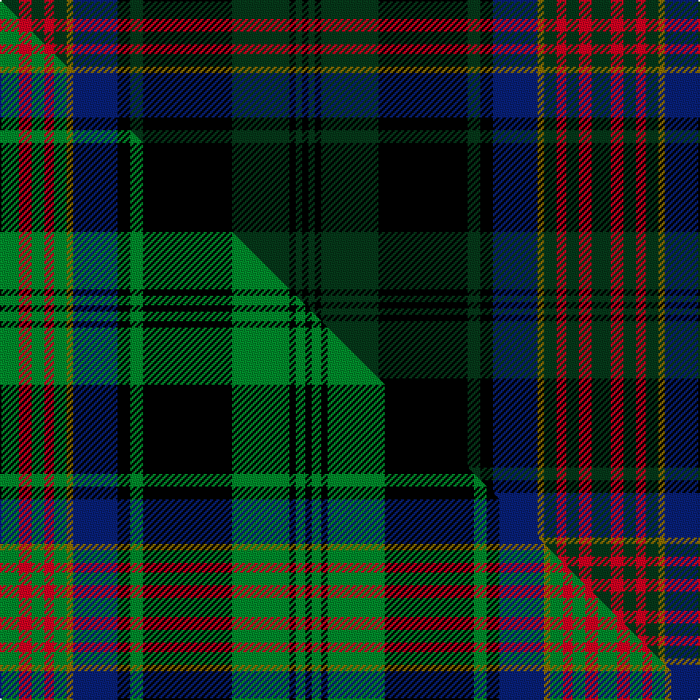

This page is one **sett** — a single exact thread-count. It belongs to the [tartan](/setts/dg6r4dg4r3dg4y2db14k4dg4k28dg18k2dg2k2/)
(the same proportion at any scale), whose colour order is pattern [GRGRGGBKGKGKGK](/stripes/grgrggbkgkgkgk/).

Part of the [Cypress Presbyterian Church](/tartans/cypress-presbyterian-church/) tartan — the named design grouping this sett with its other cloths.

Sourced from tartans-authority.  It is a [14 stripe tartan](/stripes/stripes14/).

Original link http://www.tartansauthority.com/tartan-ferret/display/10840/

## Register references

External register numbers recorded for this tartan.

- Scottish Register of Tartans: [10840](https://www.tartanregister.gov.uk/tartanDetails?ref=10840)
- Scottish Tartans Authority (ITI): 10840

## Thread count
DG/12 R8 DG8 R6 DG8 Y4 DB28 K8 DG8 K56 DG36 K4 DG4 K/4

One full sett is **372 threads**.

## Palette
<table><thead><tr><th>Colour</th><th>Shade</th><th>OKLCh</th></tr></thead><tbody><tr><td>DB</td><td><code style="background-color:#082077;">#082077</code> <small style="color:#888">#082077</small></td><td><small style="color:#888">oklch(30.0% 0.149 265.1)</small></td></tr><tr><td>DG</td><td><code style="background-color:#053819;">#053819</code> <small style="color:#888">#053819</small></td><td><small style="color:#888">oklch(30.0% 0.075 151.3)</small></td></tr><tr><td>K</td><td><code style="background-color:#000000;">#000000</code> <small style="color:#888">#000000</small></td><td><small style="color:#888">oklch(0.0% 0.000 0.0)</small></td></tr><tr><td>R</td><td><code style="background-color:#D60020;">#D60020</code> <small style="color:#888">#D60020</small></td><td><small style="color:#888">oklch(55.2% 0.224 25.5)</small></td></tr><tr><td>Y</td><td><code style="background-color:#8B6E00;">#8B6E00</code> <small style="color:#888">#8B6E00</small></td><td><small style="color:#888">oklch(55.1% 0.113 90.4)</small></td></tr></tbody></table>

# Sample pattern

## Compared to the master

This cloth is one sett of its design; the master sett (the exemplar the design is anchored on) is below for comparison.

Its **ΔTartan distance** from the master is **0.19** — the same measure the nearest-tartans table ranks by (0 is identical; a re-scale of the same cloth is near 0, a recolour or a different proportion further).

<figure class="master-compare" style="margin:0">

this sett
master sett ★

<figcaption style="color:#888;font-size:smaller">One weave of this sett against the <a href="/setts/g6r4g4r3g4y2db14k4g4k28g18k2g3k2/">master sett ★</a>, split on the diagonal: a shared proportion runs seamlessly across it with only the shades shifting; a different proportion breaks on it.</figcaption>
</figure>

## Nearest tartan variants

The nearest existing variants by ΔTartan distance, with this cloth at the top so the swatches line up against it.

ΔTartan

Threads

Variant

Sett

—

372

<a href="/variants/s14/dg6r4dg4r3dg4y2db14k4dg4k28dg18k2dg2k2~x2/">Cypress Presbyterian Church</a>

<a href="/ttd/edit/#slug=dg10w2dg18k3dg3k3dg3k18dp24k3dp3ly3~x2&amp;base=dg6r4dg4r3dg4y2db14k4dg4k28dg18k2dg2k2~x2" title="compare in the TTD">1.67</a>

346

<a href="/variants/s12/dg10w2dg18k3dg3k3dg3k18dp24k3dp3ly3~x2/">Bell's Whisky (SA)</a>

<a href="/ttd/edit/#slug=y2k2dg2y2dg3y1dg10k18dg3db2dg3db10w2~x2&amp;base=dg6r4dg4r3dg4y2db14k4dg4k28dg18k2dg2k2~x2" title="compare in the TTD">1.93</a>

232

<a href="/variants/s13/y2k2dg2y2dg3y1dg10k18dg3db2dg3db10w2~x2/">O'Doherty (Glasgow) (Personal)</a>

<a href="/ttd/edit/#slug=do24g5n2k14dr2k3g3k3n14do6k4do3g2~x2&amp;base=dg6r4dg4r3dg4y2db14k4dg4k28dg18k2dg2k2~x2" title="compare in the TTD">1.99</a>

288

<a href="/variants/s13/do24g5n2k14dr2k3g3k3n14do6k4do3g2~x2/">Berwick (Fashion)</a>

<a href="/ttd/edit/#slug=dg16k5dg4k8dg44k40dg4db52r10db4r4db10w6&amp;base=dg6r4dg4r3dg4y2db14k4dg4k28dg18k2dg2k2~x2" title="compare in the TTD">2.20</a>

392

<a href="/variants/s13/dg16k5dg4k8dg44k40dg4db52r10db4r4db10w6/">MacNeil of Colonsay (Highland Society of London)</a>

<a href="/ttd/edit/#slug=dt30k5dt5k5dt5k31dg31k3w7k3dg31k31dt31k3r7&amp;base=dg6r4dg4r3dg4y2db14k4dg4k28dg18k2dg2k2~x2" title="compare in the TTD">2.24</a>

419

<a href="/variants/s15/dt30k5dt5k5dt5k31dg31k3w7k3dg31k31dt31k3r7/">78th Regiment (Highlanders) (Mil.)</a>

<a href="/ttd/edit/#slug=db12k2db2k2db2k12dg12k1w2k1dg12k12db12k1r2~x2&amp;base=dg6r4dg4r3dg4y2db14k4dg4k28dg18k2dg2k2~x2" title="compare in the TTD">2.27</a>

320

<a href="/variants/s15/db12k2db2k2db2k12dg12k1w2k1dg12k12db12k1r2~x2/">MacKenzie - 1780 (Clan) as 78th</a>

<a href="/ttd/edit/#slug=y3dg3k4dg14k4dg3k14db18lo1db4lo2db4lo1~x2&amp;base=dg6r4dg4r3dg4y2db14k4dg4k28dg18k2dg2k2~x2" title="compare in the TTD">2.27</a>

292

<a href="/variants/s13/y3dg3k4dg14k4dg3k14db18lo1db4lo2db4lo1~x2/">Clerke of Ulva</a>

<a href="/ttd/edit/#slug=dg28dr12dg4k20ly2k3ly2k3dg7~x2~ly2705081&amp;base=dg6r4dg4r3dg4y2db14k4dg4k28dg18k2dg2k2~x2" title="compare in the TTD">2.29</a>

254

<a href="/variants/s9/dg28dr12dg4k20ly2k3ly2k3dg7~x2~ly2705081/">Cork, County</a>

<a href="/ttd/edit/#slug=dg17k2dg2k2dg2k15db15r7db15k15dg2k2dg2k2dg17lo2~x2&amp;base=dg6r4dg4r3dg4y2db14k4dg4k28dg18k2dg2k2~x2" title="compare in the TTD">2.40</a>

438

<a href="/variants/s16/dg17k2dg2k2dg2k15db15r7db15k15dg2k2dg2k2dg17lo2~x2/">Thormanby Buccaneer Bay</a>

<a href="/ttd/edit/#slug=dg13r2dg2r6dg25ly2k27r2db25r6db2r2db13~x2&amp;base=dg6r4dg4r3dg4y2db14k4dg4k28dg18k2dg2k2~x2" title="compare in the TTD">2.48</a>

456

<a href="/variants/s13/dg13r2dg2r6dg25ly2k27r2db25r6db2r2db13~x2/">Unnamed C20th - Unregistered Error</a>

## Neighbour map

Every grey dot is one of 13620 variants placed by the first two principal components of the ΔTartan feature space (42% of its variance). Red is this tartan; blue dots are its nearest — click one to open its page.

<svg viewBox="0 0 640 380" role="img" style="max-width:100%;height:auto;border:1px solid #e0e0e0;border-radius:4px;display:block" xmlns="http://www.w3.org/2000/svg"><image href="/nn/cloud.v1.png" width="640" height="380"/><a href="/variants/s12/dg10w2dg18k3dg3k3dg3k18dp24k3dp3ly3~x2/"><circle cx="173.8" cy="144.7" r="4" fill="#3465a4"><title>Bell's Whisky (SA)</title></circle></a><a href="/variants/s13/y2k2dg2y2dg3y1dg10k18dg3db2dg3db10w2~x2/"><circle cx="166.2" cy="122.4" r="4" fill="#3465a4"><title>O'Doherty (Glasgow) (Personal)</title></circle></a><a href="/variants/s13/do24g5n2k14dr2k3g3k3n14do6k4do3g2~x2/"><circle cx="176.6" cy="142.6" r="4" fill="#3465a4"><title>Berwick (Fashion)</title></circle></a><a href="/variants/s13/dg16k5dg4k8dg44k40dg4db52r10db4r4db10w6/"><circle cx="155.2" cy="134.7" r="4" fill="#3465a4"><title>MacNeil of Colonsay (Highland Society of London)</title></circle></a><a href="/variants/s15/dt30k5dt5k5dt5k31dg31k3w7k3dg31k31dt31k3r7/"><circle cx="158.5" cy="157.6" r="4" fill="#3465a4"><title>78th Regiment (Highlanders) (Mil.)</title></circle></a><a href="/variants/s15/db12k2db2k2db2k12dg12k1w2k1dg12k12db12k1r2~x2/"><circle cx="162.4" cy="145.6" r="4" fill="#3465a4"><title>MacKenzie - 1780 (Clan) as 78th</title></circle></a><a href="/variants/s13/y3dg3k4dg14k4dg3k14db18lo1db4lo2db4lo1~x2/"><circle cx="166.6" cy="131.2" r="4" fill="#3465a4"><title>Clerke of Ulva</title></circle></a><a href="/variants/s9/dg28dr12dg4k20ly2k3ly2k3dg7~x2~ly2705081/"><circle cx="222.3" cy="143.0" r="4" fill="#3465a4"><title>Cork, County</title></circle></a><a href="/variants/s16/dg17k2dg2k2dg2k15db15r7db15k15dg2k2dg2k2dg17lo2~x2/"><circle cx="151.9" cy="158.2" r="4" fill="#3465a4"><title>Thormanby Buccaneer Bay</title></circle></a><a href="/variants/s13/dg13r2dg2r6dg25ly2k27r2db25r6db2r2db13~x2/"><circle cx="145.2" cy="137.2" r="4" fill="#3465a4"><title>Unnamed C20th - Unregistered Error</title></circle></a><circle cx="201.6" cy="129.0" r="5" fill="#c00000"/><text x="320" y="376" text-anchor="middle" font-size="11" fill="#999">ground</text><text x="11" y="190" text-anchor="middle" font-size="11" fill="#999" transform="rotate(-90 11 190)">complexity</text></svg>

ID: /variants/s14/dg6r4dg4r3dg4y2db14k4dg4k28dg18k2dg2k2~x2/
