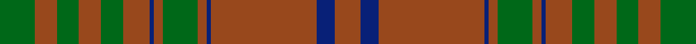

This is one **variant** — a specific cloth: this exact thread count and colourway, with its own
provenance below. It is one weaving of the [sett](/setts/dg8o5dg5o5dg5o6db1o2dg8o2db1o24db4o6/) (the scale-free proportion — the
same cloth at any scale or shade), whose colour order is pattern [GRGRGRBRGRBRBR](/stripes/grgrgrbrgrbrbr/).

Part of the [MacGillivray Hunting](/tartans/m/ma/macgillivray-hunting/) tartan — the named design grouping this sett with its other cloths.

Sourced from register-of-tartans.  It is a [14 stripe tartan](/stripes/stripes14/).

Original link [https://www.tartanregister.gov.uk/tartanDetails.aspx?ref=5388](https://www.tartanregister.gov.uk/tartanDetails.aspx?ref=5388)

Dataset <small>— provenance for this record, inherited from the source manifest</small>

<dl class="dataset-prov">
<dt>source</dt><dd><a href="/sources/register-of-tartans/">Scottish Register of Tartans</a></dd>
<dt>data captured from</dt><dd><a href="https://github.com/thetartan/tartan-database/blob/master/data/register-of-tartans/data.csv">https://github.com/thetartan/tartan-database/blob/master/data/register-of-tartans/data.csv</a></dd>
<dt>data date</dt><dd>2017-01-06 <small>(dataset default)</small></dd>
<dt>licence</dt><dd><a href="https://www.tartanregister.gov.uk/copyright">Crown copyright</a></dd>
</dl>

Capture chain <small>— the hands this data passed through, oldest first; each capture carries its own licence</small>

<ol class="capture-chain">
<li><a href="https://www.tartanregister.gov.uk/">Scottish Register of Tartans</a> · <a href="https://www.tartanregister.gov.uk/copyright">Crown copyright</a> <small>the living register — still published by National Records of Scotland</small></li>
<li><a href="https://github.com/thetartan/tartan-database">thetartan/tartan-database</a> <small>2016-2017</small> · <a href="https://creativecommons.org/licenses/by-nc-nd/4.0/">CC BY-NC-ND 4.0</a> <small>Levko Kravets's frozen compilation — the capture we vendored, and where its CC licence text came from</small></li>
<li>this dictionary <small>captured 2026-06-10 · commit 5bf86c7566</small> <small>each re-capture is a git commit to data/sources</small></li>
</ol>

## Register references

External register numbers recorded for this tartan.

- Scottish Register of Tartans: [5388](https://www.tartanregister.gov.uk/tartanDetails.aspx?ref=5388)
- Scottish Tartans Authority (ITI): 3371

## Thread count
DG/16 O10 DG10 O10 DG10 O12 DB2 O4 DG16 O4 DB2 O48 DB8 O/12

One full sett is **300 threads**.

## Palette
<table><thead><tr><th>Colour</th><th>Shade</th><th>OKLCh</th></tr></thead><tbody><tr><td>DB</td><td><code style="background-color:#082077;">#082077</code> <small style="color:#888">#082077</small></td><td><small style="color:#888">oklch(30.0% 0.149 265.1)</small></td></tr><tr><td>O</td><td><code style="background-color:#C04C08;">#C04C08</code> <small style="color:#888">#C04C08</small></td><td><small style="color:#888">oklch(56.4% 0.163 43.2)</small></td></tr><tr><td>DO</td><td><code style="background-color:#412714;">#412714</code> <small style="color:#888">#412714</small></td><td><small style="color:#888">oklch(30.1% 0.050 55.7)</small></td></tr><tr><td>DG</td><td><code style="background-color:#006818;">#006818</code> <small style="color:#888">#006818</small></td><td><small style="color:#888">oklch(45.0% 0.142 145.0)</small></td></tr><tr><td>G</td><td><code style="background-color:#289C18;">#289C18</code> <small style="color:#888">#289C18</small></td><td><small style="color:#888">oklch(60.6% 0.191 141.6)</small></td></tr><tr><td>G</td><td><code style="background-color:#408060;">#408060</code> <small style="color:#888">#408060</small></td><td><small style="color:#888">oklch(54.8% 0.084 160.1)</small></td></tr><tr><td>O</td><td><code style="background-color:#B03000;">#B03000</code> <small style="color:#888">#B03000</small></td><td><small style="color:#888">oklch(50.3% 0.171 36.3)</small></td></tr><tr><td>DY</td><td><code style="background-color:#3A2B0D;">#3A2B0D</code> <small style="color:#888">#3A2B0D</small></td><td><small style="color:#888">oklch(30.0% 0.049 82.0)</small></td></tr><tr><td>O</td><td><code style="background-color:#98481C;">#98481C</code> <small style="color:#888">#98481C</small></td><td><small style="color:#888">oklch(49.6% 0.121 46.1)</small></td></tr></tbody></table>

# Sample pattern

## Nearest tartan variants

The nearest existing variants by ΔTartan distance, with this cloth at the top so the swatches line up against it.

ΔTartan

Threads

Variant

Sett

—

300

<a href="/variants/s14/dg8o5dg5o5dg5o6db1o2dg8o2db1o24db4o6~x2~dg1806142-o2005046/">MacGillivray Hunting</a>

<a href="/ttd/edit/#slug=g8o5g5o5g5o6db1o2g8o2db1o24db4o6~x2&amp;base=dg8o5dg5o5dg5o6db1o2dg8o2db1o24db4o6~x2~dg1806142-o2005046" title="compare in the TTD">0.13</a>

300

<a href="/variants/s14/g8o5g5o5g5o6db1o2g8o2db1o24db4o6~x2/">MacGillivray Htg (Clan)</a>

<a href="/ttd/edit/#slug=g4o2g2o2g2o3db1o1g4o1db1o12db2o3~x2&amp;base=dg8o5dg5o5dg5o6db1o2dg8o2db1o24db4o6~x2~dg1806142-o2005046" title="compare in the TTD">0.58</a>

146

<a href="/variants/s14/g4o2g2o2g2o3db1o1g4o1db1o12db2o3~x2/">MacAlister of Glenbarr</a>

<a href="/ttd/edit/#slug=r4y34do20y4do8y6ri2y5do2y3r4~r1706009-ri2109032&amp;base=dg8o5dg5o5dg5o6db1o2dg8o2db1o24db4o6~x2~dg1806142-o2005046" title="compare in the TTD">3.07</a>

176

<a href="/variants/s11/r4y34do20y4do8y6ri2y5do2y3r4~r1706009-ri2109032/">Morgan Welsh Name Tartan</a>

<a href="/ttd/edit/#slug=dr4y34do20y4do8y6r2y5do2y3dr4&amp;base=dg8o5dg5o5dg5o6db1o2dg8o2db1o24db4o6~x2~dg1806142-o2005046" title="compare in the TTD">3.15</a>

176

<a href="/variants/s11/dr4y34do20y4do8y6r2y5do2y3dr4/">Morgan of Wales</a>

<a href="/ttd/edit/#slug=n33g10r3g3r3g3r8n10r3n10r8g3r3g3r3g10n33r3~x2&amp;base=dg8o5dg5o5dg5o6db1o2dg8o2db1o24db4o6~x2~dg1806142-o2005046" title="compare in the TTD">3.56</a>

536

<a href="/variants/s18/n33g10r3g3r3g3r8n10r3n10r8g3r3g3r3g10n33r3~x2/">Gray (Personal)</a>

<a href="/ttd/edit/#slug=n8r1dg3n5r1n5dg3n4dg12n14y1n14dg12y2r3~x2&amp;base=dg8o5dg5o5dg5o6db1o2dg8o2db1o24db4o6~x2~dg1806142-o2005046" title="compare in the TTD">3.73</a>

330

<a href="/variants/s15/n8r1dg3n5r1n5dg3n4dg12n14y1n14dg12y2r3~x2/">Howell of Wales</a>

<a href="/ttd/edit/#slug=r3n33g10r3g3r3g3r8n10r3~x2&amp;base=dg8o5dg5o5dg5o6db1o2dg8o2db1o24db4o6~x2~dg1806142-o2005046" title="compare in the TTD">3.95</a>

304

<a href="/variants/s10/r3n33g10r3g3r3g3r8n10r3~x2/">Gray (Name)</a>

## Neighbour map

Every grey dot is one of 13621 variants placed by the first two principal components of the ΔTartan feature space (42% of its variance). Red is this tartan; blue dots are its nearest — click one to open its page.

<svg viewBox="0 0 640 380" role="img" style="max-width:100%;height:auto;border:1px solid #e0e0e0;border-radius:4px;display:block" xmlns="http://www.w3.org/2000/svg"><image href="/nn/cloud.v1.png" width="640" height="380"/><a href="/variants/s14/g8o5g5o5g5o6db1o2g8o2db1o24db4o6~x2/"><circle cx="462.1" cy="183.0" r="4" fill="#3465a4"><title>MacGillivray Htg (Clan)</title></circle></a><a href="/variants/s14/g4o2g2o2g2o3db1o1g4o1db1o12db2o3~x2/"><circle cx="418.8" cy="202.4" r="4" fill="#3465a4"><title>MacAlister of Glenbarr</title></circle></a><a href="/variants/s11/r4y34do20y4do8y6ri2y5do2y3r4~r1706009-ri2109032/"><circle cx="430.6" cy="176.4" r="4" fill="#3465a4"><title>Morgan Welsh Name Tartan</title></circle></a><a href="/variants/s11/dr4y34do20y4do8y6r2y5do2y3dr4/"><circle cx="428.2" cy="177.5" r="4" fill="#3465a4"><title>Morgan of Wales</title></circle></a><a href="/variants/s18/n33g10r3g3r3g3r8n10r3n10r8g3r3g3r3g10n33r3~x2/"><circle cx="424.0" cy="196.6" r="4" fill="#3465a4"><title>Gray (Personal)</title></circle></a><a href="/variants/s15/n8r1dg3n5r1n5dg3n4dg12n14y1n14dg12y2r3~x2/"><circle cx="421.3" cy="209.3" r="4" fill="#3465a4"><title>Howell of Wales</title></circle></a><a href="/variants/s10/r3n33g10r3g3r3g3r8n10r3~x2/"><circle cx="421.9" cy="213.6" r="4" fill="#3465a4"><title>Gray (Name)</title></circle></a><circle cx="483.7" cy="187.5" r="5" fill="#c00000"/><text x="320" y="376" text-anchor="middle" font-size="11" fill="#999">ground</text><text x="11" y="190" text-anchor="middle" font-size="11" fill="#999" transform="rotate(-90 11 190)">complexity</text></svg>

ID: /variants/s14/dg8o5dg5o5dg5o6db1o2dg8o2db1o24db4o6~x2~dg1806142-o2005046/
