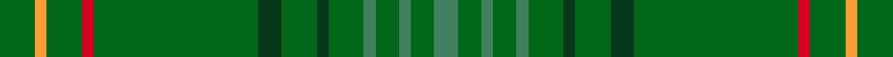

This page is one **sett** — a single exact thread-count. It belongs to the [tartan](/setts/dgi3lo1dgi3r1dgi14dg2dgi3dg1dgi3g1dgi2g1dgi2g2/)
(the same proportion at any scale), whose colour order is pattern [GGGGGGGGGGRGYG](/stripes/ggggggggggrgyg/).

Sourced from register-of-tartans.  It is a [14 stripe tartan](/stripes/stripes14/).

Original link https://www.tartanregister.gov.uk/tartanDetails.aspx?ref=3118

2 attestations — the source records this cloth was collapsed from (oldest owns this page)

<ul>
<li>01/01/1998 — New South Wales (register-of-tartans, <a href="https://www.tartanregister.gov.uk/tartanDetails.aspx?ref=3118">record</a>)  <em>Designed by Betty & Bradley Johnston of Murrumbateman to raise funds for the Cerebral Palsy Association of Australia and the Motor Neurone Association of Australia. Officially launched as the State tartan on 4th May 2000 at Glen Innes. Colours: the red represents the colour of the Waratah, the State flower, and the St George cross on the New South Wales Coat of Arms; gold represents the lion and stars on the Arms and the national flower, the wattle.</em></li>
<li>1998 — New South Wales (District) (tartans-authority, <a href="http://www.tartansauthority.com/tartan-ferret/display/2492/">record</a>)  <em>Designed by Betty & Bradley Johnston of Murrumbateman it was said to have been originally designed to raise funds for two charities - Cerebral Palsy Ass. of Australia and the Motor Neurone Ass. of Australia. However, it was officially launched as the State tartan on 4th May 2000 at Glen Innes. Design rationale: GREEN - Represents the sawtooth shaped green leaves of the floral emblem the Waratah flower, (Telopea speciosissima) the State Emblem proclaimed in 1962. Green also represents the evergreen perpetuity of the NSW tartan as one on the first registered and accredited Australian State tartans. RED - Red represents the Union Jack first raised on Australian soil by Captain James Cook at Sting Ray Harbour (Botany Bay) in 1770. Red is symbolic of the St George Cross and the Floral Emblem, the red Waratah (Telopea speciosissima). GOLD - Signifies the Golden Fleece, the sheaves of wheat and the rising sun, which symbolises agriculture in the State of NSW appearing on the coat of Arms. Gold is representative of the Golden Lion on the Cross of St George and the four, eight pointed stars representing the Southern Cross Constellation, which is unique to this hemisphere. BLACK - Signifies the uniqueness of the Black Opal found in the mines of North Western NSW. Is symbolic of the borders within Australia as the beginning of a penal colony.</em></li>
</ul>

## Register references

External register numbers recorded for this tartan.

- Scottish Register of Tartans: [3118](https://www.tartanregister.gov.uk/tartanDetails.aspx?ref=3118)
- Scottish Tartans Authority (ITI): 2492
- Scottish Tartans World Register: 2492

## Thread count
DGi/12 LO4 DGi12 R4 DGi56 DG8 DGi12 DG4 DGi12 G4 DGi8 G4 DGi8 G/8

One full sett is **292 threads**.

## Palette
<table><thead><tr><th>Colour</th><th>Shade</th><th>OKLCh</th></tr></thead><tbody><tr><td>DG</td><td><code style="background-color:#053819;">#053819</code> <small style="color:#888">#053819</small></td><td><small style="color:#888">oklch(30.0% 0.075 151.3)</small></td></tr><tr><td>DY</td><td><code style="background-color:#FF9C34;">#FF9C34</code> <small style="color:#888">#FF9C34</small></td><td><small style="color:#888">oklch(77.9% 0.161 61.8)</small></td></tr><tr><td>G</td><td><code style="background-color:#006818;">#006818</code> <small style="color:#888">#006818</small></td><td><small style="color:#888">oklch(45.0% 0.142 145.0)</small></td></tr><tr><td>Ga</td><td><code style="background-color:#408060;">#408060</code> <small style="color:#888">#408060</small></td><td><small style="color:#888">oklch(54.8% 0.084 160.1)</small></td></tr><tr><td>R</td><td><code style="background-color:#D60020;">#D60020</code> <small style="color:#888">#D60020</small></td><td><small style="color:#888">oklch(55.2% 0.224 25.5)</small></td></tr></tbody></table>

# Sample pattern

## Nearest variants

The nearest existing variants by ΔTartan distance, with this cloth at the top so the swatches line up against it.

ΔTartan

Threads

Variant

Sett

—

292

<a href="/variants/s14/dgi3lo1dgi3r1dgi14dg2dgi3dg1dgi3g1dgi2g1dgi2g2~x4~dgi1806142-g2203152/">New South Wales</a>

<a href="/ttd/edit/#slug=dy3dgi15dr2dgi2dr6dgi2dg6dgi2dg2dgi23g2dgi2~x2~dgi1804158-g2208144&amp;base=dgi3lo1dgi3r1dgi14dg2dgi3dg1dgi3g1dgi2g1dgi2g2~x4~dgi1806142-g2203152" title="compare in the TTD">2.49</a>

258

<a href="/variants/s12/dy3dgi15dr2dgi2dr6dgi2dg6dgi2dg2dgi23g2dgi2~x2~dgi1804158-g2208144/">INSEAD</a>

## Neighbour map

Every grey dot is one of 13620 variants placed by the first two principal components of the ΔTartan feature space (42% of its variance). Red is this tartan; blue dots are its nearest — click one to open its page.

<svg viewBox="0 0 640 380" role="img" style="max-width:100%;height:auto;border:1px solid #e0e0e0;border-radius:4px;display:block" xmlns="http://www.w3.org/2000/svg"><image href="/nn/cloud.v1.png" width="640" height="380"/><a href="/variants/s12/dy3dgi15dr2dgi2dr6dgi2dg6dgi2dg2dgi23g2dgi2~x2~dgi1804158-g2208144/"><circle cx="560.6" cy="224.2" r="4" fill="#3465a4"><title>INSEAD</title></circle></a><circle cx="583.3" cy="190.7" r="5" fill="#c00000"/><text x="320" y="376" text-anchor="middle" font-size="11" fill="#999">ground</text><text x="11" y="190" text-anchor="middle" font-size="11" fill="#999" transform="rotate(-90 11 190)">complexity</text></svg>

ID: /variants/s14/dgi3lo1dgi3r1dgi14dg2dgi3dg1dgi3g1dgi2g1dgi2g2~x4~dgi1806142-g2203152/
