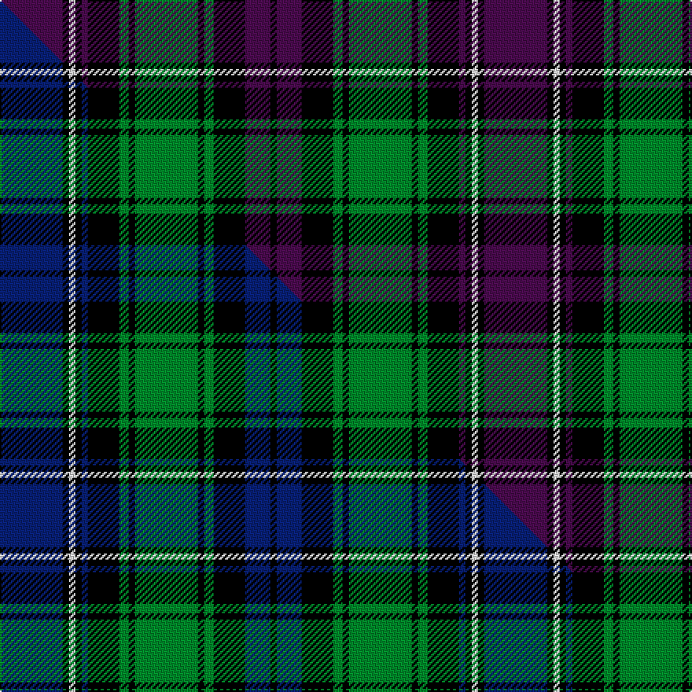

This page is one **sett** — a single exact thread-count. It belongs to the [tartan](/setts/dp20k2w2k2dp2k10g3k2g20k2g3k10dp8k2/)
(the same proportion at any scale), whose colour order is pattern [BKWKBKGKGKGKBK](/stripes/bkwkbkgkgkgkbk/).

Part of the [Caithelyn](/tartans/caithelyn/) tartan — the named design grouping this sett with its other cloths.

Sourced from tartans-authority.  It is a [14 stripe tartan](/stripes/stripes14/).

Original link http://www.tartansauthority.com/tartan-ferret/display/3252/

## Register references

External register numbers recorded for this tartan.

- Scottish Tartans Authority (ITI): 3252

## Thread count
DP/40 K4 W4 K4 DP4 K20 G6 K4 G40 K4 G6 K20 DP16 K/4

One full sett is **308 threads**.

## Palette
<table><thead><tr><th>Colour</th><th>Shade</th><th>OKLCh</th></tr></thead><tbody><tr><td>G</td><td><code style="background-color:#008B2A;">#008B2A</code> <small style="color:#888">#008B2A</small></td><td><small style="color:#888">oklch(55.4% 0.170 145.9)</small></td></tr><tr><td>K</td><td><code style="background-color:#000000;">#000000</code> <small style="color:#888">#000000</small></td><td><small style="color:#888">oklch(0.0% 0.000 0.0)</small></td></tr><tr><td>W</td><td><code style="background-color:#F7F7F7;">#F7F7F7</code> <small style="color:#888">#F7F7F7</small></td><td><small style="color:#888">oklch(97.6% 0.000 89.9)</small></td></tr><tr><td>DP</td><td><code style="background-color:#4B0B4F;">#4B0B4F</code> <small style="color:#888">#4B0B4F</small></td><td><small style="color:#888">oklch(30.1% 0.125 325.4)</small></td></tr></tbody></table>

# Sample pattern

## Compared to the master

This cloth is one sett of its design; the master sett (the exemplar the design is anchored on) is below for comparison.

Its **ΔTartan distance** from the master is **0.97** — the same measure the nearest-tartans table ranks by (0 is identical; a re-scale of the same cloth is near 0, a recolour or a different proportion further).

<figure class="master-compare" style="margin:0">

this sett
master sett ★

<figcaption style="color:#888;font-size:smaller">One weave of this sett against the <a href="/setts/db20k2w2k2db2k10g3k2g20k2g3k10db8k2/">master sett ★</a>, split on the diagonal: a shared proportion runs seamlessly across it with only the shades shifting; a different proportion breaks on it.</figcaption>
</figure>

ID: /variants/s14/dp20k2w2k2dp2k10g3k2g20k2g3k10dp8k2~x2/
