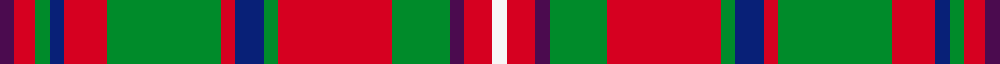

This page is one **sett** — a single exact thread-count. It belongs to the [tartan](/setts/dp2r3g2db2r6g16r2db4g2r16g8dp2r4w2/)
(the same proportion at any scale), whose colour order is pattern [BRGBRGRBGRGBRW](/stripes/brgbrgrbgrgbrw/).

Part of the [MacKinnon](/tartans/mackinnon/) tartan — the named design grouping this sett with its other cloths.

Sourced from register-of-tartans.  It is a [14 stripe tartan](/stripes/stripes14/).

Original link https://www.tartanregister.gov.uk/tartanDetails.aspx?ref=2542

## Provenance

Earliest known date: 1816 The MacKinnon tartan now generally available and approved by the chief, has altered its appearance over the years, and returned to the form of the earliest example. The collection of certified tartans made by the Highland Society of London (c.1816) includes a specimen signed by the Mackinnon in which the purple stripes are a light shade of azure, a minor change that is mirrored in other tartans, notably the Royal Stewart. Logan (1831) recorded these stripes in white, Smibert (1850) in pink, Smith (1850) in crimson, McIan (1847) in black and white and Grant (1886) as black. MacKinnons are associated with the Isle of Iona as early church leaders, and the name has been anglicized to 'Love'.

6 attestations — the source records this cloth was collapsed from (oldest owns this page)

<ul>
<li>01/01/1816 — MacKinnon (register-of-tartans, <a href="https://www.tartanregister.gov.uk/tartanDetails.aspx?ref=2542">record</a>)  <em>A very confusing situation with five different versions from five major works. However these are the colours and count approved by MacKinnon of MacKinnon Lyon Court Book No 11, 09/12/1960. Navy has been substituted for the Purple stipulated in the Lyon Court count. A letter to all its manufacturing members from the National Association of Scottish Woollen. Manufacturers dated 12/09/1959 advises that 'The Mackinnon of Mackinnon has this year recorded with the Lord Lyon the correct setts for the Clan and Hunting Tartans of the Clan Mackinnon.' This is said to be from the Highland Society of London sample circa 1816. Scottish Tartans Society Notes: The MacKinnon tartan now generally available and approved by the chief, has altered its appearance over the years, and returned to the form of the earliest example. The collection of certified tartans made by the Highland Society of London (c.1816) includes a specimen signed by the Mackinnon in which the purple stripes are a light shade of azure, a minor change that is mirrored in other tartans, notably the Royal Stewart.</em></li>
<li>1959 — MacKinnon - 1959 (Clan) (tartans-authority, <a href="http://www.tartansauthority.com/tartan-ferret/display/540/">record</a>)  <em>A very confusing situation with five different versions from five major works. However these are the colours and count approved by MacKinnon of MacKinnon Lyon Court Book No 11. 9th December 1960. Navy has been substituted for the Purple stipulated in the Lyon Court count. A letter to all its manufacturing members from the National Association of Scottish Woollen. Manufacturers dated 17th September 1959 advises that "The Mackinnon of Mackinnon has this year recorded with the Lord Lyon . . . the correct setts for the Clan and Hunting Tartans of the Clan Mackinnon." This is said to be from the HSL sample circa 1816. STS Notes: The MacKinnon tartan now generally available and approved by the chief, has altered its appearance over the years, and returned to the form of the earliest example. The collection of certified tartans made by the Highland Society of London (c.1816) includes a specimen signed by the Mackinnon in which the purple stripes are a light shade of azure, a minor change that is mirrored in other tartans, notably the Royal Stewart.</em></li>
<li>undated — MacKinnon #8 (register-of-tartans, <a href="https://www.tartanregister.gov.uk/tartanDetails.aspx?ref=2552">record</a>)  <em>Lyon Court books 09 /12/ 1960.</em></li>
<li>undated — MacKinnon 4 (weddslist, <a href="http://www.weddslist.com/cgi-bin/tartans/pg.pl?source=sts">record</a>) </li>
<li>undated — MacKinnon 5 (weddslist, <a href="http://www.weddslist.com/cgi-bin/tartans/pg.pl?source=sts">record</a>) </li>
<li>undated — MacKinnon Clan Tartan (house-of-tartan, <a href="http://www.house-of-tartan.scotland.net/house/TartanViewjs.asp?colr=Def&tnam=540">record</a>) </li>
</ul>

## Register references

External register numbers recorded for this tartan.

- Scottish Register of Tartans: [2552](https://www.tartanregister.gov.uk/tartanDetails.aspx?ref=2552)
- Scottish Tartans Authority (ITI): 540
- Scottish Tartans World Register: 1640

## Thread count
DP/4 R6 G4 DB4 R12 G32 R4 DB8 G4 R32 G16 DP4 R8 W/4

One full sett is **276 threads**.

## Palette
<table><thead><tr><th>Colour</th><th>Shade</th><th>OKLCh</th></tr></thead><tbody><tr><td>DB</td><td><code style="background-color:#082077;">#082077</code> <small style="color:#888">#082077</small></td><td><small style="color:#888">oklch(30.0% 0.149 265.1)</small></td></tr><tr><td>G</td><td><code style="background-color:#008B2A;">#008B2A</code> <small style="color:#888">#008B2A</small></td><td><small style="color:#888">oklch(55.4% 0.170 145.9)</small></td></tr><tr><td>LN</td><td><code style="background-color:#F7F7F7;">#F7F7F7</code> <small style="color:#888">#F7F7F7</small></td><td><small style="color:#888">oklch(97.6% 0.000 89.9)</small></td></tr><tr><td>P</td><td><code style="background-color:#4B0B4F;">#4B0B4F</code> <small style="color:#888">#4B0B4F</small></td><td><small style="color:#888">oklch(30.1% 0.125 325.4)</small></td></tr><tr><td>R</td><td><code style="background-color:#D60020;">#D60020</code> <small style="color:#888">#D60020</small></td><td><small style="color:#888">oklch(55.2% 0.224 25.5)</small></td></tr></tbody></table>

# Sample pattern

## Nearest variants

The nearest existing variants by ΔTartan distance, with this cloth at the top so the swatches line up against it.

ΔTartan

Threads

Variant

Sett

—

276

<a href="/variants/s14/dp2r3g2db2r6g16r2db4g2r16g8dp2r4w2~x2/">MacKinnon</a>

<a href="/ttd/edit/#slug=dp3r4g3db3r7g17r3db5g4r21g7dp3r6w3~x2&amp;base=dp2r3g2db2r6g16r2db4g2r16g8dp2r4w2~x2" title="compare in the TTD">0.34</a>

344

<a href="/variants/s14/dp3r4g3db3r7g17r3db5g4r21g7dp3r6w3~x2/">MacKinnon #3</a>

<a href="/ttd/edit/#slug=w2r4lb2g8r16g2db4r2g16r6db2g2r3lb2~x2&amp;base=dp2r3g2db2r6g16r2db4g2r16g8dp2r4w2~x2" title="compare in the TTD">0.60</a>

276

<a href="/variants/s14/w2r4lb2g8r16g2db4r2g16r6db2g2r3lb2~x2/">MacKinnon #2</a>

<a href="/ttd/edit/#slug=w3r5g3dp3r14g36r3dp8g3r36g14b3r5w3~x2&amp;base=dp2r3g2db2r6g16r2db4g2r16g8dp2r4w2~x2" title="compare in the TTD">1.52</a>

544

<a href="/variants/s14/w3r5g3dp3r14g36r3dp8g3r36g14b3r5w3~x2/">MacKinnon 3</a>

<a href="/ttd/edit/#slug=w1db1r7g2r2g6r1g6r2g2r8lo1~x4&amp;base=dp2r3g2db2r6g16r2db4g2r16g8dp2r4w2~x2" title="compare in the TTD">2.08</a>

304

<a href="/variants/s12/w1db1r7g2r2g6r1g6r2g2r8lo1~x4/">Bruce County (District)</a>

<a href="/ttd/edit/#slug=y1r8g2r2g6r1g6r2g2r7db1w1~x4&amp;base=dp2r3g2db2r6g16r2db4g2r16g8dp2r4w2~x2" title="compare in the TTD">2.08</a>

304

<a href="/variants/s12/y1r8g2r2g6r1g6r2g2r7db1w1~x4/">Bruce County</a>

<a href="/ttd/edit/#slug=y1r8g2r2g6r1g6r2g2r7db1w1~x2&amp;base=dp2r3g2db2r6g16r2db4g2r16g8dp2r4w2~x2" title="compare in the TTD">2.08</a>

152

<a href="/variants/s12/y1r8g2r2g6r1g6r2g2r7db1w1~x2/">Bruce County</a>

<a href="/ttd/edit/#slug=w2r4g8r16lb2r3g16r4lb2r4w2~x2&amp;base=dp2r3g2db2r6g16r2db4g2r16g8dp2r4w2~x2" title="compare in the TTD">2.82</a>

244

<a href="/variants/s11/w2r4g8r16lb2r3g16r4lb2r4w2~x2/">MacKinnon #10</a>

## Neighbour map

Every grey dot is one of 13620 variants placed by the first two principal components of the ΔTartan feature space (42% of its variance). Red is this tartan; blue dots are its nearest — click one to open its page.

<svg viewBox="0 0 640 380" role="img" style="max-width:100%;height:auto;border:1px solid #e0e0e0;border-radius:4px;display:block" xmlns="http://www.w3.org/2000/svg"><image href="/nn/cloud.v1.png" width="640" height="380"/><a href="/variants/s14/dp3r4g3db3r7g17r3db5g4r21g7dp3r6w3~x2/"><circle cx="211.1" cy="175.8" r="4" fill="#3465a4"><title>MacKinnon #3</title></circle></a><a href="/variants/s14/w2r4lb2g8r16g2db4r2g16r6db2g2r3lb2~x2/"><circle cx="218.1" cy="166.6" r="4" fill="#3465a4"><title>MacKinnon #2</title></circle></a><a href="/variants/s14/w3r5g3dp3r14g36r3dp8g3r36g14b3r5w3~x2/"><circle cx="257.4" cy="138.1" r="4" fill="#3465a4"><title>MacKinnon 3</title></circle></a><a href="/variants/s12/w1db1r7g2r2g6r1g6r2g2r8lo1~x4/"><circle cx="274.2" cy="186.5" r="4" fill="#3465a4"><title>Bruce County (District)</title></circle></a><a href="/variants/s12/y1r8g2r2g6r1g6r2g2r7db1w1~x4/"><circle cx="277.6" cy="187.9" r="4" fill="#3465a4"><title>Bruce County</title></circle></a><a href="/variants/s12/y1r8g2r2g6r1g6r2g2r7db1w1~x2/"><circle cx="277.6" cy="187.9" r="4" fill="#3465a4"><title>Bruce County</title></circle></a><a href="/variants/s11/w2r4g8r16lb2r3g16r4lb2r4w2~x2/"><circle cx="272.8" cy="192.6" r="4" fill="#3465a4"><title>MacKinnon #10</title></circle></a><circle cx="218.6" cy="165.8" r="5" fill="#c00000"/><text x="320" y="376" text-anchor="middle" font-size="11" fill="#999">ground</text><text x="11" y="190" text-anchor="middle" font-size="11" fill="#999" transform="rotate(-90 11 190)">complexity</text></svg>

ID: /variants/s14/dp2r3g2db2r6g16r2db4g2r16g8dp2r4w2~x2/
