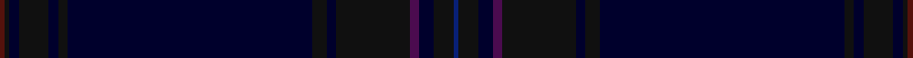

This is one **variant** — a specific cloth: this exact thread count and colourway, with its own
provenance below. It is one weaving of the [sett](/setts/dr1ki1k2ki6k2ki2k50ki3k2ki15dp2k3ki4db1/) (the scale-free proportion — the
same cloth at any scale or shade), whose colour order is pattern [BKKBKKKKKKKKKB](/stripes/bkkbkkkkkkkkkb/).

Part of the [Bowcutt, David](/tartans/b/bo/bowcutt-david/) tartan — the named design grouping this sett with its other cloths.

Sourced from tartans-authority.  It is a [14 stripe tartan](/stripes/stripes14/).

Original link [https://www.tartanregister.gov.uk/tartanDetails.aspx?ref=10495](https://www.tartanregister.gov.uk/tartanDetails.aspx?ref=10495)

Dataset <small>— provenance for this record, inherited from the source manifest</small>

<dl class="dataset-prov">
<dt>source</dt><dd><a href="/sources/tartans-authority/">Scottish Tartans Authority</a></dd>
<dt>data captured from</dt><dd><a href="https://github.com/thetartan/tartan-database/blob/master/data/tartans-authority/data.csv">https://github.com/thetartan/tartan-database/blob/master/data/tartans-authority/data.csv</a></dd>
<dt>data date</dt><dd>pre 2011 <small>(this record)</small></dd>
<dt>licence</dt><dd><a href="https://creativecommons.org/licenses/by-nc-nd/4.0/">CC BY-NC-ND 4.0</a></dd>
</dl>

Capture chain <small>— the hands this data passed through, oldest first; each capture carries its own licence</small>

<ol class="capture-chain">
<li><a href="https://www.tartansauthority.com/">Scottish Tartans Authority</a> <small>the heritage body's archive — its tartan-ferret record browser is retired (links repaired to the SRT, above)</small></li>
<li><a href="https://github.com/thetartan/tartan-database">thetartan/tartan-database</a> <small>2016-2017</small> · <a href="https://creativecommons.org/licenses/by-nc-nd/4.0/">CC BY-NC-ND 4.0</a> <small>Levko Kravets's frozen compilation — the capture we vendored, and where its CC licence text came from</small></li>
<li>this dictionary <small>captured 2026-06-10 · commit 5bf86c7566</small> <small>each re-capture is a git commit to data/sources</small></li>
</ol>

## Register references

External register numbers recorded for this tartan.

- Scottish Register of Tartans: [10495](https://www.tartanregister.gov.uk/tartanDetails?ref=10495)
- Scottish Tartans Authority (ITI): 10495

## Thread count
DR/2 Ki2 K4 Ki12 K4 Ki4 K100 Ki6 K4 Ki30 DP4 K6 Ki8 DB/2

One full sett is **372 threads**.

## Palette
<table><thead><tr><th>Colour</th><th>Shade</th><th>OKLCh</th></tr></thead><tbody><tr><td>DB</td><td><code style="background-color:#082077;">#082077</code> <small style="color:#888">#082077</small></td><td><small style="color:#888">oklch(30.0% 0.149 265.1)</small></td></tr><tr><td>K</td><td><code style="background-color:#00002C;">#00002C</code> <small style="color:#888">#00002C</small></td><td><small style="color:#888">oklch(13.2% 0.092 264.1)</small></td></tr><tr><td>DP</td><td><code style="background-color:#4B0B4F;">#4B0B4F</code> <small style="color:#888">#4B0B4F</small></td><td><small style="color:#888">oklch(30.1% 0.125 325.4)</small></td></tr><tr><td>DR</td><td><code style="background-color:#55120C;">#55120C</code> <small style="color:#888">#55120C</small></td><td><small style="color:#888">oklch(30.0% 0.099 29.3)</small></td></tr><tr><td>K</td><td><code style="background-color:#101010;">#101010</code> <small style="color:#888">#101010</small></td><td><small style="color:#888">oklch(17.3% 0.000 89.9)</small></td></tr></tbody></table>

# Sample pattern

ID: /variants/s14/dr1ki1k2ki6k2ki2k50ki3k2ki15dp2k3ki4db1~x2~ki0700000-k0504259/
