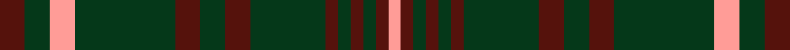

This page is one **sett** — a single exact thread-count. It belongs to the [tartan](/setts/dr2dg2lr2dg8dr2dg2dr2dg6dr1dg1dr1dg1dr1lr1/)
(the same proportion at any scale), whose colour order is pattern [BGYGBGBGBGBGBY](/stripes/bgygbgbgbgbgby/).

Sourced from register-of-tartans.  It is a [14 stripe tartan](/stripes/stripes14/).

Original link https://www.tartanregister.gov.uk/tartanDetails.aspx?ref=4252

## Register references

External register numbers recorded for this tartan.

- Scottish Register of Tartans: [4252](https://www.tartanregister.gov.uk/tartanDetails.aspx?ref=4252)
- Scottish Tartans Authority (ITI): 4405

## Thread count
DR/4 DG4 LR4 DG16 DR4 DG4 DR4 DG12 DR2 DG2 DR2 DG2 DR2 LR/2

One full sett is **122 threads**.

## Palette
<table><thead><tr><th>Colour</th><th>Shade</th><th>OKLCh</th></tr></thead><tbody><tr><td>DR</td><td><code style="background-color:#55120C;">#55120C</code> <small style="color:#888">#55120C</small></td><td><small style="color:#888">oklch(30.0% 0.099 29.3)</small></td></tr><tr><td>DG</td><td><code style="background-color:#053819;">#053819</code> <small style="color:#888">#053819</small></td><td><small style="color:#888">oklch(30.0% 0.075 151.3)</small></td></tr><tr><td>LR</td><td><code style="background-color:#FF9C97;">#FF9C97</code> <small style="color:#888">#FF9C97</small></td><td><small style="color:#888">oklch(79.3% 0.119 23.2)</small></td></tr></tbody></table>

# Sample pattern

ID: /variants/s14/dr2dg2lr2dg8dr2dg2dr2dg6dr1dg1dr1dg1dr1lr1~x2/
