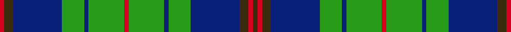

This is one **variant** — a specific cloth: this exact thread count and colourway, with its own
provenance below. It is one weaving of the [sett](/setts/dy1r1dy2db11g5db1g8r1g8db1g5db11dy2r1/) (the scale-free proportion — the
same cloth at any scale or shade), whose colour order is pattern [GRGBGBGRGBGBGR](/stripes/grgbgbgrgbgbgr/).

Part of the [New Mexico](/tartans/n/ne/new-mexico-2/) tartan — the named design grouping this sett with its other cloths.

Sourced from house-of-tartan.  It is a [14 stripe tartan](/stripes/stripes14/).

Original link [http://www.house-of-tartan.scotland.net/house/TartanViewjs.asp?colr=Def&tnam=2522](http://www.house-of-tartan.scotland.net/house/TartanViewjs.asp?colr=Def&tnam=2522)

## Provenance

Earliest known date: 1995 The official state tartan for New Mexico which was designed in 1995 by Ralph L. Stevenson and included in his petition for the first US 'Tartan Day'. The rights of the tartan were placed in the public domain. Doubts were expressed for some time as to its perceived status but on 26th May 2003 the situation was clarified when Rebecca Vigil-Giron, Secretary of State for the State of New Mexico, issued a proclamation confirming that this was indeed the official state tartan. Woven by NGSI Woolen Mills of New Mexico. The history of the State of New Mexico Tartan began in 1995 when a wide cross section of New Mexico citizens with Scottish, Welsh, Irish, Manx, Spanish (Galician) Celtic ancestry, and Native American backgrounds gave their opinions and suggestions. The final design was created by Ralph L. Stevenson, Jr., a New Mexico citizen of Scottish descent, and woven by Jean Jones, a former Santa Fe textile artist who now resides in Asheville, North Carolina. The State Library was chosen as the permanent home for the display because of former Governor Garrey E. Carruthers' support of the New Mexico Tartan, his Scottish descent, and the naming of the library building after him approximately two years ago. Four colors are woven into the State of New Mexico Tartan -- Blue for the All Encompassing Sky, Green for the State's Plant Life and Forests, Red for the Original Cultural Providers, and Gold for the Minerals and Desert.

Dataset <small>— provenance for this record, inherited from the source manifest</small>

<dl class="dataset-prov">
<dt>source</dt><dd><a href="/sources/house-of-tartan/">House of Tartan</a></dd>
<dt>data captured from</dt><dd><a href="https://github.com/thetartan/tartan-database/blob/master/data/house-of-tartan/data.csv">https://github.com/thetartan/tartan-database/blob/master/data/house-of-tartan/data.csv</a></dd>
<dt>data date</dt><dd>1995 <small>(this record)</small></dd>
<dt>licence</dt><dd><a href="https://creativecommons.org/licenses/by-nc-nd/4.0/">CC BY-NC-ND 4.0</a></dd>
</dl>

Capture chain <small>— the hands this data passed through, oldest first; each capture carries its own licence</small>

<ol class="capture-chain">
<li><a href="http://www.house-of-tartan.scotland.net/">House of Tartan</a> <small>the weaver/retailer's database — the site is now offline; the URL is kept as the ultimate source's identity</small></li>
<li><a href="https://github.com/thetartan/tartan-database">thetartan/tartan-database</a> <small>2016-2017</small> · <a href="https://creativecommons.org/licenses/by-nc-nd/4.0/">CC BY-NC-ND 4.0</a> <small>Levko Kravets's frozen compilation — the capture we vendored, and where its CC licence text came from</small></li>
<li>this dictionary <small>captured 2026-06-10 · commit 5bf86c7566</small> <small>each re-capture is a git commit to data/sources</small></li>
</ol>

## Thread count
R/4 DY8 DB44 G20 DB4 G32 R4 G32 DB4 G20 DB44 DY8 R4 DY/4

One full sett is **456 threads**.

## Palette
<table><thead><tr><th>Colour</th><th>Shade</th><th>OKLCh</th></tr></thead><tbody><tr><td>DB</td><td><code style="background-color:#082077;">#082077</code> <small style="color:#888">#082077</small></td><td><small style="color:#888">oklch(30.0% 0.149 265.1)</small></td></tr><tr><td>DG</td><td><code style="background-color:#006818;">#006818</code> <small style="color:#888">#006818</small></td><td><small style="color:#888">oklch(45.0% 0.142 145.0)</small></td></tr><tr><td>G</td><td><code style="background-color:#289C18;">#289C18</code> <small style="color:#888">#289C18</small></td><td><small style="color:#888">oklch(60.6% 0.191 141.6)</small></td></tr><tr><td>R</td><td><code style="background-color:#D60020;">#D60020</code> <small style="color:#888">#D60020</small></td><td><small style="color:#888">oklch(55.2% 0.224 25.5)</small></td></tr><tr><td>DY</td><td><code style="background-color:#3A2B0D;">#3A2B0D</code> <small style="color:#888">#3A2B0D</small></td><td><small style="color:#888">oklch(30.0% 0.049 82.0)</small></td></tr></tbody></table>

# Sample pattern

## Nearest tartan variants

The nearest existing variants by ΔTartan distance, with this cloth at the top so the swatches line up against it.

ΔTartan

Threads

Variant

Sett

—

456

<a href="/variants/s14/dy1r1dy2db11g5db1g8r1g8db1g5db11dy2r1~x4~g2408144/">New Mexico District Tartan</a>

<a href="/ttd/edit/#slug=g8db3y1g6r1g7db7y1db6r1g3db12g3y1r1~x2&amp;base=dy1r1dy2db11g5db1g8r1g8db1g5db11dy2r1~x4~g2408144" title="compare in the TTD">1.53</a>

226

<a href="/variants/s15/g8db3y1g6r1g7db7y1db6r1g3db12g3y1r1~x2/">Platt Family Tartan</a>

<a href="/ttd/edit/#slug=g11r4g4r7g41db11lb4db41r4db8&amp;base=dy1r1dy2db11g5db1g8r1g8db1g5db11dy2r1~x4~g2408144" title="compare in the TTD">2.16</a>

251

<a href="/variants/s10/g11r4g4r7g41db11lb4db41r4db8/">Stuart/Stewart of Appin #2</a>

<a href="/ttd/edit/#slug=g27r2g3r3db3ly2db14r2db3ly3db3r2db14~x2&amp;base=dy1r1dy2db11g5db1g8r1g8db1g5db11dy2r1~x4~g2408144" title="compare in the TTD">2.19</a>

242

<a href="/variants/s13/g27r2g3r3db3ly2db14r2db3ly3db3r2db14~x2/">Crowne Plaza (Corporate)</a>

<a href="/ttd/edit/#slug=g8r3g3r5g26db7lb3db28r3db6~x2&amp;base=dy1r1dy2db11g5db1g8r1g8db1g5db11dy2r1~x4~g2408144" title="compare in the TTD">2.19</a>

340

<a href="/variants/s10/g8r3g3r5g26db7lb3db28r3db6~x2/">Stewart of Appin Htg (error)</a>

<a href="/ttd/edit/#slug=r2db12w1db1g1r1g7db1g12w1~x4&amp;base=dy1r1dy2db11g5db1g8r1g8db1g5db11dy2r1~x4~g2408144" title="compare in the TTD">2.46</a>

300

<a href="/variants/s10/r2db12w1db1g1r1g7db1g12w1~x4/">Tennessee State (US State)</a>

<a href="/ttd/edit/#slug=g2db1lb6db10g4db1g1r1g1db1g18r1g4db6lb6db1~x4&amp;base=dy1r1dy2db11g5db1g8r1g8db1g5db11dy2r1~x4~g2408144" title="compare in the TTD">2.53</a>

500

<a href="/variants/s16/g2db1lb6db10g4db1g1r1g1db1g18r1g4db6lb6db1~x4/">Tiger</a>

<a href="/ttd/edit/#slug=g2db1lb6db6g4r1g18db1g1r1g1db1g4db10lb6db1~x4&amp;base=dy1r1dy2db11g5db1g8r1g8db1g5db11dy2r1~x4~g2408144" title="compare in the TTD">2.53</a>

500

<a href="/variants/s16/g2db1lb6db6g4r1g18db1g1r1g1db1g4db10lb6db1~x4/">Pina (Corporate)</a>

<a href="/ttd/edit/#slug=dy1r1dy2db11g5db1g8r1~x4~g2408144&amp;base=dy1r1dy2db11g5db1g8r1g8db1g5db11dy2r1~x4~g2408144" title="compare in the TTD">2.53</a>

232

<a href="/variants/s8/dy1r1dy2db11g5db1g8r1~x4~g2408144/">New Mexico, State of</a>

<a href="/ttd/edit/#slug=db24g4db3g4db24g6w3g4r3g8ly3g8r3g4w3g6~x2&amp;base=dy1r1dy2db11g5db1g8r1g8db1g5db11dy2r1~x4~g2408144" title="compare in the TTD">2.55</a>

380

<a href="/variants/s16/db24g4db3g4db24g6w3g4r3g8ly3g8r3g4w3g6~x2/">Scottish Borders Tourist Board</a>

<a href="/ttd/edit/#slug=g28r12g4db20y2db3y2db3g7~x2&amp;base=dy1r1dy2db11g5db1g8r1g8db1g5db11dy2r1~x4~g2408144" title="compare in the TTD">2.64</a>

254

<a href="/variants/s9/g28r12g4db20y2db3y2db3g7~x2/">Cork</a>

## Neighbour map

Every grey dot is one of 13621 variants placed by the first two principal components of the ΔTartan feature space (42% of its variance). Red is this tartan; blue dots are its nearest — click one to open its page. The map is a flat projection of a many-dimensional space — [how to read it](/posts/neighbourhood-maps/).

<svg viewBox="0 0 640 380" role="img" style="max-width:100%;height:auto;border:1px solid #e0e0e0;border-radius:4px;display:block" xmlns="http://www.w3.org/2000/svg"><image href="/nn/cloud.v1.png" width="640" height="380"/><a href="/variants/s15/g8db3y1g6r1g7db7y1db6r1g3db12g3y1r1~x2/"><circle cx="264.6" cy="184.3" r="4" fill="#3465a4"><title>Platt Family Tartan</title></circle></a><a href="/variants/s10/g11r4g4r7g41db11lb4db41r4db8/"><circle cx="258.5" cy="182.6" r="4" fill="#3465a4"><title>Stuart/Stewart of Appin #2</title></circle></a><a href="/variants/s13/g27r2g3r3db3ly2db14r2db3ly3db3r2db14~x2/"><circle cx="258.2" cy="151.1" r="4" fill="#3465a4"><title>Crowne Plaza (Corporate)</title></circle></a><a href="/variants/s10/g8r3g3r5g26db7lb3db28r3db6~x2/"><circle cx="250.1" cy="189.0" r="4" fill="#3465a4"><title>Stewart of Appin Htg (error)</title></circle></a><a href="/variants/s10/r2db12w1db1g1r1g7db1g12w1~x4/"><circle cx="285.5" cy="168.8" r="4" fill="#3465a4"><title>Tennessee State (US State)</title></circle></a><a href="/variants/s16/g2db1lb6db10g4db1g1r1g1db1g18r1g4db6lb6db1~x4/"><circle cx="259.5" cy="139.2" r="4" fill="#3465a4"><title>Tiger</title></circle></a><a href="/variants/s16/g2db1lb6db6g4r1g18db1g1r1g1db1g4db10lb6db1~x4/"><circle cx="259.5" cy="139.2" r="4" fill="#3465a4"><title>Pina (Corporate)</title></circle></a><a href="/variants/s8/dy1r1dy2db11g5db1g8r1~x4~g2408144/"><circle cx="246.8" cy="194.1" r="4" fill="#3465a4"><title>New Mexico, State of</title></circle></a><a href="/variants/s16/db24g4db3g4db24g6w3g4r3g8ly3g8r3g4w3g6~x2/"><circle cx="211.7" cy="162.0" r="4" fill="#3465a4"><title>Scottish Borders Tourist Board</title></circle></a><a href="/variants/s9/g28r12g4db20y2db3y2db3g7~x2/"><circle cx="278.0" cy="182.2" r="4" fill="#3465a4"><title>Cork</title></circle></a><circle cx="240.0" cy="178.0" r="5" fill="#c00000"/><text x="320" y="376" text-anchor="middle" font-size="11" fill="#999">ground</text><text x="11" y="190" text-anchor="middle" font-size="11" fill="#999" transform="rotate(-90 11 190)">complexity</text></svg>

ID: /variants/s14/dy1r1dy2db11g5db1g8r1g8db1g5db11dy2r1~x4~g2408144/
