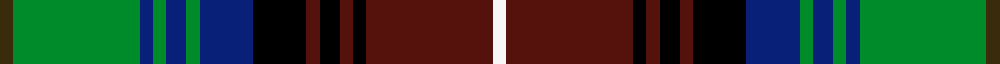

This page is one **sett** — a single exact thread-count. It belongs to the [tartan](/setts/dy2g19db2g2db3g2db8k8dr2k3dr2k2dr19w2/)
(the same proportion at any scale), whose colour order is pattern [GGBGBGBKBKBKBW](/stripes/ggbgbgbkbkbkbw/).

Sourced from register-of-tartans.  It is a [14 stripe tartan](/stripes/stripes14/).

Original link https://www.tartanregister.gov.uk/tartanDetails.aspx?ref=6000

## Register references

External register numbers recorded for this tartan.

- Scottish Register of Tartans: [6000](https://www.tartanregister.gov.uk/tartanDetails.aspx?ref=6000)
- Scottish Tartans World Register: 3291

## Thread count
DY/4 G38 DB4 G4 DB6 G4 DB16 K16 DR4 K6 DR4 K4 DR38 W/4

One full sett is **296 threads**.

## Palette
<table><thead><tr><th>Colour</th><th>Shade</th><th>OKLCh</th></tr></thead><tbody><tr><td>DB</td><td><code style="background-color:#082077;">#082077</code> <small style="color:#888">#082077</small></td><td><small style="color:#888">oklch(30.0% 0.149 265.1)</small></td></tr><tr><td>DR</td><td><code style="background-color:#55120C;">#55120C</code> <small style="color:#888">#55120C</small></td><td><small style="color:#888">oklch(30.0% 0.099 29.3)</small></td></tr><tr><td>DY</td><td><code style="background-color:#3A2B0D;">#3A2B0D</code> <small style="color:#888">#3A2B0D</small></td><td><small style="color:#888">oklch(30.0% 0.049 82.0)</small></td></tr><tr><td>G</td><td><code style="background-color:#008B2A;">#008B2A</code> <small style="color:#888">#008B2A</small></td><td><small style="color:#888">oklch(55.4% 0.170 145.9)</small></td></tr><tr><td>K</td><td><code style="background-color:#000000;">#000000</code> <small style="color:#888">#000000</small></td><td><small style="color:#888">oklch(0.0% 0.000 0.0)</small></td></tr><tr><td>LN</td><td><code style="background-color:#F7F7F7;">#F7F7F7</code> <small style="color:#888">#F7F7F7</small></td><td><small style="color:#888">oklch(97.6% 0.000 89.9)</small></td></tr></tbody></table>

# Sample pattern

ID: /variants/s14/dy2g19db2g2db3g2db8k8dr2k3dr2k2dr19w2~x2/
