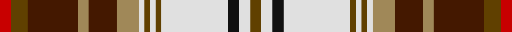

This page is one **sett** — a single exact thread-count. It belongs to the [tartan](/setts/dy2w2k2w12dy1w1dy1w1lo4do5lo2do9dy3r2/)
(the same proportion at any scale), whose colour order is pattern [GWKWGWGWYBYBGR](/stripes/gwkwgwgwybybgr/).

Part of the [Harrods](/tartans/harrods/) tartan — the named design grouping this sett with its other cloths.

Sourced from tartans-authority.  It is a [14 stripe tartan](/stripes/stripes14/).

Original link http://www.tartansauthority.com/tartan-ferret/display/2551/

## Register references

External register numbers recorded for this tartan.

- Scottish Tartans Authority (ITI): 2551

## Thread count
R/4 T6 DR18 LT4 DR10 LT8 LN2 T2 LN2 T2 LN24 K4 LN4 T/4

One full sett is **180 threads**.

## Palette

Palette: <strong>Tartan Register</strong>
<table><thead><tr><th>Colour</th><th>Threads</th><th>Shade</th><th>Base</th><th>OKLCh</th></tr></thead><tbody><tr><td>R/</td><td style="text-align:right;font-variant-numeric:tabular-nums">4</td><td><code style="background-color:#C80000;">#C80000</code> <small style="color:#888">#C80000</small></td><td>R <code style="background-color:#CC0000;">#CC0000</code></td><td><small style="color:#888">oklch(52.3% 0.215 29.2)</small></td></tr><tr><td>T</td><td style="text-align:right;font-variant-numeric:tabular-nums">6</td><td><code style="background-color:#604000;">#604000</code> <small style="color:#888">#604000</small></td><td>G <code style="background-color:#006100;">#006100</code></td><td><small style="color:#888">oklch(39.8% 0.083 76.8)</small></td></tr><tr><td>DR</td><td style="text-align:right;font-variant-numeric:tabular-nums">18</td><td><code style="background-color:#441800;">#441800</code> <small style="color:#888">#441800</small></td><td>B <code style="background-color:#2A418A;">#2A418A</code></td><td><small style="color:#888">oklch(27.3% 0.076 46.3)</small></td></tr><tr><td>LT</td><td style="text-align:right;font-variant-numeric:tabular-nums">4</td><td><code style="background-color:#A08858;">#A08858</code> <small style="color:#888">#A08858</small></td><td>Y <code style="background-color:#F2BF00;">#F2BF00</code></td><td><small style="color:#888">oklch(63.7% 0.071 84.0)</small></td></tr><tr><td>DR</td><td style="text-align:right;font-variant-numeric:tabular-nums">10</td><td><code style="background-color:#441800;">#441800</code> <small style="color:#888">#441800</small></td><td>B <code style="background-color:#2A418A;">#2A418A</code></td><td><small style="color:#888">oklch(27.3% 0.076 46.3)</small></td></tr><tr><td>LT</td><td style="text-align:right;font-variant-numeric:tabular-nums">8</td><td><code style="background-color:#A08858;">#A08858</code> <small style="color:#888">#A08858</small></td><td>Y <code style="background-color:#F2BF00;">#F2BF00</code></td><td><small style="color:#888">oklch(63.7% 0.071 84.0)</small></td></tr><tr><td>LN</td><td style="text-align:right;font-variant-numeric:tabular-nums">2</td><td><code style="background-color:#E0E0E0;">#E0E0E0</code> <small style="color:#888">#E0E0E0</small></td><td>W <code style="background-color:#F7F7F7;">#F7F7F7</code></td><td><small style="color:#888">oklch(90.7% 0.000 89.9)</small></td></tr><tr><td>T</td><td style="text-align:right;font-variant-numeric:tabular-nums">2</td><td><code style="background-color:#604000;">#604000</code> <small style="color:#888">#604000</small></td><td>G <code style="background-color:#006100;">#006100</code></td><td><small style="color:#888">oklch(39.8% 0.083 76.8)</small></td></tr><tr><td>LN</td><td style="text-align:right;font-variant-numeric:tabular-nums">2</td><td><code style="background-color:#E0E0E0;">#E0E0E0</code> <small style="color:#888">#E0E0E0</small></td><td>W <code style="background-color:#F7F7F7;">#F7F7F7</code></td><td><small style="color:#888">oklch(90.7% 0.000 89.9)</small></td></tr><tr><td>T</td><td style="text-align:right;font-variant-numeric:tabular-nums">2</td><td><code style="background-color:#604000;">#604000</code> <small style="color:#888">#604000</small></td><td>G <code style="background-color:#006100;">#006100</code></td><td><small style="color:#888">oklch(39.8% 0.083 76.8)</small></td></tr><tr><td>LN</td><td style="text-align:right;font-variant-numeric:tabular-nums">24</td><td><code style="background-color:#E0E0E0;">#E0E0E0</code> <small style="color:#888">#E0E0E0</small></td><td>W <code style="background-color:#F7F7F7;">#F7F7F7</code></td><td><small style="color:#888">oklch(90.7% 0.000 89.9)</small></td></tr><tr><td>K</td><td style="text-align:right;font-variant-numeric:tabular-nums">4</td><td><code style="background-color:#101010;">#101010</code> <small style="color:#888">#101010</small></td><td>K <code style="background-color:#000000;">#000000</code></td><td><small style="color:#888">oklch(17.3% 0.000 89.9)</small></td></tr><tr><td>LN</td><td style="text-align:right;font-variant-numeric:tabular-nums">4</td><td><code style="background-color:#E0E0E0;">#E0E0E0</code> <small style="color:#888">#E0E0E0</small></td><td>W <code style="background-color:#F7F7F7;">#F7F7F7</code></td><td><small style="color:#888">oklch(90.7% 0.000 89.9)</small></td></tr><tr><td>T/</td><td style="text-align:right;font-variant-numeric:tabular-nums">4</td><td><code style="background-color:#604000;">#604000</code> <small style="color:#888">#604000</small></td><td>G <code style="background-color:#006100;">#006100</code></td><td><small style="color:#888">oklch(39.8% 0.083 76.8)</small></td></tr></tbody></table>

## Compared to the master

This cloth is one sett of its design; the master sett (the exemplar the design is anchored on) is below for comparison.

<figure style="margin:0"><figcaption style="color:#888;font-size:smaller">this sett</figcaption></figure>
<figure style="margin:0"><figcaption style="color:#888;font-size:smaller"><a href="/setts/dy3do9lo2do5lo4w1dy1w1dy1w12k2w2dy2w2k2w12dy1w1dy1w1lo4do5lo2do9dy3r2/">master sett →</a></figcaption></figure>

## Nearest tartans

The nearest existing variants by ΔTartan distance, with this tartan at the top so the swatches line up against it.

ΔTartan

Tartan

Sett

—

<a href="/ttd/edit/#slug=dy2w2k2w12dy1w1dy1w1lo4do5lo2do9dy3r2~x2">Harrods (Corporate)</a> <a class="nn-out" href="/variants/s14/dy2w2k2w12dy1w1dy1w1lo4do5lo2do9dy3r2~x2/" title="open its dictionary page">↗</a>

0.26

<a href="/ttd/edit/#slug=r2oi3dr9o2dr5o4w1oi1w1oi1w12k2w2oi2~x2&amp;base=dy2w2k2w12dy1w1dy1w1lo4do5lo2do9dy3r2~x2">Harrods</a> <a class="nn-out" href="/variants/s14/r2oi3dr9o2dr5o4w1oi1w1oi1w12k2w2oi2~x2/" title="open its dictionary page">↗</a>

0.38

<a href="/ttd/edit/#slug=lo35r3k21r3g21lo6w3k3w3lo6lb15w3k6w6~x2&amp;base=dy2w2k2w12dy1w1dy1w1lo4do5lo2do9dy3r2~x2">Dundee (2003)</a> <a class="nn-out" href="/variants/s14/lo35r3k21r3g21lo6w3k3w3lo6lb15w3k6w6~x2/" title="open its dictionary page">↗</a>

0.49

<a href="/ttd/edit/#slug=r5w23db5w5k7ly3k3w2k3dg16r8dg3r6w3~x2&amp;base=dy2w2k2w12dy1w1dy1w1lo4do5lo2do9dy3r2~x2">Victoria Highland Dress</a> <a class="nn-out" href="/variants/s14/r5w23db5w5k7ly3k3w2k3dg16r8dg3r6w3~x2/" title="open its dictionary page">↗</a>

0.71

<a href="/ttd/edit/#slug=db3ly5r4k4db14w3ly4r4k2r4ly4w3g17w3k3r22w3~x2&amp;base=dy2w2k2w12dy1w1dy1w1lo4do5lo2do9dy3r2~x2">MacPherson 4</a> <a class="nn-out" href="/variants/s17/db3ly5r4k4db14w3ly4r4k2r4ly4w3g17w3k3r22w3~x2/" title="open its dictionary page">↗</a>

0.79

<a href="/ttd/edit/#slug=db1ly3r3k2db8ly3r2k1r2ly3g8w1k1r12w1~x2&amp;base=dy2w2k2w12dy1w1dy1w1lo4do5lo2do9dy3r2~x2">MacPherson 5</a> <a class="nn-out" href="/variants/s15/db1ly3r3k2db8ly3r2k1r2ly3g8w1k1r12w1~x2/" title="open its dictionary page">↗</a>

0.81

<a href="/ttd/edit/#slug=db3ly5r4k4db14w3ly4r4k2r4ly4w3dg17w3k3r22w3~x2&amp;base=dy2w2k2w12dy1w1dy1w1lo4do5lo2do9dy3r2~x2">MacPherson #3</a> <a class="nn-out" href="/variants/s17/db3ly5r4k4db14w3ly4r4k2r4ly4w3dg17w3k3r22w3~x2/" title="open its dictionary page">↗</a>

0.93

<a href="/ttd/edit/#slug=db1ly3r3k2db8ly3r2k1r2ly3dg8w1k1r12w1~x2&amp;base=dy2w2k2w12dy1w1dy1w1lo4do5lo2do9dy3r2~x2">MacPherson #2</a> <a class="nn-out" href="/variants/s15/db1ly3r3k2db8ly3r2k1r2ly3dg8w1k1r12w1~x2/" title="open its dictionary page">↗</a>

0.94

<a href="/ttd/edit/#slug=ly6k2r15g5r8k12w24t2w4t2~x2&amp;base=dy2w2k2w12dy1w1dy1w1lo4do5lo2do9dy3r2~x2">Gillies, dress Red</a> <a class="nn-out" href="/variants/s10/ly6k2r15g5r8k12w24t2w4t2~x2/" title="open its dictionary page">↗</a>

0.95

<a href="/ttd/edit/#slug=lo2r15lo3dr2lo3k14lo2t6w2t6lo2r7t10w1~x2&amp;base=dy2w2k2w12dy1w1dy1w1lo4do5lo2do9dy3r2~x2">Dalrymple of Castleton</a> <a class="nn-out" href="/variants/s14/lo2r15lo3dr2lo3k14lo2t6w2t6lo2r7t10w1~x2/" title="open its dictionary page">↗</a>

0.98

<a href="/variants/s16/r22lt3db5ly2r2w2dg11db4w3~x2/">Norwich No.014</a>

## Neighbour map

Every grey dot is one of 14360 variants placed by the first two principal components of the ΔTartan feature space (44% of its variance). Red is this tartan; blue dots are its nearest — click one to open its page.

<svg viewBox="0 0 640 380" role="img" style="max-width:100%;height:auto;border:1px solid #e0e0e0;border-radius:4px;display:block" xmlns="http://www.w3.org/2000/svg"><image href="/nn/cloud.v1.png" width="640" height="380"/><a href="/variants/s14/r2oi3dr9o2dr5o4w1oi1w1oi1w12k2w2oi2~x2/"><circle cx="98.9" cy="98.0" r="4" fill="#3465a4"><title>Harrods</title></circle></a><a href="/variants/s14/lo35r3k21r3g21lo6w3k3w3lo6lb15w3k6w6~x2/"><circle cx="95.7" cy="94.9" r="4" fill="#3465a4"><title>Dundee (2003)</title></circle></a><a href="/variants/s14/r5w23db5w5k7ly3k3w2k3dg16r8dg3r6w3~x2/"><circle cx="87.0" cy="103.3" r="4" fill="#3465a4"><title>Victoria Highland Dress</title></circle></a><a href="/variants/s17/db3ly5r4k4db14w3ly4r4k2r4ly4w3g17w3k3r22w3~x2/"><circle cx="77.6" cy="93.9" r="4" fill="#3465a4"><title>MacPherson 4</title></circle></a><a href="/variants/s15/db1ly3r3k2db8ly3r2k1r2ly3g8w1k1r12w1~x2/"><circle cx="112.6" cy="98.5" r="4" fill="#3465a4"><title>MacPherson 5</title></circle></a><a href="/variants/s17/db3ly5r4k4db14w3ly4r4k2r4ly4w3dg17w3k3r22w3~x2/"><circle cx="84.5" cy="94.9" r="4" fill="#3465a4"><title>MacPherson #3</title></circle></a><a href="/variants/s15/db1ly3r3k2db8ly3r2k1r2ly3dg8w1k1r12w1~x2/"><circle cx="119.6" cy="99.5" r="4" fill="#3465a4"><title>MacPherson #2</title></circle></a><a href="/variants/s10/ly6k2r15g5r8k12w24t2w4t2~x2/"><circle cx="92.1" cy="112.0" r="4" fill="#3465a4"><title>Gillies, dress Red</title></circle></a><a href="/variants/s14/lo2r15lo3dr2lo3k14lo2t6w2t6lo2r7t10w1~x2/"><circle cx="94.6" cy="108.4" r="4" fill="#3465a4"><title>Dalrymple of Castleton</title></circle></a><a href="/variants/s16/r22lt3db5ly2r2w2dg11db4w3~x2/"><circle cx="82.5" cy="97.2" r="4" fill="#3465a4"><title>Norwich No.014</title></circle></a><circle cx="100.1" cy="99.4" r="5" fill="#c00000"/></svg>

ID: /variants/s14/dy2w2k2w12dy1w1dy1w1lo4do5lo2do9dy3r2~x2/
