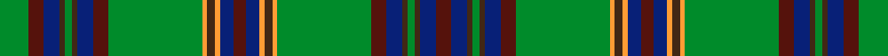

This is one **variant** — a specific cloth: this exact thread count and colourway, with its own
provenance below. It is one weaving of the [sett](/setts/g11dr6db6do2g3do2db6dr6g36lo2do3lo2db5dr5/) (the scale-free proportion — the
same cloth at any scale or shade), whose colour order is pattern [BBBGBBBGYBYBBBYBYGBBBGBBBG](/stripes/bbbgbbbgybybbbybygbbbgbbbg/).

Part of the [Westmeath](/tartans/w/we/westmeath/) tartan — the named design grouping this sett with its other cloths.

Sourced from register-of-tartans.  It is a [26 stripe tartan](/stripes/stripes26/).

Original link [https://www.tartanregister.gov.uk/tartanDetails.aspx?ref=4608](https://www.tartanregister.gov.uk/tartanDetails.aspx?ref=4608)

2 attestations — the source records this cloth was collapsed from (oldest owns this page)

<ul>
<li>01/01/1996 — Westmeath (register-of-tartans, <a href="https://www.tartanregister.gov.uk/tartanDetails.aspx?ref=4608">record</a>)  <em>One of a series of Irish District tartans designed by Polly Wittering of the House of Edgar. These are not 'officially sanctioned' District tartans but have apparently proved popular and no doubt in time will be accepted as genuine District rather than Fashion tartans. Sample in Scottish Tartans Authority's Johnston Collection. Designed for Macnaughtons of Pitlochry as a collection of trade tartans.</em></li>
<li>1997 — Westmeath (District) (tartans-authority, <a href="https://www.tartanregister.gov.uk/tartanDetails.aspx?ref=2278">record</a>)  <em>One of a series of Irish District tartans designed by Polly Wittering of the House of Edgar. These were not 'officially sanctioned' District tartans but, like many of their historic district tartan predecessors have apparently proved popular enough to be regarded as 'District' rather than their original categorisation of 'Fashion'. Sample in STA's Johnston Collection.</em></li>
</ul>

Dataset <small>— provenance for this record, inherited from the source manifest</small>

<dl class="dataset-prov">
<dt>source</dt><dd><a href="/sources/register-of-tartans/">Scottish Register of Tartans</a></dd>
<dt>data captured from</dt><dd><a href="https://github.com/thetartan/tartan-database/blob/master/data/register-of-tartans/data.csv">https://github.com/thetartan/tartan-database/blob/master/data/register-of-tartans/data.csv</a></dd>
<dt>data date</dt><dd>1996 <small>(this record)</small></dd>
<dt>licence</dt><dd><a href="https://www.tartanregister.gov.uk/copyright">Crown copyright</a></dd>
</dl>

Capture chain <small>— the hands this data passed through, oldest first; each capture carries its own licence</small>

<ol class="capture-chain">
<li><a href="https://www.tartanregister.gov.uk/">Scottish Register of Tartans</a> · <a href="https://www.tartanregister.gov.uk/copyright">Crown copyright</a> <small>the living register — still published by National Records of Scotland</small></li>
<li><a href="https://github.com/thetartan/tartan-database">thetartan/tartan-database</a> <small>2016-2017</small> · <a href="https://creativecommons.org/licenses/by-nc-nd/4.0/">CC BY-NC-ND 4.0</a> <small>Levko Kravets's frozen compilation — the capture we vendored, and where its CC licence text came from</small></li>
<li>this dictionary <small>captured 2026-06-10 · commit 5bf86c7566</small> <small>each re-capture is a git commit to data/sources</small></li>
</ol>

## Register references

External register numbers recorded for this tartan.

- Scottish Register of Tartans: [4608](https://www.tartanregister.gov.uk/tartanDetails.aspx?ref=4608)
- Scottish Tartans Authority (ITI): 2278
- Scottish Tartans World Register: 2278

## Thread count
G/22 DR12 DB12 DO4 G6 DO4 DB12 DR12 G72 LO4 DO6 LO4 DB10 DR10 DB10 LO4 DO6 LO4 G72 DR12 DB12 DO4 G6 DO4 DB12 DR/12

One full sett is **662 threads**.

## Palette
<table><thead><tr><th>Colour</th><th>Shade</th><th>OKLCh</th></tr></thead><tbody><tr><td>DB</td><td><code style="background-color:#082077;">#082077</code> <small style="color:#888">#082077</small></td><td><small style="color:#888">oklch(30.0% 0.149 265.1)</small></td></tr><tr><td>DR</td><td><code style="background-color:#55120C;">#55120C</code> <small style="color:#888">#55120C</small></td><td><small style="color:#888">oklch(30.0% 0.099 29.3)</small></td></tr><tr><td>LO</td><td><code style="background-color:#FF9C34;">#FF9C34</code> <small style="color:#888">#FF9C34</small></td><td><small style="color:#888">oklch(77.9% 0.161 61.8)</small></td></tr><tr><td>G</td><td><code style="background-color:#008B2A;">#008B2A</code> <small style="color:#888">#008B2A</small></td><td><small style="color:#888">oklch(55.4% 0.170 145.9)</small></td></tr><tr><td>DO</td><td><code style="background-color:#412714;">#412714</code> <small style="color:#888">#412714</small></td><td><small style="color:#888">oklch(30.1% 0.050 55.7)</small></td></tr></tbody></table>

# Sample pattern

## Nearest tartan variants

The nearest existing variants by ΔTartan distance, with this cloth at the top so the swatches line up against it.

ΔTartan

Threads

Variant

Sett

—

662

<a href="/variants/s14/g11dr6db6do2g3do2db6dr6g36lo2do3lo2db5dr5~x2/">Westmeath</a>

<a href="/ttd/edit/#slug=g11r6db6o2g3o2db6r6g36y2o2y2db5r5~x2&amp;base=g11dr6db6do2g3do2db6dr6g36lo2do3lo2db5dr5~x2" title="compare in the TTD">0.67</a>

344

<a href="/variants/s14/g11r6db6o2g3o2db6r6g36y2o2y2db5r5~x2/">Westmeath</a>

<a href="/ttd/edit/#slug=g11dr6db6dg2g3dg2db6dr6g36lo2dg3lo2db5dr5~x2&amp;base=g11dr6db6do2g3do2db6dr6g36lo2do3lo2db5dr5~x2" title="compare in the TTD">2.80</a>

348

<a href="/variants/s14/g11dr6db6dg2g3dg2db6dr6g36lo2dg3lo2db5dr5~x2/">Westmeath Irish County Tartan</a>

<a href="/ttd/edit/#slug=db2g2dr1g4dr1db6dr2g1ly1g1dr1g1dr1g1lb1g1dr2db6g26dr1g1dr1g1db1~x2&amp;base=g11dr6db6do2g3do2db6dr6g36lo2do3lo2db5dr5~x2" title="compare in the TTD">3.35</a>

258

<a href="/variants/s24/db2g2dr1g4dr1db6dr2g1ly1g1dr1g1dr1g1lb1g1dr2db6g26dr1g1dr1g1db1~x2/">Ettrick Forest</a>

<a href="/ttd/edit/#slug=dr12g1dg3g20lb1g1lb3g1lb1g20dg3g1dr12ly3~x4&amp;base=g11dr6db6do2g3do2db6dr6g36lo2do3lo2db5dr5~x2" title="compare in the TTD">3.38</a>

596

<a href="/variants/s14/dr12g1dg3g20lb1g1lb3g1lb1g20dg3g1dr12ly3~x4/">Manitoba Province</a>

<a href="/ttd/edit/#slug=dg12y1lb1w1dr2w1db1w1db4w1db1w1dr2w1lb1y1dg12y1dg1w1y3w1db5w1y3w1dg1y1dg12y1dg1y1~x2&amp;base=g11dr6db6do2g3do2db6dr6g36lo2do3lo2db5dr5~x2" title="compare in the TTD">3.48</a>

286

<a href="/variants/s32/dg12y1lb1w1dr2w1db1w1db4w1db1w1dr2w1lb1y1dg12y1dg1w1y3w1db5w1y3w1dg1y1dg12y1dg1y1~x2/">Henry (2016)</a>

<a href="/ttd/edit/#slug=lo1y3dt2g5dp4g1dt14y1dt4g25y2lo1~x2~y2101180-dt0900000&amp;base=g11dr6db6do2g3do2db6dr6g36lo2do3lo2db5dr5~x2" title="compare in the TTD">3.64</a>

248

<a href="/variants/s12/lo1y3dt2g5dp4g1dt14y1dt4g25y2lo1~x2~y2101180-dt0900000/">Walker, Gauvin (Personal)</a>

## Neighbour map

Every grey dot is one of 13621 variants placed by the first two principal components of the ΔTartan feature space (42% of its variance). Red is this tartan; blue dots are its nearest — click one to open its page.

<svg viewBox="0 0 640 380" role="img" style="max-width:100%;height:auto;border:1px solid #e0e0e0;border-radius:4px;display:block" xmlns="http://www.w3.org/2000/svg"><image href="/nn/cloud.v1.png" width="640" height="380"/><a href="/variants/s14/g11r6db6o2g3o2db6r6g36y2o2y2db5r5~x2/"><circle cx="300.4" cy="126.1" r="4" fill="#3465a4"><title>Westmeath</title></circle></a><a href="/variants/s14/g11dr6db6dg2g3dg2db6dr6g36lo2dg3lo2db5dr5~x2/"><circle cx="310.7" cy="141.7" r="4" fill="#3465a4"><title>Westmeath Irish County Tartan</title></circle></a><a href="/variants/s24/db2g2dr1g4dr1db6dr2g1ly1g1dr1g1dr1g1lb1g1dr2db6g26dr1g1dr1g1db1~x2/"><circle cx="376.3" cy="80.9" r="4" fill="#3465a4"><title>Ettrick Forest</title></circle></a><a href="/variants/s14/dr12g1dg3g20lb1g1lb3g1lb1g20dg3g1dr12ly3~x4/"><circle cx="325.2" cy="141.7" r="4" fill="#3465a4"><title>Manitoba Province</title></circle></a><a href="/variants/s32/dg12y1lb1w1dr2w1db1w1db4w1db1w1dr2w1lb1y1dg12y1dg1w1y3w1db5w1y3w1dg1y1dg12y1dg1y1~x2/"><circle cx="213.8" cy="93.2" r="4" fill="#3465a4"><title>Henry (2016)</title></circle></a><a href="/variants/s12/lo1y3dt2g5dp4g1dt14y1dt4g25y2lo1~x2~y2101180-dt0900000/"><circle cx="322.9" cy="133.7" r="4" fill="#3465a4"><title>Walker, Gauvin (Personal)</title></circle></a><circle cx="292.3" cy="115.9" r="5" fill="#c00000"/><text x="320" y="376" text-anchor="middle" font-size="11" fill="#999">ground</text><text x="11" y="190" text-anchor="middle" font-size="11" fill="#999" transform="rotate(-90 11 190)">complexity</text></svg>

ID: /variants/s14/g11dr6db6do2g3do2db6dr6g36lo2do3lo2db5dr5~x2/
