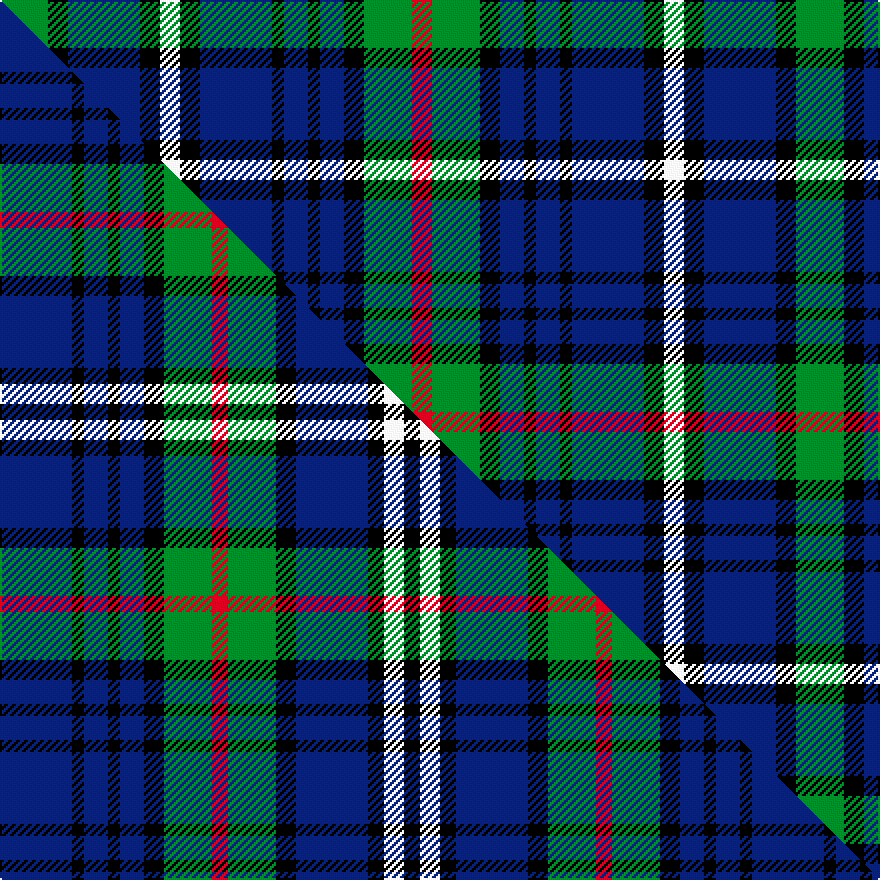

This is one **variant** — a specific cloth: this exact thread count and colourway, with its own
provenance below. It is one weaving of the [sett](/tartans/e/en/encyclopaedia-britannica/) (the scale-free proportion — the
same cloth at any scale or shade), whose colour order is pattern [GKBKWKBKBKBKGR](/stripes/gkbkwkbkbkbkgr/).

Part of the [Encyclopaedia Britannica](/tartans/e/en/encyclopaedia-britannica/) tartan — the named design grouping this sett with its other cloths.

Sourced from tartans-authority.  It is a [14 stripe tartan](/stripes/stripes14/).

Original link <code>http://www.tartansauthority.com/tartan-ferret/display/1968/</code> — retired · [Internet Archive copy](https://web.archive.org/web/*/http://www.tartansauthority.com/tartan-ferret/display/1968/*)

Dataset <small>— provenance for this record, inherited from the source manifest</small>

<dl class="dataset-prov">
<dt>source</dt><dd><a href="/sources/tartans-authority/">Scottish Tartans Authority</a></dd>
<dt>data captured from</dt><dd><a href="https://github.com/thetartan/tartan-database/blob/master/data/tartans-authority/data.csv">https://github.com/thetartan/tartan-database/blob/master/data/tartans-authority/data.csv</a></dd>
<dt>data date</dt><dd>1989 <small>(this record)</small></dd>
<dt>licence</dt><dd><a href="https://creativecommons.org/licenses/by-nc-nd/4.0/">CC BY-NC-ND 4.0</a></dd>
</dl>

Capture chain <small>— the hands this data passed through, oldest first; each capture carries its own licence</small>

<ol class="capture-chain">
<li><a href="https://www.tartansauthority.com/">Scottish Tartans Authority</a> <small>the heritage body’s archive — its tartan-ferret record browser is retired; dead record links are shown unlinked, with an Internet Archive copy (ITI numbers are not SRT references)</small></li>
<li><a href="https://github.com/thetartan/tartan-database">thetartan/tartan-database</a> <small>2016-2017</small> · <a href="https://creativecommons.org/licenses/by-nc-nd/4.0/">CC BY-NC-ND 4.0</a> <small>Levko Kravets's frozen compilation — the capture we vendored, and where its CC licence text came from</small></li>
<li>this dictionary <small>captured 2026-06-10 · commit 5bf86c7566</small> <small>each re-capture is a git commit to data/sources</small></li>
</ol>

## Register references

External register numbers recorded for this tartan.

- Scottish Tartans Authority (ITI): 1968

## Thread count
G/24 K10 DB36 K10 W10 K10 DB36 K6 DB12 K6 DB12 K10 G24 R/10

One full sett is **398 threads**.

## Palette
<table><thead><tr><th>Colour</th><th>Shade</th><th>OKLCh</th></tr></thead><tbody><tr><td>DB</td><td><code style="background-color:#082077;">#082077</code> <small style="color:#888">#082077</small></td><td><small style="color:#888">oklch(30.0% 0.149 265.1)</small></td></tr><tr><td>G</td><td><code style="background-color:#008B2A;">#008B2A</code> <small style="color:#888">#008B2A</small></td><td><small style="color:#888">oklch(55.4% 0.170 145.9)</small></td></tr><tr><td>K</td><td><code style="background-color:#000000;">#000000</code> <small style="color:#888">#000000</small></td><td><small style="color:#888">oklch(0.0% 0.000 0.0)</small></td></tr><tr><td>R</td><td><code style="background-color:#D60020;">#D60020</code> <small style="color:#888">#D60020</small></td><td><small style="color:#888">oklch(55.2% 0.224 25.5)</small></td></tr><tr><td>W</td><td><code style="background-color:#F7F7F7;">#F7F7F7</code> <small style="color:#888">#F7F7F7</small></td><td><small style="color:#888">oklch(97.6% 0.000 89.9)</small></td></tr></tbody></table>

# Sample pattern

## Compared to the master

This cloth is one sett of its design; the master sett (the exemplar the design is anchored on) is below for comparison.

Its **ΔTartan distance** from the master is **0.08** — the same measure the nearest-tartans table ranks by (0 is identical; a re-scale of the same cloth is near 0, a recolour or a different proportion further).

<figure class="master-compare" style="margin:0">

this sett
master sett ★

<figcaption style="color:#888;font-size:smaller">One weave of this sett against the <a href="/setts/db18k3db6k3db6k5g12r4g12k5db18k4w5k4/">master sett ★</a>, split on the diagonal: a shared proportion runs seamlessly across it with only the shades shifting; a different proportion breaks on it.</figcaption>
</figure>

## Nearest tartan variants

The nearest existing variants by ΔTartan distance, with this cloth at the top so the swatches line up against it.

ΔTartan

Threads

Variant

Sett

—

398

<a href="/variants/s14/g12k5db18k5w5k5db18k3db6k3db6k5g12r5~x2/">Encyclopaedia Britannica (Corporate)</a>

<a href="/ttd/edit/#slug=db18k3db6k3db6k5g12r4g12k5db18k4w5k4~x2&amp;base=g12k5db18k5w5k5db18k3db6k3db6k5g12r5~x2" title="compare in the TTD">0.08</a>

376

<a href="/variants/s14/db18k3db6k3db6k5g12r4g12k5db18k4w5k4~x2/">Encyclopaedia Britannica</a>

<a href="/ttd/edit/#slug=db36r4db6g18db15k18w4~x2&amp;base=g12k5db18k5w5k5db18k3db6k3db6k5g12r5~x2" title="compare in the TTD">1.81</a>

324

<a href="/variants/s7/db36r4db6g18db15k18w4~x2/">Grainger</a>

<a href="/ttd/edit/#slug=w5k5db25k16g18k4g5k4g18k16db25r5db5w5&amp;base=g12k5db18k5w5k5db18k3db6k3db6k5g12r5~x2" title="compare in the TTD">1.91</a>

302

<a href="/variants/s14/w5k5db25k16g18k4g5k4g18k16db25r5db5w5/">Arndt (Personal)</a>

<a href="/ttd/edit/#slug=db6k1db1k1db1k6g6r2g6k6db6k1db2~x4&amp;base=g12k5db18k5w5k5db18k3db6k3db6k5g12r5~x2" title="compare in the TTD">1.97</a>

328

<a href="/variants/s13/db6k1db1k1db1k6g6r2g6k6db6k1db2~x4/">Murray #2</a>

<a href="/ttd/edit/#slug=db6k1db1k1db1k6g6r2g6k6db6k1db2~x2&amp;base=g12k5db18k5w5k5db18k3db6k3db6k5g12r5~x2" title="compare in the TTD">1.97</a>

164

<a href="/variants/s13/db6k1db1k1db1k6g6r2g6k6db6k1db2~x2/">New South Wales Scottish Rifles</a>

<a href="/ttd/edit/#slug=db6k1db1k1db1k6g6r2g6k6db6k1db2&amp;base=g12k5db18k5w5k5db18k3db6k3db6k5g12r5~x2" title="compare in the TTD">1.97</a>

82

<a href="/variants/s13/db6k1db1k1db1k6g6r2g6k6db6k1db2/">Murray</a>

<a href="/ttd/edit/#slug=db15k8g3r3g5k2y2k2g5r3g3k8db8k8~x4&amp;base=g12k5db18k5w5k5db18k3db6k3db6k5g12r5~x2" title="compare in the TTD">2.11</a>

508

<a href="/variants/s14/db15k8g3r3g5k2y2k2g5r3g3k8db8k8~x4/">MacLellan</a>

<a href="/ttd/edit/#slug=g2r2g12k4db11r2db11k4db2k9db2k9db2k4db11y2db11k4g12r2g2~x2&amp;base=g12k5db18k5w5k5db18k3db6k3db6k5g12r5~x2" title="compare in the TTD">2.12</a>

472

<a href="/variants/s21/g2r2g12k4db11r2db11k4db2k9db2k9db2k4db11y2db11k4g12r2g2~x2/">Allen, Christopher Holler</a>

<a href="/ttd/edit/#slug=db29k15g5r5g8k4y4k4g8r5g5k15db7k15~x2&amp;base=g12k5db18k5w5k5db18k3db6k3db6k5g12r5~x2" title="compare in the TTD">2.15</a>

428

<a href="/variants/s14/db29k15g5r5g8k4y4k4g8r5g5k15db7k15~x2/">MacLellan Clan Tartan</a>

<a href="/ttd/edit/#slug=db6k1db1k1db1k6g6k1w2k1g6k6db6k1r2~x2&amp;base=g12k5db18k5w5k5db18k3db6k3db6k5g12r5~x2" title="compare in the TTD">2.15</a>

172

<a href="/variants/s15/db6k1db1k1db1k6g6k1w2k1g6k6db6k1r2~x2/">MacKenzie MINI Clan Miniature Tartan</a>

## Neighbour map

Every grey dot is one of 13662 variants placed by the first two principal components of the ΔTartan feature space (42% of its variance). Red is this tartan; blue dots are its nearest — click one to open its page. The map is a flat projection of a many-dimensional space — [how to read it](/posts/neighbourhood-maps/).

<svg viewBox="0 0 640 380" role="img" style="max-width:100%;height:auto;border:1px solid #e0e0e0;border-radius:4px;display:block" xmlns="http://www.w3.org/2000/svg"><image href="/nn/cloud.v1.png" width="640" height="380"/><a href="/variants/s14/db18k3db6k3db6k5g12r4g12k5db18k4w5k4~x2/"><circle cx="126.7" cy="180.9" r="4" fill="#3465a4"><title>Encyclopaedia Britannica</title></circle></a><a href="/variants/s7/db36r4db6g18db15k18w4~x2/"><circle cx="165.7" cy="176.9" r="4" fill="#3465a4"><title>Grainger</title></circle></a><a href="/variants/s14/w5k5db25k16g18k4g5k4g18k16db25r5db5w5/"><circle cx="78.4" cy="177.3" r="4" fill="#3465a4"><title>Arndt (Personal)</title></circle></a><a href="/variants/s13/db6k1db1k1db1k6g6r2g6k6db6k1db2~x4/"><circle cx="119.2" cy="200.5" r="4" fill="#3465a4"><title>Murray #2</title></circle></a><a href="/variants/s13/db6k1db1k1db1k6g6r2g6k6db6k1db2~x2/"><circle cx="119.2" cy="200.5" r="4" fill="#3465a4"><title>New South Wales Scottish Rifles</title></circle></a><a href="/variants/s13/db6k1db1k1db1k6g6r2g6k6db6k1db2/"><circle cx="119.2" cy="200.5" r="4" fill="#3465a4"><title>Murray</title></circle></a><a href="/variants/s14/db15k8g3r3g5k2y2k2g5r3g3k8db8k8~x4/"><circle cx="100.8" cy="174.9" r="4" fill="#3465a4"><title>MacLellan</title></circle></a><a href="/variants/s21/g2r2g12k4db11r2db11k4db2k9db2k9db2k4db11y2db11k4g12r2g2~x2/"><circle cx="116.0" cy="165.4" r="4" fill="#3465a4"><title>Allen, Christopher Holler</title></circle></a><a href="/variants/s14/db29k15g5r5g8k4y4k4g8r5g5k15db7k15~x2/"><circle cx="119.1" cy="166.9" r="4" fill="#3465a4"><title>MacLellan Clan Tartan</title></circle></a><a href="/variants/s15/db6k1db1k1db1k6g6k1w2k1g6k6db6k1r2~x2/"><circle cx="84.1" cy="169.0" r="4" fill="#3465a4"><title>MacKenzie MINI Clan Miniature Tartan</title></circle></a><circle cx="116.8" cy="184.5" r="5" fill="#c00000"/><text x="320" y="376" text-anchor="middle" font-size="11" fill="#999">ground</text><text x="11" y="190" text-anchor="middle" font-size="11" fill="#999" transform="rotate(-90 11 190)">complexity</text></svg>

ID: /variants/s14/g12k5db18k5w5k5db18k3db6k3db6k5g12r5~x2/
