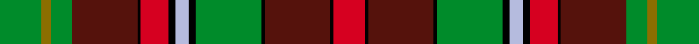

This is one **variant** — a specific cloth: this exact thread count and colourway, with its own
provenance below. It is one weaving of the [sett](/tartans/g/go/golden-broom/) (the scale-free proportion — the
same cloth at any scale or shade), whose colour order is pattern [GGGBKRKWKGKBKR](/stripes/gggbkrkwkgkbkr/).

Part of the [Golden Broom](/tartans/g/go/golden-broom/) tartan — the named design grouping this sett with its other cloths.

Sourced from tartans-authority.  It is a [14 stripe tartan](/stripes/stripes14/).

Original link <code>http://www.tartansauthority.com/tartan-ferret/display/7072/</code> — retired · [Internet Archive copy](https://web.archive.org/web/*/http://www.tartansauthority.com/tartan-ferret/display/7072/*)

Dataset <small>— provenance for this record, inherited from the source manifest</small>

<dl class="dataset-prov">
<dt>source</dt><dd><a href="/sources/tartans-authority/">Scottish Tartans Authority</a></dd>
<dt>data captured from</dt><dd><a href="https://github.com/thetartan/tartan-database/blob/master/data/tartans-authority/data.csv">https://github.com/thetartan/tartan-database/blob/master/data/tartans-authority/data.csv</a></dd>
<dt>data date</dt><dd>2005 <small>(this record)</small></dd>
<dt>licence</dt><dd><a href="https://creativecommons.org/licenses/by-nc-nd/4.0/">CC BY-NC-ND 4.0</a></dd>
</dl>

Capture chain <small>— the hands this data passed through, oldest first; each capture carries its own licence</small>

<ol class="capture-chain">
<li><a href="https://www.tartansauthority.com/">Scottish Tartans Authority</a> <small>the heritage body’s archive — its tartan-ferret record browser is retired; dead record links are shown unlinked, with an Internet Archive copy (ITI numbers are not SRT references)</small></li>
<li><a href="https://github.com/thetartan/tartan-database">thetartan/tartan-database</a> <small>2016-2017</small> · <a href="https://creativecommons.org/licenses/by-nc-nd/4.0/">CC BY-NC-ND 4.0</a> <small>Levko Kravets's frozen compilation — the capture we vendored, and where its CC licence text came from</small></li>
<li>this dictionary <small>captured 2026-06-10 · commit 5bf86c7566</small> <small>each re-capture is a git commit to data/sources</small></li>
</ol>

## Register references

External register numbers recorded for this tartan.

- Scottish Tartans Authority (ITI): 7072

## Thread count
G/24 Y6 G12 DR38 K2 R16 K4 LB8 K4 G38 K2 DR38 K2 R/18

One full sett is **382 threads**.

## Palette
<table><thead><tr><th>Colour</th><th>Shade</th><th>OKLCh</th></tr></thead><tbody><tr><td>LB</td><td><code style="background-color:#B5BBDE;">#B5BBDE</code> <small style="color:#888">#B5BBDE</small></td><td><small style="color:#888">oklch(79.9% 0.050 277.6)</small></td></tr><tr><td>DR</td><td><code style="background-color:#55120C;">#55120C</code> <small style="color:#888">#55120C</small></td><td><small style="color:#888">oklch(30.0% 0.099 29.3)</small></td></tr><tr><td>K</td><td><code style="background-color:#000000;">#000000</code> <small style="color:#888">#000000</small></td><td><small style="color:#888">oklch(0.0% 0.000 0.0)</small></td></tr><tr><td>G</td><td><code style="background-color:#008B2A;">#008B2A</code> <small style="color:#888">#008B2A</small></td><td><small style="color:#888">oklch(55.4% 0.170 145.9)</small></td></tr><tr><td>R</td><td><code style="background-color:#D60020;">#D60020</code> <small style="color:#888">#D60020</small></td><td><small style="color:#888">oklch(55.2% 0.224 25.5)</small></td></tr><tr><td>Y</td><td><code style="background-color:#8B6E00;">#8B6E00</code> <small style="color:#888">#8B6E00</small></td><td><small style="color:#888">oklch(55.1% 0.113 90.4)</small></td></tr></tbody></table>

# Sample pattern

[Sample sheet (PDF)](swatch.pdf) — the woven sample, thread count and palette on one printable A4, rendered on demand (the same sheet the TTD print page downloads).

## Nearest tartan variants

The nearest existing variants by ΔTartan distance, with this cloth at the top so the swatches line up against it.

ΔTartan

Threads

Variant

Sett

—

382

<a href="/variants/s14/g12y3g6dr19k1r8k2lb4k2g19k1dr19k1r9~x2/">Golden Broom (Corporate)</a>

<a href="/ttd/edit/#slug=g12y3g6dr19k1r8k2t4k2g19k1dr19k1r9~x2&amp;base=g12y3g6dr19k1r8k2lb4k2g19k1dr19k1r9~x2" title="compare in the TTD">0.02</a>

382

<a href="/variants/s14/g12y3g6dr19k1r8k2t4k2g19k1dr19k1r9~x2/">Golden Broom #2</a>

<a href="/ttd/edit/#slug=g12y3g6dr19k1r8k2lb4k2g19k1dr19k1r9~x2~r6914021&amp;base=g12y3g6dr19k1r8k2lb4k2g19k1dr19k1r9~x2" title="compare in the TTD">0.06</a>

382

<a href="/variants/s14/g12y3g6dr19k1r8k2lb4k2g19k1dr19k1r9~x2~r6914021/">Golden Broom</a>

<a href="/ttd/edit/#slug=y2r15y2dr2y2k14y2g10w1g6w1g10y2r7g10w1~x2&amp;base=g12y3g6dr19k1r8k2lb4k2g19k1dr19k1r9~x2" title="compare in the TTD">2.28</a>

342

<a href="/variants/s16/y2r15y2dr2y2k14y2g10w1g6w1g10y2r7g10w1~x2/">Dalrymple of Castleton #2</a>

<a href="/ttd/edit/#slug=r8lb7k8y2k1b1g19k1r8lb3r8~x2&amp;base=g12y3g6dr19k1r8k2lb4k2g19k1dr19k1r9~x2" title="compare in the TTD">2.50</a>

232

<a href="/variants/s11/r8lb7k8y2k1b1g19k1r8lb3r8~x2/">Unnamed No 1</a>

<a href="/ttd/edit/#slug=k10r26k2r4k2r26k3dg36k3g30k3y2~y59&amp;base=g12y3g6dr19k1r8k2lb4k2g19k1dr19k1r9~x2" title="compare in the TTD">2.53</a>

282

<a href="/variants/s12/k10r26k2r4k2r26k3dg36k3g30k3y2~y59/">Pope Welsh Name Tartan</a>

<a href="/ttd/edit/#slug=o5k3w2r20db10g2w1r1g20k4o3~x2&amp;base=g12y3g6dr19k1r8k2lb4k2g19k1dr19k1r9~x2" title="compare in the TTD">2.55</a>

268

<a href="/variants/s11/o5k3w2r20db10g2w1r1g20k4o3~x2/">MacCullough Family Tartan</a>

<a href="/ttd/edit/#slug=k2g12r2k2r2k2r16y2r3db6r3k1g8k1r3w2~x2&amp;base=g12y3g6dr19k1r8k2lb4k2g19k1dr19k1r9~x2" title="compare in the TTD">2.60</a>

260

<a href="/variants/s16/k2g12r2k2r2k2r16y2r3db6r3k1g8k1r3w2~x2/">Innes (D C Stewart)</a>

<a href="/ttd/edit/#slug=r8lb7k8y2k1w2k1g19k1r8lb3r8~x2&amp;base=g12y3g6dr19k1r8k2lb4k2g19k1dr19k1r9~x2" title="compare in the TTD">2.60</a>

240

<a href="/variants/s12/r8lb7k8y2k1w2k1g19k1r8lb3r8~x2/">Unnamed No 1 Tartan</a>

<a href="/ttd/edit/#slug=r2lb6r1dy14r1dy14r1k6g10ly1g2ly2~x2&amp;base=g12y3g6dr19k1r8k2lb4k2g19k1dr19k1r9~x2" title="compare in the TTD">2.66</a>

232

<a href="/variants/s12/r2lb6r1dy14r1dy14r1k6g10ly1g2ly2~x2/">Ogg of Tarragann Hunting (Personal)</a>

<a href="/ttd/edit/#slug=k8w1r2g16r8g8r11y2g2lo1g2w2r10y2r2k1w4~x2&amp;base=g12y3g6dr19k1r8k2lb4k2g19k1dr19k1r9~x2" title="compare in the TTD">2.67</a>

304

<a href="/variants/s17/k8w1r2g16r8g8r11y2g2lo1g2w2r10y2r2k1w4~x2/">Pernel (Personal)</a>

## Neighbour map

Every grey dot is one of 13662 variants placed by the first two principal components of the ΔTartan feature space (42% of its variance). Red is this tartan; blue dots are its nearest — click one to open its page. The map is a flat projection of a many-dimensional space — [how to read it](/posts/neighbourhood-maps/).

<svg viewBox="0 0 640 380" role="img" style="max-width:100%;height:auto;border:1px solid #e0e0e0;border-radius:4px;display:block" xmlns="http://www.w3.org/2000/svg"><image href="/nn/cloud.v1.png" width="640" height="380"/><a href="/variants/s14/g12y3g6dr19k1r8k2t4k2g19k1dr19k1r9~x2/"><circle cx="152.4" cy="112.9" r="4" fill="#3465a4"><title>Golden Broom #2</title></circle></a><a href="/variants/s14/g12y3g6dr19k1r8k2lb4k2g19k1dr19k1r9~x2~r6914021/"><circle cx="138.7" cy="109.6" r="4" fill="#3465a4"><title>Golden Broom</title></circle></a><a href="/variants/s16/y2r15y2dr2y2k14y2g10w1g6w1g10y2r7g10w1~x2/"><circle cx="129.1" cy="112.1" r="4" fill="#3465a4"><title>Dalrymple of Castleton #2</title></circle></a><a href="/variants/s11/r8lb7k8y2k1b1g19k1r8lb3r8~x2/"><circle cx="121.0" cy="114.9" r="4" fill="#3465a4"><title>Unnamed No 1</title></circle></a><a href="/variants/s12/k10r26k2r4k2r26k3dg36k3g30k3y2~y59/"><circle cx="160.3" cy="113.2" r="4" fill="#3465a4"><title>Pope Welsh Name Tartan</title></circle></a><a href="/variants/s11/o5k3w2r20db10g2w1r1g20k4o3~x2/"><circle cx="111.7" cy="100.8" r="4" fill="#3465a4"><title>MacCullough Family Tartan</title></circle></a><a href="/variants/s16/k2g12r2k2r2k2r16y2r3db6r3k1g8k1r3w2~x2/"><circle cx="152.2" cy="92.0" r="4" fill="#3465a4"><title>Innes (D C Stewart)</title></circle></a><a href="/variants/s12/r8lb7k8y2k1w2k1g19k1r8lb3r8~x2/"><circle cx="110.1" cy="107.7" r="4" fill="#3465a4"><title>Unnamed No 1 Tartan</title></circle></a><a href="/variants/s12/r2lb6r1dy14r1dy14r1k6g10ly1g2ly2~x2/"><circle cx="162.9" cy="116.9" r="4" fill="#3465a4"><title>Ogg of Tarragann Hunting (Personal)</title></circle></a><a href="/variants/s17/k8w1r2g16r8g8r11y2g2lo1g2w2r10y2r2k1w4~x2/"><circle cx="134.0" cy="99.0" r="4" fill="#3465a4"><title>Pernel (Personal)</title></circle></a><circle cx="146.3" cy="110.4" r="5" fill="#c00000"/><text x="320" y="376" text-anchor="middle" font-size="11" fill="#999">ground</text><text x="11" y="190" text-anchor="middle" font-size="11" fill="#999" transform="rotate(-90 11 190)">complexity</text></svg>

ID: /variants/s14/g12y3g6dr19k1r8k2lb4k2g19k1dr19k1r9~x2/
