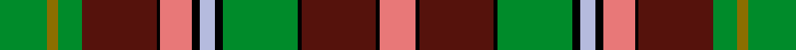

This page is one **sett** — a single exact thread-count. It belongs to the [tartan](/setts/g12y3g6dr19k1r8k2lb4k2g19k1dr19k1r9/)
(the same proportion at any scale), whose colour order is pattern [GGGBKRKWKGKBKR](/stripes/gggbkrkwkgkbkr/).

Part of the [Golden Broom](/tartans/golden-broom/) tartan — the named design grouping this sett with its other cloths.

Sourced from register-of-tartans.  It is a [14 stripe tartan](/stripes/stripes14/).

Original link https://www.tartanregister.gov.uk/tartanDetails.aspx?ref=4950

## Provenance

Earliest known date: 2005 Designed by pupils of P6 & P7 in Mulbuie Primary School at Muir of Order (northwest of Inverness) during a project on the Jacobites. Mulbuie is the Gaelic for Golden Broom - thus the name of the tartan which has also been chosen as the official design for the 2007 Highland Year of Culture. Burgundy is the school colour, gold is for the golden broom and the greens and browns represent the area's agriculture. Woven sample.

2 attestations — the source records this cloth was collapsed from (oldest owns this page)

<ul>
<li>01/01/2005 — Golden Broom (register-of-tartans, <a href="https://www.tartanregister.gov.uk/tartanDetails.aspx?ref=4950">record</a>)  <em>Designed by pupils of P6 & P7 in Mulbuie Primary School at Muir of Order (northwest of Inverness) during a project on the Jacobites. Mulbuie is the Gaelic for Golden Broom - thus the name of the tartan which has also been chosen as the official design for the 2007 Highland Year of Culture. Burgundy is the school colour, gold is for the golden broom and the greens and browns represent the area's agriculture. Woven sample.</em></li>
<li>undated — Golden Broom (Corporate) Corporate Tartan (house-of-tartan, <a href="http://www.house-of-tartan.scotland.net/house/TartanViewjs.asp?colr=Def&tnam=7072">record</a>) </li>
</ul>

## Register references

External register numbers recorded for this tartan.

- Scottish Register of Tartans: [4950](https://www.tartanregister.gov.uk/tartanDetails.aspx?ref=4950)
- Scottish Tartans Authority (ITI): 7072

## Thread count
G/24 Y6 G12 DR38 K2 R16 K4 LB8 K4 G38 K2 DR38 K2 R/18

One full sett is **382 threads**.

## Palette
<table><thead><tr><th>Colour</th><th>Shade</th><th>OKLCh</th></tr></thead><tbody><tr><td>LB</td><td><code style="background-color:#B5BBDE;">#B5BBDE</code> <small style="color:#888">#B5BBDE</small></td><td><small style="color:#888">oklch(79.9% 0.050 277.6)</small></td></tr><tr><td>DR</td><td><code style="background-color:#55120C;">#55120C</code> <small style="color:#888">#55120C</small></td><td><small style="color:#888">oklch(30.0% 0.099 29.3)</small></td></tr><tr><td>K</td><td><code style="background-color:#000000;">#000000</code> <small style="color:#888">#000000</small></td><td><small style="color:#888">oklch(0.0% 0.000 0.0)</small></td></tr><tr><td>G</td><td><code style="background-color:#008B2A;">#008B2A</code> <small style="color:#888">#008B2A</small></td><td><small style="color:#888">oklch(55.4% 0.170 145.9)</small></td></tr><tr><td>R</td><td><code style="background-color:#E87878;">#E87878</code> <small style="color:#888">#E87878</small></td><td><small style="color:#888">oklch(70.0% 0.139 21.2)</small></td></tr><tr><td>LR</td><td><code style="background-color:#E08070;">#E08070</code> <small style="color:#888">#E08070</small></td><td><small style="color:#888">oklch(70.1% 0.122 30.4)</small></td></tr><tr><td>R</td><td><code style="background-color:#C80000;">#C80000</code> <small style="color:#888">#C80000</small></td><td><small style="color:#888">oklch(52.3% 0.215 29.2)</small></td></tr><tr><td>Y</td><td><code style="background-color:#8B6E00;">#8B6E00</code> <small style="color:#888">#8B6E00</small></td><td><small style="color:#888">oklch(55.1% 0.113 90.4)</small></td></tr></tbody></table>

# Sample pattern

## Nearest tartan variants

The nearest existing variants by ΔTartan distance, with this cloth at the top so the swatches line up against it.

ΔTartan

Threads

Variant

Sett

—

382

<a href="/variants/s14/g12y3g6dr19k1r8k2lb4k2g19k1dr19k1r9~x2~r2806019/">Golden Broom</a>

<a href="/ttd/edit/#slug=g12y3g6dr19k1r8k2lb4k2g19k1dr19k1r9~x2&amp;base=g12y3g6dr19k1r8k2lb4k2g19k1dr19k1r9~x2~r2806019" title="compare in the TTD">0.06</a>

382

<a href="/variants/s14/g12y3g6dr19k1r8k2lb4k2g19k1dr19k1r9~x2/">Golden Broom (Corporate)</a>

<a href="/ttd/edit/#slug=g12y3g6dr19k1r8k2t4k2g19k1dr19k1r9~x2&amp;base=g12y3g6dr19k1r8k2lb4k2g19k1dr19k1r9~x2~r2806019" title="compare in the TTD">0.08</a>

382

<a href="/variants/s14/g12y3g6dr19k1r8k2t4k2g19k1dr19k1r9~x2/">Golden Broom #2</a>

<a href="/ttd/edit/#slug=y2r15y2dr2y2k14y2g10w1g6w1g10y2r7g10w1~x2&amp;base=g12y3g6dr19k1r8k2lb4k2g19k1dr19k1r9~x2~r2806019" title="compare in the TTD">1.94</a>

342

<a href="/variants/s16/y2r15y2dr2y2k14y2g10w1g6w1g10y2r7g10w1~x2/">Dalrymple of Castleton #2</a>

<a href="/ttd/edit/#slug=ly10w2dy1w2n10ly8dy2k17dy2ly7n19k3y1k1~x2&amp;base=g12y3g6dr19k1r8k2lb4k2g19k1dr19k1r9~x2~r2806019" title="compare in the TTD">2.24</a>

318

<a href="/variants/s14/ly10w2dy1w2n10ly8dy2k17dy2ly7n19k3y1k1~x2/">Scottish Wildcat</a>

<a href="/ttd/edit/#slug=r8lb7k8y2k1b1g19k1r8lb3r8~x2&amp;base=g12y3g6dr19k1r8k2lb4k2g19k1dr19k1r9~x2~r2806019" title="compare in the TTD">2.31</a>

232

<a href="/variants/s11/r8lb7k8y2k1b1g19k1r8lb3r8~x2/">Unnamed No 1</a>

<a href="/ttd/edit/#slug=r8lb7k8y2k1w2k1g19k1r8lb3r8~x2&amp;base=g12y3g6dr19k1r8k2lb4k2g19k1dr19k1r9~x2~r2806019" title="compare in the TTD">2.36</a>

240

<a href="/variants/s12/r8lb7k8y2k1w2k1g19k1r8lb3r8~x2/">Unidentified No 1</a>

<a href="/ttd/edit/#slug=o5k3w2r20db10g2w1r1g20k4o3~x2&amp;base=g12y3g6dr19k1r8k2lb4k2g19k1dr19k1r9~x2~r2806019" title="compare in the TTD">2.36</a>

268

<a href="/variants/s11/o5k3w2r20db10g2w1r1g20k4o3~x2/">MacCullough Family Tartan</a>

<a href="/ttd/edit/#slug=r2lb6r1dy14r1dy14r1k6g10ly1g2ly2~x2&amp;base=g12y3g6dr19k1r8k2lb4k2g19k1dr19k1r9~x2~r2806019" title="compare in the TTD">2.42</a>

232

<a href="/variants/s12/r2lb6r1dy14r1dy14r1k6g10ly1g2ly2~x2/">Ogg of Tarragann Hunting (Personal)</a>

<a href="/ttd/edit/#slug=dy5k3w2r20db10g2w1dy1g20k4dy3~x2&amp;base=g12y3g6dr19k1r8k2lb4k2g19k1dr19k1r9~x2~r2806019" title="compare in the TTD">2.45</a>

268

<a href="/variants/s11/dy5k3w2r20db10g2w1dy1g20k4dy3~x2/">MacCulloch</a>

<a href="/ttd/edit/#slug=r5k3g22k3y3dp7r7k2dp4w2dp4r7k2r7y3k3g22k2~x2&amp;base=g12y3g6dr19k1r8k2lb4k2g19k1dr19k1r9~x2~r2806019" title="compare in the TTD">2.46</a>

418

<a href="/variants/s18/r5k3g22k3y3dp7r7k2dp4w2dp4r7k2r7y3k3g22k2~x2/">Derbyshire</a>

## Neighbour map

Every grey dot is one of 13620 variants placed by the first two principal components of the ΔTartan feature space (42% of its variance). Red is this tartan; blue dots are its nearest — click one to open its page.

<svg viewBox="0 0 640 380" role="img" style="max-width:100%;height:auto;border:1px solid #e0e0e0;border-radius:4px;display:block" xmlns="http://www.w3.org/2000/svg"><image href="/nn/cloud.v1.png" width="640" height="380"/><a href="/variants/s14/g12y3g6dr19k1r8k2lb4k2g19k1dr19k1r9~x2/"><circle cx="146.3" cy="110.6" r="4" fill="#3465a4"><title>Golden Broom (Corporate)</title></circle></a><a href="/variants/s14/g12y3g6dr19k1r8k2t4k2g19k1dr19k1r9~x2/"><circle cx="152.5" cy="113.0" r="4" fill="#3465a4"><title>Golden Broom #2</title></circle></a><a href="/variants/s16/y2r15y2dr2y2k14y2g10w1g6w1g10y2r7g10w1~x2/"><circle cx="129.1" cy="112.4" r="4" fill="#3465a4"><title>Dalrymple of Castleton #2</title></circle></a><a href="/variants/s14/ly10w2dy1w2n10ly8dy2k17dy2ly7n19k3y1k1~x2/"><circle cx="102.7" cy="97.3" r="4" fill="#3465a4"><title>Scottish Wildcat</title></circle></a><a href="/variants/s11/r8lb7k8y2k1b1g19k1r8lb3r8~x2/"><circle cx="120.9" cy="115.3" r="4" fill="#3465a4"><title>Unnamed No 1</title></circle></a><a href="/variants/s12/r8lb7k8y2k1w2k1g19k1r8lb3r8~x2/"><circle cx="110.1" cy="108.1" r="4" fill="#3465a4"><title>Unidentified No 1</title></circle></a><a href="/variants/s11/o5k3w2r20db10g2w1r1g20k4o3~x2/"><circle cx="111.7" cy="101.0" r="4" fill="#3465a4"><title>MacCullough Family Tartan</title></circle></a><a href="/variants/s12/r2lb6r1dy14r1dy14r1k6g10ly1g2ly2~x2/"><circle cx="163.0" cy="117.1" r="4" fill="#3465a4"><title>Ogg of Tarragann Hunting (Personal)</title></circle></a><a href="/variants/s11/dy5k3w2r20db10g2w1dy1g20k4dy3~x2/"><circle cx="111.5" cy="103.6" r="4" fill="#3465a4"><title>MacCulloch</title></circle></a><a href="/variants/s18/r5k3g22k3y3dp7r7k2dp4w2dp4r7k2r7y3k3g22k2~x2/"><circle cx="117.0" cy="106.5" r="4" fill="#3465a4"><title>Derbyshire</title></circle></a><circle cx="138.7" cy="109.8" r="5" fill="#c00000"/><text x="320" y="376" text-anchor="middle" font-size="11" fill="#999">ground</text><text x="11" y="190" text-anchor="middle" font-size="11" fill="#999" transform="rotate(-90 11 190)">complexity</text></svg>

ID: /variants/s14/g12y3g6dr19k1r8k2lb4k2g19k1dr19k1r9~x2~r2806019/
